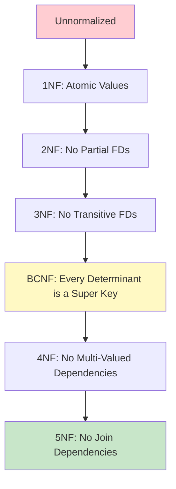

# ⭐⭐⭐⭐⭐ Chapter 2: ER Model & Normalization

This chapter covers the database design process. We will visually map out requirements using the ER Model and then eliminate data anomalies using Normalization. This is the **most heavily tested** topic in technical interviews.

---

## 1. Entity-Relationship (ER) Model

The ER model is a blueprint of your database. Before writing any SQL, you draw an ER diagram.

### 🧠 Mind Map: ER Model Components
```text
           [ ER MODEL ]
          /      |     \
         /       |      \
    [Entity] [Attribute] [Relationship]
     (Noun)  (Adjective)     (Verb)
```

> [!NOTE]
> **Analogy:**  
> **Entity:** A Student (Person, Place, Object).  
> **Attribute:** Student's Name, Age, ID (Characteristics of the entity).  
> **Relationship:** Student *enrolls in* a Course (How entities interact).

### 🖼️ ASCII ER Diagram Example
```text
  +---------+           +----------+           +--------+
  | Student | ===(1)===<  Enrolls  >===(M)=== | Course |
  +---------+           +----------+           +--------+
       |                                           |
   +---+---+                                   +---+---+
   |       |                                   |       |
(ID)     (Name)                            (C_ID)  (C_Name)
```

### Relationship Types (Cardinality)
1. **One-to-One (1:1):** One Citizen has One Passport.
2. **One-to-Many (1:M):** One Department has Many Employees. (Most common).
3. **Many-to-Many (M:N):** Many Students enroll in Many Courses.

---

## 2. What is Normalization?

Normalization is the process of organizing data to reduce **redundancy** (duplication) and improve data integrity.

> [!WARNING]
> **Why do we Normalize? (The 3 Anomalies)**  
> 1. **Insertion Anomaly:** Cannot insert data because other data is missing. (e.g., Cannot add a new Course if no Student is enrolled in it yet).
> 2. **Update Anomaly:** Updating a value requires changing it in 100 different rows. If you miss one, data becomes inconsistent.
> 3. **Deletion Anomaly:** Deleting a row accidentally deletes unrelated data. (e.g., Deleting the last student in a course deletes the course details entirely).

---

## 3. Step-by-Step Normalization (1NF to BCNF)

Let's walk through the exact steps to normalize a database, exactly as expected in product-based company interviews.

### ⭐ First Normal Form (1NF)
**Rule:** Attributes must be atomic (single-valued). No multi-valued attributes or nested tables.

**Original Table:**
| Emp_ID | Emp_Name | Phone_Numbers |
| :--- | :--- | :--- |
| 1 | Alice | 555-1111, 555-2222 |
| 2 | Bob | 555-3333 |

**The Problem:** Alice has two phone numbers in one cell. This makes searching for a specific phone number very difficult.
**The Fix (Decomposition):** Create a new row for every multi-valued attribute.

**Final 1NF Table:**
| Emp_ID | Emp_Name | Phone_Number |
| :--- | :--- | :--- |
| 1 | Alice | 555-1111 |
| 1 | Alice | 555-2222 |
| 2 | Bob | 555-3333 |

---

### ⭐⭐ Second Normal Form (2NF)
**Rule:** Must be in 1NF **AND** no Partial Dependencies.
*(Partial Dependency: A non-prime attribute depends on only a PART of a composite primary key).*

**Original 1NF Table:** `Student_Course` (Primary Key = `{Student_ID, Course_ID}`)
| Student_ID | Course_ID | Student_Name | Course_Fee |
| :--- | :--- | :--- | :--- |
| 101 | C1 | John | $500 |
| 101 | C2 | John | $300 |

**The Problem:** `Student_Name` only depends on `Student_ID` (part of the PK). `Course_Fee` only depends on `Course_ID` (part of the PK). This causes redundancy — John's name is stored once per course he enrolls in.

**The Functional Dependencies (Violations):**
* `{Student_ID} → Student_Name` ← **Partial Dependency** (Student_Name needs only Student_ID, not the full composite PK)
* `{Course_ID} → Course_Fee` ← **Partial Dependency** (Course_Fee needs only Course_ID, not the full composite PK)

> [!IMPORTANT]
> Since non-prime attributes (`Student_Name`, `Course_Fee`) depend on only a **part** of the composite Primary Key `{Student_ID, Course_ID}`, this table **violates 2NF**.

**The Fix (Decomposition):** Break it into 3 tables based on what defines what.

**Final 2NF Tables:**
* **Student Table:** (PK: `Student_ID`)
  | Student_ID | Student_Name |
  | :--- | :--- |
  | 101 | John |

* **Course Table:** (PK: `Course_ID`)
  | Course_ID | Course_Fee |
  | :--- | :--- |
  | C1 | $500 |
  | C2 | $300 |

* **Enrollment Table:** (PK: `{Student_ID, Course_ID}`)
  | Student_ID | Course_ID |
  | :--- | :--- |
  | 101 | C1 |
  | 101 | C2 |

**Why it worked:** No more partial dependencies. John's name is stored only once.

---

### ⭐⭐⭐ Third Normal Form (3NF)
**Rule:** Must be in 2NF **AND** no Transitive Dependencies.
*(Transitive Dependency: A non-prime attribute depends on another non-prime attribute).*

**Original 2NF Table:** `Employee` (Primary Key = `Emp_ID`)
| Emp_ID | Emp_Name | Dept_ID | Dept_Name |
| :--- | :--- | :--- | :--- |
| 1 | Alice | D1 | HR |
| 2 | Bob | D1 | HR |

**The Problem:** `Dept_Name` depends on `Dept_ID`. `Dept_ID` depends on `Emp_ID`. Therefore, `Dept_Name` transitively depends on `Emp_ID`. HR is repeated for every HR employee.
**The Dependency:** `Emp_ID -> Dept_ID -> Dept_Name`

**The Fix (Decomposition):** Move the transitively dependent attributes to a new table.

**Final 3NF Tables:**
* **Employee Table:**
  | Emp_ID | Emp_Name | Dept_ID (FK) |
  | :--- | :--- | :--- |
  | 1 | Alice | D1 |
  | 2 | Bob | D1 |

* **Department Table:**
  | Dept_ID | Dept_Name |
  | :--- | :--- |
  | D1 | HR |

**Why it worked:** If the HR department changes its name to Human Resources, we only update it in ONE place (the Department table).

---

### ⭐⭐⭐⭐ Boyce-Codd Normal Form (BCNF)
**Rule:** Must be in 3NF **AND** for every functional dependency `X -> Y`, `X` must be a Super Key.
*(Simply: If A determines B, A better be a key!)*

> [!IMPORTANT]
> **Difference between 3NF and BCNF:** 3NF allows `X -> Y` if `Y` is a prime attribute (part of a candidate key). BCNF is stricter and does not allow this exception.

**Original 3NF Table:** `Student_Subject_Professor`
*(Rule: A student can take multiple subjects. Each subject has multiple professors. A professor teaches ONLY ONE subject.)*
Primary Key: `{Student, Subject}`

| Student | Subject | Professor |
| :--- | :--- | :--- |
| S1 | Math | Prof_A |
| S2 | Math | Prof_B |
| S3 | Math | Prof_A |

**The Problem:** The table is in 3NF. However, `Professor -> Subject` (because a professor teaches only one subject). But `Professor` is NOT a super key (Prof_A appears twice). This is a BCNF violation.
**The Fix (Decomposition):**

**Final BCNF Tables:**
* **Professor_Subject Table:** (PK: `Professor`)
  | Professor | Subject |
  | :--- | :--- |
  | Prof_A | Math |
  | Prof_B | Math |

* **Student_Professor Table:** (PK: `{Student, Professor}`)
  | Student | Professor |
  | :--- | :--- |
  | S1 | Prof_A |
  | S2 | Prof_B |
  | S3 | Prof_A |

**Why it worked:** Now, every determinant (left side of the arrow) is a Super Key.

---

### ⭐⭐⭐⭐⭐ Fourth Normal Form (4NF)
**Rule:** Must be in BCNF **AND** no non-trivial Multi-Valued Dependencies (MVD) exist.

A **Multi-Valued Dependency (MVD)** `X →→ Y` means: for a given X, there exists a *set* of Y values that are independent of any other attribute Z.

**Original Table:** `Student_Skills_Languages`
*(A student can have multiple skills AND multiple languages. These are independent facts.)*

| Student | Skill | Language |
| :--- | :--- | :--- |
| Alice | Python | English |
| Alice | Python | Hindi |
| Alice | SQL | English |
| Alice | SQL | Hindi |

**The Problem:** Every combination of Alice's skills and languages must be stored. Adding a new language requires adding rows for EVERY skill, causing massive redundancy.

**The Fix (Decomposition):**
- **Student_Skill Table:** (Alice, Python), (Alice, SQL)
- **Student_Language Table:** (Alice, English), (Alice, Hindi)

> [!IMPORTANT]
> **When does 4NF apply?** Only when a table has two or more *independent* multi-valued attributes for the same primary key. This is fairly rare but asked in advanced interviews.

---

### ⭐⭐⭐⭐⭐ Fifth Normal Form (5NF) / Project-Join Normal Form (PJNF)
**Rule:** Must be in 4NF **AND** every join dependency is implied by the candidate keys.

5NF deals with **Join Dependencies**: a table cannot be reconstructed by joining smaller tables without losing or adding data.

> [!TIP]
> 5NF is rarely discussed in placements beyond the definition. The key answer: "A table is in 5NF if it cannot be decomposed further without losing information." This is the highest practical normal form.

---

### Summary: Normal Forms at a Glance



---

## 4. Strong vs Weak Entities

### Strong Entity
An entity that can be uniquely identified on its own using its own attributes (has a primary key).
- **Example:** `Employee` (identified by `Emp_ID`)

### Weak Entity
An entity that **cannot** be uniquely identified on its own. It depends on a Strong Entity for its existence.
- **Example:** `Dependent` (a family member of an employee). The dependent "Riya" is only meaningful in the context of employee Alice.
- **Identifying Relationship:** The relationship connecting a weak entity to its owning strong entity.
- **Partial Key (Discriminator):** The attribute within the weak entity that distinguishes weak entity instances for the same strong entity. (e.g., `Dependent_Name` within the same `Emp_ID`).

```text
Strong Entity         Identifying Rel.     Weak Entity
+----------+          +----------+          +------------+
| EMPLOYEE |=====1====| Has      |====M=====| DEPENDENT  |
+----------+          +----------+          +------------+
| Emp_ID◆  |                                | Dep_Name~  |
| Name     |                                | DOB        |
+----------+                                +------------+
◆ = Primary Key    ~ = Partial Key (Discriminator)
```

> [!NOTE]
> **Interview Note:** Weak entities are represented with a **double rectangle** in ER diagrams. The identifying relationship is a **double diamond**.

---

## 5. Participation Constraints (Total vs Partial)

Participation constraints define whether ALL instances of an entity must participate in a relationship.

| Type | Meaning | Notation | Example |
| :--- | :--- | :--- | :--- |
| **Total Participation** | Every instance MUST participate | Double line `==` | Every Employee MUST work in a Department |
| **Partial Participation** | Not every instance needs to participate | Single line `—` | Not every Employee MANAGES a Department |

```text
EMPLOYEE ===(works_in)=== DEPARTMENT
         total              partial
(Every employee must       (A department can
 work in a department)      exist without a manager)
```

---

## 6. ER to Relational Schema Conversion (Full Walkthrough)

Converting an ER diagram to actual SQL tables is a core interview skill.

### Rules:
1. **Each Strong Entity** → becomes a Table. Its attributes → columns. PK → Primary Key.
2. **Each Weak Entity** → becomes a Table. Its Partial Key + Owner's PK = Composite Primary Key.
3. **1:1 Relationship** → Add FK of one entity into the other (prefer the total participation side).
4. **1:M Relationship** → Add FK of the '1' side into the 'M' side's table.
5. **M:N Relationship** → Create a **new Bridge/Junction Table** with FKs from both entities as the composite PK.
6. **Attributes of a Relationship** → Go into the Bridge Table.

### Example: University ER → SQL

**ER Diagram:**
- `Student (S_ID, Name)` enrolls in `Course (C_ID, Title)` — M:N relationship with attribute `Grade`.

**Conversion:**
```sql
-- Rule 1: Strong entities become tables
CREATE TABLE Student (
    S_ID INT PRIMARY KEY,
    Name VARCHAR(50)
);

CREATE TABLE Course (
    C_ID   INT PRIMARY KEY,
    Title  VARCHAR(100)
);

-- Rule 5: M:N → Bridge Table
-- Rule 6: Relationship attribute (Grade) goes into bridge table
CREATE TABLE Enrollment (
    S_ID    INT,
    C_ID    INT,
    Grade   CHAR(1),
    PRIMARY KEY (S_ID, C_ID),
    FOREIGN KEY (S_ID) REFERENCES Student(S_ID),
    FOREIGN KEY (C_ID) REFERENCES Course(C_ID)
);
```

---

## 7. Denormalization

**Denormalization** is the process of intentionally introducing redundancy into a normalized database to **improve read performance**.

> [!NOTE]
> **When to Denormalize:** In **OLAP** (Online Analytical Processing) / Data Warehousing systems where read performance is critical and data rarely changes. JOINs across many normalized tables are expensive for analytics.

**Example:** Instead of joining `Employee`, `Department`, and `Location` tables every time for a report, store `Dept_Name` directly in the `Employee` table.

| Approach | Use Case | Trade-off |
| :--- | :--- | :--- |
| **Normalization** | OLTP (Online Transaction Processing) — frequent INSERT/UPDATE/DELETE | Eliminates redundancy, slower reads due to JOINs |
| **Denormalization** | OLAP (Data Warehousing, Reports, Analytics) | Faster reads, introduces redundancy, harder to maintain |

> [!WARNING]
> **Interview Trap:** Never say "Denormalization is bad." It is a valid and often necessary design choice for analytical systems. Star Schema and Snowflake Schema in data warehouses are intentionally denormalized.

---

# 🛑 CHAPTER END REVISIONS 🛑

## ⚡ 5-Minute Quick Revision
1. **ER Model:** Visual representation (Entity, Attribute, Relationship).
2. **Anomalies:** Insertion, Update, and Deletion errors caused by unnormalized data.
3. **1NF:** No multi-valued attributes (atomic values only).
4. **2NF:** No partial dependencies (non-prime relying on part of a composite PK).
5. **3NF:** No transitive dependencies (non-prime relying on another non-prime).
6. **BCNF:** Stricter 3NF. For every `X -> Y`, `X` must be a super key.

## 🤔 Common Mistakes Students Make in Interviews
1. **Confusing 2NF and 3NF:** 2NF deals with **Partial** dependencies (requires a composite primary key to happen). 3NF deals with **Transitive** dependencies (A -> B -> C).
2. **Forgetting BCNF:** Many students stop at 3NF. Remember that BCNF removes anomalies where a non-prime attribute determines a prime attribute.
3. **Decomposing without linking:** When you decompose a table in an interview, ALWAYS explicitly mention what the Foreign Key will be in the new tables to connect them back.

## 📝 Top 5 Placement MCQs

**Q1. Which normal form dictates that all attributes must be single-valued (atomic)?**
A) 1NF
B) 2NF
C) 3NF
D) BCNF
> **Answer: A) 1NF.**

**Q2. A table is in 2NF if it is in 1NF and:**
A) Has no transitive dependencies.
B) Has no partial dependencies.
C) Has no foreign keys.
D) Every determinant is a candidate key.
> **Answer: B) Has no partial dependencies.**

**Q3. If A -> B and B -> C, then A -> C. This is called:**
A) Trivial dependency
B) Partial dependency
C) Transitive dependency
D) Multi-valued dependency
> **Answer: C) Transitive dependency.**

**Q4. A table has fields (EmpID, ProjectID, EmpName, ProjectName). The Primary key is (EmpID, ProjectID). What is the highest normal form of this table?**
A) 1NF
B) 2NF
C) 3NF
D) Unnormalized
> **Answer: A) 1NF.** (It violates 2NF because EmpName depends only on EmpID, which is a partial dependency).

**Q5. For a relation in BCNF, every functional dependency X -> Y implies that:**
A) Y is a prime attribute
B) X is a super key
C) Y is a super key
D) X is a foreign key
> **Answer: B) X is a super key.**

## 🎤 Top 5 Interview Questions
1. **Explain the 3 types of Data Anomalies with examples.**
   * *Answer:* Mention Insertion (can't insert because PK is null), Update (updating one fact requires updating many rows), Deletion (deleting one row deletes unintended facts). Give the Student-Course examples.
2. **What is the difference between 3NF and BCNF?**
   * *Answer:* In 3NF, if X -> Y, either X is a super key OR Y is a prime attribute. BCNF removes the second exception. In BCNF, X *must* be a super key. BCNF is stricter.
3. **Can a table be in 3NF but not in 2NF?**
   * *Answer:* No. Normalization is sequential. To be in 3NF, a table MUST first be in 2NF, which means it MUST first be in 1NF.
4. **What is Denormalization and when would you use it?**
   * *Answer:* Denormalization is intentionally adding redundancy back into a database to speed up read queries (avoiding expensive JOINs). Used heavily in Data Warehousing (OLAP).
5. **Draw an ER diagram for a Library Management System.**
   * *Answer:* Show Entities (Book, Member, Librarian), Attributes (Book_ID, Title, Member_ID), and Relationships (Member *Borrows* Book - M:N relationship requiring a bridge table in implementation).
