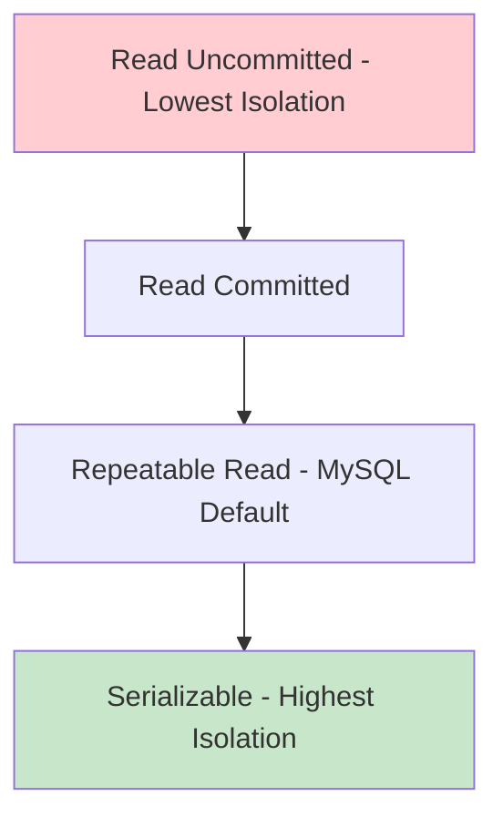
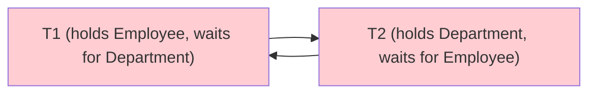
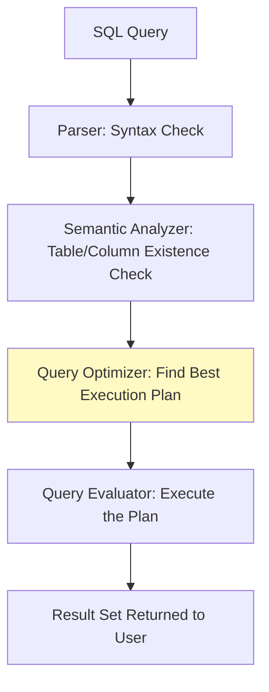

# ⭐⭐⭐⭐⭐ Chapter 4: Advanced DBMS & Interview Topics

This chapter separates the beginners from the experts. You must master Transactions, ACID properties, and Indexing to crack a product-based company interview.

---

## 1. Transactions & ACID Properties

A **Transaction** is a sequence of one or more database operations (reads and writes) that are treated as a single logical unit of work. Transactions are managed to ensure the ACID properties are maintained.

> [!NOTE]
> **Real-World Banking Analogy:**
> Alice wants to transfer $100 to Bob.
> * **Step 1:** Read Alice's Balance ($500)
> * **Step 2:** Deduct $100 from Alice (New Balance: $400)
> * **Step 3:** Read Bob's Balance ($200)
> * **Step 4:** Add $100 to Bob (New Balance: $300)
> 
> *What if the server crashes right after Step 2?* Alice lost $100, but Bob never got it! This is why we need ACID properties.

### ⭐ ACID Properties (Extremely Important)

* **Atomicity (All or Nothing):** The transaction either completes all 4 steps successfully (`COMMIT`) or fails completely and reverses any changes (`ROLLBACK`). The $100 isn't lost in the void.
* **Consistency:** The database must remain in a valid state. (e.g., The total sum of Alice and Bob's money must remain $700 before and after the transaction).
* **Isolation:** If Alice and Charlie both send money to Bob at the exact same millisecond, the DBMS must isolate the transactions so they don't overwrite each other's updates.
* **Durability:** Once a transaction is `COMMIT`ted, the changes are permanent. Even if the server catches fire 1 second later, the data is safe on the hard drive.

### 🔄 Transaction Flow Diagram
```text
               [ BEGIN TRANSACTION ]
                       |
                       v
               [ READ Alice ($500) ]
                       |
                       v
               [ WRITE Alice ($400) ]
                       |
               (Server Crashes here?) ---> [ ROLLBACK ] ---> (Alice back to $500)
                       |
                       v
               [ READ Bob ($200) ]
                       |
                       v
               [ WRITE Bob ($300) ]
                       |
                       v
                   [ COMMIT ]
                       |
               (Data is now DURABLE)
```

---

## 2. Concurrency Control & Locking

When thousands of users access a database at the same time (Concurrency), we use Locks to prevent data corruption.

### The Locking Mechanism
Imagine a public restroom with one toilet. If someone is inside, they lock the door. Others must wait in a queue.

* **Shared Lock (Read Lock - 'S'):** Multiple people can *read* the data at the same time. (Like multiple people reading a public notice board).
* **Exclusive Lock (Write Lock - 'X'):** Only ONE person can *write/update* the data. Everyone else is locked out until they finish.

### Lock Compatibility Matrix
| Requested ↓ \ Held → | Shared (S) | Exclusive (X) |
| :--- | :--- | :--- |
| **Shared (S)** | ✅ Compatible | ❌ Conflict |
| **Exclusive (X)** | ❌ Conflict | ❌ Conflict |

---

## 3. ⭐⭐⭐⭐⭐ Concurrency Anomalies (Must Know for Interviews)

These are the problems that occur when multiple transactions run concurrently without proper isolation.

### 1. Dirty Read
**Problem:** Transaction T2 reads data that T1 has modified but **NOT YET COMMITTED**. If T1 then rolls back, T2 has read "dirty" (non-existent) data.

```text
T1: UPDATE Salary = 90000 (not committed yet)
T2: READ Salary → sees 90000  ← DIRTY READ!
T1: ROLLBACK  (Salary is back to 80000)
T2: Is now working with wrong data!
```

### 2. Non-Repeatable Read
**Problem:** Transaction T1 reads the same row twice, but T2 **commits an UPDATE** between the two reads. T1 gets different values.

```text
T1: READ Salary → 80000
T2: UPDATE Salary = 90000 → COMMIT
T1: READ Salary again → 90000  ← Different value! Non-Repeatable!
```

### 3. Phantom Read
**Problem:** Transaction T1 executes the same range query twice, but T2 **commits an INSERT or DELETE** between the reads. T1 sees different rows (like ghosts appearing/disappearing).

```text
T1: SELECT * WHERE Dept=2 → returns 3 rows
T2: INSERT new employee in Dept=2 → COMMIT
T1: SELECT * WHERE Dept=2 → returns 4 rows  ← Phantom row appeared!
```

---

## 4. ⭐⭐⭐⭐⭐ Transaction Isolation Levels

Isolation levels control how much concurrent transactions can interfere with each other. Higher isolation = more safety, less performance.

| Isolation Level | Dirty Read | Non-Repeatable Read | Phantom Read |
| :--- | :--- | :--- | :--- |
| **Read Uncommitted** | ✅ Possible | ✅ Possible | ✅ Possible |
| **Read Committed** | ❌ Prevented | ✅ Possible | ✅ Possible |
| **Repeatable Read** | ❌ Prevented | ❌ Prevented | ✅ Possible |
| **Serializable** | ❌ Prevented | ❌ Prevented | ❌ Prevented |



```sql
-- Set isolation level for a session (MySQL)
SET SESSION TRANSACTION ISOLATION LEVEL READ COMMITTED;
SET SESSION TRANSACTION ISOLATION LEVEL REPEATABLE READ;  -- MySQL default
SET SESSION TRANSACTION ISOLATION LEVEL SERIALIZABLE;
```

> [!NOTE]
> **MySQL InnoDB default:** Repeatable Read. It prevents dirty reads and non-repeatable reads, and uses **gap locks** to also prevent phantom reads in many cases.

> [!TIP]
> **Interview Answer:** "Serializable is the safest level but has the lowest performance because it essentially runs transactions one at a time. Read Committed is the default in PostgreSQL and many other systems for a balance of safety and performance."

---

## 5. Two-Phase Locking (2PL) Protocol

**Two-Phase Locking** is the standard protocol to ensure **serializability** (correct concurrent execution).

### The Two Phases:
1. **Growing Phase:** A transaction can ACQUIRE locks but cannot RELEASE any lock.
2. **Shrinking Phase:** A transaction can RELEASE locks but cannot ACQUIRE any new lock.


> [!IMPORTANT]
> **2PL Guarantees Serializability** but does NOT prevent Deadlocks.

### Strict 2PL
All Exclusive (Write) locks are held until COMMIT/ROLLBACK. This prevents Cascading Rollbacks (where one transaction's rollback forces other transactions to also rollback).

---

## 6. Schedules and Serializability

A **Schedule** is the interleaved sequence of operations from multiple concurrent transactions.

### Serial Schedule
Transactions execute one after another, with no interleaving. Always correct but slow.

```text
T1: Read(A), Write(A), Commit
T2: Read(B), Write(B), Commit
```

### Serializable Schedule
A concurrent schedule that produces the same result as *some* serial schedule. This is the goal of concurrency control.

### Conflict Serializability (Tested in Exams!)
Two operations **conflict** if:
1. They belong to different transactions.
2. They operate on the **same data item**.
3. At least one of them is a **WRITE**.

**Precedence Graph (Wait-For Graph) Method:**
- Draw a directed edge T1 → T2 if T1's operation conflicts with T2's and T1 comes first.
- If the graph has **no cycle → Schedule is Conflict Serializable**.
- If the graph has **a cycle → NOT Conflict Serializable**.

```text
Example Schedule:
T1: R(A)        W(A)
T2:      W(A)        R(B) W(B)

Conflicts: T1 R(A) vs T2 W(A) → T1 first → Edge T1→T2
           T2 W(A) vs T1 W(A) → T2 first → Edge T2→T1

Graph has cycle T1→T2→T1 → NOT Serializable!
```

---

## 7. 🛑 Deadlock

A Deadlock occurs when two transactions are waiting for each other to release a lock, resulting in an infinite wait.

**Deadlock Analogy:**
* Transaction A locks the `Employee` table and needs the `Department` table.
* Transaction B locks the `Department` table and needs the `Employee` table.
* Both wait forever. The DBMS must detect this and kill (abort) one of the transactions.

### Deadlock Detection
The DBMS maintains a **Wait-For Graph (WFG)**. A cycle in the WFG indicates a deadlock.



**Resolution:** DBMS selects a **victim** transaction (usually the one with least work done) and aborts it.

### Deadlock Prevention
- **Wait-Die:** Older transaction waits; younger transaction dies (rolls back).
- **Wound-Wait:** Older transaction wounds (aborts) the younger; younger waits.
- **No-Wait:** Never wait for a lock; if lock is unavailable, immediately rollback.
- **Timeout:** Rollback if lock is not obtained within a set time.

### Deadlock Avoidance
**Banker's Algorithm:** Only grant a lock if the resulting state is "safe" (no deadlock possible). Rarely used in practice due to overhead.

---

## 8. Recovery Techniques

When a database crashes, it must recover to a consistent state.

### Write-Ahead Logging (WAL) ⭐⭐⭐⭐⭐
**Rule:** Before any change is written to the actual database on disk, it MUST first be recorded in a **Log File**.

```text
Log Entry format: [Transaction ID, Operation, Old Value, New Value]
Example: [T1, UPDATE, Salary=80000, Salary=90000]

Order of operations:
1. WRITE to LOG (WAL rule — must happen FIRST)
2. Write to Buffer (in memory)
3. COMMIT recorded in log
4. Flush Buffer to disk (physical DB file)
```

**Why WAL?** If the system crashes after step 3 but before step 4, the log can be used to REDO the committed changes and ensure durability.

### REDO and UNDO in Recovery

| Operation | When Used | What it Does |
| :--- | :--- | :--- |
| **REDO** | Transaction was COMMITTed but changes not yet on disk | Re-applies committed changes |
| **UNDO** | Transaction was NOT committed when crash occurred | Reverses the uncommitted changes |

### Checkpointing
A **Checkpoint** is a snapshot of the current DB state written to disk periodically. During recovery, the DBMS only needs to REDO/UNDO transactions that were active AFTER the last checkpoint, drastically reducing recovery time.

```text
Without Checkpoint: Must scan entire log (hours of recovery)
With Checkpoint: Only scan log from last checkpoint (seconds to minutes)
```

---

## 9. Indexing (How Databases Search So Fast)

If you have a table with 10 Million rows, searching for `Emp_ID = 500` would normally require checking every single row one-by-one (a **Full Table Scan**). This is incredibly slow.

> [!TIP]
> **The Library Analogy (No Jargon First):**
> Imagine finding a specific recipe in a 1,000-page cookbook that has no index. You have to flip through every single page. (Full Table Scan).
> 
> Now, imagine the book has an **Index** at the back. You look up "Chicken" in alphabetical order, and it says "Page 450". You jump straight to page 450. (Index Scan).

### Types of Indexes

| Type | Description | Notes |
| :--- | :--- | :--- |
| **Clustered Index** | Data rows physically stored in index order. ONE per table. | Usually the Primary Key in MySQL InnoDB |
| **Non-Clustered Index** | Separate structure with pointers to actual rows. Many per table. | All other indexed columns |
| **Dense Index** | One index entry per data record | Faster search, more storage |
| **Sparse Index** | One index entry per block of data | Less storage, slightly slower |
| **Composite Index** | Index on multiple columns | `CREATE INDEX idx ON T(A, B)` |
| **Partial Index** | Index on a subset of rows | PostgreSQL only: `WHERE salary > 0` |
| **Covering Index** | All columns needed by query exist in the index itself | No table lookup needed → very fast |

### How Indexes Work Internally (B-Trees and B+ Trees)

Databases use tree data structures to store indexes. The most popular is the **B+ Tree**.

### 🖼️ B-Tree vs B+ Tree Diagram
```text
B-Tree: Data can be stored in the middle branches.
      [ 50 (Data) ]
     /             \
 [ 20 (Data) ]  [ 80 (Data) ]

B+ Tree: Data is ONLY stored in the bottom leaves. Leaves are linked!
          [ 50 ]
         /      \
      [ 20 ]   [ 80 ]
       |          |
 [Data: 10,20]->[Data: 50,80]  <-- Linked List at the bottom!
```

**Why B+ Tree is better than B-Tree:**
In a B+ Tree, the leaf nodes are linked together like a train (a Linked List). This makes **Range Queries** (e.g., `WHERE Salary BETWEEN 40000 AND 60000`) blazingly fast because the DBMS just finds 40000 and rides the train sideways!

### Hashing for Indexes

**Static Hashing:** Uses a fixed number of buckets. Problem: if too many records hash to the same bucket (overflow), performance degrades.

**Dynamic (Extendible) Hashing:** The number of buckets grows automatically as the table grows. Used when data size is unpredictable. Avoids the overflow problem.

| Feature | B+ Tree Index | Hash Index |
| :--- | :--- | :--- |
| **Equality search** `=` | ✅ Fast | ✅ Very Fast (O(1)) |
| **Range search** `BETWEEN`, `>`, `<` | ✅ Fast (linked leaves) | ❌ Cannot do range queries |
| **ORDER BY** | ✅ Efficient | ❌ Not useful |
| **Used by default in MySQL** | ✅ Yes (InnoDB) | ❌ No |

---

## 10. Query Processing Pipeline



### Query Optimizer
The optimizer chooses the most efficient execution plan. Two main approaches:

| Type | How it Works |
| :--- | :--- |
| **Rule-Based Optimization (RBO)** | Applies predefined rules (e.g., "push WHERE clause down before JOIN") |
| **Cost-Based Optimization (CBO)** | Estimates cost (I/O, CPU) of different plans and picks the cheapest one. Uses table statistics. |

> [!NOTE]
> Modern databases use Cost-Based Optimization. MySQL's optimizer can be observed using `EXPLAIN` and `EXPLAIN ANALYZE`.

### SQL Query Execution Order
This is the actual ORDER SQL clauses are processed internally (different from writing order!):

```
1. FROM / JOIN       ← Get the raw data from tables
2. WHERE             ← Filter rows
3. GROUP BY          ← Group filtered rows
4. HAVING            ← Filter groups
5. SELECT            ← Pick columns / compute expressions
6. DISTINCT          ← Remove duplicates
7. ORDER BY          ← Sort results
8. LIMIT / OFFSET    ← Limit output rows
```

> [!IMPORTANT]
> **This is why you CANNOT use a SELECT alias in a WHERE clause** — WHERE is processed BEFORE SELECT!
> ```sql
> -- WRONG: WHERE sees column before SELECT assigns alias
> SELECT Salary * 1.1 AS New_Salary FROM Employees WHERE New_Salary > 90000;
> 
> -- CORRECT: Use HAVING after GROUP BY, or repeat the expression
> SELECT Salary * 1.1 AS New_Salary FROM Employees WHERE Salary * 1.1 > 90000;
> ```


---

# 🛑 CHAPTER END REVISIONS 🛑

## ⚡ 5-Minute Quick Revision
1. **Transaction:** Logical unit of work. BEGIN → operations → COMMIT/ROLLBACK.
2. **ACID:** Atomicity (All/Nothing), Consistency (Valid state), Isolation (No interference), Durability (Permanent).
3. **Concurrency Anomalies:** Dirty Read (uncommitted read), Non-Repeatable Read (same row, different values), Phantom Read (different row count).
4. **Isolation Levels:** Read Uncommitted < Read Committed < Repeatable Read (MySQL default) < Serializable.
5. **Locks:** Shared (Read, multiple allowed), Exclusive (Write, only one).
6. **2PL:** Growing phase (acquire) + Shrinking phase (release). Guarantees serializability.
7. **Schedules:** Serial (always correct), Serializable (equivalent to serial). Detect via Precedence Graph.
8. **Deadlock:** Two transactions waiting infinitely. Detected via Wait-For Graph. Resolved by aborting victim.
9. **WAL (Write-Ahead Logging):** Log written BEFORE data. Enables REDO (committed, not on disk) and UNDO (not committed).
10. **Checkpoint:** Periodic snapshot to reduce recovery time.
11. **Indexing:** Data structure to speed up retrieval. Uses B+ Trees.
12. **B+ Tree:** Stores data only in leaf nodes. Leaf nodes are linked for fast range scans.
13. **Dense Index:** One entry per record. Sparse Index: One entry per block.
14. **Clustered:** ONE per table, physical order. Non-Clustered: MANY per table, separate structure with pointers.
15. **Query Execution Order:** FROM → WHERE → GROUP BY → HAVING → SELECT → DISTINCT → ORDER BY → LIMIT.

## 🤔 Common Mistakes Students Make in Interviews
1. **Confusing Atomicity and Consistency:** Atomicity guarantees the transaction runs fully or aborts. Consistency guarantees business rules (like money cannot be negative) are upheld before and after.
2. **Thinking Indexes are always good:** Indexes speed up `SELECT` queries, but they slow down `INSERT`, `UPDATE`, and `DELETE` queries because the index tree must be rearranged every time data changes. Don't over-index!
3. **Forgetting Durability:** Durability means the data survives a power loss. It is achieved using database transaction logs (Write-Ahead Logging).
4. **Mixing up Dirty Read and Non-Repeatable Read:** Dirty Read is reading an UNCOMMITTED change. Non-Repeatable Read is reading a COMMITTED change between two reads of the same row.
5. **Saying 2PL prevents Deadlocks:** 2PL guarantees **serializability** but does NOT prevent deadlocks.
6. **Confusing WHERE alias:** You cannot reference a SELECT alias in WHERE because WHERE is processed before SELECT.

## 📝 Top 10 Placement MCQs

**Q1. Which ACID property ensures that either all operations execute or none do?**
A) Atomicity  B) Consistency  C) Isolation  D) Durability
> **Answer: A) Atomicity.**

**Q2. What type of lock allows multiple transactions to read a data item but not update it?**
A) Exclusive Lock  B) Deadlock  C) Shared Lock  D) Binary Lock
> **Answer: C) Shared Lock.**

**Q3. The situation where two transactions wait indefinitely for each other to release a lock is called:**
A) Starvation  B) Deadlock  C) Concurrency  D) Serializability
> **Answer: B) Deadlock.**

**Q4. Which data structure is most commonly used for database indexing?**
A) Hash Tables  B) Linked Lists  C) B+ Trees  D) Binary Search Trees
> **Answer: C) B+ Trees.**

**Q5. What is a major disadvantage of adding too many indexes to a table?**
A) SELECT queries become slower  B) INSERT and UPDATE queries become slower  C) Database uses less storage  D) Deadlocks occur more frequently
> **Answer: B) INSERT and UPDATE queries become slower.**
> **Note:** DELETE operations also become slower with excessive indexes.

**Q6. Which isolation level prevents Dirty Reads but NOT Non-Repeatable Reads?**
A) Read Uncommitted  B) Read Committed  C) Repeatable Read  D) Serializable
> **Answer: B) Read Committed.**

**Q7. Transaction T2 reads data that T1 has modified but not yet committed. What anomaly is this?**
A) Phantom Read  B) Non-Repeatable Read  C) Dirty Read  D) Lost Update
> **Answer: C) Dirty Read.**

**Q8. The Two-Phase Locking (2PL) protocol guarantees:**
A) Deadlock prevention  B) Conflict Serializability  C) Maximum throughput  D) No lock required
> **Answer: B) Conflict Serializability.**

**Q9. In the Write-Ahead Logging (WAL) protocol, the log must be written:**
A) After the data is written to disk  B) Before the data is written to disk  C) After COMMIT  D) Only on system crash
> **Answer: B) Before the data is written to disk.**

**Q10. The SQL clause that is executed FIRST in a query's logical processing order is:**
A) WHERE  B) SELECT  C) FROM/JOIN  D) GROUP BY
> **Answer: C) FROM/JOIN.**

## 🎤 Top 10 Interview Questions
1. **Explain the ACID properties with a real-world example.**
   * *Answer:* Explain the banking transfer analogy (Alice sending Bob $100). Walk through Atomicity (rollback on crash), Consistency (total balance remains same), Isolation (Charlie can't interfere), and Durability (saved to disk).
2. **What is the difference between a B-Tree and a B+ Tree?**
   * *Answer:* A B-Tree stores data in both internal and leaf nodes. A B+ Tree stores data pointers ONLY in leaf nodes. Additionally, B+ Tree leaf nodes are linked sequentially, making range queries (`BETWEEN`) extremely fast.
3. **What is a Deadlock and how can a DBMS handle it?**
   * *Answer:* Two transactions waiting on each other's locks forever. Handled by Deadlock Detection (DBMS finds cycles in a wait-for graph and kills one transaction) or by prevention strategies like Wait-Die or Wound-Wait.
4. **If Indexing makes searching fast, why don't we index every single column?**
   * *Answer:* Indexes consume disk space, and every INSERT/UPDATE/DELETE must update the index tree too. Too many indexes slow down write operations significantly.
5. **What is a Clustered Index vs a Non-Clustered Index?**
   * *Answer:* Clustered determines physical data order, ONE per table (usually Primary Key). Non-Clustered is a separate structure with pointers back to rows; MANY per table allowed.
6. **What are the 4 Transaction Isolation Levels and what anomaly does each prevent?**
   * *Answer:* Read Uncommitted (prevents nothing), Read Committed (prevents Dirty Reads), Repeatable Read (prevents Non-Repeatable Reads, MySQL default), Serializable (prevents all anomalies including Phantom Reads).
7. **Explain the difference between Dirty Read, Non-Repeatable Read, and Phantom Read.**
   * *Answer:* Dirty Read: Reading uncommitted data. Non-Repeatable: Same row gives different values in two reads. Phantom: Same query returns different rows (due to INSERT/DELETE by another transaction).
8. **What is Write-Ahead Logging? Why is it important?**
   * *Answer:* WAL requires writing to the transaction log BEFORE writing data to disk. It enables crash recovery: REDO committed but unflused transactions, UNDO uncommitted transactions.
9. **What is the SQL Query Execution Order?**
   * *Answer:* FROM → WHERE → GROUP BY → HAVING → SELECT → DISTINCT → ORDER BY → LIMIT. This is why you can't use SELECT aliases in WHERE.
10. **What is Two-Phase Locking (2PL)? Does it prevent deadlocks?**
    * *Answer:* 2PL has a Growing phase (acquire locks only) and Shrinking phase (release locks only). It guarantees conflict serializability but does NOT prevent deadlocks. Strict 2PL (release X-locks only at commit) prevents cascading rollbacks.


