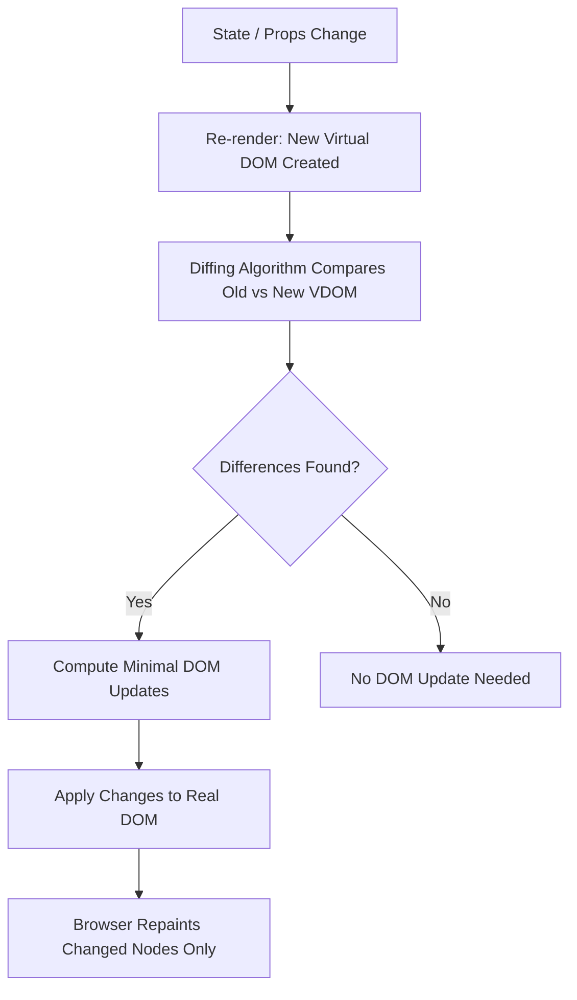

# Module 01 — Introduction to React & JSX

> **Level:** Beginner | **Duration:** 4–5 hours

---

## 🎯 Learning Objectives

By the end of this module, you will:
- Understand what React is and why it exists
- Know how the Virtual DOM works internally
- Write JSX confidently
- Set up a React project with Vite
- Understand React Fiber architecture at a high level
- Avoid common JSX mistakes

---

## 1. What Is React?

React is a **JavaScript library** (not a framework) built by Facebook (Meta) in 2013 for building **user interfaces**. It focuses exclusively on the **view layer** of an application.

### Why React Exists

Before React, building dynamic UIs meant manually updating the DOM with vanilla JS or jQuery — every state change required you to find elements, update them, and keep everything in sync. This became a nightmare at scale.

React solved this with one core idea:

> **"Describe what the UI should look like for a given state, and let React figure out how to update the DOM."**

### React's Core Principles

1. **Declarative** — You describe *what* you want, not *how* to do it
2. **Component-Based** — UI is split into reusable, isolated pieces
3. **Unidirectional Data Flow** — Data flows from parent to child via props
4. **Learn Once, Write Anywhere** — React Native for mobile, React DOM for web

---

## 2. The Virtual DOM

### What is the DOM?

The **Document Object Model (DOM)** is a tree-like representation of your HTML that the browser creates. Manipulating it directly is **slow** because every change can trigger expensive browser reflows and repaints.

### What is the Virtual DOM?

The Virtual DOM (VDOM) is a **lightweight JavaScript object** that mirrors the real DOM structure. It lives in memory and is much faster to work with.

### How it works — Step by Step

```
1. Initial Render
   Your JSX → React.createElement() → Virtual DOM tree → Real DOM

2. State Change
   New state → New Virtual DOM tree created

3. Diffing (Reconciliation)
   React compares old VDOM vs new VDOM (diffing algorithm)

4. Patching
   Only the changed parts are updated in the real DOM
```

### Mermaid Diagram — Virtual DOM Cycle



### Why VDOM is Fast

- Batch updates — multiple state changes are batched into one DOM update
- Minimal mutations — only truly changed nodes are touched
- In-memory diffing is cheap compared to DOM traversal

---

## 3. React Fiber Architecture

Fiber is React's internal **reconciliation engine** (introduced in React 16).

### Why Fiber?

The old reconciler was synchronous — once it started rendering, it couldn't stop. This caused UI jank (dropped frames) for expensive renders.

Fiber makes rendering **incremental** and **interruptible**:
- React can pause rendering, do other work, then resume
- High-priority updates (user input) can interrupt low-priority ones
- Enables Concurrent Mode and features like Suspense

### Fiber Concepts

| Concept | Meaning |
|---------|---------|
| Fiber node | A unit of work representing one component |
| Work loop | React processes fiber nodes one at a time |
| Time-slicing | Work is split into chunks (16ms frames) |
| Priority lanes | Updates are assigned priority (urgent, normal, background) |

---

## 4. Setting Up a React Project

### Option A: Vite (Recommended — Fast)

```bash
# Create a new Vite + React project
npm create vite@latest my-app -- --template react

cd my-app
npm install
npm run dev
```

### Option B: Create React App (Legacy — slower)

```bash
npx create-react-app my-app
cd my-app
npm start
```

### Project Structure (Vite)

```
my-app/
├── public/
│   └── vite.svg
├── src/
│   ├── assets/
│   ├── App.jsx          ← Root component
│   ├── App.css
│   ├── main.jsx         ← Entry point
│   └── index.css
├── index.html           ← HTML shell
├── package.json
└── vite.config.js
```

### Entry Point Explained

```jsx
// src/main.jsx
import React from 'react';
import ReactDOM from 'react-dom/client';
import App from './App.jsx';
import './index.css';

// Mount the React app into the real DOM
ReactDOM.createRoot(document.getElementById('root')).render(
  <React.StrictMode>
    <App />
  </React.StrictMode>
);
```

`React.StrictMode` activates extra warnings and double-invokes certain functions in development to help catch bugs.

---

## 5. JSX — JavaScript XML

### What is JSX?

JSX is a **syntax extension** for JavaScript that lets you write HTML-like code inside JavaScript files.

```jsx
// JSX
const element = <h1 className="title">Hello, World!</h1>;

// What Babel compiles it to:
const element = React.createElement(
  'h1',
  { className: 'title' },
  'Hello, World!'
);
```

JSX is NOT HTML. It is **syntactic sugar** for `React.createElement()` calls.

### JSX Rules

#### Rule 1: Return a Single Root Element

```jsx
// ❌ WRONG — multiple root elements
return (
  <h1>Title</h1>
  <p>Content</p>
);

// ✅ CORRECT — wrap in a div
return (
  <div>
    <h1>Title</h1>
    <p>Content</p>
  </div>
);

// ✅ BETTER — use Fragment to avoid extra div
return (
  <>
    <h1>Title</h1>
    <p>Content</p>
  </>
);
```

#### Rule 2: Close All Tags

```jsx
// ❌ WRONG
<input type="text">


// ✅ CORRECT
<input type="text" />

```

#### Rule 3: Use `className`, not `class`

```jsx
// ❌ WRONG (class is a reserved JS keyword)
<div class="container">

// ✅ CORRECT
<div className="container">
```

#### Rule 4: Use camelCase for Attributes

```jsx
// HTML:         onclick, tabindex, for
// JSX:          onClick, tabIndex, htmlFor

<label htmlFor="email">Email</label>
<input id="email" tabIndex={1} onChange={handleChange} />
```

#### Rule 5: JavaScript Expressions in Curly Braces

```jsx
const name = 'Alice';
const age = 25;

return (
  <div>
    <h1>Hello, {name}!</h1>
    <p>Age: {age}</p>
    <p>Next year: {age + 1}</p>
    <p>Upper: {name.toUpperCase()}</p>
    {/* This is a JSX comment */}
  </div>
);
```

#### Rule 6: Inline Styles Use Objects

```jsx
// ❌ WRONG
<div style="color: red; font-size: 16px">

// ✅ CORRECT — object with camelCase keys
<div style={{ color: 'red', fontSize: '16px' }}>
//           ↑ outer {} = JSX expression
//                ↑ inner {} = JavaScript object
```

### What Can Go Inside JSX `{}`?

```jsx
// ✅ Allowed — expressions
{name}
{2 + 2}
{user.name}
{isLoggedIn ? 'Welcome' : 'Login'}
{items.map(item => <li>{item}</li>)}
{'hello'.toUpperCase()}

// ❌ Not allowed — statements
{if (x) { return y }}   // ← statements don't work
{for (...) {}}          // ← use .map() instead
```

### JSX is an Expression

JSX can be stored in variables, passed as arguments, returned from functions:

```jsx
const greeting = <h1>Hello!</h1>;

function getButton(type) {
  if (type === 'primary') return <button className="btn-primary">Submit</button>;
  return <button className="btn-secondary">Cancel</button>;
}
```

### Fragments

Fragments let you group elements without adding extra DOM nodes:

```jsx
import { Fragment } from 'react';

// Long form
function App() {
  return (
    <Fragment>
      <h1>Title</h1>
      <p>Content</p>
    </Fragment>
  );
}

// Short form (most common)
function App() {
  return (
    <>
      <h1>Title</h1>
      <p>Content</p>
    </>
  );
}

// When you need a key prop (e.g., in lists), use the long form:
items.map(item => (
  <Fragment key={item.id}>
    <dt>{item.term}</dt>
    <dd>{item.description}</dd>
  </Fragment>
))
```

---

## 6. React.createElement Deep Dive

Under the hood, JSX compiles to nested `React.createElement()` calls:

```jsx
// JSX
const card = (
  <div className="card">
    <h2>{title}</h2>
    <p>{body}</p>
  </div>
);

// Compiled JavaScript
const card = React.createElement(
  'div',                         // type
  { className: 'card' },         // props
  React.createElement('h2', null, title),   // child 1
  React.createElement('p', null, body)      // child 2
);
```

The result is a plain JavaScript object (a React element):

```js
{
  type: 'div',
  props: {
    className: 'card',
    children: [
      { type: 'h2', props: { children: title } },
      { type: 'p',  props: { children: body  } }
    ]
  }
}
```

This object is what React uses to build and diff the Virtual DOM.

---

## 7. Your First React App

```jsx
// src/App.jsx
function App() {
  const user = {
    name: 'Alice',
    role: 'Developer',
    skills: ['React', 'JavaScript', 'CSS'],
  };

  const isLoggedIn = true;

  return (
    <div className="app">
      <header>
        <h1>Welcome, {user.name}!</h1>
        <p>Role: {user.role}</p>
      </header>

      <main>
        {isLoggedIn ? (
          <p>You are logged in ✅</p>
        ) : (
          <p>Please log in</p>
        )}

        <h2>Skills:</h2>
        <ul>
          {user.skills.map((skill, index) => (
            <li key={index}>{skill}</li>
          ))}
        </ul>
      </main>

      <footer style={{ marginTop: '20px', color: '#888' }}>
        <p>Built with React</p>
      </footer>
    </div>
  );
}

export default App;
```

---

## 8. Diffing Algorithm & Reconciliation

React's diffing algorithm makes two important assumptions to achieve O(n) complexity:

### Assumption 1: Different Element Types → Rebuild

```jsx
// Before
<div><Counter /></div>

// After  
<span><Counter /></span>
// ↑ Because root element changed (div → span), React
//   destroys the old tree and builds a new one from scratch.
//   Counter loses all its state!
```

### Assumption 2: Keys Help Identify List Items

```jsx
// Without keys — React may re-render incorrectly when list order changes
{items.map(item => <Item>{item.name}</Item>)}

// With keys — React can track which items moved, were added, or removed
{items.map(item => <Item key={item.id}>{item.name}</Item>)}
```

### The Diffing Process

```
Old Tree:          New Tree:
<ul>               <ul>
  <li>A</li>         <li>A</li>   ← same, skip
  <li>B</li>         <li>C</li>   ← changed, update text
  <li>C</li>                      ← removed
</ul>              </ul>
```

Without keys, React compares nodes by position. With unique keys, it tracks by identity.

---

## 9. Common Mistakes

| Mistake | Problem | Fix |
|---------|---------|-----|
| `class` instead of `className` | JS reserved keyword | Use `className` |
| Returning multiple root elements | Invalid JSX | Wrap in `<>` or `<div>` |
| Not closing self-closing tags | Syntax error | ``, `<br />` |
| Using `for` instead of `htmlFor` | Wrong attribute name | Use `htmlFor` on `<label>` |
| Statements inside `{}` | Only expressions allowed | Use ternary or `.map()` |
| `style="color: red"` | Style must be an object | Use `style={{ color: 'red' }}` |
| Using array index as key | Causes bugs when list changes | Use unique IDs as keys |
| Mutating state directly | React won't detect changes | Use setter functions |

---

## 10. Debugging Tips

1. **React DevTools** — Install the browser extension to inspect the component tree and state
2. **Console.log in JSX** — Use `{console.log(variable) || null}` to log inside JSX
3. **Error messages** — React gives descriptive errors; read them carefully
4. **Strict Mode** — `<React.StrictMode>` catches many bugs during development

```jsx
// Debugging trick — log inside JSX without affecting output
return (
  <div>
    {console.log('Current state:', data) || null}
    <p>{data.name}</p>
  </div>
);
```

---

## 11. Interview Questions

**Q1. What is the Virtual DOM and how does it improve performance?**
The Virtual DOM is an in-memory JavaScript representation of the real DOM. When state changes, React creates a new VDOM, diffs it against the old one (reconciliation), and updates only the changed nodes in the real DOM. This minimizes expensive DOM operations.

**Q2. What is JSX? Is it required to use React?**
JSX is syntactic sugar for `React.createElement()`. It is NOT required — you can write React in pure JavaScript — but JSX makes code more readable. Babel compiles JSX to `React.createElement()` calls before the browser runs it.

**Q3. What is React Fiber?**
React Fiber is the reconciliation engine introduced in React 16. It makes rendering incremental and interruptible, allowing React to pause, prioritize, and resume rendering work. This enables Concurrent Mode, Suspense, and smooth animations.

**Q4. Why must JSX return a single root element?**
Because JSX compiles to a single `React.createElement()` call, which can only return one value. Fragments (`<>`) solve this without adding extra DOM nodes.

**Q5. What is the difference between `class` and `className` in JSX?**
`class` is a reserved keyword in JavaScript. JSX uses `className` instead to avoid conflicts, which maps to the `class` attribute in the real DOM.

**Q6. What is the difference between the real DOM and Virtual DOM?**
The real DOM is the actual HTML tree in the browser. The Virtual DOM is a lightweight JS object copy of it. DOM operations are slow because they trigger browser reflow/repaint. VDOM operations happen in memory (fast), and only the final diff is applied to the real DOM.

**Q7. What does React.StrictMode do?**
It activates extra development-only warnings, detects deprecated APIs, double-invokes certain lifecycle methods to expose side effects, and warns about unexpected side effects. It has no effect in production.

---

## 12. MCQs

**1. What does JSX compile to?**
- a) HTML
- b) `React.createElement()` calls ✅
- c) DOM elements
- d) JSON objects

**2. Which attribute replaces `for` in JSX?**
- a) `forHtml`
- b) `labelFor`
- c) `htmlFor` ✅
- d) `forLabel`

**3. What does the Virtual DOM do?**
- a) Replaces the real DOM entirely
- b) Stores CSS
- c) Acts as an in-memory representation for efficient updates ✅
- d) Manages routing

**4. What is React Fiber?**
- a) A CSS framework
- b) A build tool
- c) React's incremental reconciliation engine ✅
- d) A testing library

**5. Which is the correct way to write inline styles in JSX?**
- a) `style="color: red"`
- b) `style={{ color: 'red' }}` ✅
- c) `style={color: red}`
- d) `css={{ color: 'red' }}`

---

## 13. Assignments

### Assignment 1 — Setup & Hello World
1. Create a new Vite + React project
2. Delete `App.css` contents and clear `App.jsx`
3. Create an `App` component that renders:
   - Your name as an `<h1>`
   - Your current role as a `<p>`
   - A list of 3 technologies you want to learn

### Assignment 2 — JSX Practice
Create a component that:
1. Declares a `product` object with `name`, `price`, and `inStock` fields
2. Renders the product name and price
3. Conditionally renders "In Stock" or "Out of Stock" based on `inStock`
4. Styles the stock text green or red using inline styles

### Assignment 3 — JSX Deep Dive
Create an array of 5 people objects `{ id, name, age, city }` and render them as a styled HTML table using `.map()`.

---

## 14. Mini Project — Profile Card

Build a static profile card component:

```jsx
// Requirements:
// - Avatar (use a placeholder image URL)
// - Name, title, bio
// - Skill tags (map over an array)
// - Follow/Message buttons
// - Clean, styled layout

function ProfileCard() {
  const profile = {
    name: 'Alex Johnson',
    title: 'Frontend Developer',
    bio: 'Passionate about building beautiful, accessible web apps.',
    skills: ['React', 'TypeScript', 'CSS', 'Node.js'],
    followers: 1240,
    following: 380,
    avatar: 'https://api.dicebear.com/7.x/avataaars/svg?seed=Alex'
  };

  return (
    // Your implementation here
  );
}
```

---

## ⚡ Quick Revision Notes

- React is a **UI library**, not a framework
- **Virtual DOM** = in-memory JS object of the DOM; makes updates faster via diffing
- **JSX** = syntax sugar for `React.createElement()`; Babel compiles it
- **Fiber** = React's reconciliation engine; enables incremental, interruptible rendering
- JSX rules: single root, close all tags, `className` not `class`, camelCase attributes
- `{}` in JSX = JavaScript expressions only (no statements)
- **Fragments** `<>` = group elements without extra DOM nodes
- Inline styles = objects with camelCase keys `{{ color: 'red' }}`
- **Reconciliation** = process of comparing old and new VDOM trees
- **Diffing** = comparing trees; assumes different types = different subtrees; uses keys for lists

---

*Next: Module 02 — Components & Props →*
