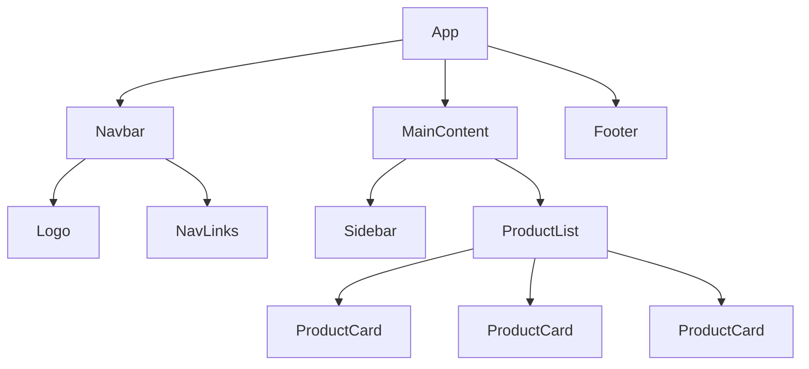

# Module 02 — Components & Props

> **Level:** Beginner | **Duration:** 4–5 hours

---

## 🎯 Learning Objectives

- Understand functional and class components
- Master passing and receiving props
- Understand the component tree and composition
- Learn PropTypes for runtime type checking
- Understand children prop and composition patterns
- Avoid prop drilling anti-patterns
- Write clean, reusable components

---

## 1. What is a Component?

A component is a **self-contained, reusable piece of UI** — like a JavaScript function that returns JSX.

> Think of components as custom HTML elements you define yourself.

```jsx
// A simple component — it's just a function!
function Welcome() {
  return <h1>Hello, World!</h1>;
}

// Use it like an HTML tag
function App() {
  return (
    <div>
      <Welcome />
      <Welcome />
      <Welcome />
    </div>
  );
}
```

**Key rules:**
- Component names must start with a **capital letter** (`Welcome`, not `welcome`)
- A lowercase name means an HTML tag; uppercase means a component
- Components must return JSX (or `null`)

---

## 2. Functional Components

Functional components are the **modern standard** — plain JavaScript functions.

```jsx
// Arrow function style
const Greeting = () => {
  return <h1>Hello!</h1>;
};

// Regular function style (preferred for readability)
function Greeting() {
  return <h1>Hello!</h1>;
}

// Implicit return for simple components
const Badge = () => <span className="badge">New</span>;
```

### Component with Logic

```jsx
function UserCard() {
  const user = { name: 'Alice', age: 28, role: 'Developer' };
  const isAdmin = user.role === 'Admin';

  return (
    <div className="user-card">
      <h2>{user.name}</h2>
      <p>Age: {user.age}</p>
      <p>Role: {user.role}</p>
      {isAdmin && <span className="badge admin">Admin</span>}
    </div>
  );
}
```

---

## 3. Class Components (Legacy Knowledge)

Class components were the original way to write React. You must know them for interviews and legacy codebases, but **always prefer functional components**.

```jsx
import { Component } from 'react';

class Welcome extends Component {
  render() {
    return <h1>Hello, {this.props.name}!</h1>;
  }
}
```

### Functional vs Class — Comparison

| Feature | Functional | Class |
|---------|-----------|-------|
| Syntax | Plain function | ES6 class |
| Hooks | ✅ Yes | ❌ No |
| `this` | Not needed | Required everywhere |
| Boilerplate | Minimal | More verbose |
| Performance | Slightly better | Slightly more overhead |
| Modern standard | ✅ Yes | Legacy |

---

## 4. Props

**Props** (short for "properties") are how you pass data from a **parent component to a child component**.

Props are:
- **Read-only** — a component must never modify its own props
- **Passed like HTML attributes** — `<Component key={value} />`
- **Received as a plain object** in the function parameter

```jsx
// Parent passes props
function App() {
  return (
    <UserCard
      name="Alice"
      age={28}
      role="Developer"
      isActive={true}
    />
  );
}

// Child receives props as an object
function UserCard(props) {
  return (
    <div>
      <h2>{props.name}</h2>
      <p>Age: {props.age}</p>
      <p>Role: {props.role}</p>
      {props.isActive && <span>🟢 Active</span>}
    </div>
  );
}
```

### Destructuring Props (Best Practice)

```jsx
// ✅ Destructure in the parameter
function UserCard({ name, age, role, isActive }) {
  return (
    <div>
      <h2>{name}</h2>
      <p>Age: {age}</p>
      <p>Role: {role}</p>
      {isActive && <span>🟢 Active</span>}
    </div>
  );
}

// ✅ Destructure inside the function body
function UserCard(props) {
  const { name, age, role, isActive } = props;
  // ...
}
```

### Types of Props

```jsx
function Demo({
  // String
  title,
  // Number
  count,
  // Boolean
  isVisible,
  // Array
  items,
  // Object
  user,
  // Function (callback)
  onClick,
  // JSX / Component
  icon,
}) {
  return (
    <div>
      <h1>{title}</h1>
      <p>Count: {count}</p>
      {isVisible && <span>Visible</span>}
      <ul>{items.map(item => <li key={item}>{item}</li>)}</ul>
      <p>{user.name}</p>
      <button onClick={onClick}>Click</button>
      {icon}
    </div>
  );
}

// Usage
<Demo
  title="Hello"
  count={5}
  isVisible={true}
  items={['a', 'b', 'c']}
  user={{ name: 'Alice' }}
  onClick={() => console.log('clicked')}
  icon={<span>⭐</span>}
/>
```

### Default Props

```jsx
// Method 1: Default parameter values (preferred)
function Button({ label = 'Click me', variant = 'primary', disabled = false }) {
  return (
    <button className={`btn btn-${variant}`} disabled={disabled}>
      {label}
    </button>
  );
}

// Method 2: defaultProps (legacy, still works)
Button.defaultProps = {
  label: 'Click me',
  variant: 'primary',
  disabled: false,
};
```

---

## 5. The `children` Prop

`children` is a special prop that represents whatever is placed **between the opening and closing tags** of a component.

```jsx
// The children prop
function Card({ title, children }) {
  return (
    <div className="card">
      <div className="card-header">
        <h2>{title}</h2>
      </div>
      <div className="card-body">
        {children}  {/* Renders whatever is placed between <Card> tags */}
      </div>
    </div>
  );
}

// Usage — anything between tags becomes `children`
function App() {
  return (
    <Card title="User Info">
      <p>Name: Alice</p>
      <p>Role: Developer</p>
      <button>Edit Profile</button>
    </Card>
  );
}
```

This is the foundation of **component composition** — building flexible, reusable components.

```jsx
// Layout components using children
function PageLayout({ children }) {
  return (
    <div className="layout">
      <Navbar />
      <main className="main-content">
        {children}
      </main>
      <Footer />
    </div>
  );
}

// Modal using children
function Modal({ isOpen, onClose, children }) {
  if (!isOpen) return null;
  return (
    <div className="modal-overlay" onClick={onClose}>
      <div className="modal-content" onClick={e => e.stopPropagation()}>
        {children}
        <button onClick={onClose}>Close</button>
      </div>
    </div>
  );
}
```

---

## 6. Component Composition

**Composition** is the pattern of building complex UIs by combining smaller components — the preferred alternative to inheritance.

```jsx
// Small, focused components
function Avatar({ src, alt, size = 'medium' }) {
  return ;
}

function UserName({ name, verified }) {
  return (
    <span>
      {name} {verified && <span title="Verified">✅</span>}
    </span>
  );
}

function FollowButton({ onFollow, following }) {
  return (
    <button onClick={onFollow} className={following ? 'btn-unfollow' : 'btn-follow'}>
      {following ? 'Unfollow' : 'Follow'}
    </button>
  );
}

// Composed into a complex component
function UserProfile({ user, onFollow }) {
  return (
    <div className="profile">
      <Avatar src={user.avatarUrl} alt={user.name} size="large" />
      <UserName name={user.name} verified={user.isVerified} />
      <p>{user.bio}</p>
      <FollowButton onFollow={onFollow} following={user.isFollowing} />
    </div>
  );
}
```

---

## 7. Component Tree

React apps are organized as a **tree** of components:

```
App
├── Navbar
│   ├── Logo
│   ├── NavLinks
│   └── UserMenu
├── MainContent
│   ├── Sidebar
│   └── ProductList
│       ├── ProductCard
│       ├── ProductCard
│       └── ProductCard
└── Footer
```



Data flows **downward** through props (from parent to child). This is called **unidirectional data flow**.

---

## 8. PropTypes — Runtime Type Checking

`PropTypes` provides runtime warnings when wrong prop types are passed. Useful for catching bugs during development.

```bash
npm install prop-types
```

```jsx
import PropTypes from 'prop-types';

function UserCard({ name, age, email, role, onDelete }) {
  return (
    <div>
      <h2>{name}</h2>
      <p>Age: {age}</p>
      <p>Email: {email}</p>
      <p>Role: {role}</p>
      <button onClick={onDelete}>Delete</button>
    </div>
  );
}

UserCard.propTypes = {
  name: PropTypes.string.isRequired,
  age: PropTypes.number.isRequired,
  email: PropTypes.string,
  role: PropTypes.oneOf(['admin', 'user', 'moderator']),
  onDelete: PropTypes.func.isRequired,
};

UserCard.defaultProps = {
  email: 'Not provided',
  role: 'user',
};
```

### Common PropTypes

```jsx
MyComponent.propTypes = {
  // Primitives
  name: PropTypes.string,
  age: PropTypes.number,
  isActive: PropTypes.bool,

  // Required versions
  id: PropTypes.number.isRequired,
  title: PropTypes.string.isRequired,

  // Arrays and objects
  items: PropTypes.array,
  user: PropTypes.object,

  // Specific array type
  scores: PropTypes.arrayOf(PropTypes.number),

  // Object with specific shape
  address: PropTypes.shape({
    street: PropTypes.string,
    city: PropTypes.string,
    zip: PropTypes.string,
  }),

  // One of specific values
  status: PropTypes.oneOf(['active', 'inactive', 'pending']),

  // One of several types
  children: PropTypes.oneOfType([
    PropTypes.string,
    PropTypes.node,
  ]),

  // Function
  onClick: PropTypes.func,

  // React element
  icon: PropTypes.element,
  children: PropTypes.node, // anything renderable
};
```

**Note:** For production apps with TypeScript, use TypeScript interfaces/types instead of PropTypes.

---

## 9. Prop Drilling (Anti-Pattern)

Prop drilling is passing props through multiple intermediate components that don't need them, just to get them to a deeply nested child.

```jsx
// ❌ Prop Drilling Problem
function App() {
  const user = { name: 'Alice', avatar: 'url...' };
  return <Page user={user} />;
}

function Page({ user }) {
  return <Sidebar user={user} />;  // Page doesn't use user, just passes it
}

function Sidebar({ user }) {
  return <UserInfo user={user} />;  // Sidebar doesn't use user either
}

function UserInfo({ user }) {
  return <p>{user.name}</p>;  // Only this component actually needs user
}
```

**Solutions to Prop Drilling:**
1. **Context API** (Module 12) — best for global data
2. **Component Composition** — restructure components to avoid the drilling
3. **Redux/State Management** (Module 21) — for complex global state

```jsx
// ✅ Solution via Composition — pass components as children
function App() {
  const user = { name: 'Alice' };
  return (
    <Page>
      <Sidebar>
        <UserInfo user={user} />
      </Sidebar>
    </Page>
  );
}

function Page({ children }) {
  return <div className="page">{children}</div>;
}

function Sidebar({ children }) {
  return <aside className="sidebar">{children}</aside>;
}

function UserInfo({ user }) {
  return <p>{user.name}</p>;
}
```

---

## 10. Lifting State Up

When two sibling components need to share state, **lift the state up** to their closest common ancestor.

```jsx
// ❌ Problem — siblings can't share state directly
function TemperatureInput() {
  // Both components have their own state — they can't sync
}

// ✅ Solution — lift state to parent
function TemperatureConverter() {
  const [celsius, setCelsius] = useState('');

  const fahrenheit = celsius !== '' ? (celsius * 9) / 5 + 32 : '';

  return (
    <div>
      <TemperatureInput
        label="Celsius"
        value={celsius}
        onChange={setCelsius}
      />
      <TemperatureInput
        label="Fahrenheit"
        value={fahrenheit}
        onChange={(f) => setCelsius(((f - 32) * 5) / 9)}
      />
    </div>
  );
}

function TemperatureInput({ label, value, onChange }) {
  return (
    <div>
      <label>{label}: </label>
      <input
        type="number"
        value={value}
        onChange={(e) => onChange(e.target.value)}
      />
    </div>
  );
}
```

---

## 11. Pure Components

A **pure component** renders the same output for the same props/state. It has no side effects.

```jsx
// ✅ Pure — same input always gives same output
function PureButton({ label, onClick }) {
  return <button onClick={onClick}>{label}</button>;
}

// ❌ Impure — depends on external state
let count = 0;
function ImpureCounter() {
  count++;  // Mutates external variable!
  return <p>Count: {count}</p>;
}
```

Keeping components pure makes them:
- Predictable and testable
- Safe for Concurrent Mode
- Easy to reason about

---

## 12. Exporting Components

```jsx
// Named export
export function Button({ label }) {
  return <button>{label}</button>;
}

// Default export
function App() {
  return <div>App</div>;
}
export default App;

// Multiple named exports from one file
export { Button, Card, Modal };

// Importing
import App from './App';            // default import
import { Button } from './Button';  // named import
import { Button, Card } from './components'; // multiple named
```

---

## 13. Common Mistakes

| Mistake | Problem | Fix |
|---------|---------|-----|
| Lowercase component name | Treated as HTML tag | Always capitalize: `<MyComponent>` |
| Mutating props | React won't re-render | Props are read-only |
| Passing props as strings when numbers needed | `"5"` vs `5` | Use `{}`: `count={5}` |
| Too many props on one component | Hard to use | Extract sub-components |
| Excessive prop drilling | Unmaintainable | Use Context or composition |
| Using array index as key | Bugs when list reorders | Use unique IDs |

---

## 14. Interview Questions

**Q1. What is the difference between props and state?**
Props are passed from parent to child — they are external and read-only. State is managed inside a component — it is internal and mutable. Props configure a component; state drives its behavior over time.

**Q2. Can a component modify its own props?**
No. Props are immutable from the child's perspective. If you need to change data, lift the state to the parent and pass down a callback to trigger updates.

**Q3. What is prop drilling and how do you fix it?**
Prop drilling is passing props through intermediate components that don't need them. Fix with Context API (for global data), component composition (restructuring), or state management (Redux).

**Q4. What is the difference between functional and class components?**
Functional components are plain functions; class components extend `React.Component`. Functional components use hooks for state and lifecycle; class components use `this.state` and lifecycle methods. Functional components are the modern standard.

**Q5. What is the `children` prop?**
A special prop that holds whatever JSX is placed between a component's opening and closing tags. Used to build flexible wrapper/layout components.

**Q6. What is lifting state up?**
Moving shared state to the nearest common ancestor of the components that need it, then passing it down as props. This is how siblings can share and sync data.

**Q7. Why should component names start with a capital letter?**
JSX uses the capitalization to distinguish components from HTML elements. Lowercase tags are treated as DOM elements; capitalized tags are treated as React components.

---

## 15. MCQs

**1. Which of the following correctly passes a number prop?**
- a) `<Input value="5">`
- b) `<Input value={5}>` ✅
- c) `<Input value=5>`
- d) `<Input value=(5)>`

**2. Props in React are:**
- a) Mutable from inside the component
- b) Read-only and passed from parent to child ✅
- c) Available only in class components
- d) Used only for styling

**3. What is the purpose of the `children` prop?**
- a) To define the component's name
- b) To render nested child elements passed between component tags ✅
- c) To pass CSS styles
- d) To define default props

**4. What is prop drilling?**
- a) A performance optimization
- b) Passing props through multiple intermediate components ✅
- c) Using the Context API
- d) Drilling holes in components

**5. When should you lift state up?**
- a) When a component becomes too large
- b) When two sibling components need to share state ✅
- c) Always, for every component
- d) Only in class components

---

## 16. Assignments

### Assignment 1 — Component Breakdown
Take this HTML and break it into React components:
```html
<div class="page">
  <nav>Logo | Home | About | Contact</nav>
  <main>
    <article class="card">
      
      <h2>Title</h2>
      <p>Description...</p>
      <button>Read More</button>
    </article>
  </main>
  <footer>© 2024</footer>
</div>
```

### Assignment 2 — Props Practice
Create a `ProductCard` component that accepts:
- `name` (string, required)
- `price` (number, required)
- `imageUrl` (string)
- `inStock` (boolean)
- `onAddToCart` (function)
Add PropTypes for all props and default values where appropriate.

### Assignment 3 — Composition Pattern
Build a `Modal` component using the children pattern. It should:
- Accept `isOpen`, `onClose`, `title`, and `children` props
- Render nothing when `isOpen` is false
- Render a centered overlay with the title and children when open
- Close when the overlay background or a Close button is clicked

---

## ⚡ Quick Revision Notes

- **Component** = function returning JSX; name must be capitalized
- **Props** = read-only data passed parent → child; destructure for clean code
- **Children prop** = content between component tags; enables composition
- **Default props** = use parameter defaults: `function Btn({ label = 'OK' })`
- **PropTypes** = runtime type checking (dev only); prefer TypeScript in production
- **Lifting state up** = move shared state to nearest common ancestor
- **Prop drilling** = passing props through intermediaries (anti-pattern); solve with Context or composition
- **Composition** = prefer over inheritance; combine small components to build complex UIs
- Class components: know the syntax, use functional components in practice

---

*Next: Module 03 — State & Event Handling →*
