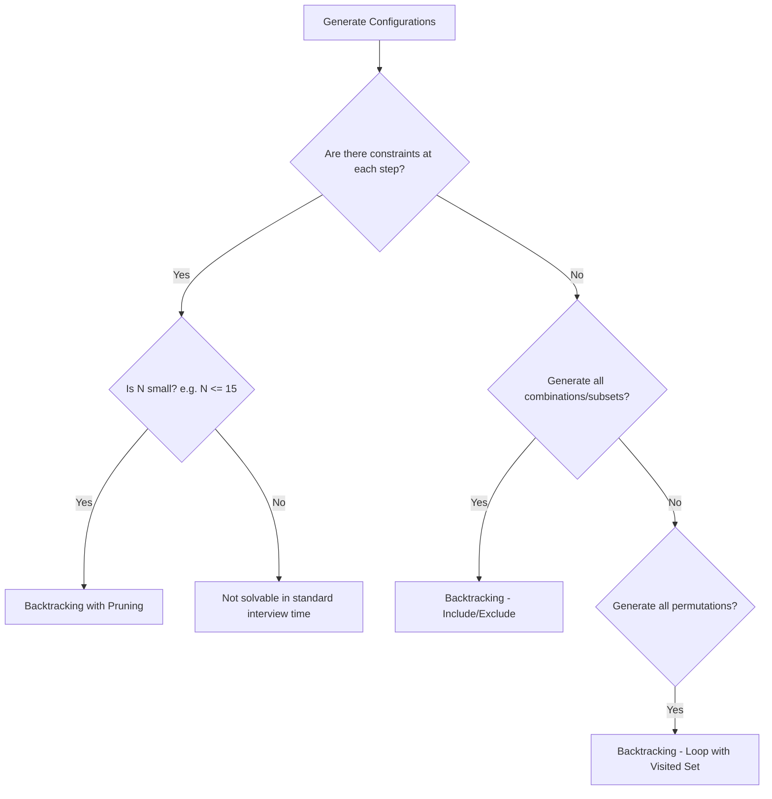
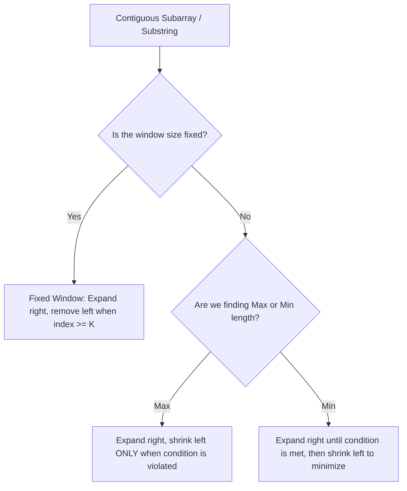
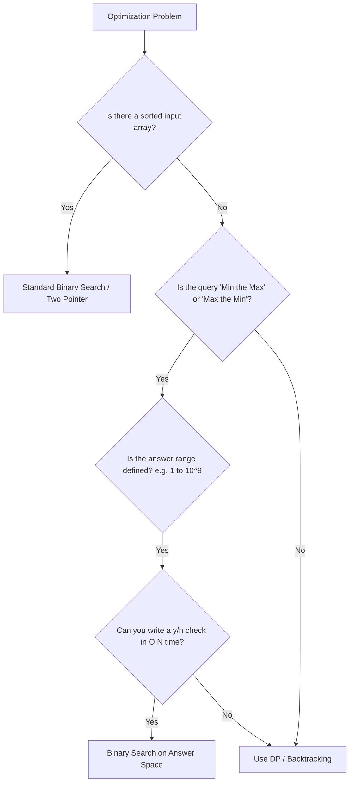
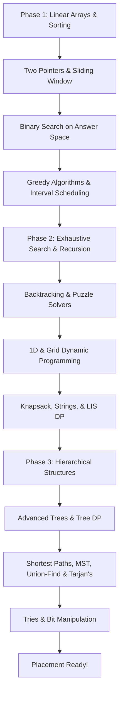

# MODULE 1: Greedy Algorithms & Greedy Choice Theory

## 1. Concept Overview

### What is it?
A **Greedy Algorithm** is a method for solving optimization problems by making the absolute best, most optimal decision at each step without ever looking back or changing past decisions. It acts "greedy" in the short term, hoping that these local choices add up to the absolute best solution in the long term.

### Why do we use it?
We use it because it is incredibly fast and simple. Unlike other methods that explore many paths (like Backtracking or Dynamic Programming), a Greedy algorithm makes one choice per step and proceeds. This reduces the time complexity from exponential ($O(2^N)$) to linear ($O(N)$) or linearithmic ($O(N \log N)$), which is crucial for passing competitive programming tests and online assessments.

### Intuition
The core intuition is: **"If I always make the most profitable choice right now, I will end up with the maximum total profit at the end."** While this isn't true for all problems, it holds true for a specific class of problems where local choices do not restrict future choices from being optimal.

### Real-world Analogy
Imagine you are a cashier giving change to a customer. If you need to give $86$ cents using coins ($25¢, 10¢, 5¢, 1¢$):
- You greedily take the largest coin that fits: $3$ quarters ($75¢$). Remaining: $11¢$.
- You take the next largest coin: $1$ dime ($10¢$). Remaining: $1¢$.
- You take the next largest coin: $1$ penny ($1¢$). Remaining: $0¢$.
You used $5$ coins. This is the absolute minimum possible. You didn't need to try all combinations because our currency system is designed to make this greedy approach work.

---

## 2. Recognition Guide

### Question says → Think
*   "Find the maximum number of intervals/activities..." $\rightarrow$ **Greedy (Activity Selection / Sort by End Time)**
*   "Find the minimum number of rooms/platforms..." $\rightarrow$ **Greedy (Overlap Sweep / Min-Heap)**
*   "Can you reach the end using maximum steps..." $\rightarrow$ **Greedy (Track Max Reachable Index)**
*   "Find the minimum cost/jumps to reach the end..." $\rightarrow$ **Greedy (Window-based farthest reach)**
*   "Distribute resources to neighbors based on rating..." $\rightarrow$ **Two-Pass Greedy (Left and Right scans)**
*   "Schedule jobs with deadlines to maximize profit..." $\rightarrow$ **Greedy (Sort by Profit descending, schedule as late as possible)**

---

## 3. Algorithm Selection Flow

-------------------------------------------------
GREEDY CHOICE ALGORITHM
-------------------------------------------------

### Used For:
- Selecting maximum non-overlapping intervals (scheduling).
- Minimizing resource allocation overlap (rooms, buses, platforms).
- Simple pathfinding on arrays where jumps have variable limits.
- Local optimization where neighbors have comparative constraints.

### Recognition Clues:
- Keywords: "maximum non-overlapping", "minimum rooms", "at each step make optimal choice", "can we reach".
- Constraints: $N \le 10^5$ or $10^6$ (requires $O(N)$ or $O(N \log N)$).

### Question Flow:
```
Question
|
+-- Intervals involved?
|     |
|     +-- Select maximum non-overlapping?
|     |      -> Sort by End Time ascending
|     |
|     +-- Minimize room / platform overlap?
|            -> Sort by Start Time ascending + Min-Heap
|
+-- Array steps / reachability?
|     |
|     +-- Reach the end possible?
|     |      -> Track Max Reachable Index (Single Pass)
|     |
|     +-- Minimum jumps to reach end?
|            -> Window-based Greedy (Level scan)
|
+-- Constraints based on neighbors?
      |
      +-- Compare left and right neighbors?
             -> Two-Pass Greedy (Left-to-Right & Right-to-Left)
```

### When To Use:
1.  **Greedy Choice Property**: Making the local optimum choice at each step leads to a global optimum.
2.  **Optimal Substructure**: The optimal solution to the problem contains optimal solutions to its subproblems.
3.  **Canonical Systems**: The elements (like coin values or intervals) have a relationship that prevents the greedy choice from blocking the optimal path.

### When NOT To Use:
1.  **Non-canonical systems**: Denominations like $\{1, 3, 4\}$ for amount $6$ (Greedy gives $4+1+1=3$ coins, but optimal is $3+3=2$).
2.  **Interdependent choices**: Making a choice now blocks a much better choice later. Use **Dynamic Programming** instead.

### Interview Traps:
*   **Assuming Sorting is unnecessary**: Many greedy problems require sorting first. If you don't sort by the correct key (e.g., end time vs. start time), the greedy choice fails.
*   **Failing to prove the choice**: Interviewers often ask, "Why does sorting by end time work?" You must justify it using the **Exchange Argument** (swapping any other choice with the greedy choice never makes the solution worse).

### Alternative Algorithms:
*   If Greedy fails due to choices blocking future paths $\rightarrow$ Use **Dynamic Programming (DP)**.
*   If constraints are very small and you need to generate all solutions $\rightarrow$ Use **Backtracking**.

### Complexity:
- **Time Complexity**: $O(N \log N)$ (due to sorting) or $O(N)$ (if array is already sorted or requires a single pass).
- **Space Complexity**: $O(1)$ auxiliary space or $O(N)$ to store sorted arrays/heaps.

---

## 4. HOW DO I KNOW THIS IS THE CORRECT ALGORITHM?

### Use If:
- The problem asks for the minimum or maximum of something.
- The data is or can be sorted.
- Making a choice at index `i` does not depend on future choices.
- The constraints are large ($N \ge 10^5$), which makes $O(N^2)$ DP too slow.

### Avoid If:
- A choice at step `i` restricts choices at step `i+1` in a way that requires backtracking.
- You need to generate all possible valid configurations (use Backtracking instead).
- The items are not independent.

### Think Dynamic Programming Instead If:
- The coin change problem uses arbitrary coin values.
- You need to find the absolute minimum path sum on a grid where you can move down and right (choices are interdependent).

---

## 5. Coding Problem Breakdown

### Program 1: Jump Game (LeetCode 55)
*   **Pattern**: Greedy (Max Reachable Index)
*   **Difficulty**: Easy
*   **Recognition Clues**: "initially positioned at the first index", "maximum jump length", "Return true if you can reach the last index".
*   **Brute Force**: Recursion. From index `i`, try all jumps from `1` to `nums[i]` and recurse. Time: $O(2^N)$, Space: $O(N)$.
*   **Better Approach**: Dynamic Programming. Create a boolean array `dp` where `dp[i]` represents if index `i` can reach the end. Iterate backwards. Time: $O(N^2)$, Space: $O(N)$.
*   **Optimal Approach**: We only care about the farthest index we can reach. Maintain a variable `maxReach = 0`. Iterate through the array. If the current index `i` is greater than `maxReach`, it means we can never reach `i`, so return `false`. Otherwise, update `maxReach = Math.max(maxReach, i + nums[i])`. If `maxReach >= nums.length - 1`, return `true`.
*   **Complexity**: Time: $O(N)$, Space: $O(1)$.
*   **Edge Cases**: Single-element array (`[0]` $\rightarrow$ `true`); zero at start (`[0, 1]` $\rightarrow$ `false`).
*   **Java Code**:
```java
public boolean canJump(int[] nums) {
    int maxReach = 0;
    for (int i = 0; i < nums.length; i++) {
        if (i > maxReach) {
            return false; // Current index is unreachable
        }
        maxReach = Math.max(maxReach, i + nums[i]);
        if (maxReach >= nums.length - 1) {
            return true; // We can reach the end
        }
    }
    return true;
}
```
*   **Interview Explanation**: "Instead of tracing every path, we maintain the maximum index we can reach at any point. As we walk through the array, if we find ourselves at an index we cannot reach, we return false. Otherwise, we update our reach limit. If this limit reaches the end, we return true."
*   **Similar Problems**: LeetCode 1306 (Jump Game III), LeetCode 1871 (Jump Game VII).

---

### Program 2: Meeting Room Allocator
*   **Pattern**: Greedy / Min-Heap (Interval Overlap)
*   **Difficulty**: Medium
*   **Recognition Clues**: "minimum number of conference rooms required", "no two overlapping meetings share the same room".
*   **Brute Force**: Check every meeting against all other meetings to find the maximum number of concurrent overlaps. Time: $O(N^2)$, Space: $O(1)$.
*   **Optimal Approach**: Sort meetings by start time. Use a Min-Heap (PriorityQueue) to store the end times of meetings currently in progress. For the next meeting, check if its start time is $\ge$ the end time of the earliest ending meeting (heap root). If it is, we can reuse that room (pop from heap). If not, we need a new room. In both cases, push the new meeting's end time to the heap. The size of the heap at the end is the minimum rooms required.
*   **Complexity**: Time: $O(N \log N)$, Space: $O(N)$ (to store end times in heap).
*   **Edge Cases**: Single meeting (`1`), non-overlapping meetings (`1`), meetings starting exactly when another ends (ends at `3`, starts at `3` $\rightarrow$ reuse room, count `1`).
*   **Java Code**:
```java
public int minMeetingRooms(int[][] intervals) {
    if (intervals == null || intervals.length == 0) return 0;
    // Sort intervals by start time
    Arrays.sort(intervals, (a, b) -> Integer.compare(a[0], b[0]));
    // Min-heap to track meeting end times
    PriorityQueue<Integer> minHeap = new PriorityQueue<>();
    minHeap.add(intervals[0][1]);
    
    for (int i = 1; i < intervals.length; i++) {
        // If room is free, reuse it
        if (intervals[i][0] >= minHeap.peek()) {
            minHeap.poll();
        }
        // Add new meeting's end time
        minHeap.add(intervals[i][1]);
    }
    return minHeap.size();
}
```
*   **Interview Explanation**: "We sort meetings chronologically. A min-heap tracks when rooms become vacant. When a new meeting starts, we check if the earliest ending meeting has finished. If it has, we reuse the room by updating its end time in our heap. If not, we allocate a new room."
*   **Similar Problems**: LeetCode 253 (Meeting Rooms II), LeetCode 1094 (Car Pooling).

---

### Program 3: Jump Game II (LeetCode 45)
*   **Pattern**: Greedy (BFS-like windows)
*   **Difficulty**: Medium
*   **Recognition Clues**: "reach the last index in the minimum number of jumps".
*   **Brute Force**: Recursion. Explore all jump options from each index and find the one that reaches the end with minimal steps. Time: $O(2^N)$, Space: $O(N)$.
*   **Better Approach**: 1D Dynamic Programming. `dp[i]` stores minimum jumps to reach `i`. Time: $O(N^2)$, Space: $O(N)$.
*   **Optimal Approach**: We visualize this as a BFS level-by-level traversal. We maintain the current jump's reach boundary (`curEnd`) and the maximum reachable index from the current window (`curFarthest`). We iterate through the array. At each step, we update `curFarthest`. When we reach `curEnd`, it means we must make a jump to go further, so we increment our jump count and set `curEnd = curFarthest`.
*   **Complexity**: Time: $O(N)$, Space: $O(1)$.
*   **Edge Cases**: Single-element array (`[0]` $\rightarrow$ `0` jumps), large jump limits.
*   **Java Code**:
```java
public int jump(int[] nums) {
    int jumps = 0, curEnd = 0, curFarthest = 0;
    for (int i = 0; i < nums.length - 1; i++) {
        curFarthest = Math.max(curFarthest, i + nums[i]);
        if (i == curEnd) {
            jumps++; // Must jump now
            curEnd = curFarthest; // Move boundary to farthest reachable
        }
    }
    return jumps;
}
```
*   **Interview Explanation**: "We group our steps into jump levels. For the current jump range, we find the absolute farthest index we could reach. Once we reach the end of our current jump range, we commit to a new jump, updating our boundary to the farthest index we observed."
*   **Similar Problems**: LeetCode 1345 (Jump Game IV), LeetCode 1024 (Video Stitching).

---

### Program 4: Candy (LeetCode 135)
*   **Pattern**: Two-Pass Greedy (Left-Right propagation)
*   **Difficulty**: Hard
*   **Recognition Clues**: "ratings", "Children with a higher rating than their neighbor must get more candies", "minimum total candies".
*   **Brute Force**: Loop through the array, check neighbors, update candies, and repeat until no more updates are needed. Time: $O(N^2)$, Space: $O(1)$.
*   **Optimal Approach**: Solve in two passes.
    1.  **Left-to-Right Pass**: If `ratings[i] > ratings[i-1]`, give the current child 1 more candy than the left child (`candies[i] = candies[i-1] + 1`).
    2.  **Right-to-Left Pass**: If `ratings[i] > ratings[i+1]`, ensure the current child has more candy than the right child (`candies[i] = Math.max(candies[i], candies[i+1] + 1)`).
    Sum up the candies.
*   **Complexity**: Time: $O(N)$, Space: $O(N)$ (to store candies array).
*   **Edge Cases**: Single child (`1`), all identical ratings (everyone gets `1`, sum is `N`).
*   **Java Code**:
```java
public int candy(int[] ratings) {
    int n = ratings.length;
    int[] candies = new int[n];
    Arrays.fill(candies, 1); // Everyone gets at least 1 candy
    
    // Left-to-Right Pass
    for (int i = 1; i < n; i++) {
        if (ratings[i] > ratings[i - 1]) {
            candies[i] = candies[i - 1] + 1;
        }
    }
    
    int sum = candies[n - 1];
    // Right-to-Left Pass
    for (int i = n - 2; i >= 0; i--) {
        if (ratings[i] > ratings[i + 1]) {
            candies[i] = Math.max(candies[i], candies[i + 1] + 1);
        }
        sum += candies[i];
    }
    return sum;
}
```
*   **Interview Explanation**: "A child has two neighbors. To handle both constraints linearly, we split the logic. First, we scan from left to right, making sure each child is satisfied relative to their left neighbor. Then we scan from right to left, adjusting if they have a higher rating than their right neighbor, taking the maximum value to preserve both constraints."
*   **Similar Problems**: LeetCode 316 (Remove Duplicate Letters), LeetCode 402 (Remove K Digits).

---

### Program 5: Delivery Fleet Scheduler
*   **Pattern**: Greedy (Job Sequencing with Deadlines)
*   **Difficulty**: Medium
*   **Recognition Clues**: "deadline", "profit", "only one delivery can be done per day", "maximum profit".
*   **Brute Force**: Generate all combinations of jobs, check which are valid under deadline constraints, and sum the profits. Time: $O(2^N)$, Space: $O(N)$.
*   **Optimal Approach**: Sort all jobs by profit in descending order. Find the maximum deadline to determine the calendar size. For each job, schedule it at the **latest available slot** before or on its deadline. This leaves earlier slots open for other jobs.
*   **Complexity**: Time: $O(N \log N + N \times \text{maxDeadline})$, Space: $O(\text{maxDeadline})$.
*   **Edge Cases**: Deadlines are larger than job count, all jobs have deadline 1, zero profits.
*   **Java Code**:
```java
public int[] scheduleJobs(int[][] jobs) {
    // Sort jobs by profit descending
    Arrays.sort(jobs, (a, b) -> Integer.compare(b[1], a[1]));
    int maxDeadline = 0;
    for (int[] job : jobs) {
        maxDeadline = Math.max(maxDeadline, job[0]);
    }
    int[] slots = new int[maxDeadline + 1];
    Arrays.fill(slots, -1);
    
    int totalProfit = 0, count = 0;
    for (int[] job : jobs) {
        // Try to schedule as late as possible
        for (int j = job[0]; j > 0; j--) {
            if (slots[j] == -1) {
                slots[j] = 1; // Slot filled
                totalProfit += job[1];
                count++;
                break;
            }
        }
    }
    return new int[]{count, totalProfit};
}
```
*   **Interview Explanation**: "We prioritize the most profitable jobs. To give other jobs a chance, we schedule each high-profit job as late as possible, right on its deadline day. If that day is taken, we look for the next available day going backwards."
*   **Similar Problems**: LeetCode 1235 (Maximum Profit in Job Scheduling), LeetCode 630 (Course Schedule III).

---

### Challenge 1: Gas Station (LeetCode 134)
*   **Pattern**: Greedy (Fuel Balance)
*   **Difficulty**: Medium
*   **Recognition Clues**: "circular route", "starting gas station index", "unique solution".
*   **Brute Force**: Try starting from each index and simulate the complete loop. Time: $O(N^2)$, Space: $O(1)$.
*   **Optimal Approach**: First check if total gas is $\ge$ total cost. If not, it's impossible, return `-1`. Otherwise, start at index `0` and track your current fuel (`currTank`). If `currTank` drops below zero, it means we cannot reach the next station from our start station. Therefore, the start station must be updated to the next station `i + 1`, and we reset `currTank = 0`.
*   **Complexity**: Time: $O(N)$, Space: $O(1)$.
*   **Edge Cases**: Single gas station, no solution possible.
*   **Java Code**:
```java
public int canCompleteCircuit(int[] gas, int[] cost) {
    int totalTank = 0, currTank = 0, start = 0;
    for (int i = 0; i < gas.length; i++) {
        int diff = gas[i] - cost[i];
        totalTank += diff;
        currTank += diff;
        if (currTank < 0) {
            start = i + 1; // Can't start anywhere up to i
            currTank = 0;
        }
    }
    return totalTank >= 0 ? start : -1;
}
```
*   **Interview Explanation**: "If the total fuel is less than the total cost, we can't complete the loop, period. If it's enough, a solution exists. We step through the route. If we run out of gas at station `i`, it proves we couldn't have started at our current start point or any station before `i`. We reset our starting point to `i+1` and continue."
*   **Similar Problems**: LeetCode 2207 (Maximize Number of Subsequences in a String).

---

### Challenge 2: Partition Labels (LeetCode 763)
*   **Pattern**: Greedy (Last Occurrence Boundary)
*   **Difficulty**: Medium
*   **Recognition Clues**: "Partition the string into as many parts as possible", "each letter appears in at most one part".
*   **Brute Force**: For each character, find its first and last occurrence, treat them as intervals, and merge overlapping intervals. Time: $O(N^2)$, Space: $O(N)$.
*   **Optimal Approach**: Create a frequency/index map storing the *last index* of each character in the string. Maintain a running window with `start` and `end`. Iterate through the string; update `end = Math.max(end, lastIndex[char])`. When the index `i` matches `end`, we have reached the boundary of a partition, so we record its size and reset `start = i + 1`.
*   **Complexity**: Time: $O(N)$, Space: $O(1)$ (since map is at most size 26).
*   **Edge Cases**: Single-character string, string with all unique characters.
*   **Java Code**:
```java
public List<Integer> partitionLabels(String s) {
    int[] last = new int[26];
    for (int i = 0; i < s.length(); i++) {
        last[s.charAt(i) - 'a'] = i; // Store last index of char
    }
    List<Integer> result = new ArrayList<>();
    int start = 0, end = 0;
    for (int i = 0; i < s.length(); i++) {
        end = Math.max(end, last[s.charAt(i) - 'a']);
        if (i == end) {
            result.add(end - start + 1); // Log partition size
            start = i + 1;
        }
    }
    return result;
}
```
*   **Interview Explanation**: "To ensure characters inside a partition don't appear elsewhere, the partition must extend to the last occurrence of all its characters. We record these last indices. During traversal, we push our partition endpoint `end` to the right as we find later occurrences. When our index meets `end`, we close the partition."
*   **Similar Problems**: LeetCode 56 (Merge Intervals), LeetCode 57 (Insert Interval).

---

### Challenge 3: Hand of Straights (LeetCode 846)
*   **Pattern**: Greedy (TreeMap Card matching)
*   **Difficulty**: Medium
*   **Recognition Clues**: "groups where each group is groupSize consecutive cards".
*   **Brute Force**: Sort the hand. Iteratively search and remove consecutive groups from the list. Time: $O(N^2)$, Space: $O(N)$.
*   **Optimal Approach**: Put all card counts in a `TreeMap` (keeps keys sorted). Pick the smallest card key `first`. It must start a group of size `groupSize`. Check if the next consecutive cards `first + 1, first + 2, ...` exist in the map. Decrement their counts, removing them if they hit zero. If any card is missing, return `false`. Repeat until map is empty.
*   **Complexity**: Time: $O(N \log N)$, Space: $O(N)$.
*   **Edge Cases**: Hand size not divisible by group size (immediate `false`), duplicate cards.
*   **Java Code**:
```java
public boolean isNStraightHand(int[] hand, int groupSize) {
    if (hand.length % groupSize != 0) return false;
    TreeMap<Integer, Integer> counts = new TreeMap<>();
    for (int card : hand) {
        counts.put(card, counts.getOrDefault(card, 0) + 1);
    }
    while (!counts.isEmpty()) {
        int first = counts.firstKey();
        for (int i = first; i < first + groupSize; i++) {
            if (!counts.containsKey(i)) return false;
            int count = counts.get(i);
            if (count == 1) {
                counts.remove(i);
            } else {
                counts.put(i, count - 1);
            }
        }
    }
    return true;
}
```
*   **Interview Explanation**: "We use a sorted map to count cards. We grab the smallest card available; it must be the start of a consecutive group since no smaller card exists to group it. We then verify and consume the next consecutive cards. We repeat this greedy collection until all cards are cleared."
*   **Similar Problems**: LeetCode 659 (Split Array into Consecutive Subsequences), LeetCode 1296 (Divide Array in Sets of K Consecutive Numbers).

# MODULE 2: Backtracking & Constraint Satisfaction

## 1. Concept Overview

### Definition
**Backtracking** is a systematic method for exploring all configuration spaces to find configurations that satisfy a given set of constraints. It builds candidates incrementally and abandons a candidate ("backtracks") as soon as it determines that the candidate cannot possibly be completed to a valid solution.

### Intuition
Think of backtracking as a depth-first search (DFS) over a tree of decisions (state-space tree). You make a choice, recurse to explore the consequences, and if the path leads to a dead end, you revert the choice (un-choose) and try the next alternative.

### Real-world Analogy
Imagine you are walking through a complex maze. 
1. When you hit a fork, you choose a path (e.g., Left).
2. You follow it until you reach a wall (dead end).
3. You walk backwards to the fork (backtrack) and try the other path (Right).

### Why It Works
It works because it systematically traverses the entire state space. By introducing **pruning**, it cuts off entire branches of the state space tree early, saving massive amounts of computation time compared to simple brute-force enumeration.

### Interview Importance
Backtracking is highly tested in FAANG interviews because it requires strong recursive reasoning, understanding stack frames, and the ability to optimize via pruning.

---

## 2. Pattern Recognition

### Mappings
*   **Generate all subsets or powersets** $\rightarrow$ Backtracking (Include/Exclude pattern)
*   **Generate all orderings / arrangements** $\rightarrow$ Backtracking (Permutations with visited array or swaps)
*   **Grid pathfinding with character matching** $\rightarrow$ DFS with backtracking (un-mark grid visited)
*   **N-choice assignment with constraints (coloring, scheduling)** $\rightarrow$ Constraint satisfaction backtracking
*   **Solve puzzles (Sudoku, N-Queens)** $\rightarrow$ Backtracking with board validation check

---

## 3. Algorithm Selection Framework

### Backtracking Framework
*   **Use When**:
    *   The problem requires generating **all** possibilities, combinations, permutations, or subsets.
    *   The problem is a puzzle that requires checking constraints at each step (Sudoku, N-Queens).
    *   The search space is relatively small (e.g., $N \le 20$ for subsets/combinations, $N \le 8$ for permutations).
*   **Do Not Use**:
    *   When the constraints are large ($N > 50$) and only the *optimal value* (maximum/minimum count) is required $\rightarrow$ Use Dynamic Programming or Greedy instead.
    *   When the problem has no overlapping subproblems or constraints and simple iterations can solve it.
*   **Question Clues**:
    *   "Return all possible..."
    *   "Generate all subsets/permutations..."
    *   "Find all valid configurations..."
*   **Input Characteristics & Constraints**:
    *   Subsets: $N \le 20$ (since $2^{20} \approx 10^6$ operations).
    *   Permutations: $N \le 10$ (since $10! \approx 3.6 \times 10^6$ operations).

---

## 4. Algorithm Decision Tree



---

## 5. Algorithm Comparison Table

| Backtracking Archetype | State Definition | Transition | Space Complexity |
| :--- | :--- | :--- | :--- |
| **Subsets** (Include/Exclude) | Index in input array | Recurse with item included, then recurse with item excluded | $O(N)$ (recursion stack) |
| **Permutations** | Current permutation list | Loop through all unused elements, add to list, recurse, backtrack | $O(N)$ |
| **Combinations** (Fixed size $K$) | Index + current count | Loop starting from current index, select element, recurse, backtrack | $O(K)$ |

---

## 6. Coding Problem Breakdown

### Program 1: Subsets (LeetCode 78)
*   **Pattern**: Backtracking (Subsets / Include-Exclude)
*   **Difficulty**: Easy
*   **Recognition Clues**: "return all possible subsets (the power set)".
*   **Brute Force / Optimal**: Recursively decide for each element whether to include it in the current subset or exclude it.
*   **Complexity**: Time: $O(N \cdot 2^N)$ (since there are $2^N$ subsets, and copying each takes $O(N)$), Space: $O(N)$ (recursion stack).
*   **Edge Cases**: Empty array, single element.
*   **Java Code**:
```java
public List<List<Integer>> subsets(int[] nums) {
    List<List<Integer>> result = new ArrayList<>();
    backtrackSubsets(0, nums, new ArrayList<>(), result);
    return result;
}

private void backtrackSubsets(int start, int[] nums, List<Integer> current, List<List<Integer>> result) {
    result.add(new ArrayList<>(current));
    for (int i = start; i < nums.length; i++) {
        current.add(nums[i]);
        backtrackSubsets(i + 1, nums, current, result);
        current.remove(current.size() - 1);
    }
}
```
*   **Interview Explanation**: "We start with an empty subset and add it to our result list. For each element in the array, we branch by including the element and recursing forward. After the recursive call returns, we backtrack by removing the element to explore subsets that exclude it."
*   **Similar LeetCode**: LeetCode 90 (Subsets II).

---

### Program 2: Permutations (LeetCode 46)
*   **Pattern**: Backtracking (Permutations)
*   **Difficulty**: Medium
*   **Recognition Clues**: "return all possible permutations".
*   **Optimal Approach**: Keep track of the current permutation list. Use a boolean array `visited` or a `HashSet` to mark elements currently in use. Loop through all elements; if not visited, mark visited, add to list, recurse, then unmark and remove.
*   **Complexity**: Time: $O(N \cdot N!)$ (there are $N!$ permutations, and creating a copy of each takes $O(N)$), Space: $O(N)$ (visited array + recursion depth).
*   **Edge Cases**: Single element, duplicates (duplicates require sorting and skipping).
*   **Java Code**:
```java
public List<List<Integer>> permute(int[] nums) {
    List<List<Integer>> result = new ArrayList<>();
    backtrackPermute(nums, new ArrayList<>(), new boolean[nums.length], result);
    return result;
}

private void backtrackPermute(int[] nums, List<Integer> current, boolean[] visited, List<List<Integer>> result) {
    if (current.size() == nums.length) {
        result.add(new ArrayList<>(current));
        return;
    }
    for (int i = 0; i < nums.length; i++) {
        if (visited[i]) continue;
        visited[i] = true;
        current.add(nums[i]);
        backtrackPermute(nums, current, visited, result);
        current.remove(current.size() - 1);
        visited[i] = false;
    }
}
```
*   **Interview Explanation**: "To generate all orderings, we recursively fill positions from 0 to N-1. At each position, we loop through all numbers. We use a visited array to ensure we only choose numbers not yet in the current permutation. We backtrack by unmarking the number so it can be used in other positions."
*   **Similar LeetCode**: LeetCode 47 (Permutations II).

---

### Program 3: Exam Timetable Planner
*   **Pattern**: Backtracking (Graph Coloring / Constraint Satisfaction)
*   **Difficulty**: Medium
*   **Recognition Clues**: "assign each course to a time slot such that no conflicting courses share the same slot".
*   **Optimal Approach**: This is the $M$-Coloring decision problem. Graph vertices are courses, edges are conflicts, and colors are time slots. Assign a time slot to course `0`, check if it conflicts with already assigned neighbors. If valid, recurse to course `1`. If no slot works, backtrack.
*   **Complexity**: Time: $O(K^N)$ (where $K$ is slots, $N$ is courses), Space: $O(N)$ (recursion depth + assignment array).
*   **Edge Cases**: No conflicts (returns all combinations), complete graph (requires $K \ge N$), $K = 1$.
*   **Java Code**:
```java
public List<int[]> planTimetable(int n, int k, int[][] conflicts) {
    List<int[]> results = new ArrayList<>();
    List<Integer>[] adj = new ArrayList[n];
    for (int i = 0; i < n; i++) adj[i] = new ArrayList<>();
    for (int[] edge : conflicts) {
        adj[edge[0]].add(edge[1]);
        adj[edge[1]].add(edge[0]);
    }
    int[] assignment = new int[n];
    Arrays.fill(assignment, -1);
    solveColoring(0, n, k, adj, assignment, results);
    return results;
}

private void solveColoring(int course, int n, int k, List<Integer>[] adj, int[] assignment, List<int[]> results) {
    if (course == n) {
        results.add(assignment.clone());
        return;
    }
    for (int slot = 0; slot < k; slot++) {
        if (isValidSlot(course, slot, adj, assignment)) {
            assignment[course] = slot;
            solveColoring(course + 1, n, k, adj, assignment, results);
            assignment[course] = -1; // Backtrack
        }
    }
}

private boolean isValidSlot(int course, int slot, List<Integer>[] adj, int[] assignment) {
    for (int neighbor : adj[course]) {
        if (assignment[neighbor] == slot) return false;
    }
    return true;
}
```
*   **Interview Explanation**: "We model the courses and conflicts as a graph. We try assigning each time slot to the current course. Before making the assignment, we check if any neighbor (conflicting course) has already been assigned that slot. If no conflict is found, we proceed to assign the next course."
*   **Similar LeetCode**: LeetCode 1042 (Flower Planting With No Adjacent).

---

### Program 4: N-Queens (LeetCode 51)
*   **Pattern**: Backtracking with Pruning (Board Constraint)
*   **Difficulty**: Hard
*   **Recognition Clues**: "Place n queens... no two queens threaten each other", "Return all distinct solutions".
*   **Optimal Approach**: Place queens row-by-row. Maintain arrays/sets to track threatened columns, positive diagonals (`row + col`), and negative diagonals (`row - col`). For row `r`, loop through columns `c`. If `c`, `r+c`, or `r-c` are not threatened, place queen, update sets, recurse to `r+1`, then backtrack.
*   **Complexity**: Time: $O(N!)$, Space: $O(N)$ (storing diagonals/columns states).
*   **Edge Cases**: $N=1$ (trivial), $N=2, 3$ (no solutions).
*   **Java Code**:
```java
public List<List<String>> solveNQueens(int n) {
    List<List<String>> result = new ArrayList<>();
    char[][] board = new char[n][n];
    for (char[] row : board) Arrays.fill(row, '.');
    boolean[] cols = new boolean[n];
    boolean[] diag1 = new boolean[2 * n]; // row + col
    boolean[] diag2 = new boolean[2 * n]; // row - col + n
    backtrackQueens(0, n, board, cols, diag1, diag2, result);
    return result;
}

private void backtrackQueens(int row, int n, char[][] board, boolean[] cols, boolean[] diag1, boolean[] diag2, List<List<String>> result) {
    if (row == n) {
        result.add(constructBoard(board));
        return;
    }
    for (int col = 0; col < n; col++) {
        int d1 = row + col;
        int d2 = row - col + n;
        if (cols[col] || diag1[d1] || diag2[d2]) continue; // Pruning
        
        board[row][col] = 'Q';
        cols[col] = diag1[d1] = diag2[d2] = true;
        
        backtrackQueens(row + 1, n, board, cols, diag1, diag2, result);
        
        board[row][col] = '.'; // Backtrack
        cols[col] = diag1[d1] = diag2[d2] = false;
    }
}

private List<String> constructBoard(char[][] board) {
    List<String> path = new ArrayList<>();
    for (char[] row : board) path.add(new String(row));
    return path;
}
```
*   **Interview Explanation**: "Instead of placing queens randomly, we place one queen per row. To check column and diagonal safety in $O(1)$ time, we use lookup arrays. For diagonals, all cells on the same positive diagonal have a constant `row + col` sum, and negative diagonals have a constant `row - col` difference. We prune any column or diagonal that is already blocked."
*   **Similar LeetCode**: LeetCode 52 (N-Queens II).

---

### Program 5: Word Search (LeetCode 79)
*   **Pattern**: Grid DFS with Backtracking
*   **Difficulty**: Medium
*   **Recognition Clues**: "return true if word exists in the grid", "sequentially adjacent cells", "cannot reuse same cell".
*   **Optimal Approach**: Iterate through every cell `(r, c)`. If `board[r][c] == word.charAt(0)`, initiate a DFS. In the DFS, mark `board[r][c]` as visited (e.g., replace with `#`). Recurse in 4 directions for `index + 1`. After recursing, restore `board[r][c]` back to its original character (backtrack).
*   **Complexity**: Time: $O(M \cdot N \cdot 3^L)$ (where $M \times N$ is grid size, $L$ is word length; 3 choices because we don't return to the parent cell), Space: $O(L)$ (recursion stack).
*   **Edge Cases**: Single cell grid, word length longer than grid size, word contains duplicate adjacent letters.
*   **Java Code**:
```java
public boolean exist(char[][] board, String word) {
    int m = board.length, n = board[0].length;
    for (int r = 0; r < m; r++) {
        for (int c = 0; c < n; c++) {
            if (dfsWord(r, c, 0, board, word)) return true;
        }
    }
    return false;
}

private boolean dfsWord(int r, int c, int index, char[][] board, String word) {
    if (index == word.length()) return true;
    if (r < 0 || r >= board.length || c < 0 || c >= board[0].length || board[r][c] != word.charAt(index)) {
        return false;
    }
    char temp = board[r][c];
    board[r][c] = '#'; // Mark visited
    
    int[] dr = {-1, 1, 0, 0};
    int[] dc = {0, 0, -1, 1};
    for (int i = 0; i < 4; i++) {
        if (dfsWord(r + dr[i], c + dc[i], index + 1, board, word)) return true;
    }
    
    board[r][c] = temp; // Backtrack
    return false;
}
```
*   **Interview Explanation**: "We search for the starting character across the grid. Once found, we perform a DFS to find adjacent characters. To prevent cyclic re-entry and satisfy the 'no reuse' constraint, we temporarily overwrite the current cell with a dummy character before branching, restoring it immediately after the recursion branch completes."
*   **Similar LeetCode**: LeetCode 212 (Word Search II).

---

### Challenge 1: Combination Sum (LeetCode 39)
*   **Pattern**: Backtracking (Unlimited Choice combination)
*   **Difficulty**: Medium
*   **Recognition Clues**: "same number may be chosen unlimited times", "unique combinations".
*   **Optimal Approach**: Iterate from the current index `start` to avoid duplicate combinations. If `target == 0`, add to result. If `target < 0`, return (prune). For candidate `i`, add to list, recurse with the *same* index `i` (allowing reuse), then subtract candidate value from target, and backtrack.
*   **Complexity**: Time: $O(S^T)$ (where $S$ is candidates, $T$ is target/minCandidate), Space: $O(T)$ (recursion stack).
*   **Edge Cases**: Target cannot be formed, candidates contain large numbers, target is small.
*   **Java Code**:
```java
public List<List<Integer>> combinationSum(int[] candidates, int target) {
    List<List<Integer>> result = new ArrayList<>();
    backtrackCombo(0, candidates, target, new ArrayList<>(), result);
    return result;
}

private void backtrackCombo(int start, int[] candidates, int target, List<Integer> current, List<List<Integer>> result) {
    if (target == 0) {
        result.add(new ArrayList<>(current));
        return;
    }
    for (int i = start; i < candidates.length; i++) {
        if (target - candidates[i] >= 0) {
            current.add(candidates[i]);
            backtrackCombo(i, candidates, target - candidates[i], current, result);
            current.remove(current.size() - 1);
        }
    }
}
```
*   **Interview Explanation**: "We traverse the choice tree. By sorting or simply enforcing an ascending index constraint (`i = start`), we prevent permutations of the same combination from being generated. We pass `i` to the next recursive call to allow the same element to be chosen repeatedly, pruning paths when the sum exceeds target."
*   **Similar LeetCode**: LeetCode 40 (Combination Sum II).

---

### Challenge 2: Subsets II (LeetCode 90)
*   **Pattern**: Backtracking (Subsets with Duplicates)
*   **Difficulty**: Medium
*   **Recognition Clues**: "array may contain duplicates", "must not contain duplicate subsets".
*   **Optimal Approach**: Sort the array first. In the backtracking loop, if `i > start` and `nums[i] == nums[i-1]`, skip the iteration. This ensures that for any duplicate group, we only branch using the first element, preventing identical combinations at the same depth.
*   **Complexity**: Time: $O(N \cdot 2^N)$, Space: $O(N)$.
*   **Edge Cases**: Array contains all duplicates, array contains no duplicates.
*   **Java Code**:
```java
public List<List<Integer>> subsetsWithDup(int[] nums) {
    List<List<Integer>> result = new ArrayList<>();
    Arrays.sort(nums);
    backtrackSubsetsDup(0, nums, new ArrayList<>(), result);
    return result;
}

private void backtrackSubsetsDup(int start, int[] nums, List<Integer> current, List<List<Integer>> result) {
    result.add(new ArrayList<>(current));
    for (int i = start; i < nums.length; i++) {
        if (i > start && nums[i] == nums[i - 1]) continue; // Skip duplicates
        current.add(nums[i]);
        backtrackSubsetsDup(i + 1, nums, current, result);
        current.remove(current.size() - 1);
    }
}
```
*   **Interview Explanation**: "To handle duplicates, we sort the input. Sorting groups duplicate values together. When we decide which element to place at the current index of our subset, we skip any element that is identical to the previous one at the same decision level, avoiding duplicate branches."
*   **Similar LeetCode**: LeetCode 491 (Non-decreasing Subsequences).

---

### Challenge 3: Sudoku Solver (LeetCode 37)
*   **Pattern**: Backtracking with Pruning (Constraint Grid)
*   **Difficulty**: Hard
*   **Recognition Clues**: "solve a Sudoku puzzle by filling the empty cells".
*   **Optimal Approach**: Scan grid to find empty cell `(r, c)`. Loop through digits `'1'` to `'9'`. Check if placing digit at `(r, c)` is valid (no conflict in row `r`, column `c`, and the $3 \times 3$ subgrid). If valid, place it, recurse. If the recursion returns `true`, propagate `true`. If not, reset cell to `'.'` (backtrack) and try next digit. Return `false` if no digits work.
*   **Complexity**: Time: $O(9^{81})$ (upper bound, actual is much smaller due to constraints/pruning), Space: $O(81)$ (recursion stack).
*   **Edge Cases**: Single empty cell, heavily empty board.
*   **Java Code**:
```java
public void solveSudoku(char[][] board) {
    solve(board);
}

private boolean solve(char[][] board) {
    for (int r = 0; r < 9; r++) {
        for (int c = 0; c < 9; c++) {
            if (board[r][c] == '.') {
                for (char val = '1'; val <= '9'; val++) {
                    if (isValidSudoku(r, c, val, board)) {
                        board[r][c] = val;
                        if (solve(board)) return true;
                        board[r][c] = '.'; // Backtrack
                    }
                }
                return false;
            }
        }
    }
    return true;
}

private boolean isValidSudoku(int row, int col, char val, char[][] board) {
    for (int i = 0; i < 9; i++) {
        if (board[row][i] == val) return false;
        if (board[i][col] == val) return false;
        int subRow = 3 * (row / 3) + i / 3;
        int subCol = 3 * (col / 3) + i % 3;
        if (board[subRow][subCol] == val) return false;
    }
    return true;
}
```
*   **Interview Explanation**: "We search for empty cells. When we find one, we try digits 1 to 9. We validate the placement against the row, column, and $3 \times 3$ box. If valid, we tentatively place it and recurse. If the board is successfully completed down the road, we return true; otherwise, we erase it and try the next candidate."
*   **Similar LeetCode**: LeetCode 36 (Valid Sudoku).

# MODULE 3: Two Pointers & Advanced Sliding Window

## 1. Concept Overview

### Definition
The **Sliding Window** and **Two Pointers** techniques optimize array/string algorithms by maintaining a contiguous subsegment (the "window") of the data structure. Instead of recalculating the window properties from scratch, we incrementally update the window state as its boundaries move.

### Intuition
Instead of exploring all possible subarrays ($O(N^2)$), we use two pointers (`left` and `right`) to represent a window. The `right` pointer expands the window to include new elements, and the `left` pointer shrinks it to discard elements when constraints are violated. This ensures each element is processed a constant number of times.

### Real-world Analogy
Imagine a train passenger window. As the train moves forward, new scenery enters the window from the front (`right`), and old scenery leaves from the back (`left`). You only focus on what is currently visible inside the window pane.

### Why It Works
It works because of monotonicity: if a subarray from `left` to `right` violates a constraint, expanding it further by moving `right` will still violate it (or vice versa), allowing us to safely skip checking redundant subarrays and simply shrink the window from the `left`.

### Interview Importance
This is one of the highest-ROI patterns for product companies (Amazon, Google, Uber) because it yields optimal $O(N)$ solutions to problems that look like they require $O(N^2)$ checks.

---

## 2. Pattern Recognition

### Mappings
*   **Contiguous subarray / substring with constraint** $\rightarrow$ Sliding Window
*   **Longest valid contiguous segment** $\rightarrow$ Variable-size window (expand, shrink only when invalid)
*   **Shortest valid contiguous segment** $\rightarrow$ Variable-size window (expand until valid, shrink as much as possible)
*   **Substring permutations / anagram matching** $\rightarrow$ Fixed-size window (size matches pattern length)
*   **Sorted array pair searches** $\rightarrow$ Two Pointers converging from ends (`left++`, `right--`)

---

## 3. Algorithm Selection Framework

### Sliding Window Template
```python
left = 0
for right in range(len(data)):
    # 1. Expand: include data[right] in window state
    update_state_on_expansion(data[right])
    
    # 2. Shrink: move left pointer until condition is valid again
    while window_condition_is_violated():
        update_state_on_shrinkage(data[left])
        left += 1
        
    # 3. Update Answer: record result for the valid window
    update_global_answer(left, right)
```

*   **Use When**:
    *   The problem involves a **contiguous** sequence (subarray, substring).
    *   You need to find a min/max length or count of valid subarrays.
*   **Do Not Use**:
    *   When the subset of elements can be **non-contiguous** (e.g., subsequences).
    *   On trees or graphs (excluding grid problems mapped to 1D arrays).
*   **Question Clues**:
    *   "Longest substring without..."
    *   "Minimum size subarray..."
    *   "Continuous segment satisfying..."
*   **Input Constraints & Indicators**:
    *   $N \le 10^5$ or $N \le 10^6$ (indicates $O(N)$ solution is required).

---

## 4. Algorithm Decision Tree



---

## 5. Algorithm Comparison Table

| Problem Type | Window State Tracker | Shrink Trigger | Solution Update Time |
| :--- | :--- | :--- | :--- |
| **Longest Unique Substring** | Map/Set of characters + index | Duplicate character encountered | When window is valid (after loop/shrink) |
| **Minimum Subarray Sum** | Cumulative sum | Sum $\ge$ target | During the shrink loop (to find minimum) |
| **Anagram / Permutation** | Frequency map of characters | Window size $>$ pattern length | When frequencies match |

---

## 6. Coding Problem Breakdown

### Program 1: Subscription Renewal Window
*   **Pattern**: Sliding Window (Variable-Size, Monotonic)
*   **Difficulty**: Easy
*   **Recognition Clues**: "longest contiguous stretch of renewals", "difference between latest and earliest is at most K days", "sorted array".
*   **Brute Force**: Check all pairs of `start` and `end`, check if `days[end] - days[start] <= K`. Time: $O(N^2)$, Space: $O(1)$.
*   **Optimal Approach**: Since the array is sorted, the minimum element in any window `[left, right]` is always `days[left]` and the maximum is `days[right]`. Expand `right`. If `days[right] - days[left] > K`, shrink the window by incrementing `left`. The maximum window size seen is the answer.
*   **Complexity**: Time: $O(N)$, Space: $O(1)$.
*   **Edge Cases**: Single log, $K = 0$, all elements identical.
*   **Java Code**:
```java
public int longestRenewalWindow(int[] days, int k) {
    int left = 0, maxLength = 0;
    for (int right = 0; right < days.length; right++) {
        while (days[right] - days[left] > k) {
            left++;
        }
        maxLength = Math.max(maxLength, right - left + 1);
    }
    return maxLength;
}
```
*   **Interview Explanation**: "Because the array is sorted, the range difference is always between the two endpoints. We expand `right` to grow the window. If the difference between `days[right]` and `days[left]` exceeds `K`, we shift `left` forward to restore the condition. We track the maximum window size."
*   **Similar LeetCode**: LeetCode 1438 (Longest Continuous Subarray With Absolute Diff Less Than or Equal to Limit).

---

### Program 2: Longest Substring Without Repeating Characters (LeetCode 3)
*   **Pattern**: Sliding Window (Variable-Size, Character Map)
*   **Difficulty**: Medium
*   **Recognition Clues**: "longest substring without repeating characters".
*   **Brute Force**: Check all substrings, verify uniqueness with a set. Time: $O(N^3)$, Space: $O(\min(N, M))$.
*   **Better Approach**: Sliding window with a HashSet. Shrink `left` one-by-one until the duplicate character is removed. Time: $O(2N)$, Space: $O(M)$.
*   **Optimal Approach**: Use an integer array/hashmap to store the *last index* of each character. When expanding `right`, if `s.charAt(right)` is seen, jump `left` directly to `lastIndex + 1` (but ensure `left` never moves backwards: `left = Math.max(left, last[char] + 1)`).
*   **Complexity**: Time: $O(N)$, Space: $O(\min(N, M))$ (where $M$ is alphabet size).
*   **Edge Cases**: Empty string (`0`), single character (`1`), all identical characters.
*   **Java Code**:
```java
public int lengthOfLongestSubstring(String s) {
    int[] last = new int[128];
    Arrays.fill(last, -1);
    int left = 0, maxLength = 0;
    for (int right = 0; right < s.length(); right++) {
        char c = s.charAt(right);
        if (last[c] >= left) {
            left = last[c] + 1;
        }
        last[c] = right;
        maxLength = Math.max(maxLength, right - left + 1);
    }
    return maxLength;
}
```
*   **Interview Explanation**: "We slide a window over the string. We keep track of the last index where each character was seen. If we encounter a duplicate within our current window, we can skip the intermediate steps and directly move our left boundary past the previous occurrence of that character."
*   **Similar LeetCode**: LeetCode 159 (Longest Substring with At Most Two Distinct Characters).

---

### Program 3: Minimum Size Subarray Sum (LeetCode 209)
*   **Pattern**: Sliding Window (Variable-Size, Sum-based)
*   **Difficulty**: Medium
*   **Recognition Clues**: "minimal length of a subarray whose sum is greater than or equal to target".
*   **Brute Force**: Compute sum of all subarrays. Time: $O(N^2)$, Space: $O(1)$.
*   **Optimal Approach**: Expand `right` and add `nums[right]` to `sum`. While `sum >= target`, record the window size `right - left + 1`, update minimum, and subtract `nums[left]` from `sum` while moving `left` forward.
*   **Complexity**: Time: $O(N)$, Space: $O(1)$.
*   **Edge Cases**: Total sum < target (returns `0`), single element satisfies target.
*   **Java Code**:
```java
public int minSubArrayLen(int target, int[] nums) {
    int left = 0, sum = 0, minLength = Integer.MAX_VALUE;
    for (int right = 0; right < nums.length; right++) {
        sum += nums[right];
        while (sum >= target) {
            minLength = Math.min(minLength, right - left + 1);
            sum -= nums[left];
            left++;
        }
    }
    return minLength == Integer.MAX_VALUE ? 0 : minLength;
}
```
*   **Interview Explanation**: "We expand the window until the sum of elements is at least the target. Once met, we try to shrink the window from the left to find a smaller valid subarray. We repeat this expansion and contraction in a single pass."
*   **Similar LeetCode**: LeetCode 862 (Shortest Subarray with Sum at Least K).

---

### Program 4: Minimum Window Substring (LeetCode 76)
*   **Pattern**: Sliding Window (Variable-Size, Frequency Match)
*   **Difficulty**: Hard
*   **Recognition Clues**: "minimum window substring... every character in t is included".
*   **Brute Force**: Generate all substrings of `s`, check if they contain `t`. Time: $O(N^2 \cdot M)$, Space: $O(M)$.
*   **Optimal Approach**: Maintain two frequency maps: `tFreq` (target) and `windowFreq` (current window). Track the count of satisfied unique characters (`have` and `need`). Expand `right`. If `s.charAt(right)` matches the target frequency requirement, increment `have`. While `have == need`, record the minimum window, then shrink `left` and update frequencies.
*   **Complexity**: Time: $O(N + M)$, Space: $O(1)$ (constant size character arrays for map).
*   **Edge Cases**: `t` longer than `s`, missing characters, exact match.
*   **Java Code**:
```java
public String minWindow(String s, String t) {
    if (s.length() < t.length()) return "";
    int[] targetMap = new int[128];
    for (char c : t.toCharArray()) targetMap[c]++;
    
    int[] windowMap = new int[128];
    int left = 0, minLen = Integer.MAX_VALUE, start = 0;
    int need = 0, have = 0;
    
    for (char c : t.toCharArray()) {
        if (targetMap[c] == 1) need++; // Unique chars count
    }
    // Re-verify unique char count in targetMap
    int uniqueTarget = 0;
    for (int count : targetMap) if (count > 0) uniqueTarget++;
    need = uniqueTarget;
    
    for (int right = 0; right < s.length(); right++) {
        char c = s.charAt(right);
        windowMap[c]++;
        if (targetMap[c] > 0 && windowMap[c] == targetMap[c]) {
            have++;
        }
        while (have == need) {
            if (right - left + 1 < minLen) {
                minLen = right - left + 1;
                start = left;
            }
            char leftChar = s.charAt(left);
            windowMap[leftChar]--;
            if (targetMap[leftChar] > 0 && windowMap[leftChar] < targetMap[leftChar]) {
                have--;
            }
            left++;
        }
    }
    return minLen == Integer.MAX_VALUE ? "" : s.substring(start, start + minLen);
}
```
*   **Interview Explanation**: "We use two maps to track character counts. We grow our window until it contains all characters of `t` in their required frequencies. Then, we greedily shrink from the left to find the smallest possible string, updating our start index and length."
*   **Similar LeetCode**: LeetCode 438 (Find All Anagrams in a String).

---

### Program 5: Permutation in String (LeetCode 567)
*   **Pattern**: Fixed-Size Sliding Window
*   **Difficulty**: Medium
*   **Recognition Clues**: "s2 contains a permutation of s1".
*   **Brute Force**: Generate all permutations of `s1`, check if any is a substring of `s2`. Time: $O(N! \cdot M)$, Space: $O(N)$.
*   **Optimal Approach**: The window size is fixed at `s1.length()`. Maintain two frequency arrays of size 26. Compare arrays for equality. As the window slides: increment count for `s2.charAt(right)` and decrement count for `s2.charAt(right - s1.length())`.
*   **Complexity**: Time: $O(M)$ (where $M$ is length of `s2`), Space: $O(1)$ (arrays of size 26).
*   **Edge Cases**: `s1` longer than `s2`, matching at the very start/end.
*   **Java Code**:
```java
public boolean checkInclusion(String s1, String s2) {
    int len1 = s1.length(), len2 = s2.length();
    if (len1 > len2) return false;
    int[] count1 = new int[26];
    int[] count2 = new int[26];
    for (int i = 0; i < len1; i++) {
        count1[s1.charAt(i) - 'a']++;
        count2[s2.charAt(i) - 'a']++;
    }
    if (matches(count1, count2)) return true;
    for (int i = len1; i < len2; i++) {
        count2[s2.charAt(i) - 'a']++;
        count2[s2.charAt(i - len1) - 'a']--;
        if (matches(count1, count2)) return true;
    }
    return false;
}

private boolean matches(int[] c1, int[] c2) {
    for (int i = 0; i < 26; i++) {
        if (c1[i] != c2[i]) return false;
    }
    return true;
}
```
*   **Interview Explanation**: "A permutation has the exact same character counts. We maintain a running window of size equal to `s1` inside `s2`. Instead of recalculating counts, we slide the window by adding the new character on the right and subtracting the character leaving on the left, comparing frequency arrays in $O(26) = O(1)$ time."
*   **Similar LeetCode**: LeetCode 438 (Find All Anagrams in a String).

---

### Challenge 1: Fruit Into Baskets (LeetCode 904)
*   **Pattern**: Sliding Window (Variable-Size, Max Distinct)
*   **Difficulty**: Medium
*   **Recognition Clues**: "at most 2 types of fruit", "consecutive trees", "maximum number of fruits".
*   **Optimal Approach**: This is equivalent to finding the **longest subarray with at most 2 distinct elements**. Maintain a frequency map of fruit types. Expand `right`. If map size exceeds 2, shrink `left` by decrementing counts until map size is 2.
*   **Complexity**: Time: $O(N)$, Space: $O(1)$ (map stores at most 3 elements).
*   **Edge Cases**: Only 1 fruit type available, all unique fruits.
*   **Java Code**:
```java
public int totalFruit(int[] fruits) {
    Map<Integer, Integer> counts = new HashMap<>();
    int left = 0, maxFruits = 0;
    for (int right = 0; right < fruits.length; right++) {
        counts.put(fruits[right], counts.getOrDefault(fruits[right], 0) + 1);
        while (counts.size() > 2) {
            counts.put(fruits[left], counts.get(fruits[left]) - 1);
            if (counts.get(fruits[left]) == 0) {
                counts.remove(fruits[left]);
            }
            left++;
        }
        maxFruits = Math.max(maxFruits, right - left + 1);
    }
    return maxFruits;
}
```
*   **Interview Explanation**: "This is a direct mapping to the 'longest subarray with at most 2 distinct numbers' problem. We expand the window and add fruits. If we collect a 3rd type, we shrink the window from the left until one of our current 2 fruit types is completely cleared."
*   **Similar LeetCode**: LeetCode 340 (Longest Substring with At Most K Distinct Characters).

---

### Challenge 2: Longest Repeating Character Replacement (LeetCode 424)
*   **Pattern**: Sliding Window (Variable-Size, Max Frequency)
*   **Difficulty**: Medium
*   **Recognition Clues**: "change at most k characters", "longest substring containing the same letter".
*   **Optimal Approach**: Expand `right` and record character count. Maintain `maxFreq` (the count of the most frequent character in the current window). The cost to make all characters in the window identical is `(window_length - maxFreq)`. If this cost exceeds `k`, the window is invalid; shrink `left` by decrementing the count of the character at `left`, and move `left` forward.
*   **Complexity**: Time: $O(N)$, Space: $O(1)$ (frequency array of size 26).
*   **Edge Cases**: $K \ge N$ (returns $N$), all unique characters.
*   **Java Code**:
```java
public int characterReplacement(String s, int k) {
    int[] count = new int[26];
    int left = 0, maxCount = 0, maxLength = 0;
    for (int right = 0; right < s.length(); right++) {
        maxCount = Math.max(maxCount, ++count[s.charAt(right) - 'a']);
        // If remaining characters to replace exceed K
        if (right - left + 1 - maxCount > k) {
            count[s.charAt(left) - 'a']--;
            left++;
        }
        maxLength = Math.max(maxLength, right - left + 1);
    }
    return maxLength;
}
```
*   **Interview Explanation**: "The count of characters we must change in any window is its length minus the frequency of the most common character. If this difference is greater than `k`, the window is invalid. We slide the window, updating the max frequency and shifting the left boundary when invalid."
*   **Similar LeetCode**: LeetCode 1004 (Max Consecutive Ones III).

---

### Challenge 3: Subarrays with K Different Integers (LeetCode 992)
*   **Pattern**: Sliding Window (At Most to Exact Reduction)
*   **Difficulty**: Hard
*   **Recognition Clues**: "number of subarrays that contain exactly k different integers".
*   **Optimal Approach**: Directly counting "exactly $K$" is difficult because sliding window naturally handles range constraints ("at most"). The key insight is:
    $$\text{Exact}(K) = \text{AtMost}(K) - \text{AtMost}(K - 1)$$
    Implement a helper function `atMost(nums, K)` that returns the count of subarrays with at most $K$ distinct numbers. Sum valid window sizes `right - left + 1` at each step.
*   **Complexity**: Time: $O(N)$, Space: $O(N)$ (hashmap size up to $K$).
*   **Edge Cases**: $K=1$, $K$ exceeds number of unique elements.
*   **Java Code**:
```java
public int subarraysWithKDistinct(int[] nums, int k) {
    return atMost(nums, k) - atMost(nums, k - 1);
}

private int atMost(int[] nums, int k) {
    Map<Integer, Integer> counts = new HashMap<>();
    int left = 0, result = 0;
    for (int right = 0; right < nums.length; right++) {
        counts.put(nums[right], counts.getOrDefault(nums[right], 0) + 1);
        while (counts.size() > k) {
            counts.put(nums[left], counts.get(nums[left]) - 1);
            if (counts.get(nums[left]) == 0) {
                counts.remove(nums[left]);
            }
            left++;
        }
        result += right - left + 1; // Count of all subarrays ending at 'right'
    }
    return result;
}
```
*   **Interview Explanation**: "To find subarrays with exactly $K$ distinct elements, we subtract the count of subarrays with at most $K-1$ distinct elements from those with at most $K$. For the 'at most' helper, the number of valid subarrays ending at `right` is `right - left + 1`, which we sum up linearly."
*   **Similar LeetCode**: LeetCode 1248 (Count Number of Nice Subarrays).

---

### Challenge 4: Trapping Rain Water (LeetCode 42)
*   **Pattern**: Two Pointers (Boundary Minima)
*   **Difficulty**: Hard
*   **Recognition Clues**: "elevation map", "compute how much water can be trapped".
*   **Brute Force**: For each element, find maximum height on left and right, add `Math.min(maxLeft, maxRight) - height[i]`. Time: $O(N^2)$, Space: $O(1)$.
*   **Better Approach**: Precompute `leftMax` and `rightMax` arrays. Time: $O(N)$, Space: $O(N)$.
*   **Optimal Approach**: Maintain two pointers `left = 0` and `right = N - 1`, and variables `leftMax = 0`, `rightMax = 0`. Whichever height is smaller governs the water limit. If `height[left] < height[right]`: if `height[left] >= leftMax` update `leftMax`, else add `leftMax - height[left]` to result, increment `left`. Do the symmetric operation for `right` otherwise.
*   **Complexity**: Time: $O(N)$, Space: $O(1)$.
*   **Edge Cases**: Array size $< 3$, flat elevations, strictly increasing/descending elevations.
*   **Java Code**:
```java
public int trap(int[] height) {
    int left = 0, right = height.length - 1;
    int leftMax = 0, rightMax = 0, water = 0;
    while (left < right) {
        if (height[left] < height[right]) {
            if (height[left] >= leftMax) {
                leftMax = height[left];
            } else {
                water += leftMax - height[left];
            }
            left++;
        } else {
            if (height[right] >= rightMax) {
                rightMax = height[right];
            } else {
                water += rightMax - height[right];
            }
            right--;
        }
    }
    return water;
}
```
*   **Interview Explanation**: "The water trapped above any bar is determined by the minimum of the highest walls to its left and right. Using two pointers at the ends, the smaller boundary limits the water level. We update the maximum wall height for that side or trap water based on the difference, then move the pointer inward."
*   **Similar LeetCode**: LeetCode 11 (Container With Most Water).

# MODULE 4: Binary Search on Answer Space

## 1. Concept Overview

### Definition
**Binary Search on Answer Space** is a technique where instead of searching for an element in an array, we search for the optimal answer itself within a range `[lo, hi]`. It is applicable when the answer space is **monotonic** (i.e., if an answer $X$ is feasible, then all values $> X$ are also feasible, or vice versa).

### Intuition
Think of it as playing a "High/Low" guessing game. Instead of building a solution constructively, we choose a candidate answer (the midpoint `mid` of our search range) and ask a helper function: *"Is it possible to satisfy the problem constraints with this value `mid`?"* Based on the binary feedback (Yes/No), we discard half of the search range.

### Real-world Analogy
Imagine a cargo ship loading boxes. 
- You want to find the **minimum capacity** the ship needs to carry all cargo within `D` days.
- If a capacity of `15 tons` works, you don't need to try `20 tons` or `30 tons` (they will also work, but we want the minimum). You try a smaller capacity like `10 tons`.
- If `10 tons` fails, you know anything less than `10 tons` will also fail, so you search the range `[11, 14]`.

### Why It Works
It works because of monotonicity. If the validity of the answer is a step-function (e.g., `[No, No, No, Yes, Yes, Yes]`), binary search can pinpoint the exact transition boundary (the first "Yes") in $O(\log(\text{range}))$ checks.

### Interview Importance
This is a favorite topic for top-tier companies (Microsoft, Google, Adobe) because it requires shifting from a constructive mindset to a decision-based validation mindset. The feasibility check helper is usually implemented using a **greedy** scan.

---

## 2. Pattern Recognition

### Mappings
*   **"Minimize the maximum value of..."** $\rightarrow$ Binary Search on Answer (Lower-bound search)
*   **"Maximize the minimum value of..."** $\rightarrow$ Binary Search on Answer (Upper-bound search)
*   **Split array into $K$ contiguous segments to minimize max sum** $\rightarrow$ Binary Search on Answer
*   **Distribute resources/stalls to maximize min distance** $\rightarrow$ Binary Search on Answer
*   **Find speed/rate to complete work within $H$ hours** $\rightarrow$ Binary Search on Answer

---

## 3. Algorithm Selection Framework

### Binary Search on Answer Template
```python
lo = minimum_possible_answer
hi = maximum_possible_answer
ans = -1

while lo <= hi:
    mid = lo + (hi - lo) // 2
    if is_feasible(mid):
        ans = mid
        # For "minimize the maximum", try smaller values
        hi = mid - 1
        # For "maximize the minimum", try larger values: lo = mid + 1
    else:
        # If not feasible, search the other half
        lo = mid + 1
        # For "maximize the minimum": hi = mid - 1
return ans
```

*   **Use When**:
    *   The question asks for the "minimum possible maximum" or "maximum possible minimum".
    *   The target answer is a numeric value within a known range `[min_val, max_val]`.
    *   A validation function can check if a candidate answer is feasible in $O(N)$ time.
*   **Do Not Use**:
    *   When the feasibility function is not monotonic (e.g., some larger values work, some smaller work, with no clear transition).
    *   When $O(N)$ feasibility check is too slow (e.g., $N > 10^6$ and range is huge).
*   **Question Clues**:
    *   "Find the minimum speed such that..."
    *   "Split into $K$ sub-arrays to minimize the maximum sum..."
    *   "Place $M$ elements to maximize the minimum distance..."
*   **Constraint Indicators**:
    *   Array size $N \le 10^5$, elements value up to $10^9$. The logarithmic range limits binary search to $\approx 30$ iterations, resulting in $30 \times O(N)$ total operations.

---

## 4. Algorithm Decision Tree



---

## 5. Algorithm Comparison Table

| Problem Type | Goal | Left Search Update (`lo`) | Right Search Update (`hi`) |
| :--- | :--- | :--- | :--- |
| **Minimize the Maximum** (e.g., Split Array Sum) | Find first feasible value | `lo = mid + 1` (if invalid, need larger sum) | `hi = mid - 1` (if valid, try smaller sum) |
| **Maximize the Minimum** (e.g., Aggressive Cows) | Find last feasible value | `lo = mid + 1` (if valid, try larger distance) | `hi = mid - 1` (if invalid, need smaller distance) |

---

## 6. Coding Problem Breakdown

### Program 1: Koko Eating Bananas (LeetCode 875)
*   **Pattern**: Binary Search on Answer (Minimize rate)
*   **Difficulty**: Easy / Medium
*   **Recognition Clues**: "minimum integer k such that she can eat all bananas within h hours".
*   **Optimal Approach**:
    *   Range: `lo = 1` (minimum speed), `hi = max(piles)` (maximum speed needed to finish in $N$ hours).
    *   Feasibility Check: Sum up `Math.ceil((double)pile / speed)` for all piles. If total hours $\le H$, return `true`.
*   **Complexity**: Time: $O(N \log(\max(\text{piles})))$, Space: $O(1)$.
*   **Edge Cases**: $H = N$ (returns `hi`), single pile.
*   **Java Code**:
```java
public int minEatingSpeed(int[] piles, int h) {
    int lo = 1, hi = 0;
    for (int p : piles) hi = Math.max(hi, p);
    int ans = hi;
    while (lo <= hi) {
        int mid = lo + (hi - lo) / 2;
        if (canFinish(piles, mid, h)) {
            ans = mid;
            hi = mid - 1; // Try slower
        } else {
            lo = mid + 1; // Need faster speed
        }
    }
    return ans;
}

private boolean canFinish(int[] piles, int speed, int h) {
    long hours = 0;
    for (int p : piles) {
        hours += (p + speed - 1) / speed; // Efficient ceil
    }
    return hours <= h;
}
```
*   **Interview Explanation**: "We binary search the eating speed range `[1, max(piles)]`. For each candidate speed `mid`, we greedily calculate the hours Koko will take. If she finishes within $H$ hours, it is a valid speed, and we search for a smaller speed on the left. Otherwise, we speed up by searching on the right."
*   **Similar LeetCode**: LeetCode 2187 (Minimum Time to Complete Trips).

---

### Program 2: Capacity to Ship Packages Within D Days (LeetCode 1011)
*   **Pattern**: Binary Search on Answer (Minimize Capacity)
*   **Difficulty**: Medium
*   **Recognition Clues**: "least weight capacity... shipped within days".
*   **Optimal Approach**:
    *   Range: `lo = max(weights)` (must be able to carry the heaviest package), `hi = sum(weights)` (can ship all in 1 day).
    *   Feasibility Check: Greedily group packages. If current weight + package weight $>$ capacity, start a new day. If total days $\le D$, return `true`.
*   **Complexity**: Time: $O(N \log(\text{sum} - \text{max}))$, Space: $O(1)$.
*   **Edge Cases**: `days = 1` (returns `hi`), all packages identical.
*   **Java Code**:
```java
public int shipWithinDays(int[] weights, int days) {
    int lo = 0, hi = 0;
    for (int w : weights) {
        lo = Math.max(lo, w);
        hi += w;
    }
    int ans = hi;
    while (lo <= hi) {
        int mid = lo + (hi - lo) / 2;
        if (canShip(weights, mid, days)) {
            ans = mid;
            hi = mid - 1;
        } else {
            lo = mid + 1;
        }
    }
    return ans;
}

private boolean canShip(int[] weights, int capacity, int days) {
    int dCount = 1, currentLoad = 0;
    for (int w : weights) {
        if (currentLoad + w > capacity) {
            dCount++;
            currentLoad = 0;
        }
        currentLoad += w;
    }
    return dCount <= days;
}
```
*   **Interview Explanation**: "The shipping capacity must be at least the heaviest single item, and at most the sum of all items. We binary search this range. For each candidate capacity, we simulate packing the cargo day-by-day. If we can ship all items within the day limit, we try a smaller capacity."
*   **Similar LeetCode**: LeetCode 410 (Split Array Largest Sum).

---

### Program 3: Library Book Allocation
*   **Pattern**: Binary Search on Answer (Minimize Max pages)
*   **Difficulty**: Medium
*   **Recognition Clues**: "minimum possible value of the maximum pages any student has to read", "contiguous segment".
*   **Optimal Approach**: This is the classic **Book Allocation** problem.
    *   Range: `lo = max(pages)`, `hi = sum(pages)`.
    *   Feasibility Check: Greedily allocate books to students. If adding a book exceeds `capacity`, assign to next student. If student count $\le M$, return `true`.
*   **Complexity**: Time: $O(N \log(\text{sum} - \text{max}))$, Space: $O(1)$.
*   **Edge Cases**: $M > N$ (returns `-1` as each student must get at least one book), $M = 1$ (returns `sum(pages)`).
*   **Java Code**:
```java
public int allocateBooks(int[] pages, int m) {
    if (pages.length < m) return -1;
    int lo = 0, hi = 0;
    for (int p : pages) {
        lo = Math.max(lo, p);
        hi += p;
    }
    int ans = -1;
    while (lo <= hi) {
        int mid = lo + (hi - lo) / 2;
        if (isPossibleAllocation(pages, mid, m)) {
            ans = mid;
            hi = mid - 1;
        } else {
            lo = mid + 1;
        }
    }
    return ans;
}

private boolean isPossibleAllocation(int[] pages, int maxPages, int m) {
    int students = 1, currentPages = 0;
    for (int p : pages) {
        if (currentPages + p > maxPages) {
            students++;
            currentPages = p;
            if (students > m) return false;
        } else {
            currentPages += p;
        }
    }
    return true;
}
```
*   **Interview Explanation**: "We want to minimize the maximum workload. The search space is bounded by the single largest book (lower bound) and the sum of all pages (upper bound). We test midpoints. If a midpoint capacity allows allocation to at most $M$ students, it is feasible, and we try to reduce the workload further."
*   **Similar LeetCode**: LeetCode 410 (Split Array Largest Sum).

---

### Program 4: Split Array Largest Sum (LeetCode 410)
*   **Pattern**: Binary Search on Answer (Minimize Max Sum)
*   **Difficulty**: Hard
*   **Recognition Clues**: "split nums into k non-empty contiguous subarrays", "largest sum of any subarray is minimized".
*   **Optimal Approach**:
    *   Range: `lo = max(nums)`, `hi = sum(nums)`.
    *   Feasibility Check: Group elements such that the group sum $\le$ candidate. If total groups $\le K$, return `true`.
*   **Complexity**: Time: $O(N \log(\text{sum} - \text{max}))$, Space: $O(1)$.
*   **Edge Cases**: $K=1$, $K=N$.
*   **Java Code**: (Identical pattern to Book Allocation and Capacity to Ship).
```java
public int splitArray(int[] nums, int k) {
    int lo = 0;
    long hi = 0;
    for (int num : nums) {
        lo = Math.max(lo, num);
        hi += num;
    }
    long ans = hi;
    while (lo <= hi) {
        long mid = lo + (hi - lo) / 2;
        if (canSplit(nums, mid, k)) {
            ans = mid;
            hi = mid - 1;
        } else {
            lo = (int) mid + 1;
        }
    }
    return (int) ans;
}

private boolean canSplit(int[] nums, long maxSubarraySum, int k) {
    int subArrays = 1;
    long currentSum = 0;
    for (int num : nums) {
        if (currentSum + num > maxSubarraySum) {
            subArrays++;
            currentSum = num;
            if (subArrays > k) return false;
        } else {
            currentSum += num;
        }
    }
    return true;
}
```

---

### Program 5: Farm Partition Planner
*   **Pattern**: Binary Search on Answer (Contiguous Partitioning)
*   **Difficulty**: Medium
*   **Recognition Clues**: "contigous segment of fields", "minimize the maximum total yield any single worker has to manage".
*   **Optimal Approach**: Identical mapping to **Split Array Largest Sum**.
    *   Range: `lo = max(yields)`, `hi = sum(yields)`.
    *   Validation: check if we can partition the farm into $M$ workers such that no worker manages more than `mid` yield.
*   **Complexity**: Time: $O(N \log(\text{sum} - \text{max}))$, Space: $O(1)$.

---

### Challenge 1: Find the Smallest Divisor Given a Threshold (LeetCode 1283)
*   **Pattern**: Binary Search on Answer (Minimize Divisor)
*   **Difficulty**: Medium
*   **Recognition Clues**: "find the smallest divisor such that the sum of division results... is <= threshold".
*   **Optimal Approach**:
    *   Range: `lo = 1`, `hi = max(nums)`.
    *   Feasibility Check: For divisor `D`, compute `sum(ceil(num / D))`. If sum $\le$ threshold, return `true`.
*   **Complexity**: Time: $O(N \log(\max(\text{nums})))$, Space: $O(1)$.
*   **Edge Cases**: Threshold equals array length (returns `hi`), large threshold.
*   **Java Code**:
```java
public int smallestDivisor(int[] nums, int threshold) {
    int lo = 1, hi = 0;
    for (int num : nums) hi = Math.max(hi, num);
    int ans = hi;
    while (lo <= hi) {
        int mid = lo + (hi - lo) / 2;
        if (getSum(nums, mid) <= threshold) {
            ans = mid;
            hi = mid - 1; // Try smaller divisor
        } else {
            lo = mid + 1; // Need larger divisor
        }
    }
    return ans;
}

private int getSum(int[] nums, int divisor) {
    int sum = 0;
    for (int num : nums) {
        sum += (num + divisor - 1) / divisor; // Efficient ceil
    }
    return sum;
}
```
*   **Interview Explanation**: "As the divisor increases, the sum of divisions monotonically decreases. We binary search the divisor range `[1, max(nums)]`. For each divisor, we compute the sum. If the sum is within the threshold, we log the divisor and look for a smaller one."
*   **Similar LeetCode**: LeetCode 1870 (Minimum Speed to Arrive on Time).

---

### Challenge 2: Minimum Number of Days to Make M Bouquets (LeetCode 1482)
*   **Pattern**: Binary Search on Answer (Minimize Days)
*   **Difficulty**: Medium
*   **Recognition Clues**: "m bouquets of k adjacent flowers", "minimum number of days to wait".
*   **Optimal Approach**:
    *   Range: `lo = min(bloomDay)`, `hi = max(bloomDay)`.
    *   Feasibility Check: For day `D`, loop through the array. If `bloomDay[i] <= D`, increment adjacent flower count. When adjacent count reaches `K`, increment bouquet count and reset adjacent count. If we hit a blocked flower (`bloomDay[i] > D`), reset adjacent count. Return `true` if total bouquets $\ge M$.
*   **Complexity**: Time: $O(N \log(\max - \min))$, Space: $O(1)$.
*   **Edge Cases**: Impossible to make bouquets (e.g. `m * k > bloomDay.length` $\rightarrow$ return `-1`).
*   **Java Code**:
```java
public int minDays(int[] bloomDay, int m, int k) {
    if ((long) m * k > bloomDay.length) return -1;
    int lo = Integer.MAX_VALUE, hi = 0;
    for (int day : bloomDay) {
        lo = Math.min(lo, day);
        hi = Math.max(hi, day);
    }
    int ans = -1;
    while (lo <= hi) {
        int mid = lo + (hi - lo) / 2;
        if (canMake(bloomDay, mid, m, k)) {
            ans = mid;
            hi = mid - 1;
        } else {
            lo = mid + 1;
        }
    }
    return ans;
}

private boolean canMake(int[] bloomDay, int day, int m, int k) {
    int bouquets = 0, flowers = 0;
    for (int b : bloomDay) {
        if (b <= day) {
            flowers++;
            if (flowers == k) {
                bouquets++;
                flowers = 0;
            }
        } else {
            flowers = 0;
        }
    }
    return bouquets >= m;
}
```

---

### Challenge 3: Magnetic Force Between Two Balls (LeetCode 1552)
*   **Pattern**: Binary Search on Answer (Maximize the Minimum)
*   **Difficulty**: Medium
*   **Recognition Clues**: "maximize the minimum magnetic force (distance) between any two balls".
*   **Optimal Approach**:
    *   Sort the `position` array first.
    *   Range: `lo = 1` (min distance), `hi = position[N-1] - position[0]` (max possible distance).
    *   Feasibility Check: Place the first ball at `position[0]`. Greedily place the next ball at the first position `position[i]` such that `position[i] - lastPlacedPosition >= mid`. If we can place $\ge M$ balls, return `true`.
*   **Complexity**: Time: $O(N \log N + N \log(\text{max\_dist}))$, Space: $O(1)$.
*   **Edge Cases**: $M = 2$ (returns `hi`), large coordinates.
*   **Java Code**:
```java
public int maxDistance(int[] position, int m) {
    Arrays.sort(position);
    int lo = 1, hi = position[position.length - 1] - position[0];
    int ans = 0;
    while (lo <= hi) {
        int mid = lo + (hi - lo) / 2;
        if (canPlace(position, mid, m)) {
            ans = mid;
            lo = mid + 1; // Try to maximize the minimum distance
        } else {
            hi = mid - 1; // Need smaller distance
        }
    }
    return ans;
}

private boolean canPlace(int[] position, int minDist, int m) {
    int ballsPlaced = 1;
    int lastPos = position[0];
    for (int i = 1; i < position.length; i++) {
        if (position[i] - lastPos >= minDist) {
            ballsPlaced++;
            lastPos = position[i];
            if (ballsPlaced == m) return true;
        }
    }
    return false;
}
```
*   **Interview Explanation**: "This is a 'maximize the minimum' problem. We sort the positions. For a candidate distance `mid`, we place balls greedily. If we can place all $M$ balls with at least `mid` spacing, then `mid` is possible, and we search for a larger distance on the right."
*   **Similar LeetCode**: LeetCode 2517 (Maximum Tastiness of Candy Basket).

---

### Challenge 4: Server Load Balancer
*   **Pattern**: Binary Search on Answer (Minimize maximum load)
*   **Difficulty**: Medium
*   **Recognition Clues**: "distributed across m servers in order (contiguous)", "Minimize the maximum total load on any single server".
*   **Optimal Approach**: Exactly identical mapping to **Split Array Largest Sum** (LeetCode 410) and **Book Allocation**.
    *   Range: `lo = max(loads)`, `hi = sum(loads)`.
    *   Feasibility: Check if we can assign contiguous blocks of tasks to $M$ servers such that no server's load exceeds `mid`.
*   **Complexity**: Time: $O(N \log(\text{sum} - \text{max}))$, Space: $O(1)$.

# MODULE 5: Dynamic Programming Foundations: 1D & Grid DP

## 1. Concept Overview

### Definition
**Dynamic Programming (DP)** is an algorithmic paradigm that solves a complex problem by breaking it down into subproblems, solving each subproblem exactly once, and storing their solutions (using memoization or tabulation) to avoid redundant computations.

### Intuition
DP is essentially **Backtracking with Memory**. While backtracking explores the same subproblem states repeatedly, DP intercepts duplicate states and answers them in $O(1)$ time by performing a lookup. 
- *Brute-force*: "Explore all possibilities."
- *DP*: "Explore all possibilities, but remember the results of subproblems."

### Real-world Analogy
Imagine a teacher writes on the blackboard:
`1 + 1 + 1 + 1 + 1 = ?`
The students count and answer `5`.
The teacher adds another `1 +` at the beginning:
`1 + 1 + 1 + 1 + 1 + 1 = ?`
Instead of counting from scratch, the students immediately answer `6` because they **remembered** the previous sum was `5` and simply added `1`. That memory is the essence of DP.

### Why It Works
DP is applicable when a problem exhibits:
1.  **Overlapping Subproblems**: The same subproblems are solved repeatedly during recursion.
2.  **Optimal Substructure**: The optimal solution to the problem can be constructed from the optimal solutions of its subproblems.

---

## 2. Pattern Recognition

### Mappings
*   **Decide count of paths on a grid with obstacles** $\rightarrow$ Grid DP (2D state: `dp[r][c]`)
*   **Count ways to decode a string of digits** $\rightarrow$ 1D DP (state: `dp[i]` = ways to decode suffix `s[i:]`)
*   **Segment a string into dictionary words** $\rightarrow$ 1D DP (state: `dp[i]` = can segment prefix `s[0..i]`)
*   **Find maximum product contiguous subarray** $\rightarrow$ 1D DP (state: track both `dp_max[i]` and `dp_min[i]`)
*   **Find minimum cost to reach bottom of grid** $\rightarrow$ Grid DP (state: `dp[r][c] = cell[r][c] + min(above, left)`)

---

## 3. Dynamic Programming Framework

For every DP problem in this module, we will classify the type and outline the 4-step framework:
1.  **Recursive (Brute Force)**
2.  **Top-Down Memoization** (recursive with array/map cache)
3.  **Bottom-Up Tabulation** (iterative table building)
4.  **Space Optimization** (reducing storage from $O(N)$ or $O(N^2)$ to $O(1)$ or $O(\text{row})$).

---

## 4. Coding Problem Breakdown

### Program 1 & 2: Decode Ways / Secret Message Decoder (LeetCode 91)
*   **Classification**: 1D DP
*   **Difficulty**: Medium
*   **Recognition Clues**: "count the number of ways to decode back to letters", "A=1, B=2, ..., Z=26".
*   **Recursive Solution**:
```java
// Let f(i) be the number of decodings for s[i...]
// f(i) = f(i+1) (if s[i] != '0') + f(i+2) (if s[i..i+2] is between "10" and "26")
```
*   **Memoization**:
```java
public int numDecodings(String s) {
    int[] memo = new int[s.length()];
    Arrays.fill(memo, -1);
    return decodeHelper(s, 0, memo);
}

private int decodeHelper(String s, int index, int[] memo) {
    if (index == s.length()) return 1;
    if (s.charAt(index) == '0') return 0;
    if (memo[index] != -1) return memo[index];
    
    int ways = decodeHelper(s, index + 1, memo);
    if (index + 1 < s.length()) {
        int val = Integer.parseInt(s.substring(index, index + 2));
        if (val >= 10 && val <= 26) {
            ways += decodeHelper(s, index + 2, memo);
        }
    }
    return memo[index] = ways;
}
```
*   **Tabulation**:
```java
public int numDecodingsTab(String s) {
    int n = s.length();
    int[] dp = new int[n + 1];
    dp[n] = 1; // Base case
    for (int i = n - 1; i >= 0; i--) {
        if (s.charAt(i) == '0') {
            dp[i] = 0;
        } else {
            dp[i] = dp[i + 1];
            if (i + 1 < n) {
                int val = (s.charAt(i) - '0') * 10 + (s.charAt(i+1) - '0');
                if (val >= 10 && val <= 26) dp[i] += dp[i + 2];
            }
        }
    }
    return dp[0];
}
```
*   **Space Optimization**:
Since `dp[i]` only depends on `dp[i+1]` and `dp[i+2]`, we can use two variables: `oneStepAhead` and `twoStepsAhead`.
```java
public int numDecodingsOpt(String s) {
    int n = s.length();
    int oneStepAhead = 1, twoStepsAhead = 0;
    for (int i = n - 1; i >= 0; i--) {
        int current = 0;
        if (s.charAt(i) != '0') {
            current = oneStepAhead;
            if (i + 1 < n) {
                int val = (s.charAt(i) - '0') * 10 + (s.charAt(i+1) - '0');
                if (val >= 10 && val <= 26) current += twoStepsAhead;
            }
        }
        twoStepsAhead = oneStepAhead;
        oneStepAhead = current;
    }
    return oneStepAhead;
}
```
*   **Complexity**: Time: $O(N)$, Space: $O(1)$.
*   **Edge Cases**: Single digit, leading zero (`"06"` $\rightarrow$ `0`), consecutive zeros.
*   **Similar LeetCode**: LeetCode 639 (Decode Ways II).

---

### Program 3: Word Break (LeetCode 139)
*   **Classification**: 1D DP
*   **Difficulty**: Medium
*   **Recognition Clues**: "return true if s can be segmented into a space-separated sequence of... dictionary words".
*   **Recursive Solution**: Try split points `i` from `1` to `len`. If prefix `s[0..i]` is in dictionary, recurse on suffix `s[i...]`.
*   **Memoization**:
```java
public boolean wordBreakMemo(String s, List<String> wordDict) {
    Set<String> dict = new HashSet<>(wordDict);
    Boolean[] memo = new Boolean[s.length()];
    return solveWordBreak(s, 0, dict, memo);
}

private boolean solveWordBreak(String s, int start, Set<String> dict, Boolean[] memo) {
    if (start == s.length()) return true;
    if (memo[start] != null) return memo[start];
    for (int end = start + 1; end <= s.length(); end++) {
        if (dict.contains(s.substring(start, end)) && solveWordBreak(s, end, dict, memo)) {
            return memo[start] = true;
        }
    }
    return memo[start] = false;
}
```
*   **Tabulation**:
`dp[i]` represents if the prefix of length `i` can be segmented.
```java
public boolean wordBreak(String s, List<String> wordDict) {
    Set<String> dict = new HashSet<>(wordDict);
    boolean[] dp = new boolean[s.length() + 1];
    dp[0] = true;
    for (int i = 1; i <= s.length(); i++) {
        for (int j = 0; j < i; j++) {
            if (dp[j] && dict.contains(s.substring(j, i))) {
                dp[i] = true;
                break;
            }
        }
    }
    return dp[s.length()];
}
```
*   **Space Optimization**: Cannot be easily optimized below $O(N)$ because the state checks all previous split points `j < i`.
*   **Complexity**: Time: $O(N^3)$ (nested loops + substring slicing), Space: $O(N)$.
*   **Edge Cases**: Single word match, no matches, reuse of same word.
*   **Similar LeetCode**: LeetCode 140 (Word Break II).

---

### Program 4: Maximum Product Subarray (LeetCode 152)
*   **Classification**: 1D DP (Multi-State tracking)
*   **Difficulty**: Hard
*   **Recognition Clues**: "subarray that has the largest product".
*   **Optimal Approach**:
    Because multiplying two negative numbers creates a positive product, we must track both the **maximum** product (`maxProd`) and the **minimum** product (`minProd`) ending at the current index.
*   **Complexity**: Time: $O(N)$, Space: $O(1)$.
*   **Edge Cases**: Array contains zeros, all negative numbers, single element.
*   **Java Code**:
```java
public int maxProduct(int[] nums) {
    int maxSoFar = nums[0];
    int minSoFar = nums[0];
    int globalMax = nums[0];
    
    for (int i = 1; i < nums.length; i++) {
        int val = nums[i];
        if (val < 0) {
            // Swap max and min because multiplying by negative flips order
            int temp = maxSoFar;
            maxSoFar = minSoFar;
            minSoFar = temp;
        }
        maxSoFar = Math.max(val, maxSoFar * val);
        minSoFar = Math.min(val, minSoFar * val);
        globalMax = Math.max(globalMax, maxSoFar);
    }
    return globalMax;
}
```
*   **Interview Explanation**: "A standard Kadane's algorithm fails here because a small negative product can become a large positive product if multiplied by another negative. By maintaining both the running maximum and minimum, we handle negative signs naturally. When a negative number is encountered, we swap the maximum and minimum values before updating."

---

### Program 5: Minimum Cost For Tickets (LeetCode 983)
*   **Classification**: 1D DP (Dynamic Step)
*   **Difficulty**: Medium
*   **Recognition Clues**: "Return the minimum cost to travel on all given days", "1-day, 7-day, or 30-day passes".
*   **Tabulation**:
`dp[i]` represents the minimum cost to travel up to day `i`.
```java
public int mincostTickets(int[] days, int[] costs) {
    int lastDay = days[days.length - 1];
    int[] dp = new int[lastDay + 1];
    boolean[] travelDay = new boolean[lastDay + 1];
    for (int d : days) travelDay[d] = true;
    
    for (int i = 1; i <= lastDay; i++) {
        if (!travelDay[i]) {
            dp[i] = dp[i - 1];
            continue;
        }
        int c1 = dp[i - 1] + costs[0];
        int c7 = dp[Math.max(0, i - 7)] + costs[1];
        int c30 = dp[Math.max(0, i - 30)] + costs[2];
        dp[i] = Math.min(c1, Math.min(c7, c30));
    }
    return dp[lastDay];
}
```
*   **Space Optimization**: Can be optimized to $O(30)$ space using queues to keep track of active 7-day and 30-day passes.
*   **Complexity**: Time: $O(\text{lastDay})$, Space: $O(\text{lastDay})$.

---

### Program 1 (CDP 606): Warehouse Robot Path Counter
*   **Classification**: Grid DP
*   **Difficulty**: Easy
*   **Recognition Clues**: "robot starts at top-left... reach bottom-right", "can only move right or down".
*   **Tabulation**:
`dp[i][j] = dp[i-1][j] + dp[i][j-1]` (ways from above + ways from left).
```java
public int uniquePaths(int m, int n) {
    int[][] dp = new int[m][n];
    for (int r = 0; r < m; r++) dp[r][0] = 1;
    for (int c = 0; c < n; c++) dp[0][c] = 1;
    for (int r = 1; r < m; r++) {
        for (int c = 1; c < n; c++) {
            dp[r][c] = dp[r - 1][c] + dp[r][c - 1];
        }
    }
    return dp[m - 1][n - 1];
}
```
*   **Space Optimization**:
Since we only need the values from the previous row and the current row, we can use a single 1D array of size `n`.
```java
public int uniquePathsOpt(int m, int n) {
    int[] dp = new int[n];
    Arrays.fill(dp, 1);
    for (int r = 1; r < m; r++) {
        for (int c = 1; c < n; c++) {
            dp[c] = dp[c] + dp[c - 1];
        }
    }
    return dp[n - 1];
}
```
*   **Complexity**: Time: $O(M \cdot N)$, Space: $O(N)$.
*   **Similar LeetCode**: LeetCode 62 (Unique Paths).

---

### Program 2 (CDP 606): Unique Paths II (LeetCode 63)
*   **Classification**: Grid DP
*   **Difficulty**: Medium
*   **Recognition Clues**: "grid has obstacles (marked as 1)", "obstacle cells are impassable".
*   **Tabulation**:
Same transition as Unique Paths, but if `grid[r][c] == 1`, set `dp[r][c] = 0`.
```java
public int uniquePathsWithObstacles(int[][] obstacleGrid) {
    int m = obstacleGrid.length, n = obstacleGrid[0].length;
    int[] dp = new int[n];
    dp[0] = obstacleGrid[0][0] == 0 ? 1 : 0;
    
    for (int r = 0; r < m; r++) {
        for (int c = 0; c < n; c++) {
            if (obstacleGrid[r][c] == 1) {
                dp[c] = 0;
            } else if (c > 0) {
                dp[c] = dp[c] + dp[c - 1];
            }
        }
    }
    return dp[n - 1];
}
```
*   **Complexity**: Time: $O(M \cdot N)$, Space: $O(N)$ (Space-optimized).

---

### Program 3 (CDP 606): Minimum Path Sum (LeetCode 64)
*   **Classification**: Grid DP
*   **Difficulty**: Medium
*   **Recognition Clues**: "find a path from top-left to bottom-right that minimizes the sum".
*   **Tabulation**:
`dp[r][c] = grid[r][c] + min(dp[r-1][c], dp[r][c-1])`.
```java
public int minPathSum(int[][] grid) {
    int m = grid.length, n = grid[0].length;
    int[] dp = new int[n];
    dp[0] = grid[0][0];
    for (int c = 1; c < n; c++) dp[c] = dp[c - 1] + grid[0][c];
    
    for (int r = 1; r < m; r++) {
        dp[0] += grid[r][0];
        for (int c = 1; c < n; c++) {
            dp[c] = grid[r][c] + Math.min(dp[c], dp[c - 1]);
        }
    }
    return dp[n - 1];
}
```
*   **Complexity**: Time: $O(M \cdot N)$, Space: $O(N)$ (Space-optimized).

---

### Program 4 (CDP 606): Maximal Square (LeetCode 221)
*   **Classification**: Grid DP (Square Dimension)
*   **Difficulty**: Hard
*   **Recognition Clues**: "find the largest square containing only 1's and return its area".
*   **Tabulation**:
Let `dp[r][c]` be the side length of the largest square ending at cell `(r, c)`.
If `matrix[r][c] == '1'`:
`dp[r][c] = 1 + min(dp[r-1][c], dp[r][c-1], dp[r-1][c-1])`.
*   **Complexity**: Time: $O(M \cdot N)$, Space: $O(N)$ (Space-optimized).
*   **Java Code**:
```java
public int maximalSquare(char[][] matrix) {
    int m = matrix.length, n = matrix[0].length;
    int[] dp = new int[n + 1];
    int maxSide = 0, prev = 0; // prev tracks dp[r-1][c-1]
    
    for (int r = 1; r <= m; r++) {
        for (int c = 1; c <= n; c++) {
            int temp = dp[c];
            if (matrix[r - 1][c - 1] == '1') {
                dp[c] = 1 + Math.min(dp[c], Math.min(dp[c - 1], prev));
                maxSide = Math.max(maxSide, dp[c]);
            } else {
                dp[c] = 0;
            }
            prev = temp;
        }
    }
    return maxSide * maxSide;
}
```

---

### Program 5 (CDP 606): Triangle (LeetCode 120)
*   **Classification**: Grid DP (Triangular shape)
*   **Difficulty**: Medium
*   **Recognition Clues**: "minimum path sum from top to bottom... triangle array".
*   **Tabulation**:
We can solve bottom-up starting from the second-to-last row.
`dp[i] = row[i] + min(dp[i], dp[i+1])`.
*   **Complexity**: Time: $O(N^2)$ (total cells), Space: $O(N)$ (where $N$ is triangle height).
*   **Java Code**:
```java
public int minimumTotal(List<List<Integer>> triangle) {
    int n = triangle.size();
    int[] dp = new int[n + 1];
    for (int r = n - 1; r >= 0; r--) {
        for (int c = 0; c <= r; c++) {
            dp[c] = triangle.get(r).get(c) + Math.min(dp[c], dp[c + 1]);
        }
    }
    return dp[0];
}
```

---

### Challenge 1 (CDP 605): Combination Sum IV (LeetCode 377)
*   **Classification**: 1D DP (Unbounded Knapsack-like / Permutations count)
*   **Difficulty**: Medium
*   **Recognition Clues**: "return the number of possible combinations that add up to target... different orderings count".
*   **Tabulation**:
`dp[i]` represents ways to reach sum `i`.
`dp[i] = sum(dp[i - num] for num in nums if i >= num)`.
*   **Complexity**: Time: $O(\text{target} \cdot N)$, Space: $O(\text{target})$.
*   **Java Code**:
```java
public int combinationSum4(int[] nums, int target) {
    int[] dp = new int[target + 1];
    dp[0] = 1;
    for (int i = 1; i <= target; i++) {
        for (int num : nums) {
            if (i >= num) dp[i] += dp[i - num];
        }
    }
    return dp[target];
}
```

---

### Challenge 2 (CDP 605): Delete and Earn (LeetCode 740)
*   **Classification**: 1D DP (House Robber variant)
*   **Difficulty**: Medium
*   **Recognition Clues**: "delete it to earn points... must also delete every element equal to nums[i] - 1 and nums[i] + 1".
*   **Optimal Approach**:
    Reduce the problem to **House Robber**. Create a frequency-sum array `points` where `points[val]` is the total points earned by choosing `val`. We cannot choose adjacent elements in `points`.
    `dp[i] = max(dp[i-1], dp[i-2] + points[i])`.
*   **Complexity**: Time: $O(N + M)$ (where $M$ is the maximum value in `nums`), Space: $O(M)$ (which can be optimized to $O(1)$ dynamic variables).
*   **Java Code**:
```java
public int deleteAndEarn(int[] nums) {
    int maxVal = 0;
    for (int num : nums) maxVal = Math.max(maxVal, num);
    int[] points = new int[maxVal + 1];
    for (int num : nums) points[num] += num;
    
    int robPrev2 = 0, robPrev1 = 0;
    for (int p : points) {
        int temp = Math.max(robPrev1, robPrev2 + p);
        robPrev2 = robPrev1;
        robPrev1 = temp;
    }
    return robPrev1;
}
```

---

### Challenge 3 (CDP 605): Perfect Squares (LeetCode 279)
*   **Classification**: 1D DP (Coin Change variant)
*   **Difficulty**: Medium
*   **Recognition Clues**: "least number of perfect square numbers... that sum to n".
*   **Tabulation**:
`dp[i]` represents the minimum perfect squares to sum to `i`.
`dp[i] = 1 + min(dp[i - j*j] for j*j <= i)`.
*   **Complexity**: Time: $O(N \sqrt{N})$, Space: $O(N)$.
*   **Java Code**:
```java
public int numSquares(int n) {
    int[] dp = new int[n + 1];
    Arrays.fill(dp, Integer.MAX_VALUE);
    dp[0] = 0;
    for (int i = 1; i <= n; i++) {
        for (int j = 1; j * j <= i; j++) {
            dp[i] = Math.min(dp[i], 1 + dp[i - j * j]);
        }
    }
    return dp[n];
}
```

---

### Challenge 1 (CDP 606): Dungeon Game (LeetCode 174)
*   **Classification**: Grid DP (Reverse Path)
*   **Difficulty**: Hard
*   **Recognition Clues**: "minimum initial health the knight needs to reach the bottom-right corner alive", "negative damage, positive potions".
*   **Tabulation (Bottom-Up from Target)**:
    Let `dp[r][c]` be the minimum health needed to complete the path from `(r, c)` to destination.
    `dp[r][c] = Math.max(1, Math.min(dp[r+1][c], dp[r][c+1]) - dungeon[r][c])`.
*   **Complexity**: Time: $O(M \cdot N)$, Space: $O(N)$ (Space-optimized).
*   **Java Code**:
```java
public int calculateMinimumHP(int[][] dungeon) {
    int m = dungeon.length, n = dungeon[0].length;
    int[] dp = new int[n];
    Arrays.fill(dp, Integer.MAX_VALUE);
    
    // Base Case at bottom right
    dp[n - 1] = Math.max(1, 1 - dungeon[m - 1][n - 1]);
    
    // Fill last row
    for (int c = n - 2; c >= 0; c--) {
        dp[c] = Math.max(1, dp[c + 1] - dungeon[m - 1][c]);
    }
    
    for (int r = m - 2; r >= 0; r--) {
        dp[n - 1] = Math.max(1, dp[n - 1] - dungeon[r][n - 1]);
        for (int c = n - 2; c >= 0; c--) {
            int next = Math.min(dp[c], dp[c + 1]);
            dp[c] = Math.max(1, next - dungeon[r][c]);
        }
    }
    return dp[0];
}
```

---

### Challenge 2 (CDP 606): Minimum Falling Path Sum (LeetCode 931)
*   **Classification**: Grid DP
*   **Difficulty**: Medium
*   **Recognition Clues**: "minimum sum of a falling path", "diagonally left/right... or directly below".
*   **Tabulation**:
`dp[r][c] = grid[r][c] + min(dp[r-1][c-1], dp[r-1][c], dp[r-1][c+1])`.
```java
public int minFallingPathSum(int[][] matrix) {
    int n = matrix.length;
    int[] dp = matrix[0].clone();
    
    for (int r = 1; r < n; r++) {
        int[] nextRow = new int[n];
        for (int c = 0; c < n; c++) {
            int left = c > 0 ? dp[c - 1] : Integer.MAX_VALUE;
            int mid = dp[c];
            int right = c < n - 1 ? dp[c + 1] : Integer.MAX_VALUE;
            nextRow[c] = matrix[r][c] + Math.min(mid, Math.min(left, right));
        }
        dp = nextRow;
    }
    int minSum = Integer.MAX_VALUE;
    for (int val : dp) minSum = Math.min(minSum, val);
    return minSum;
}
```
*   **Complexity**: Time: $O(N^2)$, Space: $O(N)$ (Space-optimized).

---

### Challenge 3 (CDP 606): Count Square Submatrices with All Ones (LeetCode 1277)
*   **Classification**: Grid DP (Maximal Square variant)
*   **Difficulty**: Medium
*   **Recognition Clues**: "return the total number of square submatrices that contain all ones".
*   **Optimal Approach**:
    The number of square submatrices with all ones ending at cell `(r, c)` as their bottom-right corner is *exactly* the side length of the largest square submatrix ending at `(r, c)`.
    `dp[r][c] = 1 + min(dp[r-1][c], dp[r][c-1], dp[r-1][c-1])` (if `matrix[r][c] == 1`).
    Sum up all `dp` entries.
*   **Complexity**: Time: $O(M \cdot N)$, Space: $O(N)$ (Space-optimized).
*   **Java Code**:
```java
public int countSquares(int[][] matrix) {
    int m = matrix.length, n = matrix[0].length;
    int[] dp = new int[n + 1];
    int totalSquares = 0, prev = 0;
    
    for (int r = 1; r <= m; r++) {
        for (int c = 1; c <= n; c++) {
            int temp = dp[c];
            if (matrix[r - 1][c - 1] == 1) {
                dp[c] = 1 + Math.min(dp[c], Math.min(dp[c - 1], prev));
                totalSquares += dp[c];
            } else {
                dp[c] = 0;
            }
            prev = temp;
        }
    }
    return totalSquares;
}
```

# MODULE 6: Advanced Dynamic Programming: Strings & Knapsack Family

## 1. Concept Overview

### Definition
*   **String DP** involves subproblems defined on prefixes or suffixes of one or two strings. The state is typically represented as `dp[i][j]`, corresponding to index `i` of string 1 and index `j` of string 2.
*   **Knapsack DP** involves selecting a subset of items under a resource constraint (capacity) to optimize an objective (profit, count, or sum).

### Intuition
*   **String DP**: At each step, compare `s1[i]` with `s2[j]`. If they match, the subproblem reduces to `dp[i-1][j-1]` (matching character is free). If they mismatch, we branch into possible string edit operations (insert, delete, replace).
*   **Knapsack DP**: For each item `i` and weight capacity `w`, we decide:
    *   *Exclude*: Keep the result without item `i` $\rightarrow$ `dp[i-1][w]`.
    *   *Include*: Take item `i`, subtract its weight, and add its value $\rightarrow$ `dp[i-1][w-wt] + val`.
    Choose the maximum of the two.

### Real-world Analogy
*   **String DP**: Imagine translating a text line-by-line. If words match, you write it down and move on. If not, you either insert, delete, or replace a word, calculating the "mental effort" cost.
*   **Knapsack DP**: Imagine packing a survival backpack. You have a weight limit. You must choose between items (flashlight vs canned food) to maximize your survival score.

### Why It Works
*   **String DP**: Relationships between substrings contain optimal substructure. For example, the longest common subsequence of two strings contains the longest common subsequence of their prefixes.
*   **Knapsack DP**: Monotonic resource consumption allows us to compute optimal values for all sub-capacities from `0` to `W` and build up to `W`.

---

## 2. Pattern Recognition

### Mappings
*   **Transform string A into B with min edits** $\rightarrow$ String DP (Edit Distance: `dp[i][j]`)
*   **Find longest common subsequence / palindrome** $\rightarrow$ String DP (LCS: `dp[i][j]`)
*   **Match string against regex / wildcard pattern** $\rightarrow$ String DP (Boolean matching)
*   **Distribute symbols/signs to reach target sum** $\rightarrow$ Knapsack DP (Target Sum $\rightarrow$ Subset Sum)
*   **Select items multiple times to reach capacity** $\rightarrow$ Unbounded Knapsack (left-to-right space optimization)
*   **Select items at most once to reach capacity** $\rightarrow$ 0/1 Knapsack (right-to-left space optimization)

---

## 3. Algorithm Selection Framework

### Knapsack Space Optimization Trick
*   **0/1 Knapsack** (items used once):
    To reduce the 2D table `dp[i][w]` to 1D `dp[w]`, we **must iterate capacity from right-to-left** (`w` from `W` down to `weight[i]`). This prevents the same item `i` from being selected multiple times within the same pass, as `dp[w]` relies on `dp[w - weight[i]]` which hasn't been updated yet.
*   **Unbounded Knapsack** (items used infinitely):
    We **iterate capacity from left-to-right** (`w` from `weight[i]` up to `W`). This allows an item to be selected multiple times, as `dp[w]` will build upon the already updated values of `dp[w - weight[i]]` in the current pass.

---

## 4. Coding Problem Breakdown

### Program 1 & 2: Edit Distance / Spell Checker (LeetCode 72)
*   **Classification**: String DP
*   **Difficulty**: Medium / Hard
*   **Recognition Clues**: "minimum number of operations required to convert word1 to word2", "insert, delete, replace".
*   **Recursive Solution**:
    If `word1[i-1] == word2[j-1]`, no operation: `f(i, j) = f(i-1, j-1)`.
    Else, choose min of:
    - Insert: `f(i, j-1) + 1`
    - Delete: `f(i-1, j) + 1`
    - Replace: `f(i-1, j-1) + 1`
*   **Tabulation**:
```java
public int minDistance(String word1, String word2) {
    int m = word1.length(), n = word2.length();
    int[] dp = new int[n + 1];
    for (int j = 0; j <= n; j++) dp[j] = j; // Base case: word1 is empty
    
    for (int i = 1; i <= m; i++) {
        int prev = dp[0];
        dp[0] = i; // Base case: word2 is empty
        for (int j = 1; j <= n; j++) {
            int temp = dp[j];
            if (word1.charAt(i - 1) == word2.charAt(j - 1)) {
                dp[j] = prev;
            } else {
                dp[j] = 1 + Math.min(dp[j], Math.min(dp[j - 1], prev));
            }
            prev = temp;
        }
    }
    return dp[n];
}
```
*   **Complexity**: Time: $O(M \cdot N)$, Space: $O(\min(M, N))$ (Space-optimized).
*   **Edge Cases**: One or both strings empty, identical strings.
*   **Similar LeetCode**: LeetCode 583 (Delete Operation for Two Strings).

---

### Program 3: Longest Palindromic Subsequence (LeetCode 516)
*   **Classification**: String DP (Symmetric LCS)
*   **Difficulty**: Medium
*   **Recognition Clues**: "longest palindromic subsequence's length".
*   **Optimal Approach**:
    The longest palindromic subsequence of string `s` is equivalent to the **Longest Common Subsequence (LCS)** of `s` and its reversed string `reverse(s)`.
*   **Complexity**: Time: $O(N^2)$, Space: $O(N)$ (Space-optimized LCS).
*   **Java Code**:
```java
public int longestPalindromeSubseq(String s) {
    int n = s.length();
    int[] dp = new int[n];
    for (int i = n - 1; i >= 0; i--) {
        dp[i] = 1;
        int prev = 0; // Tracks dp[i+1][j-1]
        for (int j = i + 1; j < n; j++) {
            int temp = dp[j];
            if (s.charAt(i) == s.charAt(j)) {
                dp[j] = (i + 1 == j) ? 2 : prev + 2;
            } else {
                dp[j] = Math.max(dp[j], dp[j - 1]);
            }
            prev = temp;
        }
    }
    return dp[n - 1];
}
```

---

### Program 4: Wildcard Matching (LeetCode 44)
*   **Classification**: String DP (Regex matching)
*   **Difficulty**: Hard
*   **Recognition Clues**: "'?' matches any single character", "'*' matches any sequence of characters (including empty)".
*   **Tabulation**:
    `dp[i][j]` represents if `s[0..i]` matches `p[0..j]`.
    If `p[j-1] == '*'` $\rightarrow$ `dp[i][j] = dp[i-1][j] || dp[i][j-1]` (matches 1+ characters or 0 characters).
    If `p[j-1] == '?'` or `s[i-1] == p[j-1]` $\rightarrow$ `dp[i][j] = dp[i-1][j-1]`.
*   **Complexity**: Time: $O(M \cdot N)$, Space: $O(N)$ (Space-optimized).
*   **Java Code**:
```java
public boolean isMatch(String s, String p) {
    int m = s.length(), n = p.length();
    boolean[] dp = new boolean[n + 1];
    dp[0] = true;
    for (int j = 1; j <= n; j++) {
        if (p.charAt(j - 1) == '*') dp[j] = dp[j - 1];
    }
    for (int i = 1; i <= m; i++) {
        boolean prev = dp[0];
        dp[0] = false;
        for (int j = 1; j <= n; j++) {
            boolean temp = dp[j];
            if (p.charAt(j - 1) == '*') {
                dp[j] = dp[j] || dp[j - 1];
            } else if (p.charAt(j - 1) == '?' || s.charAt(i - 1) == p.charAt(j - 1)) {
                dp[j] = prev;
            } else {
                dp[j] = false;
            }
            prev = temp;
        }
    }
    return dp[n];
}
```

---

### Program 5: Delete Operation for Two Strings (LeetCode 583)
*   **Classification**: String DP (LCS Reduction)
*   **Difficulty**: Medium
*   **Recognition Clues**: "minimum number of steps required to make them the same... delete one character from either".
*   **Optimal Approach**:
    To make two strings identical with minimum deletions, we should find their **Longest Common Subsequence (LCS)**. The minimum deletions required is:
    $$\text{Deletions} = \text{len}(s1) + \text{len}(s2) - 2 \cdot \text{LCS}(s1, s2)$$
*   **Complexity**: Time: $O(M \cdot N)$, Space: $O(\min(M, N))$.
*   **Java Code**:
```java
public int minDistanceDeletions(String s1, String s2) {
    int m = s1.length(), n = s2.length();
    int[] dp = new int[n + 1];
    for (int i = 1; i <= m; i++) {
        int prev = 0;
        for (int j = 1; j <= n; j++) {
            int temp = dp[j];
            if (s1.charAt(i - 1) == s2.charAt(j - 1)) {
                dp[j] = prev + 1;
            } else {
                dp[j] = Math.max(dp[j], dp[j - 1]);
            }
            prev = temp;
        }
    }
    return m + n - 2 * dp[n];
}
```

---

### Program 1 (CDP 608): Budget Shopping Cart
*   **Classification**: 0/1 Knapsack
*   **Difficulty**: Easy
*   **Recognition Clues**: "shopping budget of W rupees", "each item can only be bought once", "maximize total satisfaction".
*   **Tabulation (Space-Optimized)**:
    Since each item is used at most once, we iterate capacity `w` **right-to-left**.
    `dp[w] = max(dp[w], dp[w - price[i]] + satisfaction[i])`.
*   **Complexity**: Time: $O(N \cdot W)$, Space: $O(W)$.
*   **Java Code**:
```java
public int maxSatisfaction(int[] prices, int[] satisfaction, int budget) {
    int[] dp = new int[budget + 1];
    for (int i = 0; i < prices.length; i++) {
        int p = prices[i];
        int s = satisfaction[i];
        for (int w = budget; w >= p; w--) {
            dp[w] = Math.max(dp[w], dp[w - p] + s);
        }
    }
    return dp[budget];
}
```

---

### Program 2 (CDP 608): Target Sum (LeetCode 494)
*   **Classification**: Knapsack DP (Subset Sum Reduction)
*   **Difficulty**: Medium
*   **Recognition Clues**: "assign + or - to each element to make the sum equal to target", "number of different ways".
*   **Optimal Approach**:
    Let the sum of elements assigned `+` be $S_1$, and the sum of elements assigned `-` be $S_2$.
    We have:
    $$S_1 - S_2 = \text{target}$$
    $$S_1 + S_2 = \text{sum}(\text{nums})$$
    Adding both equations:
    $$2 \cdot S_1 = \text{target} + \text{sum}(\text{nums}) \implies S_1 = \frac{\text{target} + \text{sum}(\text{nums})}{2}$$
    The problem reduces to finding the number of subsets that sum to $S_1$. If `(target + sum)` is odd or negative, return `0`.
*   **Complexity**: Time: $O(N \cdot S_1)$, Space: $O(S_1)$ (Space-optimized right-to-left).
*   **Java Code**:
```java
public int findTargetSumWays(int[] nums, int target) {
    int sum = 0;
    for (int num : nums) sum += num;
    if (Math.abs(target) > sum || (target + sum) % 2 != 0) return 0;
    int subsetSum = (target + sum) / 2;
    
    int[] dp = new int[subsetSum + 1];
    dp[0] = 1;
    for (int num : nums) {
        for (int w = subsetSum; w >= num; w--) {
            dp[w] += dp[w - num];
        }
    }
    return dp[subsetSum];
}
```

---

### Program 3 (CDP 608): Coin Change II (LeetCode 518)
*   **Classification**: Unbounded Knapsack
*   **Difficulty**: Medium
*   **Recognition Clues**: "return the number of combinations that make up that amount", "infinite number of times".
*   **Tabulation (Space-Optimized)**:
    Since coins can be used infinitely, we iterate capacity `w` **left-to-right**.
    `dp[w] = dp[w] + dp[w - coin]`.
*   **Complexity**: Time: $O(N \cdot \text{amount})$, Space: $O(\text{amount})$.
*   **Java Code**:
```java
public int change(int amount, int[] coins) {
    int[] dp = new int[amount + 1];
    dp[0] = 1;
    for (int coin : coins) {
        for (int w = coin; w <= amount; w++) {
            dp[w] += dp[w - coin];
        }
    }
    return dp[amount];
}
```

---

### Program 4 (CDP 608): Ones and Zeroes (LeetCode 474)
*   **Classification**: Multi-Constraint 0/1 Knapsack (2D Knapsack)
*   **Difficulty**: Hard
*   **Recognition Clues**: "maximum number of strings", "total number of 0s and 1s does not exceed m and n".
*   **Tabulation**:
    We have two constraints: maximum zeros $M$ and maximum ones $N$. The state `dp[i][j]` represents the maximum strings we can form using at most `i` zeros and `j` ones. We iterate right-to-left for both constraints.
*   **Complexity**: Time: $O(S \cdot M \cdot N)$ (where $S$ is strings count), Space: $O(M \cdot N)$.
*   **Java Code**:
```java
public int findMaxForm(String[] strs, int m, int n) {
    int[][] dp = new int[m + 1][n + 1];
    for (String s : strs) {
        int zeros = 0, ones = 0;
        for (char c : s.toCharArray()) {
            if (c == '0') zeros++;
            else ones++;
        }
        for (int i = m; i >= zeros; i--) {
            for (int j = n; j >= ones; j--) {
                dp[i][j] = Math.max(dp[i][j], 1 + dp[i - zeros][j - ones]);
            }
        }
    }
    return dp[m][n];
}
```

---

### Program 5 (CDP 608): Last Stone Weight II (LeetCode 1049)
*   **Classification**: Knapsack DP (Partition Balance)
*   **Difficulty**: Medium / Hard
*   **Recognition Clues**: "smallest possible weight of the last remaining stone".
*   **Optimal Approach**:
    This problem is equivalent to dividing the stones into two groups, $G_1$ and $G_2$, such that the difference between their weights is minimized:
    $$\text{Minimize } |G_1 - G_2| \implies G_2 = \text{sum} - G_1$$
    $$\text{Minimize } |\text{sum} - 2 \cdot G_1|$$
    To minimize this, we want $G_1$ to be as close to $\frac{\text{sum}}{2}$ as possible. This is a standard 0/1 Knapsack (Subset Sum) with capacity $W = \frac{\text{sum}}{2}$.
*   **Complexity**: Time: $O(N \cdot \text{sum})$, Space: $O(\text{sum})$.
*   **Java Code**:
```java
public int lastStoneWeightII(int[] stones) {
    int sum = 0;
    for (int s : stones) sum += s;
    int target = sum / 2;
    int[] dp = new int[target + 1];
    
    for (int s : stones) {
        for (int w = target; w >= s; w--) {
            dp[w] = Math.max(dp[w], dp[w - s] + s);
        }
    }
    return sum - 2 * dp[target];
}
```

---

### Challenge 1 (CDP 607): Distinct Subsequences (LeetCode 115)
*   **Classification**: String DP (Occurrence count)
*   **Difficulty**: Hard
*   **Recognition Clues**: "number of distinct subsequences of s which equals t".
*   **Tabulation**:
    `dp[j]` represents the count of subsequences matching prefix `t[0..j]`.
    If `s[i-1] == t[j-1]`, we can either match the character or skip it:
    `dp[j] = dp[j] + dp[j-1]` (iterating `j` right-to-left to use previous state values).
*   **Complexity**: Time: $O(M \cdot N)$, Space: $O(N)$ (where $N$ is length of `t`).
*   **Java Code**:
```java
public int numDistinct(String s, String t) {
    int m = s.length(), n = t.length();
    int[] dp = new int[n + 1];
    dp[0] = 1; // Base case: empty t matches empty s
    
    for (int i = 1; i <= m; i++) {
        for (int j = n; j >= 1; j--) {
            if (s.charAt(i - 1) == t.charAt(j - 1)) {
                dp[j] += dp[j - 1];
            }
        }
    }
    return dp[n];
}
```

---

### Challenge 2 (CDP 607): Interleaving String (LeetCode 97)
*   **Classification**: String DP (Boolean match)
*   **Difficulty**: Medium
*   **Recognition Clues**: "determine whether s3 is formed by an interleaving of s1 and s2".
*   **Tabulation**:
    `dp[j]` represents if `s3[0..i+j]` is a valid interleaving of `s1[0..i]` and `s2[0..j]`.
    `dp[j] = (dp[j] && s1.charAt(i-1) == s3.charAt(i+j-1)) || (dp[j-1] && s2.charAt(j-1) == s3.charAt(i+j-1))`.
*   **Complexity**: Time: $O(M \cdot N)$, Space: $O(N)$ (where $N$ is length of `s2`).
*   **Java Code**:
```java
public boolean isInterleave(String s1, String s2, String s3) {
    if (s1.length() + s2.length() != s3.length()) return false;
    int m = s1.length(), n = s2.length();
    boolean[] dp = new boolean[n + 1];
    dp[0] = true;
    
    for (int j = 1; j <= n; j++) {
        dp[j] = dp[j - 1] && s2.charAt(j - 1) == s3.charAt(j - 1);
    }
    for (int i = 1; i <= m; i++) {
        dp[0] = dp[0] && s1.charAt(i - 1) == s3.charAt(i - 1);
        for (int j = 1; j <= n; j++) {
            dp[j] = (dp[j] && s1.charAt(i - 1) == s3.charAt(i + j - 1))
                 || (dp[j - 1] && s2.charAt(j - 1) == s3.charAt(i + j - 1));
        }
    }
    return dp[n];
}
```

---

### Challenge 3 (CDP 607): Minimum Insertion Steps to Make a String Palindrome (LeetCode 1312)
*   **Classification**: String DP
*   **Difficulty**: Hard
*   **Recognition Clues**: "minimum number of steps to make s a palindrome".
*   **Optimal Approach**:
    The minimum insertions to make a string a palindrome is:
    $$\text{Insertions} = \text{len}(s) - \text{LPS}(s)$$
    where $\text{LPS}(s)$ is the **Longest Palindromic Subsequence** of `s` (covered in Program 3).
*   **Complexity**: Time: $O(N^2)$, Space: $O(N)$.
*   **Java Code**: (Reuses the `longestPalindromeSubseq` logic).
```java
public int minInsertions(String s) {
    return s.length() - longestPalindromeSubseq(s);
}
```

---

### Challenge 3 (CDP 608): Profitable Schemes (LeetCode 879)
*   **Classification**: Multi-Constraint Knapsack
*   **Difficulty**: Hard
*   **Recognition Clues**: "total profit is at least minProfit", "modulo 10^9 + 7", "members cannot participate in more than one crime".
*   **Tabulation**:
    We have two constraints: maximum members $P$, and minimum profit $G$.
    `dp[p][g]` represents the number of schemes using at most `p` members with a profit of at least `g`.
    We iterate right-to-left for members constraint (`p`), and for profit (`g`) we cap the index at `0` if it goes negative (as any profit $\ge \text{minProfit}$ is valid).
    `dp[p][g] = (dp[p][g] + dp[p - group[i]][max(0, g - profit[i])])`.
*   **Complexity**: Time: $O(N \cdot P \cdot G)$, Space: $O(P \cdot G)$.
*   **Java Code**:
```java
public int profitableSchemes(int n, int minProfit, int[] group, int[] profit) {
    int MOD = 1_000_000_007;
    int[][] dp = new int[n + 1][minProfit + 1];
    for (int p = 0; p <= n; p++) dp[p][0] = 1; // Base case: 0 profit is always met
    
    for (int i = 0; i < group.length; i++) {
        int membersNeeded = group[i];
        int crimeProfit = profit[i];
        for (int p = n; p >= membersNeeded; p--) {
            for (int g = minProfit; g >= 0; g--) {
                int prevProfit = Math.max(0, g - crimeProfit);
                dp[p][g] = (dp[p][g] + dp[p - membersNeeded][prevProfit]) % MOD;
            }
        }
    }
    return dp[n][minProfit];
}
```

# MODULE 7: Advanced Dynamic Programming: LIS, Interval, & DP with Binary Search

## 1. Concept Overview

### Definition
*   **Longest Increasing Subsequence (LIS)**: Finds the length of the longest subsequence in an array such that all elements are sorted in strictly increasing order.
*   **Interval DP**: A pattern where subproblems are defined on subarrays or ranges `[i, j]`. The transition involves evaluating all possible split points `k` between `i` and `j` to merge sub-ranges.
*   **DP with Binary Search**: Speeds up the state transitions in DP by replacing linear scans with binary searches ($O(\log N)$).

### Intuition
*   **LIS**:
    *   *Standard DP*: For each element `i`, check all preceding elements `j < i`. If `nums[j] < nums[i]`, we can extend the LIS ending at `j`. This is $O(N^2)$.
    *   *Binary Search (Patience Sorting)*: Maintain a list `tails` where `tails[i]` stores the smallest tail of all increasing subsequences of length `i + 1`. For each new number, binary search where it fits in `tails`, overwriting or appending it. This is $O(N \log N)$.
*   **Interval DP**:
    *   To find the optimal solution for range `[i, j]`, we assume the sub-ranges `[i, k]` and `[k+1, j]` have already been solved. We try all values of `k` ($i \le k < j$) and combine them with the cost of merging the two sub-ranges.
*   **DP with Binary Search**:
    *   In problems like Job Scheduling, we sort tasks by end time. For the current job `i`, we must find the latest job `j < i` that ends before `i` starts. We use binary search to locate this job in $O(\log N)$ time.

---

## 2. Pattern Recognition

### Mappings
*   **Find longest sorted subsequence** $\rightarrow$ LIS ($O(N \log N)$ patience sorting)
*   **Nest 2D items (envelopes, boxes) inside each other** $\rightarrow$ LIS on 2D (sort by width asc, height desc)
*   **Merge adjacent stones / matrix chains with min cost** $\rightarrow$ Interval DP (`dp[i][j]` with split `k`)
*   **Pop / burst items to maximize points** $\rightarrow$ Interval DP (solve for the *last* item to be popped in range `[i, j]`)
*   **Schedule jobs with start/end times and profits** $\rightarrow$ DP with Binary Search (`dp[i] = max(exclude, include + dp[prevNonConflictingJob])`)

---

## 3. Coding Problem Breakdown

### Program 1 & 2: Career Growth Tracker / Longest Increasing Subsequence (LeetCode 300)
*   **Classification**: LIS
*   **Difficulty**: Medium
*   **Recognition Clues**: "length of the longest strictly increasing subsequence", "streak of salaries".
*   **Optimal Approach (Patience Sorting)**:
    Initialize an array `tails` of size `N`. Track the size of active tails `len`. For each `num` in `nums`, binary search for `num` in `tails[0..len]`. If `num` is larger than all elements in `tails`, append it at `tails[len]` and increment `len`. Otherwise, overwrite the first element in `tails` $\ge$ `num`.
*   **Complexity**: Time: $O(N \log N)$, Space: $O(N)$.
*   **Edge Cases**: strictly decreasing array, strictly increasing, duplicate values.
*   **Java Code**:
```java
public int lengthOfLIS(int[] nums) {
    int[] tails = new int[nums.length];
    int len = 0;
    for (int num : nums) {
        int i = 0, j = len;
        while (i < j) {
            int mid = i + (j - i) / 2;
            if (tails[mid] < num) {
                i = mid + 1;
            } else {
                j = mid;
            }
        }
        tails[i] = num;
        if (i == len) len++;
    }
    return len;
}
```
*   **Interview Explanation**: "We maintain a `tails` array where `tails[i]` stores the smallest tail of all increasing subsequences of length `i + 1`. Since `tails` is naturally sorted, we can binary search where each element fits. If it's larger than all tails, we append it, extending our LIS length. Otherwise, we update a tail to be smaller, which maximizes the capacity to accept future numbers."

---

### Program 3: Minimum Cost Tree From Leaf Values (LeetCode 1130)
*   **Classification**: Interval DP / Monotonic Stack
*   **Difficulty**: Medium
*   **Recognition Clues**: "leaf values are the array in inorder", "non-leaf node is the product of the largest leaf in left and right subtrees", "Minimize sum of all non-leaf node values".
*   **Interval DP Approach**:
    Let `dp[i][j]` be the minimum sum of non-leaf nodes for subarray `nums[i..j]`.
    `dp[i][j] = min(dp[i][k] + dp[k+1][j] + max(nums[i..k]) * max(nums[k+1..j]))` for all $i \le k < j$.
*   **Optimal Approach (Monotonic Stack)**:
    To minimize the product of leaf nodes, we should greedily multiply the two smallest adjacent values first. We can use a monotonic decreasing stack. When we see a number larger than the stack top, we pop the top, and multiply it with the minimum of the new number and the next element in the stack.
*   **Complexity**: Time: $O(N)$ (using Stack), $O(N^3)$ (using Interval DP). Space: $O(N)$.
*   **Java Code (Stack Approach)**:
```java
public int mctFromLeafValues(int[] arr) {
    int sum = 0;
    Stack<Integer> stack = new Stack<>();
    stack.push(Integer.MAX_VALUE); // Sentinel value
    for (int num : arr) {
        while (stack.peek() <= num) {
            int mid = stack.pop();
            sum += mid * Math.min(stack.peek(), num);
        }
        stack.push(num);
    }
    while (stack.size() > 2) {
        sum += stack.pop() * stack.peek();
    }
    return sum;
}
```

---

### Program 4: Burst Balloons (LeetCode 312)
*   **Classification**: Interval DP
*   **Difficulty**: Hard
*   **Recognition Clues**: "burst all to collect maximum coins", "bursting balloon i gives nums[i-1] * nums[i] * nums[i+1] coins".
*   **Optimal Approach**:
    Instead of deciding which balloon to burst *first* (which splits the array into non-contiguous segments due to remaining elements touching), we decide which balloon `k` to burst **last** in the range `[i, j]`.
    If `k` is burst last, the boundaries `i-1` and `j+1` are still intact. The transition is:
    `dp[i][j] = max(dp[i][k-1] + dp[k+1][j] + nums[i-1] * nums[k] * nums[j+1])` for all $i \le k \le j$.
*   **Complexity**: Time: $O(N^3)$, Space: $O(N^2)$.
*   **Java Code**:
```java
public int maxCoins(int[] nums) {
    int n = nums.length;
    int[] val = new int[n + 2];
    val[0] = val[n + 1] = 1; // Virtual boundaries
    for (int i = 0; i < n; i++) val[i + 1] = nums[i];
    
    int[][] dp = new int[n + 2][n + 2];
    for (int len = 1; len <= n; len++) {
        for (int i = 1; i <= n - len + 1; i++) {
            int j = i + len - 1;
            for (int k = i; k <= j; k++) {
                dp[i][j] = Math.max(dp[i][j], 
                    dp[i][k - 1] + dp[k + 1][j] + val[i - 1] * val[k] * val[j + 1]);
            }
        }
    }
    return dp[1][n];
}
```

---

### Program 5: Maximum Profit in Job Scheduling (LeetCode 1235)
*   **Classification**: DP with Binary Search
*   **Difficulty**: Hard
*   **Recognition Clues**: "start time, end time, and profit", "no two selected jobs overlap", "maximum profit".
*   **Optimal Approach**:
    Sort all jobs by `endTime`. Maintain a DP array where `dp[i]` represents the maximum profit using the first `i` jobs.
    For job `i` (1-indexed):
    - *Exclude*: `dp[i] = dp[i-1]`.
    - *Include*: `profit = job.profit + dp[prevIndex]`, where `prevIndex` is the index of the latest job that ends $\le$ `job.startTime`. We find `prevIndex` using **binary search**.
*   **Complexity**: Time: $O(N \log N)$, Space: $O(N)$.
*   **Java Code**:
```java
public int jobScheduling(int[] startTime, int[] endTime, int[] profit) {
    int n = startTime.length;
    int[][] jobs = new int[n][3];
    for (int i = 0; i < n; i++) {
        jobs[i] = new int[]{startTime[i], endTime[i], profit[i]};
    }
    Arrays.sort(jobs, (a, b) -> Integer.compare(a[1], b[1])); // Sort by end time
    
    int[] dp = new int[n + 1];
    for (int i = 1; i <= n; i++) {
        int includeProfit = jobs[i - 1][2];
        int prev = binarySearchJobs(jobs, i - 1, jobs[i - 1][0]);
        if (prev != -1) {
            includeProfit += dp[prev + 1];
        }
        dp[i] = Math.max(dp[i - 1], includeProfit);
    }
    return dp[n];
}

private int binarySearchJobs(int[][] jobs, int upperLimit, int targetStart) {
    int lo = 0, hi = upperLimit - 1, ans = -1;
    while (lo <= hi) {
        int mid = lo + (hi - lo) / 2;
        if (jobs[mid][1] <= targetStart) {
            ans = mid;
            lo = mid + 1; // Look for closer end times
        } else {
            hi = mid - 1;
        }
    }
    return ans;
}
```

---

### Challenge 1: Russian Doll Envelopes (LeetCode 354)
*   **Classification**: LIS on 2D (Patience sorting)
*   **Difficulty**: Hard
*   **Recognition Clues**: "envelopes you can nest", "width and height are strictly smaller".
*   **Optimal Approach**:
    Sort the envelopes:
    1.  **Width** in **ascending** order.
    2.  **Height** in **descending** order (if widths are equal).
    By sorting height in descending order for equal widths, we prevent nesting envelopes of the same width inside each other. Run the standard $O(N \log N)$ LIS algorithm on the sorted heights.
*   **Complexity**: Time: $O(N \log N)$, Space: $O(N)$.
*   **Java Code**:
```java
public int maxEnvelopes(int[][] envelopes) {
    Arrays.sort(envelopes, (a, b) -> {
        if (a[0] == b[0]) return Integer.compare(b[1], a[1]); // Height desc
        return Integer.compare(a[0], b[0]); // Width asc
    });
    int[] heights = new int[envelopes.length];
    for (int i = 0; i < envelopes.length; i++) heights[i] = envelopes[i][1];
    return lengthOfLIS(heights); // Reuses O(N log N) LIS logic
}
```

---

### Challenge 2: Number of Longest Increasing Subsequence (LeetCode 673)
*   **Classification**: LIS (Two-State DP)
*   **Difficulty**: Medium
*   **Recognition Clues**: "return the number of longest increasing subsequences".
*   **Optimal Approach**:
    Maintain two arrays: `lengths` and `counts`.
    - `lengths[i]`: length of LIS ending at `i`.
    - `counts[i]`: number of LIS of length `lengths[i]` ending at `i`.
    For each `i`, check all `j < i` where `nums[j] < nums[i]`:
    - If `lengths[j] + 1 > lengths[i]`, we found a longer LIS ending at `i`: update `lengths[i] = lengths[j] + 1` and reset `counts[i] = counts[j]`.
    - If `lengths[j] + 1 == lengths[i]`, we found another path of the same length: add `counts[i] += counts[j]`.
*   **Complexity**: Time: $O(N^2)$, Space: $O(N)$.
*   **Java Code**:
```java
public int findNumberOfLIS(int[] nums) {
    int n = nums.length;
    if (n <= 1) return n;
    int[] lengths = new int[n];
    int[] counts = new int[n];
    Arrays.fill(lengths, 1);
    Arrays.fill(counts, 1);
    
    int maxLen = 1;
    for (int i = 1; i < n; i++) {
        for (int j = 0; j < i; j++) {
            if (nums[j] < nums[i]) {
                if (lengths[j] + 1 > lengths[i]) {
                    lengths[i] = lengths[j] + 1;
                    counts[i] = counts[j];
                } else if (lengths[j] + 1 == lengths[i]) {
                    counts[i] += counts[j];
                }
            }
        }
        maxLen = Math.max(maxLen, lengths[i]);
    }
    int result = 0;
    for (int i = 0; i < n; i++) {
        if (lengths[i] == maxLen) result += counts[i];
    }
    return result;
}
```

---

### Challenge 3: Minimum Cost to Merge Stones (LeetCode 1000)
*   **Classification**: Interval DP (K-group merge)
*   **Difficulty**: Hard
*   **Recognition Clues**: "merge exactly k consecutive piles", "cost of a merge is the total number of stones".
*   **Optimal Approach**:
    A valid merge is only possible if `(N - 1) % (K - 1) == 0`.
    Let `dp[i][j][m]` be the minimum cost to merge range `[i, j]` into `m` piles.
    To compute `dp[i][j][m]`, split at `mid` ($i \le mid < j$):
    - `dp[i][j][m] = min(dp[i][mid][1] + dp[mid+1][j][m-1])`
    If `m == 1`, we merge the $K$ piles into 1:
    - `dp[i][j][1] = dp[i][j][K] + sum(stones[i..j])`.
*   **Complexity**: Time: $O(N^3 \cdot K)$, Space: $O(N^2 \cdot K)$.
*   **Java Code**:
```java
public int mergeStones(int[] stones, int K) {
    int n = stones.length;
    if ((n - 1) % (K - 1) != 0) return -1;
    int[] prefixSums = new int[n + 1];
    for (int i = 0; i < n; i++) prefixSums[i + 1] = prefixSums[i] + stones[i];
    
    int[][][] dp = new int[n][n][K + 1];
    for (int[][] row2D : dp) {
        for (int[] row1D : row2D) Arrays.fill(row1D, 99999999); // Sentinel infinity
    }
    for (int i = 0; i < n; i++) dp[i][i][1] = 0;
    
    for (int len = 2; len <= n; len++) {
        for (int i = 0; i <= n - len; i++) {
            int j = i + len - 1;
            for (int m = 2; m <= K; m++) {
                for (int mid = i; mid < j; mid += K - 1) {
                    dp[i][j][m] = Math.min(dp[i][j][m], dp[i][mid][1] + dp[mid + 1][j][m - 1]);
                }
            }
            // Merge K piles into 1 pile
            dp[i][j][1] = dp[i][j][K] + prefixSums[j + 1] - prefixSums[i];
        }
    }
    return dp[0][n - 1][1];
}
```

---

### Challenge 4: E-Commerce Flash Sale Scheduler
*   **Classification**: DP with State Constraint
*   **Difficulty**: Hard
*   **Recognition Clues**: "cannot run for more than k consecutive days", "at least 1 day gap before next stretch".
*   **Optimal Approach**:
    Let `dp[i]` be the maximum revenue up to day `i` where day `i` is a rest day (not running the sale).
    To compute `dp[i]`, we select how many consecutive days `len` ($1 \le len \le k$) we ran the sale ending at day `i-1`:
    - `dp[i] = max(dp[i-1], max(dp[i-len-1] + sum(rev[i-len..i-1])))` for all $1 \le len \le k$.
    Use prefix sums of `rev` to calculate `sum(rev[i-len..i-1])` in $O(1)$ time.
*   **Complexity**: Time: $O(N \cdot K)$, Space: $O(N)$.
*   **Java Code**:
```java
public int maxRevenue(int[] rev, int k) {
    int n = rev.length;
    int[] prefix = new int[n + 1];
    for (int i = 0; i < n; i++) prefix[i + 1] = prefix[i] + rev[i];
    
    int[] dp = new int[n + 2]; // dp[i] is max revenue up to day i-1 with day i-1 as rest
    for (int i = 1; i <= n + 1; i++) {
        dp[i] = dp[i - 1]; // Case 1: day i-1 is a rest day
        for (int len = 1; len <= k; len++) {
            if (i - len - 1 >= 0) {
                int saleRevenue = prefix[i - 1] - prefix[i - len - 1];
                dp[i] = Math.max(dp[i], dp[i - len - 1] + saleRevenue);
            }
        }
    }
    return dp[n + 1];
}
```

# MODULE 8: Advanced Trees & Tree DP

## 1. Concept Overview

### Definition
*   **Tree DP** is dynamic programming applied to tree structures. Unlike arrays where we iterate linearly, on trees we recurse post-order (Bottom-Up from leaves to the root).
*   **Tree Architecture**: A tree has no cycles and has exactly $N-1$ edges. This structural property makes traversal deterministic and simplifies the subproblem definitions.

### Intuition
Every node in a tree is the root of its own subtree. The optimal solution at any node `parent` depends solely on the precomputed optimal solutions of its child subtrees `left` and `right`. By traversing post-order, we guarantee children are solved before the parent.

### Real-world Analogy
Imagine a corporate hierarchy (CEO at root, managers, employees at leaves).
- A decision must be made (e.g., budget allocation) where each manager's allocation depends on reports from their direct employees.
- The leaves report upwards to their managers.
- Each manager aggregates the numbers and sends a single report up, until the CEO gets the final aggregated figures and decides.

### Why It Works
It works because trees are naturally recursive structures. Post-order DFS represents a topological sort of the dependencies, allowing $O(N)$ calculations.

---

## 2. Pattern Recognition

### Mappings
*   **Rob / Select nodes such that no parent-child are adjacent** $\rightarrow$ Tree DP (returns pair `[robbed, skipped]`)
*   **Find longest path between any two nodes** $\rightarrow$ Post-order traversal (track global max, return max single branch)
*   **Place cameras/monitors to cover all nodes** $\rightarrow$ Greedy Tree DP (states: `0 = uncovered`, `1 = covered`, `2 = camera`)
*   **Group / Traverse nodes by column coordinate** $\rightarrow$ BFS with coordinates or DFS with map

---

## 3. Tree DP Template

```python
def dfs(node):
    if not node:
        return [0, 0] # Base case: [value_if_included, value_if_excluded]
        
    left = dfs(node.left)
    right = dfs(node.right)
    
    # Choose: include current node (cannot include direct children)
    include = node.val + left[1] + right[1]
    
    # Un-choose: exclude current node (can choose whether to include/exclude children)
    exclude = max(left[0], left[1]) + max(right[0], right[1])
    
    return [include, exclude]
```

---

## 4. Coding Problem Breakdown

### Program 1 & 2: House Robber III / Franchise Profit Optimizer (LeetCode 337)
*   **Classification**: Tree DP
*   **Difficulty**: Easy / Medium
*   **Recognition Clues**: "cannot rob two directly-linked houses", "find the maximum amount".
*   **Optimal Approach**:
    Implement post-order DFS returning an array of size 2:
    - `res[0]`: max money if we **rob** current node.
    - `res[1]`: max money if we **skip** current node.
    If we rob `node`, we must skip children: `node.val + left[1] + right[1]`.
    If we skip `node`, we can choose the best for children: `max(left) + max(right)`.
*   **Complexity**: Time: $O(N)$, Space: $O(H)$ (recursion stack, where $H$ is height).
*   **Edge Cases**: Empty tree, single node, negative node values.
*   **Java Code**:
```java
public int rob(TreeNode root) {
    int[] result = dfsRob(root);
    return Math.max(result[0], result[1]);
}

private int[] dfsRob(TreeNode node) {
    if (node == null) return new int[]{0, 0};
    int[] left = dfsRob(node.left);
    int[] right = dfsRob(node.right);
    
    int robCurrent = node.val + left[1] + right[1];
    int skipCurrent = Math.max(left[0], left[1]) + Math.max(right[0], right[1]);
    
    return new int[]{robCurrent, skipCurrent};
}
```
*   **Interview Explanation**: "We recurse bottom-up. At each node, we return two values: the profit if we invest/rob this node, and the profit if we pass. If we invest, we are restricted from investing in the children, so we sum the 'skip' values of the children. If we pass, we take the maximum choice from each child independently."

---

### Program 3: Serialize and Deserialize Binary Tree (LeetCode 297)
*   **Classification**: Tree Structure / Design
*   **Difficulty**: Medium / Hard
*   **Recognition Clues**: "serialize a binary tree to a string and deserialize".
*   **Optimal Approach**:
    Use **Pre-order Traversal** (Root $\rightarrow$ Left $\rightarrow$ Right) for serialization, writing `"null"` for empty nodes. During deserialization, split the string by comma and use a queue to reconstruct the tree recursively.
*   **Complexity**: Time: $O(N)$, Space: $O(N)$.
*   **Java Code**:
```java
public class Codec {
    // Encodes a tree to a single string.
    public String serialize(TreeNode root) {
        StringBuilder sb = new StringBuilder();
        buildString(root, sb);
        return sb.toString();
    }

    private void buildString(TreeNode node, StringBuilder sb) {
        if (node == null) {
            sb.append("null,");
        } else {
            sb.append(node.val).append(",");
            buildString(node.left, sb);
            buildString(node.right, sb);
        }
    }

    // Decodes your encoded data to tree.
    public TreeNode deserialize(String data) {
        Queue<String> nodes = new LinkedList<>(Arrays.asList(data.split(",")));
        return buildTree(nodes);
    }

    private TreeNode buildTree(Queue<String> nodes) {
        String val = nodes.poll();
        if (val.equals("null")) return null;
        TreeNode node = new TreeNode(Integer.parseInt(val));
        node.left = buildTree(nodes);
        node.right = buildTree(nodes);
        return node;
    }
}
```

---

### Program 4: Lowest Common Ancestor of a Binary Tree (LeetCode 236)
*   **Classification**: Tree Traversal / Recursion
*   **Difficulty**: Hard
*   **Recognition Clues**: "find their lowest common ancestor", "general binary tree".
*   **Optimal Approach**:
    Recurse post-order. If the current node is `null`, `p`, or `q`, return the current node.
    Recurse `left = lca(node.left)` and `right = lca(node.right)`.
    - If both `left` and `right` return non-null, the current node is the LCA.
    - Otherwise, return the one that is non-null.
*   **Complexity**: Time: $O(N)$, Space: $O(H)$.
*   **Java Code**:
```java
public TreeNode lowestCommonAncestor(TreeNode root, TreeNode p, TreeNode q) {
    if (root == null || root == p || root == q) return root;
    TreeNode left = lowestCommonAncestor(root.left, p, q);
    TreeNode right = lowestCommonAncestor(root.right, p, q);
    if (left != null && right != null) return root;
    return left != null ? left : right;
}
```
*   **Interview Explanation**: "We search for $P$ and $Q$ recursively. If a node is either target, we return it. In the post-order step, if a parent receives search hits from both its left and right subtrees, it must be the Lowest Common Ancestor. If only one subtree returns a hit, we propagate that hit upwards."

---

### Program 5: Vertical Order Traversal of a Binary Tree (LeetCode 314)
*   **Classification**: Tree Coordinate / BFS
*   **Difficulty**: Medium
*   **Recognition Clues**: "vertical order traversal", "same position (same column) sorted by value".
*   **Optimal Approach**:
    Perform a **BFS** using a Queue of pairs: `(node, col)`. Keep track of the column indices. Maintain a Map: `col -> list of node values`. Also track `minCol` and `maxCol` to output columns in order without sorting keys.
*   **Complexity**: Time: $O(N)$, Space: $O(N)$.
*   **Java Code**:
```java
public List<List<Integer>> verticalOrder(TreeNode root) {
    List<List<Integer>> result = new ArrayList<>();
    if (root == null) return result;
    Map<Integer, List<Integer>> map = new HashMap<>();
    Queue<TreeNode> nodeQueue = new LinkedList<>();
    Queue<Integer> colQueue = new LinkedList<>();
    
    nodeQueue.add(root);
    colQueue.add(0);
    int minCol = 0, maxCol = 0;
    
    while (!nodeQueue.isEmpty()) {
        TreeNode curr = nodeQueue.poll();
        int col = colQueue.poll();
        
        map.computeIfAbsent(col, k -> new ArrayList<>()).add(curr.val);
        minCol = Math.min(minCol, col);
        maxCol = Math.max(maxCol, col);
        
        if (curr.left != null) {
            nodeQueue.add(curr.left);
            colQueue.add(col - 1);
        }
        if (curr.right != null) {
            nodeQueue.add(curr.right);
            colQueue.add(col + 1);
        }
    }
    for (int c = minCol; c <= maxCol; c++) {
        if (map.containsKey(c)) result.add(map.get(c));
    }
    return result;
}
```

---

### Challenge 1: Binary Tree Maximum Path Sum (LeetCode 124)
*   **Classification**: Tree DFS (State + Global update)
*   **Difficulty**: Hard
*   **Recognition Clues**: "maximum sum of any non-empty path", "does not need to go through the root".
*   **Optimal Approach**:
    A path can change directions at a single node `node`. The maximum path sum passing through `node` as the peak is:
    `localMax = node.val + max(0, leftBranch) + max(0, rightBranch)`.
    We update a global maximum variable with `localMax`.
    The DFS returns the maximum sum of a **single branch** that can be extended to the parent:
    `return node.val + max(0, max(leftBranch, rightBranch))`.
*   **Complexity**: Time: $O(N)$, Space: $O(H)$.
*   **Java Code**:
```java
private int globalMaxPath = Integer.MIN_VALUE;

public int maxPathSum(TreeNode root) {
    dfsPath(root);
    return globalMaxPath;
}

private int dfsPath(TreeNode node) {
    if (node == null) return 0;
    int left = Math.max(0, dfsPath(node.left));
    int right = Math.max(0, dfsPath(node.right));
    
    // Path peak candidate
    globalMaxPath = Math.max(globalMaxPath, node.val + left + right);
    
    // Return single branch choice
    return node.val + Math.max(left, right);
}
```

---

### Challenge 2: Binary Tree Cameras (LeetCode 968)
*   **Classification**: Greedy Tree DP (State-based)
*   **Difficulty**: Hard
*   **Recognition Clues**: "install the minimum number of cameras", "camera can monitor its parent, itself, and its children".
*   **Optimal Approach**:
    Recursively check child states bottom-up. Define three states:
    - `0`: Node is **uncovered** / needs camera.
    - `1`: Node is **covered** / monitored (no camera).
    - `2`: Node has a **camera**.
    Post-order decisions:
    1. If either child is uncovered (`0`), parent must place camera: increment `cameras` count, return `2`.
    2. If either child has a camera (`2`), parent is covered: return `1`.
    3. If both children are covered (`1`), parent is uncovered (no camera yet, waits for parent to cover it): return `0`.
*   **Complexity**: Time: $O(N)$, Space: $O(H)$.
*   **Java Code**:
```java
private int cameraCount = 0;

public int minCameraCover(TreeNode root) {
    // If the root remains uncovered, place a camera at root
    if (dfsCamera(root) == 0) cameraCount++;
    return cameraCount;
}

private int dfsCamera(TreeNode node) {
    if (node == null) return 1; // Null is considered covered
    int left = dfsCamera(node.left);
    int right = dfsCamera(node.right);
    
    if (left == 0 || right == 0) {
        cameraCount++;
        return 2; // Place camera
    }
    if (left == 2 || right == 2) {
        return 1; // Covered
    }
    return 0; // Uncovered
}
```
*   **Interview Explanation**: "We greedily place cameras as high up as possible. We check leaf nodes first. Leaves should never have cameras (wasteful). Instead, we let the parent of an uncovered child place the camera to maximize coverage. We track three states bottom-up and increment the count when placing a camera is mandatory."

---

### Challenge 3: Maximum Width of Binary Tree (LeetCode 662)
*   **Classification**: Tree BFS / Indexing
*   **Difficulty**: Medium / Hard
*   **Recognition Clues**: "maximum width... length between the leftmost and rightmost non-null nodes".
*   **Optimal Approach**:
    Represent the binary tree as a heap-like array structure by indexing nodes. If a parent is at index `i`, its left child is at `2 * i` and its right child is at `2 * i + 1`.
    Perform a BFS. For each level, the width is the difference between the indices of the first and last nodes in the queue: `width = lastNodeIndex - firstNodeIndex + 1`.
*   **Complexity**: Time: $O(N)$, Space: $O(N)$.
*   **Java Code**:
```java
public int widthOfBinaryTree(TreeNode root) {
    if (root == null) return 0;
    int maxWidth = 0;
    Queue<Pair<TreeNode, Integer>> queue = new LinkedList<>();
    queue.add(new Pair<>(root, 0));
    
    while (!queue.isEmpty()) {
        int size = queue.size();
        int firstIndex = queue.peek().getValue();
        int lastIndex = firstIndex;
        for (int i = 0; i < size; i++) {
            Pair<TreeNode, Integer> curr = queue.poll();
            TreeNode node = curr.getKey();
            int idx = curr.getValue();
            lastIndex = idx;
            
            if (node.left != null) {
                queue.add(new Pair<>(node.left, 2 * idx));
            }
            if (node.right != null) {
                queue.add(new Pair<>(node.right, 2 * idx + 1));
            }
        }
        maxWidth = Math.max(maxWidth, lastIndex - firstIndex + 1);
    }
    return maxWidth;
}
```

# MODULE 9: Advanced Graphs: Shortest Paths, Union-Find, MST & Bridges

## 1. Concept Overview

### Definition
A **Graph** is a non-linear data structure consisting of vertices (nodes) connected by edges. 
*   **Weighted Graphs** assign a value (cost, time, distance, probability) to each edge.
*   **Union-Find (Disjoint Set Union)** manages a partitioned set of elements, supporting checks for connectivity and group mergers in near $O(1)$ time.
*   **Minimum Spanning Tree (MST)** connects all vertices in an undirected graph with the minimum possible total edge weight and no cycles.

### Intuition
*   **Dijkstra's**: A greedy explorer that always moves to the closest unvisited node first. Since edge weights are positive, the first time you visit a node, you have found its absolute shortest path.
*   **Bellman-Ford**: Loops through all edges $V-1$ times, systematically updating ("relaxing") paths. It is slower but handles negative weights and detects cycles.
*   **Union-Find**: Nodes have "parents". When checking if two nodes are connected, we check if they share the same ultimate grandparent (representative). We use **path compression** to flatten the tree during lookups.
*   **Kruskal's**: Sorts all edges by weight, then uses Union-Find to build the tree, skipping edges that would create a cycle.

---

## 2. Pattern Recognition

### Mappings
*   **Shortest path on positive edge weights** $\rightarrow$ Dijkstra's Algorithm
*   **Shortest path with negative weights / cycle check** $\rightarrow$ Bellman-Ford
*   **Shortest path with edge count limits (at most K stops)** $\rightarrow$ Bellman-Ford / BFS
*   **Query if elements belong to same group / network** $\rightarrow$ Union-Find
*   **Find redundant edge that creates a cycle** $\rightarrow$ Union-Find (first edge where `find(u) == find(v)`)
*   **Identify critical edges whose removal disconnects the graph** $\rightarrow$ Tarjan's Bridge Algorithm (DFS low-link values)

---

## 3. Algorithm Selection Framework

### Dijkstra's vs Bellman-Ford vs Union-Find

```
                                 Graph Problem
                                       |
                   ┌───────────────────┴───────────────────┐
            Shortest Path?                            Connectivity?
                   |                                       |
         ┌─────────┴─────────┐                     ┌───────┴───────┐
  Negative Weights?     Edge limits?            Static?         Dynamic?
         |                   |                     |               |
     ┌───┴───┐           ┌───┴───┐              DFS/BFS        Union-Find
    Yes      No         Yes      No
     |        |          |        |
Bellman-   Dijkstra  Bellman-  Dijkstra
  Ford                 Ford
```

---

## 4. Coding Problem Breakdown

### Program 1 & 2 (CDP 611): Office Network Broadcast / Network Delay Time (LeetCode 743)
*   **Pattern**: Dijkstra's Algorithm (Single Source Shortest Path)
*   **Difficulty**: Easy / Medium
*   **Optimal Approach**:
    Build adjacency list. Use a `minHeap` to store pairs `(distance, node)`. Initialize `dist` array with infinity, `dist[k] = 0`. Pop minimum distance element `(d, u)` from heap. If `d > dist[u]`, skip. For each neighbor `v` of `u` with delay `w`, if `dist[u] + w < dist[v]`, update `dist[v] = dist[u] + w` and push `(dist[v], v)` to heap.
*   **Complexity**: Time: $O((V + E) \log V)$, Space: $O(V + E)$.
*   **Edge Cases**: Disconnected components (return `-1`), single node.
*   **Java Code**:
```java
public int networkDelayTime(int[][] times, int n, int k) {
    List<int[]>[] adj = new ArrayList[n + 1];
    for (int i = 1; i <= n; i++) adj[i] = new ArrayList<>();
    for (int[] t : times) adj[t[0]].add(new int[]{t[1], t[2]});
    
    int[] dist = new int[n + 1];
    Arrays.fill(dist, Integer.MAX_VALUE);
    dist[k] = 0;
    
    PriorityQueue<int[]> minHeap = new PriorityQueue<>((a, b) -> Integer.compare(a[0], b[0]));
    minHeap.add(new int[]{0, k});
    
    while (!minHeap.isEmpty()) {
        int[] curr = minHeap.poll();
        int d = curr[0], u = curr[1];
        if (d > dist[u]) continue;
        for (int[] edge : adj[u]) {
            int v = edge[0], w = edge[1];
            if (dist[u] + w < dist[v]) {
                dist[v] = dist[u] + w;
                minHeap.add(new int[]{dist[v], v});
            }
        }
    }
    int maxTime = 0;
    for (int i = 1; i <= n; i++) {
        if (dist[i] == Integer.MAX_VALUE) return -1;
        maxTime = Math.max(maxTime, dist[i]);
    }
    return maxTime;
}
```

---

### Program 3 (CDP 611): Cheapest Flights Within K Stops (LeetCode 787)
*   **Pattern**: Bellman-Ford / BFS with state
*   **Difficulty**: Medium
*   **Recognition Clues**: "cheapest price... with at most k stops".
*   **Optimal Approach**:
    Run Bellman-Ford algorithm $K+1$ times. In each iteration, create a copy of the previous distance array (`tempDist`) to prevent updates from cascading along multiple edges in the same step.
*   **Complexity**: Time: $O(K \cdot E)$, Space: $O(V)$.
*   **Java Code**:
```java
public int findCheapestPrice(int n, int[][] flights, int src, int dst, int k) {
    int[] dist = new int[n];
    Arrays.fill(dist, Integer.MAX_VALUE);
    dist[src] = 0;
    
    for (int i = 0; i <= k; i++) {
        int[] temp = dist.clone();
        for (int[] flight : flights) {
            int u = flight[0], v = flight[1], w = flight[2];
            if (dist[u] != Integer.MAX_VALUE && dist[u] + w < temp[v]) {
                temp[v] = dist[u] + w;
            }
        }
        dist = temp;
    }
    return dist[dst] == Integer.MAX_VALUE ? -1 : dist[dst];
}
```

---

### Program 4 (CDP 611): Swim in Rising Water (LeetCode 778)
*   **Pattern**: Dijkstra on Grid (Minimax Path)
*   **Difficulty**: Hard
*   **Recognition Clues**: "swim to any cell with elevation <= t", "minimum time to swim from top-left to bottom-right".
*   **Optimal Approach**:
    This is equivalent to finding a path from `(0,0)` to `(n-1,n-1)` that minimizes the maximum elevation along the path. Use Dijkstra's algorithm. Min-Heap stores `(maxElevationSeen, r, c)`.
*   **Complexity**: Time: $O(N^2 \log N)$, Space: $O(N^2)$.
*   **Java Code**:
```java
public int swimInWater(int[][] grid) {
    int n = grid.length;
    PriorityQueue<int[]> minHeap = new PriorityQueue<>((a, b) -> Integer.compare(a[0], b[0]));
    boolean[][] visited = new boolean[n][n];
    minHeap.add(new int[]{grid[0][0], 0, 0});
    visited[0][0] = true;
    
    int[] dr = {-1, 1, 0, 0};
    int[] dc = {0, 0, -1, 1};
    
    while (!minHeap.isEmpty()) {
        int[] curr = minHeap.poll();
        int t = curr[0], r = curr[1], c = curr[2];
        if (r == n - 1 && c == n - 1) return t;
        
        for (int i = 0; i < 4; i++) {
            int nr = r + dr[i], nc = c + dc[i];
            if (nr >= 0 && nr < n && nc >= 0 && nc < n && !visited[nr][nc]) {
                visited[nr][nc] = true;
                minHeap.add(new int[]{Math.max(t, grid[nr][nc]), nr, nc});
            }
        }
    }
    return 0;
}
```

---

### Program 5 (CDP 611): Path with Maximum Probability (LeetCode 1514)
*   **Pattern**: Dijkstra (Multiplicative path)
*   **Difficulty**: Medium
*   **Recognition Clues**: "maximum probability of success (product of probabilities)".
*   **Optimal Approach**:
    Instead of minimizing sum, we **maximize product**. Initialize `prob` array with `0.0`, `prob[start] = 1.0`. PriorityQueue behaves as a **Max-Heap** storing `(probability, node)`.
*   **Complexity**: Time: $O((V + E) \log V)$, Space: $O(V + E)$.
*   **Java Code**:
```java
public double maxProbability(int n, int[][] edges, double[] succProb, int start, int end) {
    List<double[]>[] adj = new ArrayList[n];
    for (int i = 0; i < n; i++) adj[i] = new ArrayList<>();
    for (int i = 0; i < edges.length; i++) {
        adj[edges[i]][0].add(new double[]{edges[i][1], succProb[i]});
        adj[edges[i]][1].add(new double[]{edges[i][0], succProb[i]});
    }
    double[] maxProb = new double[n];
    maxProb[start] = 1.0;
    
    PriorityQueue<double[]> maxHeap = new PriorityQueue<>((a, b) -> Double.compare(b[0], a[0]));
    maxHeap.add(new double[]{1.0, start});
    
    while (!maxHeap.isEmpty()) {
        double[] curr = maxHeap.poll();
        double p = curr[0];
        int u = (int) curr[1];
        if (p < maxProb[u]) continue;
        for (double[] edge : adj[u]) {
            int v = (int) edge[0];
            double weight = edge[1];
            if (maxProb[u] * weight > maxProb[v]) {
                maxProb[v] = maxProb[u] * weight;
                maxHeap.add(new double[]{maxProb[v], v});
            }
        }
    }
    return maxProb[end];
}
```

---

### Program 1 & 3 (CDP 612): Campus Network Planner / Min Cost to Connect All Points (LeetCode 1584)
*   **Pattern**: Minimum Spanning Tree (Kruskal's / Prim's)
*   **Difficulty**: Medium
*   **Optimal Approach (Kruskal's with Union-Find)**:
    For $N$ points, generate all $O(N^2)$ edges representing Manhattan distances. Sort edges by weight. Run Kruskal's: add edges to MST if endpoints are in different disjoint sets.
*   **Complexity**: Time: $O(N^2 \log N)$, Space: $O(N^2)$ (using Prim's can reduce space to $O(N)$).
*   **Java Code**:
```java
public int minCostConnectPoints(int[][] points) {
    int n = points.length;
    List<int[]> edges = new ArrayList<>();
    for (int i = 0; i < n; i++) {
        for (int j = i + 1; j < n; j++) {
            int dist = Math.abs(points[i][0] - points[j][0]) + Math.abs(points[i][1] - points[j][1]);
            edges.add(new int[]{i, j, dist});
        }
    }
    edges.sort((a, b) -> Integer.compare(a[2], b[2]));
    
    UnionFind uf = new UnionFind(n);
    int cost = 0, edgesUsed = 0;
    for (int[] edge : edges) {
        if (uf.union(edge[0], edge[1])) {
            cost += edge[2];
            edgesUsed++;
            if (edgesUsed == n - 1) break;
        }
    }
    return cost;
}

static class UnionFind {
    int[] parent, rank;
    UnionFind(int n) {
        parent = new int[n];
        rank = new int[n];
        for (int i = 0; i < n; i++) parent[i] = i;
    }
    int find(int x) {
        if (parent[x] == x) return x;
        return parent[x] = find(parent[x]); // Path compression
    }
    boolean union(int x, int y) {
        int rx = find(x), ry = find(y);
        if (rx == ry) return false;
        if (rank[rx] < rank[ry]) {
            parent[rx] = ry;
        } else if (rank[rx] > rank[ry]) {
            parent[ry] = rx;
        } else {
            parent[ry] = rx;
            rank[rx]++;
        }
        return true;
    }
}
```

---

### Program 2 (CDP 612): Redundant Connection (LeetCode 684)
*   **Pattern**: Union-Find (Cycle Detection)
*   **Difficulty**: Medium
*   **Recognition Clues**: "started as a tree has one extra edge added... return that edge".
*   **Optimal Approach**:
    Process edges one by one. If we encounter an edge `(u, v)` where `find(u) == find(v)`, it means `u` and `v` are already connected, so adding this edge creates a cycle. Return this redundant edge.
*   **Complexity**: Time: $O(N \cdot \alpha(N))$, Space: $O(N)$.
*   **Java Code**:
```java
public int[] findRedundantConnection(int[][] edges) {
    UnionFind uf = new UnionFind(edges.length + 1);
    for (int[] edge : edges) {
        if (!uf.union(edge[0], edge[1])) return edge;
    }
    return new int[0];
}
```

---

### Program 4 (CDP 612): Critical Connections in a Network (LeetCode 1192)
*   **Pattern**: Tarjan's Bridge Detection (DFS Low-Link)
*   **Difficulty**: Hard
*   **Recognition Clues**: "critical connections (bridges)", "removal disconnects the network".
*   **Optimal Approach**:
    Perform DFS starting from node `0`. Maintain `disc` (discovery time) and `low` (lowest reachable node index). For edge `(u, v)`:
    - If `v` is not visited, recurse. Update `low[u] = Math.min(low[u], low[v])`.
    - If `low[v] > disc[u]`, then edge `(u, v)` is a bridge.
    - If `v` is visited and is not parent, update `low[u] = Math.min(low[u], disc[v])`.
*   **Complexity**: Time: $O(V + E)$, Space: $O(V + E)$.
*   **Java Code**:
```java
private int time = 0;
public List<List<Integer>> criticalConnections(int n, List<List<Integer>> connections) {
    List<Integer>[] adj = new ArrayList[n];
    for (int i = 0; i < n; i++) adj[i] = new ArrayList<>();
    for (List<Integer> conn : connections) {
        adj[conn.get(0)].add(conn.get(1));
        adj[conn.get(1)].add(conn.get(0));
    }
    int[] disc = new int[n];
    int[] low = new int[n];
    Arrays.fill(disc, -1);
    List<List<Integer>> bridges = new ArrayList<>();
    dfsBridge(0, -1, adj, disc, low, bridges);
    return bridges;
}

private void dfsBridge(int u, int parent, List<Integer>[] adj, int[] disc, int[] low, List<List<Integer>> bridges) {
    disc[u] = low[u] = time++;
    for (int v : adj[u]) {
        if (v == parent) continue;
        if (disc[v] == -1) {
            dfsBridge(v, u, adj, disc, low, bridges);
            low[u] = Math.min(low[u], low[v]);
            if (low[v] > disc[u]) {
                bridges.add(Arrays.asList(u, v));
            }
        } else {
            low[u] = Math.min(low[u], disc[v]);
        }
    }
}
```

---

### Program 5 (CDP 612): Number of Provinces (LeetCode 547)
*   **Pattern**: Union-Find / connected components
*   **Difficulty**: Medium
*   **Optimal Approach**:
    Initialize Union-Find with size $N$. For each cell `isConnected[i][j] == 1`, merge components. Count decreases by 1 for each successful union. Remaining components is provinces count.
*   **Complexity**: Time: $O(N^2)$, Space: $O(N)$.
*   **Java Code**:
```java
public int findCircleNum(int[][] isConnected) {
    int n = isConnected.length;
    UnionFind uf = new UnionFind(n);
    int provinces = n;
    for (int i = 0; i < n; i++) {
        for (int j = i + 1; j < n; j++) {
            if (isConnected[i][j] == 1 && uf.union(i, j)) {
                provinces--;
            }
        }
    }
    return provinces;
}
```

---

### Challenge 1 (CDP 611): Path With Minimum Effort (LeetCode 1631)
*   **Pattern**: Dijkstra on Grid (Minimax Edge)
*   **Difficulty**: Medium
*   **Optimal Approach**:
    Use Dijkstra's algorithm. Min-Heap stores `(maxDiffSeen, r, c)`. Initialize effort array with infinity. Pop `(eff, r, c)`. If `eff > efforts[r][c]`, skip. Update neighbor efforts and push.
*   **Complexity**: Time: $O(M \cdot N \log(M \cdot N))$, Space: $O(M \cdot N)$.
*   **Java Code**: (Symmetric pattern to Swim in Rising Water).
```java
public int minimumEffortPath(int[][] heights) {
    int m = heights.length, n = heights[0].length;
    PriorityQueue<int[]> minHeap = new PriorityQueue<>((a, b) -> Integer.compare(a[0], b[0]));
    int[][] efforts = new int[m][n];
    for (int[] row : efforts) Arrays.fill(row, Integer.MAX_VALUE);
    
    minHeap.add(new int[]{0, 0, 0});
    efforts[0][0] = 0;
    
    int[] dr = {-1, 1, 0, 0};
    int[] dc = {0, 0, -1, 1};
    
    while (!minHeap.isEmpty()) {
        int[] curr = minHeap.poll();
        int eff = curr[0], r = curr[1], c = curr[2];
        if (r == m - 1 && c == n - 1) return eff;
        if (eff > efforts[r][c]) continue;
        
        for (int i = 0; i < 4; i++) {
            int nr = r + dr[i], nc = c + dc[i];
            if (nr >= 0 && nr < m && nc >= 0 && nc < n) {
                int nextEff = Math.max(eff, Math.abs(heights[r][c] - heights[nr][nc]));
                if (nextEff < efforts[nr][nc]) {
                    efforts[nr][nc] = nextEff;
                    minHeap.add(new int[]{nextEff, nr, nc});
                }
            }
        }
    }
    return 0;
}
```

---

### Challenge 2 (CDP 611): Reachable Nodes In Subdivided Graph (LeetCode 882)
*   **Pattern**: Dijkstra (Fractional Edge Consumption)
*   **Difficulty**: Hard
*   **Optimal Approach**:
    Run Dijkstra's algorithm on original graph to find shortest paths (`dist`) from node `0`. A node is reachable if `dist[u] <= maxMoves`. For each subdivided edge `(u, v, cnt)`, count how many subdivide points are reachable from both ends `u` and `v`: `Math.min(cnt, max(0, maxMoves - dist[u]) + max(0, maxMoves - dist[v]))`.
*   **Complexity**: Time: $O(E \log V)$, Space: $O(V + E)$.

---

### Challenge 3 (CDP 611): Minimum Cost to Make at Least One Valid Path in a Grid (LeetCode 1368)
*   **Pattern**: 0-1 BFS / Dijkstra
*   **Difficulty**: Hard
*   **Recognition Clues**: "cost of 1 to change the sign pointing to next cell", "minimum cost from (0,0) to (m-1, n-1)".
*   **Optimal Approach**:
    This is a 0-1 weight graph. Moving in the direction of the cell sign costs `0`. Moving in any other direction costs `1`. Use a **Deque** for BFS: if cost is `0`, push to front. If cost is `1`, push to back.
*   **Complexity**: Time: $O(M \cdot N)$, Space: $O(M \cdot N)$.
*   **Java Code**:
```java
public int minCost(int[][] grid) {
    int m = grid.length, n = grid[0].length;
    int[][] cost = new int[m][n];
    for (int[] row : cost) Arrays.fill(row, Integer.MAX_VALUE);
    
    Deque<int[]> deque = new LinkedList<>();
    deque.addFirst(new int[]{0, 0});
    cost[0][0] = 0;
    
    int[] dr = {0, 0, 1, -1}; // right, left, down, up (corresponds to signs 1, 2, 3, 4)
    int[] dc = {1, -1, 0, 0};
    
    while (!deque.isEmpty()) {
        int[] curr = deque.pollFirst();
        int r = curr[0], c = curr[1];
        if (r == m - 1 && c == n - 1) return cost[r][c];
        
        for (int i = 0; i < 4; i++) {
            int nr = r + dr[i], nc = c + dc[i];
            if (nr >= 0 && nr < m && nc >= 0 && nc < n) {
                int w = (grid[r][c] == i + 1) ? 0 : 1;
                if (cost[r][c] + w < cost[nr][nc]) {
                    cost[nr][nc] = cost[r][c] + w;
                    if (w == 0) {
                        deque.addFirst(new int[]{nr, nc});
                    } else {
                        deque.addLast(new int[]{nr, nc});
                    }
                }
            }
        }
    }
    return 0;
}
```

---

### Challenge 1 (CDP 612): Accounts Merge (LeetCode 721)
*   **Pattern**: Union-Find (Email-to-Name Grouping)
*   **Difficulty**: Medium
*   **Optimal Approach**:
    Map each email to an ID. Use Union-Find to merge email IDs that appear in the same account list. Map representative IDs to a sorted list of emails, then append the user name at the start.
*   **Complexity**: Time: $O(\sum K_i \log(\sum K_i))$ (where $K_i$ is emails count), Space: $O(\sum K_i)$.

---

### Challenge 2 (CDP 612): Number of Operations to Make Network Connected (LeetCode 1319)
*   **Pattern**: Union-Find (Redundant Edge / Connected Component)
*   **Difficulty**: Medium
*   **Recognition Clues**: "remove a cable... place it between any pair of disconnected computers... min operations".
*   **Optimal Approach**:
    A tree of size $N$ requires $N-1$ edges. If `connections.length < n - 1`, return `-1`. Otherwise, use Union-Find. Each successful union reduces component count. The number of operations needed is `components - 1`.
*   **Complexity**: Time: $O(E \cdot \alpha(V))$, Space: $O(V)$.
*   **Java Code**:
```java
public int makeConnected(int n, int[][] connections) {
    if (connections.length < n - 1) return -1;
    UnionFind uf = new UnionFind(n);
    int components = n;
    for (int[] conn : connections) {
        if (uf.union(conn[0], conn[1])) {
            components--;
        }
    }
    return components - 1;
}
```

---

### Challenge 3 (CDP 612): Connecting Cities With Minimum Cost
*   **Pattern**: Minimum Spanning Tree
*   **Difficulty**: Medium
*   **Optimal Approach**: Run Kruskal's algorithm. If edge count in MST at the end is $N-1$, return the cost. Otherwise, return `-1` (graph is disconnected).
*   **Complexity**: Time: $O(E \log E)$, Space: $O(V + E)$.

---

### Program 1 (CDP 618): Social Network Influencer Chain
*   **Pattern**: Graph DAG (Longest Path in DAG)
*   **Difficulty**: Medium
*   **Recognition Clues**: "strictly higher influence score than the previous one", "longest chain".
*   **Optimal Approach**:
    Because the chain must have strictly increasing scores, the graph is a Directed Acyclic Graph (DAG). Run **DFS with Memoization** on each node to find the longest path starting from it.
*   **Complexity**: Time: $O(V + E)$, Space: $O(V + E)$.
*   **Java Code**:
```java
public int longestInfluencerChain(int n, int[] scores, int[][] follows) {
    List<Integer>[] adj = new ArrayList[n];
    for (int i = 0; i < n; i++) adj[i] = new ArrayList<>();
    for (int[] edge : follows) {
        int u = edge[0], v = edge[1];
        if (scores[v] > scores[u]) {
            adj[u].add(v); // Directed edge
        }
    }
    int[] memo = new int[n];
    Arrays.fill(memo, -1);
    int maxLength = 0;
    for (int i = 0; i < n; i++) {
        maxLength = Math.max(maxLength, dfsChain(i, adj, memo));
    }
    return maxLength;
}

private int dfsChain(int u, List<Integer>[] adj, int[] memo) {
    if (memo[u] != -1) return memo[u];
    int maxSub = 0;
    for (int v : adj[u]) {
        maxSub = Math.max(maxSub, dfsChain(v, adj, memo));
    }
    return memo[u] = 1 + maxSub;
}
```

---

### Program 3 (CDP 618): Distributed Cache Invalidation
*   **Pattern**: Multi-Source Dijkstra
*   **Difficulty**: Hard
*   **Recognition Clues**: "minimum total cost to invalidate every server... final cost is min from any stale source", "initial staleness cost".
*   **Optimal Approach**:
    Use **Multi-Source Dijkstra's**. Instead of starting from a single node with distance `0`, push all stale sources `(staleness_cost, server_id)` to the priority queue. Update distances using delays and sum up the final costs.
*   **Complexity**: Time: $O((V + E) \log V)$, Space: $O(V + E)$.
*   **Java Code**:
```java
public int minInvalidationCost(int n, int[][] links, int[][] stale) {
    List<int[]>[] adj = new ArrayList[n];
    for (int i = 0; i < n; i++) adj[i] = new ArrayList<>();
    for (int[] link : links) {
        adj[link[0]].add(new int[]{link[1], link[2]});
        adj[link[1]].add(new int[]{link[0], link[2]});
    }
    int[] cost = new int[n];
    Arrays.fill(cost, Integer.MAX_VALUE);
    PriorityQueue<int[]> minHeap = new PriorityQueue<>((a, b) -> Integer.compare(a[0], b[0]));
    
    for (int[] s : stale) {
        int u = s[0], initialCost = s[1];
        cost[u] = initialCost;
        minHeap.add(new int[]{initialCost, u});
    }
    while (!minHeap.isEmpty()) {
        int[] curr = minHeap.poll();
        int c = curr[0], u = curr[1];
        if (c > cost[u]) continue;
        for (int[] edge : adj[u]) {
            int v = edge[0], w = edge[1];
            if (cost[u] + w < cost[v]) {
                cost[v] = cost[u] + w;
                minHeap.add(new int[]{cost[v], v});
            }
        }
    }
    int totalCost = 0;
    for (int c : cost) {
        if (c == Integer.MAX_VALUE) return -1;
        totalCost += c;
    }
    return totalCost;
}
```

# MODULE 10: Bit Manipulation, Tries, & Master Interview Framework

## 1. Concept Overview

### Bit Manipulation
*   **Definition**: The act of algorithmically manipulating bits (binary digits) directly using bitwise operators (`&`, `|`, `^`, `~`, `<<`, `>>`).
*   **Intuition**: Operates directly at the hardware layer. XOR (`^`) is the most popular because of its properties: `x ^ x = 0` and `x ^ 0 = x`.
*   **Bit Tricks**:
    *   `n & (n - 1) == 0` check if power of 2.
    *   `n & (-n)` extracts the lowest set bit.

### Tries (Prefix Trees)
*   **Definition**: A search tree used to store associative arrays where keys are strings. The path from the root to a node represents a string prefix.
*   **Intuition**: Fast string lookups. Instead of checking a string against a list in $O(N \cdot L)$ time, a Trie checks it in $O(L)$ time where $L$ is the length of the string.

---

## 2. Coding Problem Breakdown (Bit Manipulation & Tries)

### Program 1 & 2 (CDP 613): Single Number / Duplicate Transaction Finder (LeetCode 136)
*   **Pattern**: XOR cancellation
*   **Difficulty**: Easy / Medium
*   **Optimal Approach**:
    XOR all numbers in the array. Since duplicates appear twice, they cancel each other out (`x ^ x = 0`). The remaining value is the unique element.
*   **Complexity**: Time: $O(N)$, Space: $O(1)$.
*   **Java Code**:
```java
public int singleNumber(int[] nums) {
    int xor = 0;
    for (int num : nums) xor ^= num;
    return xor;
}
```

---

### Program 3 (CDP 613): Counting Bits (LeetCode 338)
*   **Pattern**: Bitwise DP
*   **Difficulty**: Medium
*   **Optimal Approach**:
    `dp[i]` represents the set bits in `i`.
    `dp[i] = dp[i >> 1] + (i & 1)` (set bits of `i/2` + last bit of `i`).
*   **Complexity**: Time: $O(N)$, Space: $O(1)$ (excluding output array).
*   **Java Code**:
```java
public int[] countBits(int n) {
    int[] dp = new int[n + 1];
    for (int i = 1; i <= n; i++) {
        dp[i] = dp[i >> 1] + (i & 1);
    }
    return dp;
}
```

---

### Program 4 (CDP 613): Single Number III (LeetCode 260)
*   **Pattern**: XOR partition
*   **Difficulty**: Hard
*   **Recognition Clues**: "every element appears twice except for two elements".
*   **Optimal Approach**:
    1. XOR all numbers $\rightarrow$ `xorSum = a ^ b`.
    2. Find the lowest set bit of `xorSum`: `diff = xorSum & (-xorSum)`. This bit is set in either `a` or `b` but not both.
    3. Partition numbers into two groups based on this bit, and XOR each group.
*   **Complexity**: Time: $O(N)$, Space: $O(1)$.
*   **Java Code**:
```java
public int[] singleNumber3(int[] nums) {
    int xorSum = 0;
    for (int num : nums) xorSum ^= num;
    int diff = xorSum & (-xorSum); // Extract rightmost set bit
    int[] ans = new int[2];
    for (int num : nums) {
        if ((num & diff) == 0) {
            ans[0] ^= num;
        } else {
            ans[1] ^= num;
        }
    }
    return ans;
}
```

---

### Program 5 (CDP 613): Subsets via Bitmask (LeetCode 78)
*   **Pattern**: Bitmask iteration
*   **Difficulty**: Medium
*   **Optimal Approach**:
    An array of size $N$ has $2^N$ subsets. Loop `i` from `0` to `2^N - 1`. If the $j$-th bit of `i` is set (`(i >> j) & 1 == 1`), include `nums[j]` in the subset.
*   **Complexity**: Time: $O(N \cdot 2^N)$, Space: $O(1)$ (excluding result lists).
*   **Java Code**:
```java
public List<List<Integer>> subsetsBitmask(int[] nums) {
    List<List<Integer>> result = new ArrayList<>();
    int total = 1 << nums.length;
    for (int i = 0; i < total; i++) {
        List<Integer> subset = new ArrayList<>();
        for (int j = 0; j < nums.length; j++) {
            if (((i >> j) & 1) == 1) {
                subset.add(nums[j]);
            }
        }
        result.add(subset);
    }
    return result;
}
```

---

### Program 1 & 2 (CDP 614): Implement Trie / Auto-Complete Engine (LeetCode 208)
*   **Pattern**: Trie Structure
*   **Difficulty**: Easy / Medium
*   **Java Code**:
```java
class TrieNode {
    TrieNode[] children = new TrieNode[26];
    boolean isEnd = false;
}

public class Trie {
    private TrieNode root = new TrieNode();

    public void insert(String word) {
        TrieNode curr = root;
        for (char c : word.toCharArray()) {
            int idx = c - 'a';
            if (curr.children[idx] == null) {
                curr.children[idx] = new TrieNode();
            }
            curr = curr.children[idx];
        }
        curr.isEnd = true;
    }

    public boolean search(String word) {
        TrieNode node = find(word);
        return node != null && node.isEnd;
    }

    public boolean startsWith(String prefix) {
        return find(prefix) != null;
    }

    private TrieNode find(String s) {
        TrieNode curr = root;
        for (char c : s.toCharArray()) {
            int idx = c - 'a';
            if (curr.children[idx] == null) return null;
            curr = curr.children[idx];
        }
        return curr;
    }
}
```

---

### Program 4 (CDP 614) & Challenge 1 (CDP 615): Word Search II (LeetCode 212)
*   **Pattern**: Trie + Backtracking
*   **Difficulty**: Hard
*   **Recognition Clues**: "return all words that can be found in the board", "list of words".
*   **Optimal Approach**:
    Insert all words into a Trie. Perform DFS on each grid cell. If the current path character is not in the Trie child node, prune immediately. If `node.isEnd` is true, add the word to result and set `node.isEnd = false` to avoid duplicates.
*   **Complexity**: Time: $O(M \cdot N \cdot 4 \cdot 3^{L-1})$ (where $L$ is word length), Space: $O(\text{sum of lengths of words})$.
*   **Java Code**:
```java
public List<String> findWords(char[][] board, String[] words) {
    TrieNode root = new TrieNode();
    for (String w : words) {
        TrieNode curr = root;
        for (char c : w.toCharArray()) {
            if (curr.children[c - 'a'] == null) curr.children[c - 'a'] = new TrieNode();
            curr = curr.children[c - 'a'];
        }
        curr.word = w; // Store full word at leaf node
    }
    List<String> result = new ArrayList<>();
    for (int r = 0; r < board.length; r++) {
        for (int c = 0; c < board[0].length; c++) {
            dfsTrie(r, c, board, root, result);
        }
    }
    return result;
}

private void dfsTrie(int r, int c, char[][] board, TrieNode node, List<String> result) {
    if (r < 0 || r >= board.length || c < 0 || c >= board[0].length) return;
    char ch = board[r][c];
    if (ch == '#' || node.children[ch - 'a'] == null) return;
    
    node = node.children[ch - 'a'];
    if (node.word != null) {
        result.add(node.word);
        node.word = null; // Prevent duplicates
    }
    
    board[r][c] = '#'; // Mark visited
    int[] dr = {-1, 1, 0, 0};
    int[] dc = {0, 0, -1, 1};
    for (int i = 0; i < 4; i++) {
        dfsTrie(r + dr[i], c + dc[i], board, node, result);
    }
    board[r][c] = ch; // Backtrack
}

static class TrieNode {
    TrieNode[] children = new TrieNode[26];
    String word = null;
}
```

---

## 3. Advanced Integration Problems (Simulations)

### Program 2 (CDP 615): Rotting Oranges (LeetCode 994)
*   **Pattern**: Multi-Source BFS on Grid
*   **Difficulty**: Medium
*   **Optimal Approach**:
    Push all rotten cells `(r, c)` to a Queue. Count fresh oranges. Run BFS level-by-level (each level = 1 minute). For each rotten orange, infect adjacent fresh oranges, decrementing fresh count and pushing new rotten ones. Return minutes if `freshCount == 0`, else `-1`.
*   **Complexity**: Time: $O(M \cdot N)$, Space: $O(M \cdot N)$.
*   **Java Code**:
```java
public int orangesRotting(int[][] grid) {
    Queue<int[]> queue = new LinkedList<>();
    int fresh = 0;
    int m = grid.length, n = grid[0].length;
    for (int r = 0; r < m; r++) {
        for (int c = 0; c < n; c++) {
            if (grid[r][c] == 2) queue.add(new int[]{r, c});
            else if (grid[r][c] == 1) fresh++;
        }
    }
    if (fresh == 0) return 0;
    int minutes = 0;
    int[] dr = {-1, 1, 0, 0};
    int[] dc = {0, 0, -1, 1};
    
    while (!queue.isEmpty()) {
        int size = queue.size();
        boolean infected = false;
        for (int i = 0; i < size; i++) {
            int[] curr = queue.poll();
            for (int d = 0; d < 4; d++) {
                int nr = curr[0] + dr[d], nc = curr[1] + dc[d];
                if (nr >= 0 && nr < m && nc >= 0 && nc < n && grid[nr][nc] == 1) {
                    grid[nr][nc] = 2;
                    queue.add(new int[]{nr, nc});
                    fresh--;
                    infected = true;
                }
            }
        }
        if (infected) minutes++;
    }
    return fresh == 0 ? minutes : -1;
}
```

---

### Program 3 (CDP 615): Longest Increasing Path in a Matrix (LeetCode 329)
*   **Pattern**: Grid DFS + Memoization (DAG Longest Path)
*   **Difficulty**: Hard
*   **Optimal Approach**:
    Since we can only move to cells with *strictly greater* values, there are no cycles (the grid is a DAG). Run DFS from each cell. Store the longest increasing path starting at `(r, c)` in a 2D `memo` table.
*   **Complexity**: Time: $O(M \cdot N)$, Space: $O(M \cdot N)$.
*   **Java Code**:
```java
public int longestIncreasingPath(int[][] matrix) {
    int m = matrix.length, n = matrix[0].length;
    int[][] memo = new int[m][n];
    int maxLen = 0;
    for (int r = 0; r < m; r++) {
        for (int c = 0; c < n; c++) {
            maxLen = Math.max(maxLen, dfsLIP(r, c, matrix, memo));
        }
    }
    return maxLen;
}

private int dfsLIP(int r, int c, int[][] matrix, int[][] memo) {
    if (memo[r][c] != 0) return memo[r][c];
    int[] dr = {-1, 1, 0, 0};
    int[] dc = {0, 0, -1, 1};
    int maxSub = 0;
    for (int i = 0; i < 4; i++) {
        int nr = r + dr[i], nc = c + dc[i];
        if (nr >= 0 && nr < matrix.length && nc >= 0 && nc < matrix[0].length 
            && matrix[nr][nc] > matrix[r][c]) {
            maxSub = Math.max(maxSub, dfsLIP(nr, nc, matrix, memo));
        }
    }
    return memo[r][c] = 1 + maxSub;
}
```

---

### Challenge 2 (CDP 615): The Skyline Problem (LeetCode 218)
*   **Pattern**: Sweep Line (Max Heap)
*   **Difficulty**: Hard
*   **Optimal Approach**:
    Convert buildings into start/end events: `(left, -height)` and `(right, height)`. Sort events: by $X$ coordinate. If $X$ is equal, sort start events before end events.
    Iterate events:
    - If start event, push height to a Max-Heap.
    - If end event, remove height from heap.
    If the heap maximum changes, log the keypoint `[X, currentMax]`.
*   **Complexity**: Time: $O(N \log N)$, Space: $O(N)$.
*   **Java Code**:
```java
public List<List<Integer>> getSkyline(int[][] buildings) {
    List<int[]> events = new ArrayList<>();
    for (int[] b : buildings) {
        events.add(new int[]{b[0], -b[2]}); // Start
        events.add(new int[]{b[1], b[2]});  // End
    }
    events.sort((a, b) -> {
        if (a[0] != b[0]) return Integer.compare(a[0], b[0]);
        return Integer.compare(a[1], b[1]);
    });
    
    PriorityQueue<Integer> maxHeap = new PriorityQueue<>((a, b) -> Integer.compare(b, a));
    maxHeap.add(0);
    int prevMax = 0;
    List<List<Integer>> result = new ArrayList<>();
    
    for (int[] e : events) {
        int x = e[0], h = e[1];
        if (h < 0) {
            maxHeap.add(-h);
        } else {
            maxHeap.remove(h);
        }
        int currMax = maxHeap.peek();
        if (currMax != prevMax) {
            result.add(Arrays.asList(x, currMax));
            prevMax = currMax;
        }
    }
    return result;
}
```

---

## 4. Ultimate Interview Guide: Choosing the Correct Algorithm

Algorithm selection is the single most critical skill in technical interviews. Master the following mappings to choose the correct approach instantly.

### Master Key Characteristics Table

| Question Characteristics | Target Algorithm | Rationale |
| :--- | :--- | :--- |
| **Sorted Array** + Pair Search | **Two Pointers** | Converging pointers search combinations in $O(N)$ instead of $O(N^2)$. |
| **Contiguous segment** + Min/Max | **Sliding Window** | Updates the window state incrementally in $O(N)$ time. |
| **"Minimize the maximum value"** | **Binary Search on Answer** | Converts optimization search into monotonic Yes/No checks. |
| **Generate ALL combinations** | **Backtracking** | Explores complete choice tree systematically. |
| **Repeated subproblems** + Max/Min | **Dynamic Programming** | Caches subproblem states to avoid exponential duplication. |
| **Prefix / Auto-complete matching** | **Trie** | Organizes strings by character paths for $O(L)$ lookups. |
| **Shortest path on positive weights** | **Dijkstra's** | Greedy priority queue expands to nearest unvisited node first. |
| **Connectivity queries** (Static/Dynamic) | **Union-Find (DSU)** | Flattened parent references merge/find groups in near $O(1)$ time. |
| **Critical edges / articulation** | **Tarjan's Bridges** | DFS tracks discovery and lowest reachable ancestors to find bridges. |
| **Frequency / Count updates** | **Hash Map** | Stores key-value entries in $O(1)$ lookup time. |
| **Sorted ordering needed dynamically** | **Priority Queue (Heap)** | Maintains min/max top element in $O(\log N)$ inserts. |
| **Duplicate check / Unique element** | **Bit Manipulation (XOR)** | Cancels out duplicates in $O(N)$ time and $O(1)$ space. |
| **Interval overlap scheduling** | **Greedy (Sort by End Time)** | Prioritizes earliest finishing tasks to free resources. |
---

## 5. Master Interview Cheatsheet & Placement Reference

### 1. Giant Pattern-to-Trigger Lookup Table

| Pattern | Data Structure / Algorithm | Core Triggers / Question Clues | Time Complexity | Space Complexity |
| :--- | :--- | :--- | :--- | :--- |
| **Sliding Window** | Array / String + Deque/Map | "Contiguous subarray/substring", "longest/shortest segment with constraint K" | $O(N)$ | $O(K)$ or $O(1)$ |
| **Two Pointers** | Array / List | "Sorted array", "find pair/triplet with target sum", "partition array", "meet in the middle" | $O(N)$ | $O(1)$ |
| **Binary Search on Answer** | Integer / Float Search Space | "Minimize the maximum value", "maximize the minimum value", "distribute items with capacity constraints" | $O(N \log(	ext{High} - 	ext{Low}))$ | $O(1)$ |
| **Greedy** | Array / Sorted List / Heap | "Interval scheduling", "non-overlapping meetings", "maximize profit under deadline constraints" | $O(N \log N)$ (sorting) | $O(N)$ or $O(1)$ |
| **Backtracking** | Recursion Stack | "Generate all combinations/permutations/subsets", "solve puzzle constraints", "find all paths" | $O(K^N)$ or $O(N!)$ | $O(N)$ (depth) |
| **1D / Grid DP** | Array / 2D Matrix | "Count distinct paths", "minimum cost path in matrix", "number of ways to decode/partition" | $O(N)$ or $O(M \cdot N)$ | $O(N)$ or $O(M \cdot N)$ |
| **Knapsack / String DP** | 2D Table | "Subset sum equal to target", "partition into subsets", "edit distance", "longest common subsequence" | $O(N \cdot W)$ or $O(L_1 \cdot L_2)$ | $O(W)$ or $O(L_2)$ |
| **LIS & Interval DP** | 1D / 2D Table + Binary Search | "Longest increasing subsequence", "burst balloons", "merge stones with minimum cost", "schedule jobs" | $O(N \log N)$ or $O(N^3)$ | $O(N)$ or $O(N^2)$ |
| **Tree DP** | Recursion + Map | "Maximum path sum", "place cameras/robbers on tree", "lowest common ancestor", "vertical traversal" | $O(N)$ | $O(H)$ or $O(N)$ |
| **Shortest Paths** | Dijkstra / Bellman-Ford / BFS | "Cheapest flight with K stops", "path with maximum probability", "network delay time", "minimum effort" | $O(E \log V)$ or $O(V \cdot E)$ | $O(V + E)$ |
| **DSU / MST / Bridges** | Disjoint Set / Prim / Kruskal / Tarjan | "Connect all components with minimum cost", "redundant connection", "find critical edges / bridges" | $O(E \log V)$ or $O(V + E)$ | $O(V + E)$ |
| **Bitwise / Trie** | Bitmask / Prefix Tree | "Unique element in duplicate array", "binary prefix matching", "word search in list", "count set bits" | $O(N \cdot L)$ or $O(N)$ | $O(	ext{Words} \cdot L)$ or $O(1)$ |

---

### 2. Pattern Roadmap: High-Yield Learning Pathway

Follow this structured order to master algorithmic problem-solving efficiently:



*   **Step 1: Two Pointers & Sliding Window** (Builds linear array indexing intuition).
*   **Step 2: Binary Search on Answer Space** (Transitions from binary searching indexes to searching value ranges).
*   **Step 3: Greedy** (Introduces basic optimization and proving sorting criteria).
*   **Step 4: Backtracking** (Develops recursion, state-space tree traversal, and pruning).
*   **Step 5: Dynamic Programming** (Caches overlapping backtracking states; transition from recursive to iterative).
*   **Step 6: Tree DP & Advanced Graphs** (Extends DP and traversals to complex pointer-based structures).
*   **Step 7: Specialized structures (Tries & Bitwise)** (Hardware-level optimizations and character prefix compression).

---

### 3. Algorithm Selection Guide & Decision Flowchart

When presented with an optimization or search problem, run through this mental decision tree:

```
                          Is the problem asking for...
                                       │
                ┌──────────────────────┴──────────────────────┐
        All Configurations?                             Optimal Value?
        (Permutations/Subsets)                     (Min/Max/Count/Exist)
                │                                             │
      [Backtracking / Bitmask]                        Is the input data...
                                                              │
                       ┌──────────────────────────────────────┴──────────────────────────────────────┐
                 Grid / Matrix?                                                                 Linear Array / String?
                       │                                                                             │
         ┌─────────────┴─────────────┐                                                 ┌─────────────┴─────────────┐
   Graph Traversal?            Grid Cost/Paths?                                  Contiguous?                 Non-Contiguous?
         │                           │                                                 │                           │
  [BFS/DFS/Dijkstra]           [Grid DP / Memo]                              ┌─────────┴─────────┐       ┌─────────┴─────────┐
                                                                          Sorted?            Unsorted? Sorted?            Unsorted?
                                                                             │                   │       │                   │
                                                                       [Two Pointers]     [Sliding Win] [Binary Search] [Greedy / DP]
```

*   **Rule 1**: If the problem requires generating **all combinations**, choose **Backtracking**.
*   **Rule 2**: If the problem requires finding a **contiguous segment**, choose **Sliding Window** (if unsorted) or **Two Pointers** (if sorted).
*   **Rule 3**: If the problem asks for the **minimum capacity/speed/time to complete a task**, choose **Binary Search on Answer**.
*   **Rule 4**: If the problem involves **overlapping choices** where a local choice restricts future options, choose **Dynamic Programming**.
*   **Rule 5**: If the problem involves **independent local choices** that never restrict future options, choose **Greedy**.

---

### 4. Quick Revision Notes (Top 10 High-Yield Interview Rules)

1.  **Interval Overlap Rule**: If problems involve intervals, *always sort*. To count non-overlapping intervals, sort by *end time*. To merge/find room overlaps, sort by *start time*.
2.  **Sliding Window Condition**: Only use sliding window if the window size increases or decreases monotonically. If negative numbers are present in the array, sliding window fails; use a *Prefix Sum HashMap* instead.
3.  **Binary Search Predicate**: Ensure the check function is monotonic: `[True, True, True, False, False]`. If it is, binary search is guaranteed to find the boundary in $O(\log N)$ checks.
4.  **Backtracking Pruning**: Always check constraints *before* recursing, not after. Pruning early prevents recursive calls from blowing up the stack.
5.  **Dynamic Programming Space Optimization**: If `dp[i]` only depends on `dp[i-1]` and `dp[i-2]`, discard the array and use two variables (`prev1`, `prev2`) to achieve $O(1)$ space.
6.  **Knapsack Table Size**: For a target sum $T$, the DP array size must be $T+1$. Always iterate backwards when space-optimizing 0/1 Knapsack to avoid using the same item twice.
7.  **Dijkstra Weight Constraint**: Dijkstra fails if edges have negative weights because it relies on a greedy expansion. Use Bellman-Ford if negative edges are present.
8.  **DSU Path Compression**: Always implement both *Path Compression* (`parent[i] = find(parent[i])`) and *Union by Rank* to guarantee near-constant time operations $O(lpha(N))$.
9.  **Trie Memory Warning**: Tries are fast but consume significant memory. Always use a dynamic array or hash map for children instead of fixed-size arrays if the alphabet size is huge.
10. **XOR Property**: Remember that `A ^ B ^ A = B`. This cancels pairs of identical elements instantly in $O(N)$ time and $O(1)$ space.

---

### 5. Placement Cheat Sheet (1-Hour Interview Warm-up)

#### Core Code Templates to Memorize

##### 1. Sliding Window (Variable Size)
```java
int left = 0, right = 0, maxLength = 0;
Map<Character, Integer> counts = new HashMap<>();
while (right < s.length()) {
    char rChar = s.charAt(right);
    counts.put(rChar, counts.getOrDefault(rChar, 0) + 1);
    while (windowInvalid(counts)) {
        char lChar = s.charAt(left);
        counts.put(lChar, counts.get(lChar) - 1);
        left++;
    }
    maxLength = Math.max(maxLength, right - left + 1);
    right++;
}
```

##### 2. Binary Search on Answer Space
```java
int low = minPossibleAns, high = maxPossibleAns, ans = -1;
while (low <= high) {
    int mid = low + (high - low) / 2;
    if (isValid(mid, nums, threshold)) {
        ans = mid;
        high = mid - 1; // Try to minimize
    } else {
        low = mid + 1; // Increase threshold
    }
}
```

##### 3. Disjoint Set Union (DSU)
```java
class DSU {
    int[] parent, rank;
    DSU(int n) {
        parent = new int[n];
        rank = new int[n];
        for (int i = 0; i < n; i++) parent[i] = i;
    }
    int find(int i) {
        if (parent[i] == i) return i;
        return parent[i] = find(parent[i]); // Path compression
    }
    boolean union(int i, int j) {
        int rootI = find(i), rootJ = find(j);
        if (rootI == rootJ) return false;
        if (rank[rootI] < rank[rootJ]) {
            parent[rootI] = rootJ;
        } else if (rank[rootI] > rank[rootJ]) {
            parent[rootJ] = rootI;
        } else {
            parent[rootJ] = rootI;
            rank[rootI]++;
        }
        return true;
    }
}
```

---

### 6. The 4-Step Interview Diagnostic Process
When the interviewer gives you a new, unseen problem, walk through this exact communication plan:

1.  **Step 1: Ask Clarifying Questions & Write Constraints**
    *   *“Are there negative values or empty arrays?”*
    *   *“What are the maximum bounds of N?”* Write down constraints on the board.
2.  **Step 2: State the Brute Force & Compute Complexity**
    *   State the simplest, most obvious way to solve the problem.
    *   Compute its time/space complexity (e.g., *“The brute force is $O(N^2)$ because we check all pairs.”*). This establishes a baseline.
3.  **Step 3: Analyze Redundancies & Map to Patterns**
    *   Identify repeating subproblems or redundant checks.
    *   Map the clues to a pattern: *“Since we need to find the contiguous subarray with sum K, we can optimize the $O(N^2)$ window checks to $O(N)$ using a Sliding Window because the array contains only positive numbers.”*
4.  **Step 4: Dry-Run the Optimal Code on Sample Test Cases**
    *   Write clean, modular code.
    *   Create a trace table with variables and walk through a small test case step-by-step.
    *   Explain edge cases (like empty arrays or single-element inputs) and how your code handles them.
