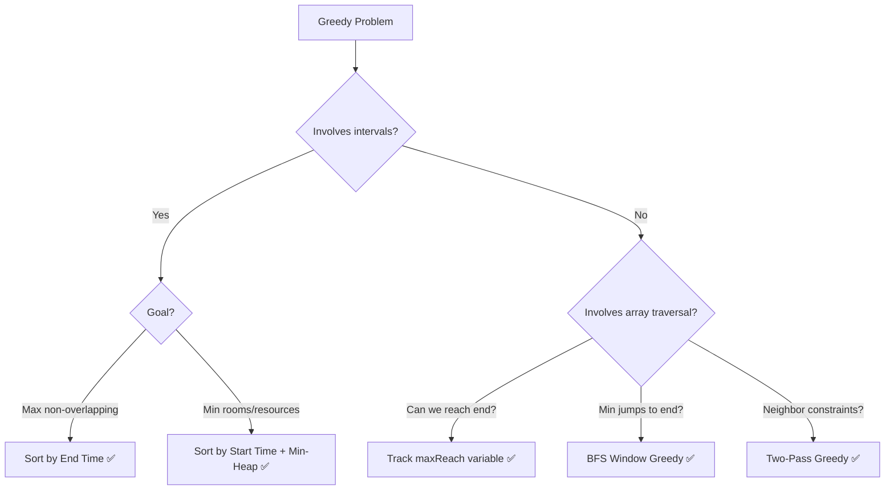
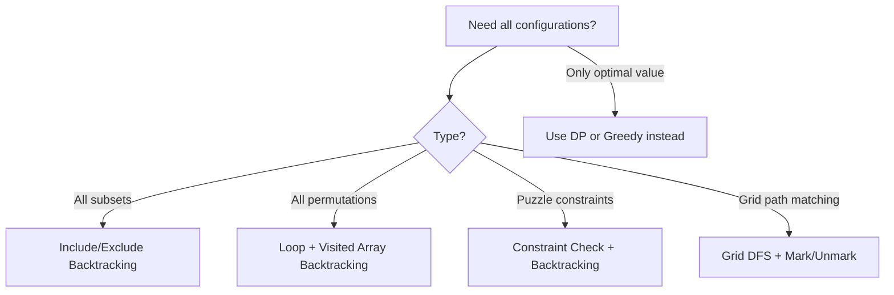
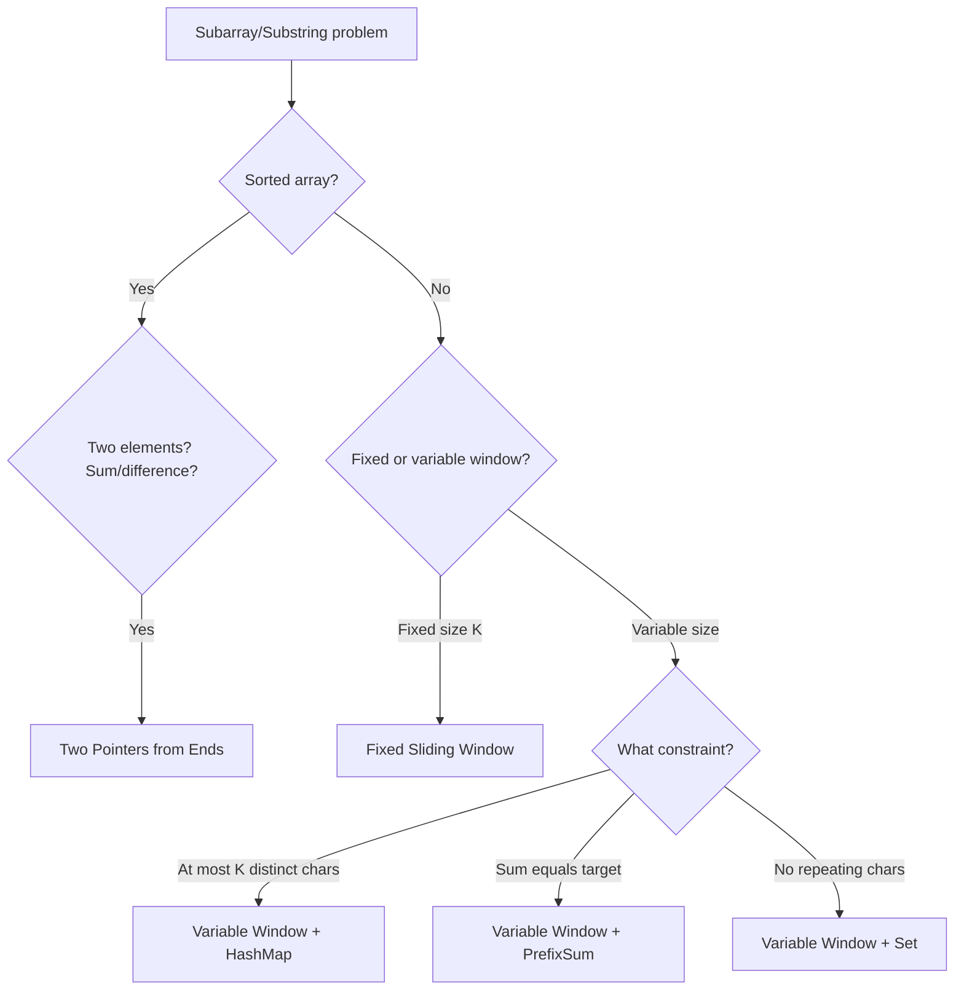
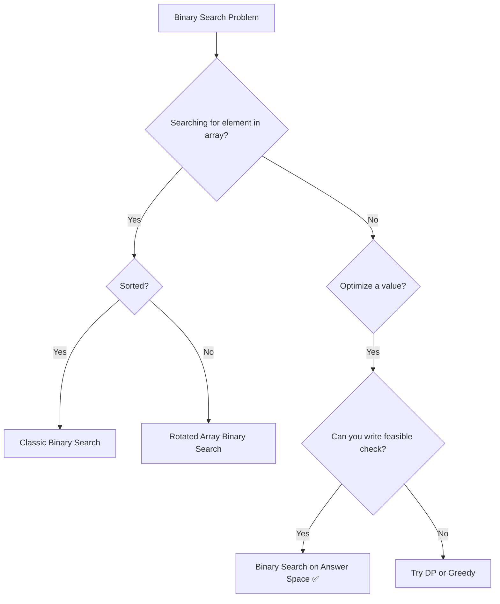
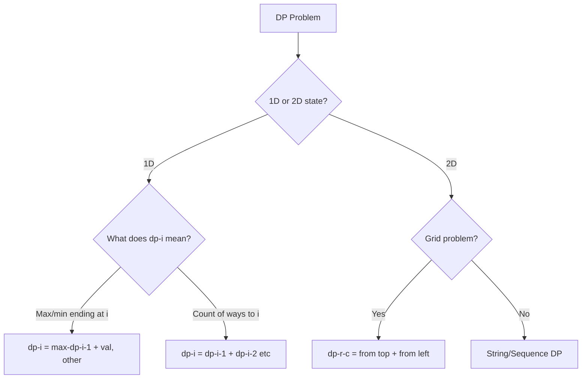
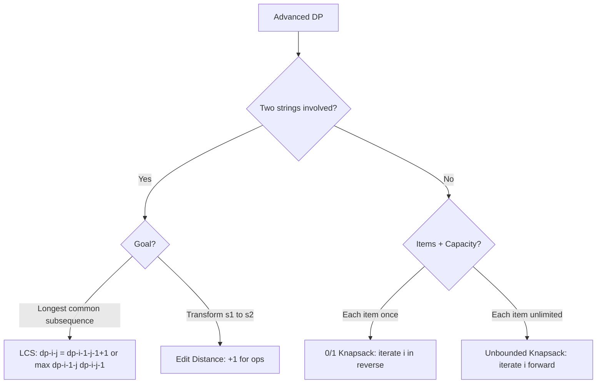
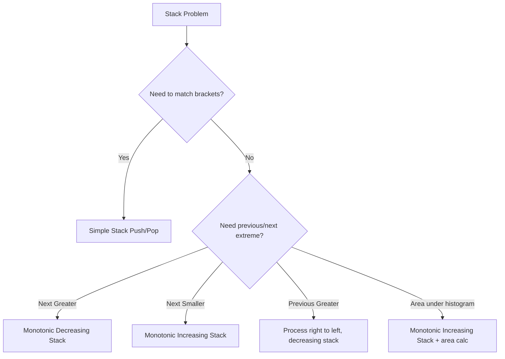

# 🚀 Ultimate DSA Placement Handbook

> **Language:** Java | **Purpose:** Placement & FAANG Interview Preparation  
> **Format:** Every module uses the same structure — skim the Quick Reference, study the Concept, then drill Problems.

---

## 📚 Table of Contents

| # | Module | Key Topics |
|---|--------|-----------|
| [1](#module-1-greedy-algorithms) | Greedy Algorithms | Activity Selection, Jump Game, Candy |
| [2](#module-2-backtracking--constraint-satisfaction) | Backtracking | Subsets, Permutations, N-Queens, Sudoku |
| [3](#module-3-two-pointers--sliding-window) | Two Pointers & Sliding Window | Longest Substring, Container With Most Water |
| [4](#module-4-binary-search-on-answer-space) | Binary Search on Answer Space | Koko Eating, Median of Arrays |
| [5](#module-5-dynamic-programming-1d--grid) | DP Foundations: 1D & Grid | House Robber, Unique Paths, Coin Change |
| [6](#module-6-advanced-dp-strings--knapsack) | Advanced DP: Strings & Knapsack | LCS, Edit Distance, 0/1 Knapsack |
| [7](#module-7-advanced-dp-lis-interval--dpbinary-search) | Advanced DP: LIS, Interval | LIS, Burst Balloons, Matrix Chain |
| [8](#module-8-advanced-trees--tree-dp) | Advanced Trees & Tree DP | Diameter, Path Sum, Serialize, LCA |
| [9](#module-9-graphs-shortest-paths-union-find--mst) | Graphs: Shortest Paths, MST | Dijkstra, Kruskal, Bridges, Topological Sort |
| [10](#module-10-bit-manipulation-tries--interview-framework) | Bit Manipulation & Tries | Bit tricks, Trie insert/search, XOR |
| [11](#module-11-stacks--monotonic-structures) | Stacks & Monotonic Structures | Next Greater Element, Largest Rectangle |
| [12](#module-12-heaps--priority-queue-patterns) | Heaps & Priority Queues | K Largest, Merge K Lists, Median Stream |
| [13](#module-13-hashing--frequency-maps) | Hashing & Frequency Maps | Anagram, Subarray Sum, LRU Cache |

---

# Module 1: Greedy Algorithms

## Quick Reference

| Signal in Problem | Pattern |
|---|---|
| "Maximum non-overlapping intervals" | Sort by end time |
| "Minimum rooms / platforms needed" | Sort by start + Min-Heap |
| "Can you reach the end?" | Track max reachable index |
| "Minimum jumps to reach end" | BFS-window greedy |
| "Distribute based on neighbor ratings" | Two-pass greedy |
| "Schedule jobs with deadlines for max profit" | Sort by profit desc, schedule latest slot |

**Use When:** Local optimal choice leads to global optimum. Constraints are large (N ≥ 10⁵).  
**Avoid When:** Choices are interdependent — use **Dynamic Programming** instead.

---

## Core Concept

A Greedy algorithm makes the locally best decision at each step without revisiting past choices. It works when the problem has two properties:

- **Greedy Choice Property:** A local optimum leads to a global optimum.
- **Optimal Substructure:** The optimal solution contains optimal sub-solutions.

> **Analogy:** A cashier giving change uses the largest coin possible at each step. This greedy approach works because of how coin denominations are structured.

**Exchange Argument (how to justify greedy in interviews):** Show that swapping any non-greedy choice with the greedy one never worsens the solution.

---

## Algorithm Decision Flowchart



---

## Complexity Cheat Sheet

| Problem Type | Time | Space |
|---|---|---|
| Sort + single pass | O(N log N) | O(1) |
| Sort + Min-Heap | O(N log N) | O(N) |
| Single pass (no sort) | O(N) | O(1) |
| Two-pass greedy | O(N) | O(N) |

---

## Problems

### Problem 1: Jump Game — LeetCode 55 | Difficulty: Easy

**Pattern:** Greedy — Track Max Reachable Index  
**Recognition Clue:** "Initially at first index, each element is your max jump length, return true if you can reach last index."

#### Approach
1. Maintain `maxReach = 0`.
2. At each index `i`, if `i > maxReach`, we can never reach `i` → return `false`.
3. Update `maxReach = max(maxReach, i + nums[i])`.
4. If `maxReach >= nums.length - 1` at any point, return `true`.

#### Code (Java)
```java
public boolean canJump(int[] nums) {
    int maxReach = 0;
    for (int i = 0; i < nums.length; i++) {
        if (i > maxReach) return false;       // Can't reach this index
        maxReach = Math.max(maxReach, i + nums[i]);
    }
    return true;
}
```

#### Complexity
| | Time | Space |
|---|---|---|
| Brute Force (recursion) | O(2ᴺ) | O(N) |
| DP | O(N²) | O(N) |
| **Greedy (optimal)** | **O(N)** | **O(1)** |

#### Edge Cases
- Single element `[0]` → `true` (already at last index)
- `[0, 1]` → `false` (stuck at index 0)
- All zeros `[0,0,0]` → `false` (unless length is 1)

> **Interview Tip:** "We don't trace paths — we just track the maximum index we can ever reach. If we ever stand beyond that, it's unreachable."

**Similar:** LC 1306 (Jump Game III), LC 1871 (Jump Game VII)

---

### Problem 2: Jump Game II — LeetCode 45 | Difficulty: Medium

**Pattern:** Greedy — BFS-Window (level scan)  
**Recognition Clue:** "Return the minimum number of jumps to reach the last index."

#### Approach
1. Use `curEnd` (boundary of current jump level) and `curFarthest` (max reachable from this level).
2. At each step, update `curFarthest = max(curFarthest, i + nums[i])`.
3. When `i == curEnd`, we *must* jump → increment `jumps`, set `curEnd = curFarthest`.

#### Code (Java)
```java
public int jump(int[] nums) {
    int jumps = 0, curEnd = 0, curFarthest = 0;
    for (int i = 0; i < nums.length - 1; i++) {
        curFarthest = Math.max(curFarthest, i + nums[i]);
        if (i == curEnd) {
            jumps++;
            curEnd = curFarthest;
        }
    }
    return jumps;
}
```

#### Complexity
| | Time | Space |
|---|---|---|
| DP | O(N²) | O(N) |
| **Greedy (optimal)** | **O(N)** | **O(1)** |

#### Edge Cases
- Single element → `0` jumps
- `[2, 3, 1, 1, 4]` → `2` jumps

> **Interview Tip:** "Think of it as BFS levels. Each 'jump' is a level expansion. We greedily commit to the farthest reachable point before being forced to jump."

**Similar:** LC 1024 (Video Stitching)

---

### Problem 3: Candy — LeetCode 135 | Difficulty: Hard

**Pattern:** Two-Pass Greedy  
**Recognition Clue:** "Children with higher rating than their neighbor get more candies. Find minimum total."

#### Approach
1. Initialize all candies to `1`.
2. **Left-to-right pass:** If `ratings[i] > ratings[i-1]`, set `candies[i] = candies[i-1] + 1`.
3. **Right-to-left pass:** If `ratings[i] > ratings[i+1]`, set `candies[i] = max(candies[i], candies[i+1] + 1)`.
4. Return sum.

#### Code (Java)
```java
public int candy(int[] ratings) {
    int n = ratings.length;
    int[] candies = new int[n];
    Arrays.fill(candies, 1);

    // Left-to-right: satisfy left neighbor constraint
    for (int i = 1; i < n; i++)
        if (ratings[i] > ratings[i - 1])
            candies[i] = candies[i - 1] + 1;

    int sum = candies[n - 1];
    // Right-to-left: satisfy right neighbor constraint
    for (int i = n - 2; i >= 0; i--) {
        if (ratings[i] > ratings[i + 1])
            candies[i] = Math.max(candies[i], candies[i + 1] + 1);
        sum += candies[i];
    }
    return sum;
}
```

#### Complexity
| | Time | Space |
|---|---|---|
| Repeat until stable | O(N²) | O(N) |
| **Two-pass greedy** | **O(N)** | **O(N)** |

#### Edge Cases
- All equal ratings → everyone gets `1`, sum = N
- Strictly increasing → `1,2,3,...,N` pattern

> **Interview Tip:** "One pass handles the left constraint, one handles the right. Taking the max in the second pass preserves both constraints simultaneously."

**Similar:** LC 135 variant, LC 402 (Remove K Digits)

---

### Problem 4: Meeting Rooms II — LeetCode 253 | Difficulty: Medium

**Pattern:** Greedy + Min-Heap  
**Recognition Clue:** "Minimum number of conference rooms required."

#### Approach
1. Sort meetings by start time.
2. Use a Min-Heap to track end times of active meetings.
3. For each meeting: if its start ≥ heap's min (earliest ending room), pop and reuse that room.
4. Always push the new meeting's end time.
5. Heap size = minimum rooms needed.

#### Code (Java)
```java
public int minMeetingRooms(int[][] intervals) {
    Arrays.sort(intervals, (a, b) -> Integer.compare(a[0], b[0]));
    PriorityQueue<Integer> minHeap = new PriorityQueue<>();
    minHeap.add(intervals[0][1]);

    for (int i = 1; i < intervals.length; i++) {
        if (intervals[i][0] >= minHeap.peek())
            minHeap.poll();          // Reuse room
        minHeap.add(intervals[i][1]); // Assign/extend room
    }
    return minHeap.size();
}
```

#### Complexity
| | Time | Space |
|---|---|---|
| Brute force | O(N²) | O(1) |
| **Sort + Heap** | **O(N log N)** | **O(N)** |

#### Edge Cases
- Single meeting → `1`
- Non-overlapping → `1`
- Meeting ending at `3`, next starting at `3` → same room (uses `>=`)

> **Interview Tip:** "The heap tracks 'when does the soonest-free room become available?' If the next meeting can fit, we reuse. If not, we allocate a new room."

**Similar:** LC 1094 (Car Pooling), LC 452 (Minimum Arrows to Burst Balloons)

---

### Problem 5: Gas Station — LeetCode 134 | Difficulty: Medium

**Pattern:** Greedy — Fuel Balance  
**Recognition Clue:** "Circular route, find starting gas station index. Guaranteed unique solution."

#### Approach
1. If `sum(gas) < sum(cost)`, return `-1` (impossible).
2. Track `currTank` and `start`. If `currTank < 0`, reset `start = i + 1`, `currTank = 0`.
3. After one pass, `start` is the answer.

#### Code (Java)
```java
public int canCompleteCircuit(int[] gas, int[] cost) {
    int totalTank = 0, currTank = 0, start = 0;
    for (int i = 0; i < gas.length; i++) {
        int diff = gas[i] - cost[i];
        totalTank += diff;
        currTank += diff;
        if (currTank < 0) {
            start = i + 1;    // Can't start from any index up to i
            currTank = 0;
        }
    }
    return totalTank >= 0 ? start : -1;
}
```

#### Complexity
| | Time | Space |
|---|---|---|
| Brute force (try each start) | O(N²) | O(1) |
| **Greedy** | **O(N)** | **O(1)** |

#### Edge Cases
- Total gas < total cost → return `-1`
- Single station with enough gas → return `0`

> **Interview Tip:** "If we run out at station `i`, it proves every station from the current `start` up to `i` is also a bad start. Jump start to `i+1`."

**Similar:** LC 2207 (Maximize Subsequences in String)

---

# Module 2: Backtracking & Constraint Satisfaction

## Quick Reference

| Signal in Problem | Pattern |
|---|---|
| "Return ALL possible subsets/combinations" | Backtracking — Include/Exclude |
| "Return ALL permutations" | Backtracking — Loop with visited array |
| "Find if word exists in grid" | Grid DFS + backtrack (mark/unmark) |
| "Solve a puzzle (Sudoku, N-Queens)" | Backtracking + constraint check |
| "Assign colors/slots with conflict constraints" | Constraint satisfaction backtracking |

**Use When:** N ≤ 20 (subsets), N ≤ 10 (permutations), need ALL configurations.  
**Avoid When:** N is large and only the optimal value is needed — use **DP or Greedy**.

---

## Core Concept

Backtracking is a depth-first exploration of a decision tree. At each node, you **choose → explore → un-choose (backtrack)**. The key is **pruning** — cutting branches early when a constraint is already violated.

> **Analogy:** Navigating a maze. You go down a path, hit a dead end, backtrack to the last fork, and try the other direction.

**Template:**
```
backtrack(state):
    if state is complete: record result; return
    for each choice in valid_choices(state):
        apply choice
        backtrack(updated state)
        undo choice   ← This is the backtrack
```

---

## Algorithm Decision Flowchart



---

## Complexity Cheat Sheet

| Problem Type | Time | Space |
|---|---|---|
| Subsets (2ᴺ subsets, O(N) to copy each) | O(N · 2ᴺ) | O(N) |
| Permutations (N! permutations) | O(N · N!) | O(N) |
| Combinations (N choose K) | O(K · C(N,K)) | O(K) |
| Grid Word Search | O(M·N · 3ᴸ) | O(L) |

---

## Problems

### Problem 1: Subsets — LeetCode 78 | Difficulty: Easy

**Pattern:** Backtracking — Include/Exclude  
**Recognition Clue:** "Return all possible subsets (the power set)."

#### Approach
1. At each index, branch into two choices: include `nums[i]` or skip it.
2. Add a copy of `current` to `result` at the start of every recursive call.
3. Loop from `start` index to avoid revisiting previous elements.

#### Code (Java)
```java
public List<List<Integer>> subsets(int[] nums) {
    List<List<Integer>> result = new ArrayList<>();
    backtrack(0, nums, new ArrayList<>(), result);
    return result;
}

private void backtrack(int start, int[] nums, List<Integer> current, List<List<Integer>> result) {
    result.add(new ArrayList<>(current));       // Snapshot current subset
    for (int i = start; i < nums.length; i++) {
        current.add(nums[i]);                   // Choose
        backtrack(i + 1, nums, current, result);// Explore
        current.remove(current.size() - 1);     // Un-choose
    }
}
```

#### Complexity
| | Time | Space |
|---|---|---|
| **Backtracking** | **O(N · 2ᴺ)** | **O(N)** |

#### Edge Cases
- Empty array → `[[]]`
- Single element `[1]` → `[[], [1]]`

> **Interview Tip:** "We snapshot the current list at every call, not just at leaves. That's what gives us all intermediate subsets too."

**Similar:** LC 90 (Subsets II with duplicates)

---

### Problem 2: Permutations — LeetCode 46 | Difficulty: Medium

**Pattern:** Backtracking — Loop with Visited Array  
**Recognition Clue:** "Return all possible permutations."

#### Approach
1. Use a `visited[]` boolean array to track which elements are in the current permutation.
2. Loop through ALL elements at each level; skip visited ones.
3. When `current.size() == nums.length`, record result.

#### Code (Java)
```java
public List<List<Integer>> permute(int[] nums) {
    List<List<Integer>> result = new ArrayList<>();
    backtrack(nums, new ArrayList<>(), new boolean[nums.length], result);
    return result;
}

private void backtrack(int[] nums, List<Integer> current, boolean[] visited, List<List<Integer>> result) {
    if (current.size() == nums.length) {
        result.add(new ArrayList<>(current));
        return;
    }
    for (int i = 0; i < nums.length; i++) {
        if (visited[i]) continue;
        visited[i] = true;
        current.add(nums[i]);
        backtrack(nums, current, visited, result);
        current.remove(current.size() - 1);
        visited[i] = false;
    }
}
```

#### Complexity
| | Time | Space |
|---|---|---|
| **Backtracking** | **O(N · N!)** | **O(N)** |

#### Edge Cases
- Single element → `[[element]]`
- Duplicates require sorting + `if (i > 0 && nums[i] == nums[i-1] && !visited[i-1]) continue`

> **Interview Tip:** "Unlike subsets, permutations loop from index 0 every time. The visited array is what prevents reuse."

**Similar:** LC 47 (Permutations II — with duplicates)

---

### Problem 3: N-Queens — LeetCode 51 | Difficulty: Hard

**Pattern:** Backtracking with Pruning  
**Recognition Clue:** "Place N queens on N×N board so no two threaten each other. Return all solutions."

#### Approach
1. Place queens **row-by-row** (one per row guaranteed).
2. Track blocked **columns**, **positive diagonals** (row+col), **negative diagonals** (row-col+N).
3. For each valid column in current row, place queen, recurse to next row, then backtrack.

#### Code (Java)
```java
public List<List<String>> solveNQueens(int n) {
    List<List<String>> result = new ArrayList<>();
    char[][] board = new char[n][n];
    for (char[] row : board) Arrays.fill(row, '.');
    backtrack(0, n, board, new boolean[n], new boolean[2*n], new boolean[2*n], result);
    return result;
}

private void backtrack(int row, int n, char[][] board,
        boolean[] cols, boolean[] diag1, boolean[] diag2, List<List<String>> result) {
    if (row == n) {
        result.add(buildBoard(board));
        return;
    }
    for (int col = 0; col < n; col++) {
        int d1 = row + col, d2 = row - col + n;
        if (cols[col] || diag1[d1] || diag2[d2]) continue; // Pruning
        board[row][col] = 'Q';
        cols[col] = diag1[d1] = diag2[d2] = true;
        backtrack(row + 1, n, board, cols, diag1, diag2, result);
        board[row][col] = '.';
        cols[col] = diag1[d1] = diag2[d2] = false;
    }
}

private List<String> buildBoard(char[][] board) {
    List<String> rows = new ArrayList<>();
    for (char[] row : board) rows.add(new String(row));
    return rows;
}
```

#### Complexity
| | Time | Space |
|---|---|---|
| **Backtracking** | **O(N!)** | **O(N)** |

#### Edge Cases
- N=1 → one solution `[["Q"]]`
- N=2,3 → no solutions

> **Interview Tip:** "Cells on the same positive diagonal share `row+col`. Same negative diagonal share `row-col`. Boolean arrays give O(1) conflict checks."

**Similar:** LC 52 (N-Queens II — count only)

---

### Problem 4: Word Search — LeetCode 79 | Difficulty: Medium

**Pattern:** Grid DFS with Backtracking  
**Recognition Clue:** "Return true if word exists in the grid using adjacent cells without reuse."

#### Approach
1. For every cell matching `word[0]`, launch DFS.
2. In DFS: mark cell as visited (overwrite with `#`), recurse in 4 directions, then restore cell.
3. Base case: if index equals word length, return `true`.

#### Code (Java)
```java
public boolean exist(char[][] board, String word) {
    for (int r = 0; r < board.length; r++)
        for (int c = 0; c < board[0].length; c++)
            if (dfs(r, c, 0, board, word)) return true;
    return false;
}

private boolean dfs(int r, int c, int idx, char[][] board, String word) {
    if (idx == word.length()) return true;
    if (r < 0 || r >= board.length || c < 0 || c >= board[0].length
            || board[r][c] != word.charAt(idx)) return false;

    char temp = board[r][c];
    board[r][c] = '#';                          // Mark visited
    int[] dr = {-1, 1, 0, 0}, dc = {0, 0, -1, 1};
    for (int i = 0; i < 4; i++)
        if (dfs(r + dr[i], c + dc[i], idx + 1, board, word)) return true;
    board[r][c] = temp;                         // Restore (backtrack)
    return false;
}
```

#### Complexity
| | Time | Space |
|---|---|---|
| **DFS + Backtrack** | **O(M·N·3ᴸ)** | **O(L)** |

#### Edge Cases
- Single-cell grid, word length 1
- Word longer than grid → `false`

> **Interview Tip:** "Overwriting the cell with '#' instead of a visited matrix is a common trick — it avoids extra space and is cleaner to backtrack."

**Similar:** LC 212 (Word Search II — find all words)

---

### Problem 5: Combination Sum — LeetCode 39 | Difficulty: Medium

**Pattern:** Backtracking — Unlimited Reuse  
**Recognition Clue:** "Same number may be chosen unlimited times. Find all unique combinations summing to target."

#### Approach
1. Loop from `start` index (prevents duplicate combinations like [2,3] and [3,2]).
2. Pass the *same* index `i` (not `i+1`) to allow reuse of the same element.
3. Prune when `target < 0`.

#### Code (Java)
```java
public List<List<Integer>> combinationSum(int[] candidates, int target) {
    List<List<Integer>> result = new ArrayList<>();
    backtrack(0, candidates, target, new ArrayList<>(), result);
    return result;
}

private void backtrack(int start, int[] candidates, int remaining,
        List<Integer> current, List<List<Integer>> result) {
    if (remaining == 0) { result.add(new ArrayList<>(current)); return; }
    for (int i = start; i < candidates.length; i++) {
        if (candidates[i] > remaining) continue;    // Prune
        current.add(candidates[i]);
        backtrack(i, candidates, remaining - candidates[i], current, result); // i, not i+1
        current.remove(current.size() - 1);
    }
}
```

#### Complexity
| | Time | Space |
|---|---|---|
| **Backtracking** | **O(N^(T/min))** | **O(T/min)** |

#### Edge Cases
- No combination sums to target → return `[]`
- Target itself is a candidate → `[[target]]`

> **Interview Tip:** "Passing `i` instead of `i+1` is the key difference from Subsets — it allows reuse of the same element."

**Similar:** LC 40 (Combination Sum II — no reuse, with duplicates)

---

# Module 3: Two Pointers & Sliding Window

## Quick Reference

| Signal in Problem | Pattern |
|---|---|
| "Longest subarray/substring with condition X" | Variable-size sliding window |
| "Subarray of exactly size K" | Fixed-size sliding window |
| "Two elements in sorted array summing to target" | Two pointers from ends |
| "Container / area between lines" | Two pointers (greedy shrink) |
| "Remove duplicates in sorted array in-place" | Slow/fast two pointers |

**Use When:** Contiguous subarrays/substrings, sorted arrays, O(N) needed.  
**Avoid When:** Non-contiguous subsets required (use backtracking/DP).

---

## Core Concept

Two pointers maintain a **window** `[left, right]` over an array or string. Instead of checking every subarray (O(N²)), each element enters and leaves the window at most once → **O(N)**.

> **Analogy:** A train window. As the train moves right, new scenery enters from the front. When it gets too crowded, scenery leaves from the back.

**Variable Window Template:**
```
left = 0, state = {}
for right in 0..N:
    expand window by adding arr[right] to state
    while window violates constraint:
        shrink window by removing arr[left] from state
        left++
    update answer with window size (right - left + 1)
```

---

## Algorithm Decision Flowchart



---

## Complexity Cheat Sheet

| Approach | Time | Space |
|---|---|---|
| Brute force (all subarrays) | O(N²) | O(1) |
| Sliding window | O(N) | O(K) where K is window/alphabet size |
| Two pointers on sorted array | O(N) | O(1) |

---

## Problems

### Problem 1: Longest Substring Without Repeating Characters — LeetCode 3 | Difficulty: Medium

**Pattern:** Variable Sliding Window + Set  
**Recognition Clue:** "Longest substring without repeating characters."

#### Approach
1. Maintain a `HashSet` of chars in the current window.
2. Expand `right`. If `s[right]` already in set, shrink from `left` until it's removed.
3. Track max window size.

#### Code (Java)
```java
public int lengthOfLongestSubstring(String s) {
    Set<Character> window = new HashSet<>();
    int left = 0, maxLen = 0;
    for (int right = 0; right < s.length(); right++) {
        while (window.contains(s.charAt(right)))
            window.remove(s.charAt(left++));    // Shrink left
        window.add(s.charAt(right));
        maxLen = Math.max(maxLen, right - left + 1);
    }
    return maxLen;
}
```

#### Complexity
| | Time | Space |
|---|---|---|
| Brute force | O(N²) | O(N) |
| **Sliding window** | **O(N)** | **O(min(N, 128))** |

> **Interview Tip:** "Use a HashMap<char, lastIndex> instead of a Set for O(1) left-jump (skip directly to duplicate's position + 1)."

**Similar:** LC 159 (At Most Two Distinct), LC 340 (At Most K Distinct)

---

### Problem 2: Longest Repeating Character Replacement — LeetCode 424 | Difficulty: Medium

**Pattern:** Variable Sliding Window + Frequency Map  
**Recognition Clue:** "You can replace at most K characters. Find longest substring with all same character."

#### Approach
1. Track character frequencies in the window. Track `maxFreq` (highest frequency char in window).
2. If `(window size - maxFreq) > K`, we've exceeded K replacements → shrink left.
3. Answer is the max valid window size.

#### Code (Java)
```java
public int characterReplacement(String s, int k) {
    int[] freq = new int[26];
    int left = 0, maxFreq = 0, maxLen = 0;
    for (int right = 0; right < s.length(); right++) {
        maxFreq = Math.max(maxFreq, ++freq[s.charAt(right) - 'A']);
        if ((right - left + 1) - maxFreq > k)
            freq[s.charAt(left++) - 'A']--;     // Shrink window
        maxLen = Math.max(maxLen, right - left + 1);
    }
    return maxLen;
}
```

#### Complexity
| | Time | Space |
|---|---|---|
| **Sliding window** | **O(N)** | **O(26) = O(1)** |

> **Interview Tip:** "We never shrink `maxFreq` — it only grows. This works because we only care about windows larger than our current best."

**Similar:** LC 1004 (Max Consecutive Ones III)

---

### Problem 3: Container With Most Water — LeetCode 11 | Difficulty: Medium

**Pattern:** Two Pointers from Ends  
**Recognition Clue:** "Array of heights, find two lines that together with the x-axis form a container with most water."

#### Approach
1. Start `left = 0`, `right = n-1`.
2. Area = `min(height[left], height[right]) * (right - left)`.
3. Move the pointer with the **shorter height** inward (greedy: the shorter side limits area).

#### Code (Java)
```java
public int maxArea(int[] height) {
    int left = 0, right = height.length - 1, maxWater = 0;
    while (left < right) {
        maxWater = Math.max(maxWater, Math.min(height[left], height[right]) * (right - left));
        if (height[left] < height[right]) left++;
        else right--;
    }
    return maxWater;
}
```

#### Complexity
| | Time | Space |
|---|---|---|
| Brute force | O(N²) | O(1) |
| **Two pointers** | **O(N)** | **O(1)** |

> **Interview Tip:** "Moving the taller side inward can only decrease width without gaining height — guaranteed suboptimal. So always move the shorter side."

**Similar:** LC 42 (Trapping Rain Water)

---

### Problem 4: Minimum Window Substring — LeetCode 76 | Difficulty: Hard

**Pattern:** Variable Sliding Window + Frequency Maps  
**Recognition Clue:** "Smallest window in s containing all characters of t."

#### Approach
1. Build `need` map for `t`. Track `have` (satisfied chars) vs `need` count.
2. Expand `right`, update `have` when a char's frequency meets requirement.
3. When `have == need`, try shrinking from `left`. Update answer, then shrink.

#### Code (Java)
```java
public String minWindow(String s, String t) {
    Map<Character, Integer> need = new HashMap<>(), window = new HashMap<>();
    for (char c : t.toCharArray()) need.merge(c, 1, Integer::sum);
    int left = 0, have = 0, required = need.size();
    int[] best = {-1, 0, 0}; // [len, left, right]
    for (int right = 0; right < s.length(); right++) {
        char c = s.charAt(right);
        window.merge(c, 1, Integer::sum);
        if (need.containsKey(c) && window.get(c).equals(need.get(c))) have++;
        while (have == required) {
            if (best[0] == -1 || right - left + 1 < best[0])
                best = new int[]{right - left + 1, left, right};
            char lc = s.charAt(left);
            window.merge(lc, -1, Integer::sum);
            if (need.containsKey(lc) && window.get(lc) < need.get(lc)) have--;
            left++;
        }
    }
    return best[0] == -1 ? "" : s.substring(best[1], best[2] + 1);
}
```

#### Complexity
| | Time | Space |
|---|---|---|
| **Sliding window** | **O(|s| + |t|)** | **O(|t|)** |

> **Interview Tip:** "Track `have` as a count of chars whose frequency requirement is met — not just their presence."

**Similar:** LC 567 (Permutation in String), LC 438 (Anagrams in String)

---

### Problem 5: Trapping Rain Water — LeetCode 42 | Difficulty: Hard

**Pattern:** Two Pointers  
**Recognition Clue:** "Given elevation map, compute how much water it can trap."

#### Approach
1. Maintain `leftMax` and `rightMax`.
2. Pointer with smaller max moves inward. Water at that bar = `max - height[pointer]`.

#### Code (Java)
```java
public int trap(int[] height) {
    int left = 0, right = height.length - 1;
    int leftMax = 0, rightMax = 0, water = 0;
    while (left < right) {
        if (height[left] < height[right]) {
            leftMax = Math.max(leftMax, height[left]);
            water += leftMax - height[left++];
        } else {
            rightMax = Math.max(rightMax, height[right]);
            water += rightMax - height[right--];
        }
    }
    return water;
}
```

#### Complexity
| | Time | Space |
|---|---|---|
| Prefix/Suffix arrays | O(N) | O(N) |
| **Two pointers** | **O(N)** | **O(1)** |

> **Interview Tip:** "We always process the side with the smaller max. We know the water level is bounded by that smaller max — no need to look at the other side."

**Similar:** LC 11 (Container With Most Water)

---

# Module 4: Binary Search on Answer Space

## Quick Reference

| Signal in Problem | Pattern |
|---|---|
| "Minimum/maximum of something... feasible?" | Binary search on answer |
| "Split array into K parts minimizing max sum" | Binary search on answer |
| "Find Kth smallest in sorted matrix/stream" | Binary search on value |
| "Median of two sorted arrays" | Binary search on partition |
| "Allocate minimum pages / bandwidth" | Binary search on answer |

**Use When:** The answer lies in a monotone range; you can write a `feasible(mid)` check.  
**Key Insight:** If `feasible(x)` is true for all `x ≥ answer`, binary search over the answer space.

---

## Core Concept

Instead of searching for an element, we search for the **answer value** itself. Define a `feasible(mid)` function that returns `true/false`. Binary search finds the smallest (or largest) value for which `feasible` holds.

> **Analogy:** Guessing a secret number between 1 and 10⁹. Instead of trying each, you ask "Is the answer ≤ 500 million?" — cut the space in half each time.

**Template:**
```java
int lo = minPossibleAnswer, hi = maxPossibleAnswer;
while (lo < hi) {
    int mid = lo + (hi - lo) / 2;
    if (feasible(mid)) hi = mid;      // Answer is mid or smaller
    else lo = mid + 1;                // Answer is larger
}
return lo; // lo == hi == answer
```

---

## Algorithm Decision Flowchart



---

## Complexity Cheat Sheet

| Approach | Time | Space |
|---|---|---|
| Linear search | O(N) | O(1) |
| Classic binary search | O(log N) | O(1) |
| BS on answer space (with O(N) feasibility check) | O(N log(range)) | O(1) |

---

## Problems

### Problem 1: Koko Eating Bananas — LeetCode 875 | Difficulty: Medium

**Pattern:** Binary Search on Answer Space  
**Recognition Clue:** "Minimum eating speed K to finish all piles within H hours."

#### Approach
1. Answer range: `[1, max(piles)]`.
2. `feasible(k)`: can we eat all piles at speed `k` in `≤ h` hours? (`ceil(pile/k)` hours per pile).
3. Binary search for smallest `k` where `feasible(k)` is true.

#### Code (Java)
```java
public int minEatingSpeed(int[] piles, int h) {
    int lo = 1, hi = Arrays.stream(piles).max().getAsInt();
    while (lo < hi) {
        int mid = lo + (hi - lo) / 2;
        if (canFinish(piles, mid, h)) hi = mid;
        else lo = mid + 1;
    }
    return lo;
}

private boolean canFinish(int[] piles, int k, int h) {
    int hours = 0;
    for (int pile : piles)
        hours += (pile + k - 1) / k;   // ceiling division
    return hours <= h;
}
```

#### Complexity
| | Time | Space |
|---|---|---|
| **BS + feasibility** | **O(N log(max))** | **O(1)** |

> **Interview Tip:** "Always identify the monotone property: 'if speed k works, any speed > k also works.' That's your signal to binary search."

**Similar:** LC 1011 (Ship Packages Within D Days), LC 410 (Split Array Largest Sum)

---

### Problem 2: Find Minimum in Rotated Sorted Array — LeetCode 153 | Difficulty: Medium

**Pattern:** Modified Binary Search  
**Recognition Clue:** "Rotated sorted array, find minimum element."

#### Approach
1. If `nums[mid] > nums[right]`, minimum is in right half → `lo = mid + 1`.
2. Else minimum is in left half (including `mid`) → `hi = mid`.

#### Code (Java)
```java
public int findMin(int[] nums) {
    int lo = 0, hi = nums.length - 1;
    while (lo < hi) {
        int mid = lo + (hi - lo) / 2;
        if (nums[mid] > nums[hi]) lo = mid + 1;
        else hi = mid;
    }
    return nums[lo];
}
```

#### Complexity
| | Time | Space |
|---|---|---|
| **Binary search** | **O(log N)** | **O(1)** |

> **Interview Tip:** "Compare `mid` with `right` (not `left`) — the right half always contains the minimum or is the boundary."

**Similar:** LC 154 (Rotated Array with Duplicates), LC 33 (Search in Rotated Array)

---

### Problem 3: Median of Two Sorted Arrays — LeetCode 4 | Difficulty: Hard

**Pattern:** Binary Search on Partition  
**Recognition Clue:** "Find median of two sorted arrays. O(log(m+n)) required."

#### Approach
1. Binary search on the shorter array's partition index.
2. Ensure left halves of both arrays combined have `(total+1)/2` elements.
3. Check if `maxLeft1 ≤ minRight2` and `maxLeft2 ≤ minRight1`. If yes, compute median.

#### Code (Java)
```java
public double findMedianSortedArrays(int[] A, int[] B) {
    if (A.length > B.length) return findMedianSortedArrays(B, A);
    int m = A.length, n = B.length;
    int lo = 0, hi = m;
    while (lo <= hi) {
        int i = (lo + hi) / 2;
        int j = (m + n + 1) / 2 - i;
        int maxL1 = (i == 0) ? Integer.MIN_VALUE : A[i - 1];
        int minR1 = (i == m) ? Integer.MAX_VALUE : A[i];
        int maxL2 = (j == 0) ? Integer.MIN_VALUE : B[j - 1];
        int minR2 = (j == n) ? Integer.MAX_VALUE : B[j];
        if (maxL1 <= minR2 && maxL2 <= minR1) {
            if ((m + n) % 2 == 1) return Math.max(maxL1, maxL2);
            return (Math.max(maxL1, maxL2) + Math.min(minR1, minR2)) / 2.0;
        } else if (maxL1 > minR2) hi = i - 1;
        else lo = i + 1;
    }
    return 0.0;
}
```

#### Complexity
| | Time | Space |
|---|---|---|
| Merge and find | O(m+n) | O(m+n) |
| **Binary search** | **O(log(min(m,n)))** | **O(1)** |

> **Interview Tip:** "Binary search on the smaller array's partition. The invariant: `maxLeft1 ≤ minRight2` and vice versa."

---

### Problem 4: Split Array Largest Sum — LeetCode 410 | Difficulty: Hard

**Pattern:** Binary Search on Answer Space  
**Recognition Clue:** "Split array into at most K subarrays to minimize the largest sum."

#### Approach
1. Answer range: `[max(nums), sum(nums)]`.
2. `feasible(mid)`: can we split into ≤ k parts where each part's sum ≤ mid?
3. Greedily accumulate elements; increment part count when sum exceeds `mid`.

#### Code (Java)
```java
public int splitArray(int[] nums, int k) {
    int lo = Arrays.stream(nums).max().getAsInt();
    int hi = Arrays.stream(nums).sum();
    while (lo < hi) {
        int mid = lo + (hi - lo) / 2;
        if (canSplit(nums, k, mid)) hi = mid;
        else lo = mid + 1;
    }
    return lo;
}

private boolean canSplit(int[] nums, int k, int maxSum) {
    int parts = 1, current = 0;
    for (int n : nums) {
        if (current + n > maxSum) { parts++; current = 0; }
        current += n;
    }
    return parts <= k;
}
```

#### Complexity
| | Time | Space |
|---|---|---|
| **BS + feasibility** | **O(N log(sum))** | **O(1)** |

> **Interview Tip:** "The feasibility check is always a greedy scan — greedily extend each subarray as far as possible."

**Similar:** LC 875 (Koko), LC 1011 (Ship Packages)

---

# Module 5: Dynamic Programming — 1D & Grid

## Quick Reference

| Signal in Problem | Pattern |
|---|---|
| "Maximum/minimum with choices at each step" | 1D DP (house robber style) |
| "Number of ways to reach/form something" | 1D DP (count paths/combos) |
| "Grid: min cost / max sum path" | 2D Grid DP |
| "Number of unique paths in grid" | 2D Grid DP (count) |
| "Decode/parse string" | 1D DP |

**Use When:** Overlapping subproblems + optimal substructure. Problem can be broken into smaller, identical subproblems.  
**Avoid When:** No overlapping subproblems (use Greedy or Divide & Conquer).

---

## Core Concept

DP solves problems by storing the results of subproblems to avoid recomputation. Two styles:
- **Top-down (Memoization):** Recursion + cache. Natural to write.
- **Bottom-up (Tabulation):** Fill a table iteratively. Better space optimization.

> **Analogy:** Climbing stairs — to know how many ways to reach step N, you just need the answers for step N-1 and N-2. Build up from the base.

**DP Design Steps:**
1. Define `dp[i]` meaning clearly.
2. Write the recurrence relation.
3. Identify base cases.
4. Determine fill order (left-to-right, right-to-left, etc.).

---

## Algorithm Decision Flowchart



---

## Complexity Cheat Sheet

| Problem Type | Time | Space | Optimizable? |
|---|---|---|---|
| 1D DP (House Robber style) | O(N) | O(N) | Yes → O(1) with two vars |
| Grid DP (M×N grid) | O(M×N) | O(M×N) | Yes → O(min(M,N)) |
| Coin Change (unbounded) | O(N×amount) | O(amount) | No |

---

## Problems

### Problem 1: House Robber — LeetCode 198 | Difficulty: Medium

**Pattern:** 1D DP  
**Recognition Clue:** "Rob houses, no two adjacent houses. Maximize amount."

#### Approach
1. `dp[i]` = max money robbing houses 0..i.
2. `dp[i] = max(dp[i-1], dp[i-2] + nums[i])` — either skip house i, or rob it + best from two steps back.
3. Optimize space: only need two variables.

#### Code (Java)
```java
public int rob(int[] nums) {
    int prev2 = 0, prev1 = 0;
    for (int num : nums) {
        int curr = Math.max(prev1, prev2 + num);
        prev2 = prev1;
        prev1 = curr;
    }
    return prev1;
}
```

#### Complexity
| | Time | Space |
|---|---|---|
| DP with array | O(N) | O(N) |
| **DP optimized** | **O(N)** | **O(1)** |

> **Interview Tip:** "You never need the full DP array — just `prev1` and `prev2`. This is a very common space optimization."

**Similar:** LC 213 (House Robber II — circular), LC 337 (House Robber III — tree)

---

### Problem 2: Climbing Stairs — LeetCode 70 | Difficulty: Easy

**Pattern:** 1D DP (Fibonacci-like)  
**Recognition Clue:** "1 or 2 steps at a time. Count distinct ways to climb N steps."

#### Approach
`dp[i] = dp[i-1] + dp[i-2]`. Ways to reach step `i` = ways from one step below + two steps below.

#### Code (Java)
```java
public int climbStairs(int n) {
    if (n <= 2) return n;
    int a = 1, b = 2;
    for (int i = 3; i <= n; i++) {
        int c = a + b;
        a = b; b = c;
    }
    return b;
}
```

#### Complexity
| | Time | Space |
|---|---|---|
| **DP** | **O(N)** | **O(1)** |

> **Interview Tip:** "This is Fibonacci. The generalization with K steps uses a sliding window sum of the last K dp values."

**Similar:** LC 746 (Min Cost Climbing Stairs), LC 91 (Decode Ways)

---

### Problem 3: Coin Change — LeetCode 322 | Difficulty: Medium

**Pattern:** 1D DP (Unbounded Knapsack variant)  
**Recognition Clue:** "Fewest coins to make amount. Infinite supply of each coin."

#### Approach
1. `dp[i]` = minimum coins to make amount `i`. Initialize to `infinity`.
2. `dp[0] = 0`. For each amount, try each coin: `dp[i] = min(dp[i], dp[i-coin] + 1)`.

#### Code (Java)
```java
public int coinChange(int[] coins, int amount) {
    int[] dp = new int[amount + 1];
    Arrays.fill(dp, amount + 1);    // Use amount+1 as "infinity"
    dp[0] = 0;
    for (int i = 1; i <= amount; i++)
        for (int coin : coins)
            if (coin <= i)
                dp[i] = Math.min(dp[i], dp[i - coin] + 1);
    return dp[amount] > amount ? -1 : dp[amount];
}
```

#### Complexity
| | Time | Space |
|---|---|---|
| **DP** | **O(amount × N)** | **O(amount)** |

> **Interview Tip:** "This is bottom-up unbounded knapsack. The outer loop is over amounts, inner over coins. Order matters for unbounded vs 0/1."

**Similar:** LC 518 (Coin Change II — count ways), LC 377 (Combination Sum IV)

---

### Problem 4: Unique Paths — LeetCode 62 | Difficulty: Medium

**Pattern:** 2D Grid DP  
**Recognition Clue:** "Robot moves only right or down. Count paths from top-left to bottom-right."

#### Approach
`dp[r][c] = dp[r-1][c] + dp[r][c-1]`. Space-optimize to a single 1D array.

#### Code (Java)
```java
public int uniquePaths(int m, int n) {
    int[] dp = new int[n];
    Arrays.fill(dp, 1);
    for (int r = 1; r < m; r++)
        for (int c = 1; c < n; c++)
            dp[c] += dp[c - 1];
    return dp[n - 1];
}
```

#### Complexity
| | Time | Space |
|---|---|---|
| 2D DP | O(M×N) | O(M×N) |
| **1D DP optimized** | **O(M×N)** | **O(N)** |

> **Interview Tip:** "After space optimization, `dp[c]` holds the top value and `dp[c-1]` the left value — exactly what we need."

**Similar:** LC 63 (Unique Paths II — with obstacles), LC 64 (Minimum Path Sum)

---

### Problem 5: Decode Ways — LeetCode 91 | Difficulty: Medium

**Pattern:** 1D DP  
**Recognition Clue:** "Encoded as numbers, 'A'→1 ... 'Z'→26. Count decoding ways."

#### Approach
1. `dp[i]` = ways to decode `s[0..i-1]`.
2. If `s[i-1] != '0'`, single-digit decode: `dp[i] += dp[i-1]`.
3. If two-digit `s[i-2..i-1]` is between 10–26, `dp[i] += dp[i-2]`.

#### Code (Java)
```java
public int numDecodings(String s) {
    int n = s.length();
    int[] dp = new int[n + 1];
    dp[0] = 1;
    dp[1] = s.charAt(0) == '0' ? 0 : 1;
    for (int i = 2; i <= n; i++) {
        int one = s.charAt(i - 1) - '0';
        int two = Integer.parseInt(s.substring(i - 2, i));
        if (one >= 1) dp[i] += dp[i - 1];
        if (two >= 10 && two <= 26) dp[i] += dp[i - 2];
    }
    return dp[n];
}
```

#### Complexity
| | Time | Space |
|---|---|---|
| **DP** | **O(N)** | **O(N) → O(1) with two vars** |

> **Interview Tip:** "Always handle leading zeros: `'0'` alone can't decode to anything. A `'0'` only works as part of `10` or `20`."

**Similar:** LC 639 (Decode Ways II)

---

# Module 6: Advanced DP — Strings & Knapsack

## Quick Reference

| Signal in Problem | Pattern |
|---|---|
| "Longest common subsequence" | 2D DP on two strings |
| "Edit distance / minimum operations" | 2D DP (insert/delete/replace) |
| "Longest palindromic subsequence" | 2D DP or reduce to LCS |
| "Maximum value fitting in weight W (0/1)" | 0/1 Knapsack DP |
| "Partition array into two equal subsets" | Subset sum DP |

---

## Core Concept

String DP uses a 2D table `dp[i][j]` representing the answer for substrings `s1[0..i-1]` and `s2[0..j-1]`. Knapsack DP trades off item weight vs value with a capacity constraint.

---

## Algorithm Decision Flowchart



---

## Problems

### Problem 1: Longest Common Subsequence — LeetCode 1143 | Difficulty: Medium

**Pattern:** 2D String DP  
**Recognition Clue:** "LCS of two strings."

#### Code (Java)
```java
public int longestCommonSubsequence(String text1, String text2) {
    int m = text1.length(), n = text2.length();
    int[][] dp = new int[m + 1][n + 1];
    for (int i = 1; i <= m; i++)
        for (int j = 1; j <= n; j++)
            if (text1.charAt(i-1) == text2.charAt(j-1))
                dp[i][j] = dp[i-1][j-1] + 1;
            else
                dp[i][j] = Math.max(dp[i-1][j], dp[i][j-1]);
    return dp[m][n];
}
```

**Recurrence:** `dp[i][j] = dp[i-1][j-1] + 1` if chars match, else `max(dp[i-1][j], dp[i][j-1])`.

**Complexity:** Time O(M×N), Space O(M×N) → optimizable to O(min(M,N))

> **Interview Tip:** "LCS is the basis for Edit Distance, Shortest Common Supersequence, and many string comparison problems."

**Similar:** LC 516 (Longest Palindromic Subsequence), LC 1092 (Shortest Common Supersequence)

---

### Problem 2: Edit Distance — LeetCode 72 | Difficulty: Hard

**Pattern:** 2D String DP  
**Recognition Clue:** "Minimum operations (insert, delete, replace) to transform word1 to word2."

#### Code (Java)
```java
public int minDistance(String word1, String word2) {
    int m = word1.length(), n = word2.length();
    int[][] dp = new int[m + 1][n + 1];
    for (int i = 0; i <= m; i++) dp[i][0] = i;
    for (int j = 0; j <= n; j++) dp[0][j] = j;
    for (int i = 1; i <= m; i++)
        for (int j = 1; j <= n; j++)
            if (word1.charAt(i-1) == word2.charAt(j-1))
                dp[i][j] = dp[i-1][j-1];
            else
                dp[i][j] = 1 + Math.min(dp[i-1][j-1],    // Replace
                                Math.min(dp[i-1][j],       // Delete from word1
                                         dp[i][j-1]));     // Insert into word1
    return dp[m][n];
}
```

**Complexity:** Time O(M×N), Space O(M×N)

> **Interview Tip:** "Base cases: converting empty string to length-j string requires j insertions. Converting length-i string to empty requires i deletions."

**Similar:** LC 583 (Delete Operations for Two Strings), LC 712 (Minimum ASCII Delete Sum)

---

### Problem 3: Partition Equal Subset Sum — LeetCode 416 | Difficulty: Medium

**Pattern:** 0/1 Knapsack (Subset Sum)  
**Recognition Clue:** "Can you partition array into two subsets with equal sum?"

#### Approach
1. If total sum is odd → `false`.
2. Find if any subset sums to `total/2`.
3. Use 1D boolean DP. Iterate elements, update `dp` in **reverse** (prevents reuse of same element).

#### Code (Java)
```java
public boolean canPartition(int[] nums) {
    int sum = Arrays.stream(nums).sum();
    if (sum % 2 != 0) return false;
    int target = sum / 2;
    boolean[] dp = new boolean[target + 1];
    dp[0] = true;
    for (int num : nums)
        for (int j = target; j >= num; j--)    // Reverse order = 0/1 knapsack
            dp[j] = dp[j] || dp[j - num];
    return dp[target];
}
```

**Complexity:** Time O(N × target), Space O(target)

> **Interview Tip:** "Iterating `j` in reverse prevents using the same element twice. Forward order would give unbounded knapsack (infinite reuse)."

**Similar:** LC 494 (Target Sum), LC 1049 (Last Stone Weight II)

---

### Problem 4: 0/1 Knapsack | Difficulty: Medium

**Pattern:** 0/1 Knapsack  
**Recognition Clue:** "N items, each with weight and value. Bag capacity W. Maximize value."

#### Code (Java)
```java
public int knapsack(int[] weights, int[] values, int W) {
    int n = weights.length;
    int[] dp = new int[W + 1];
    for (int i = 0; i < n; i++)
        for (int j = W; j >= weights[i]; j--)  // Reverse = each item used once
            dp[j] = Math.max(dp[j], dp[j - weights[i]] + values[i]);
    return dp[W];
}
```

**Complexity:** Time O(N × W), Space O(W)

> **Interview Tip:** "Remember: reverse-order fill = 0/1 (each item once). Forward-order fill = unbounded (unlimited reuse)."

**Similar:** LC 474 (Ones and Zeroes), LC 879 (Profitable Schemes)

---

### Problem 5: Longest Palindromic Subsequence — LeetCode 516 | Difficulty: Medium

**Pattern:** 2D Interval DP  
**Recognition Clue:** "Longest palindromic subsequence in a string."

#### Approach
Reduce to LCS of `s` with its reverse. Or use interval DP where `dp[i][j]` = LPS of `s[i..j]`.

#### Code (Java)
```java
public int longestPalindromeSubseq(String s) {
    // Reduce to LCS with reverse
    return longestCommonSubsequence(s, new StringBuilder(s).reverse().toString());
}

private int longestCommonSubsequence(String a, String b) {
    int m = a.length(), n = b.length();
    int[][] dp = new int[m + 1][n + 1];
    for (int i = 1; i <= m; i++)
        for (int j = 1; j <= n; j++)
            dp[i][j] = a.charAt(i-1) == b.charAt(j-1)
                ? dp[i-1][j-1] + 1 : Math.max(dp[i-1][j], dp[i][j-1]);
    return dp[m][n];
}
```

**Complexity:** Time O(N²), Space O(N²)

> **Interview Tip:** "LPS(s) = LCS(s, reverse(s)). This reduces an interval DP problem to a 2D string DP problem."

**Similar:** LC 1312 (Minimum Insertions for Palindrome), LC 647 (Palindromic Substrings)

---

# Module 7: Advanced DP — LIS, Interval & DP+Binary Search

## Quick Reference

| Signal in Problem | Pattern |
|---|---|
| "Longest increasing subsequence" | LIS DP or patience sorting (BS) |
| "Burst balloons / remove elements to maximize" | Interval DP |
| "Chain problems (envelopes, jobs)" | Sort + LIS |
| "Matrix chain multiplication" | Interval DP |

---

## Problems

### Problem 1: Longest Increasing Subsequence — LeetCode 300 | Difficulty: Medium

**Pattern:** LIS DP → O(N²) | Patience Sorting → O(N log N)

#### Code — O(N log N) with Binary Search (Java)
```java
public int lengthOfLIS(int[] nums) {
    List<Integer> tails = new ArrayList<>();
    for (int num : nums) {
        int lo = 0, hi = tails.size();
        while (lo < hi) {                       // Find insertion point
            int mid = (lo + hi) / 2;
            if (tails.get(mid) < num) lo = mid + 1;
            else hi = mid;
        }
        if (lo == tails.size()) tails.add(num); // Extend LIS
        else tails.set(lo, num);                // Replace for potential better future
    }
    return tails.size();
}
```

**Complexity:** Time O(N log N), Space O(N)

> **Interview Tip:** "`tails[i]` is the smallest possible tail for an IS of length `i+1`. We never need the actual sequence — just its length."

**Similar:** LC 354 (Russian Doll Envelopes), LC 673 (Number of LIS)

---

### Problem 2: Russian Doll Envelopes — LeetCode 354 | Difficulty: Hard

**Pattern:** Sort + LIS  
**Recognition Clue:** "Envelope [w,h] fits in [W,H] if w<W and h<H. Max envelopes you can nest."

#### Approach
1. Sort by width ascending, height **descending** (prevents using same width).
2. Apply LIS on heights only.

#### Code (Java)
```java
public int maxEnvelopes(int[][] envelopes) {
    Arrays.sort(envelopes, (a, b) -> a[0] != b[0] ? a[0] - b[0] : b[1] - a[1]);
    int[] nums = Arrays.stream(envelopes).mapToInt(e -> e[1]).toArray();
    return lengthOfLIS(nums);   // Use O(N log N) LIS from above
}
```

**Complexity:** Time O(N log N), Space O(N)

> **Interview Tip:** "Sort by height descending within same width — this ensures we can't pick two envelopes with equal width in our LIS."

---

### Problem 3: Burst Balloons — LeetCode 312 | Difficulty: Hard

**Pattern:** Interval DP  
**Recognition Clue:** "Burst all balloons to maximize coins. Coins = left × balloon × right."

#### Approach
1. Add boundary balloons `1` on each side.
2. `dp[left][right]` = max coins from bursting balloons between `left` and `right` (exclusive).
3. Try each balloon `k` as the **last** to burst in `(left, right)`.

#### Code (Java)
```java
public int maxCoins(int[] nums) {
    int n = nums.length;
    int[] balls = new int[n + 2];
    balls[0] = balls[n + 1] = 1;
    for (int i = 0; i < n; i++) balls[i + 1] = nums[i];
    int[][] dp = new int[n + 2][n + 2];
    for (int len = 1; len <= n; len++)
        for (int left = 1; left <= n - len + 1; left++) {
            int right = left + len - 1;
            for (int k = left; k <= right; k++)
                dp[left][right] = Math.max(dp[left][right],
                    balls[left-1] * balls[k] * balls[right+1]
                    + dp[left][k-1] + dp[k+1][right]);
        }
    return dp[1][n];
}
```

**Complexity:** Time O(N³), Space O(N²)

> **Interview Tip:** "Think of `k` as the LAST balloon to burst, not the first. This avoids the problem of undefined neighbors after bursting."

---

# Module 8: Advanced Trees & Tree DP

## Quick Reference

| Signal in Problem | Pattern |
|---|---|
| "Diameter / longest path in tree" | DFS returning height, update global max |
| "Max path sum (can go down any path)" | DFS returning max gain, update global max |
| "Serialize / Deserialize tree" | BFS or DFS with delimiters |
| "Lowest Common Ancestor" | DFS: check left/right subtree |
| "Count nodes / check balance" | Recursive DFS |

---

## Core Concept

Tree problems almost always use DFS. The key pattern is: **return useful info upward, maintain global answer across calls**.

> **Analogy:** Each node delegates to its children, gets their results, combines them, and reports a summary upward.

---

## Problems

### Problem 1: Binary Tree Maximum Path Sum — LeetCode 124 | Difficulty: Hard

**Pattern:** Tree DFS — Global Max Update  
**Recognition Clue:** "Path can start and end at any node. Maximize path sum."

#### Approach
1. DFS returns the maximum gain going through one branch (left or right) of a node.
2. At each node, the path sum going through it = `node.val + maxGain(left) + maxGain(right)`.
3. Update global `maxSum`. Return `node.val + max(gainLeft, gainRight)` upward.

#### Code (Java)
```java
private int maxSum = Integer.MIN_VALUE;

public int maxPathSum(TreeNode root) {
    maxSum = Integer.MIN_VALUE;
    gain(root);
    return maxSum;
}

private int gain(TreeNode node) {
    if (node == null) return 0;
    int leftGain = Math.max(gain(node.left), 0);   // Ignore negative gains
    int rightGain = Math.max(gain(node.right), 0);
    maxSum = Math.max(maxSum, node.val + leftGain + rightGain);
    return node.val + Math.max(leftGain, rightGain); // Return single branch
}
```

**Complexity:** Time O(N), Space O(H)

> **Interview Tip:** "Use `max(gain, 0)` to prune negative branches. The key insight: a path can only split at one node — update global max there, return single branch upward."

**Similar:** LC 543 (Diameter of Binary Tree), LC 687 (Longest Univalue Path)

---

### Problem 2: Serialize and Deserialize Binary Tree — LeetCode 297 | Difficulty: Hard

**Pattern:** BFS or Preorder DFS  
**Recognition Clue:** "Design algorithm to serialize and deserialize a binary tree."

#### Code (Java) — Preorder DFS
```java
public String serialize(TreeNode root) {
    if (root == null) return "null,";
    return root.val + "," + serialize(root.left) + serialize(root.right);
}

private int idx = 0;
public TreeNode deserialize(String data) {
    idx = 0;
    return dfs(data.split(","));
}

private TreeNode dfs(String[] vals) {
    if (vals[idx].equals("null")) { idx++; return null; }
    TreeNode node = new TreeNode(Integer.parseInt(vals[idx++]));
    node.left = dfs(vals);
    node.right = dfs(vals);
    return node;
}
```

**Complexity:** Time O(N), Space O(N)

> **Interview Tip:** "Preorder (root, left, right) is easiest for serialization because the root is always first — you can reconstruct from left to right."

---

### Problem 3: Lowest Common Ancestor — LeetCode 236 | Difficulty: Medium

**Pattern:** Tree DFS  
**Recognition Clue:** "Find LCA of nodes p and q in a binary tree."

#### Code (Java)
```java
public TreeNode lowestCommonAncestor(TreeNode root, TreeNode p, TreeNode q) {
    if (root == null || root == p || root == q) return root;
    TreeNode left = lowestCommonAncestor(root.left, p, q);
    TreeNode right = lowestCommonAncestor(root.right, p, q);
    if (left != null && right != null) return root;  // p and q in different subtrees
    return left != null ? left : right;              // Both in same subtree
}
```

**Complexity:** Time O(N), Space O(H)

> **Interview Tip:** "If both left and right are non-null, `root` is the LCA. Otherwise, whichever side found a node bubbles that result up."

**Similar:** LC 1644 (LCA when nodes may not exist), LC 235 (LCA in BST)

---

### Problem 4: Binary Tree Right Side View — LeetCode 199 | Difficulty: Medium

**Pattern:** BFS Level Order  
**Recognition Clue:** "Return values of nodes visible from right side."

#### Code (Java)
```java
public List<Integer> rightSideView(TreeNode root) {
    List<Integer> result = new ArrayList<>();
    if (root == null) return result;
    Queue<TreeNode> queue = new LinkedList<>();
    queue.offer(root);
    while (!queue.isEmpty()) {
        int size = queue.size();
        for (int i = 0; i < size; i++) {
            TreeNode node = queue.poll();
            if (i == size - 1) result.add(node.val); // Last of level = rightmost
            if (node.left != null) queue.offer(node.left);
            if (node.right != null) queue.offer(node.right);
        }
    }
    return result;
}
```

**Complexity:** Time O(N), Space O(N)

> **Interview Tip:** "The last node visited at each BFS level is the rightmost visible node."

**Similar:** LC 102 (Level Order Traversal), LC 103 (Zigzag Level Order)

---

### Problem 5: Validate Binary Search Tree — LeetCode 98 | Difficulty: Medium

**Pattern:** DFS with bounds  
**Recognition Clue:** "Check if a binary tree is a valid BST."

#### Code (Java)
```java
public boolean isValidBST(TreeNode root) {
    return validate(root, Long.MIN_VALUE, Long.MAX_VALUE);
}

private boolean validate(TreeNode node, long min, long max) {
    if (node == null) return true;
    if (node.val <= min || node.val >= max) return false;
    return validate(node.left, min, node.val) &&
           validate(node.right, node.val, max);
}
```

**Complexity:** Time O(N), Space O(H)

> **Interview Tip:** "Don't just compare with children — pass down valid ranges. A left subtree node must be less than ALL ancestors, not just its parent."

---

# Module 9: Graphs — Shortest Paths, Union-Find & MST

## Quick Reference

| Signal in Problem | Pattern |
|---|---|
| "Shortest path, unweighted graph" | BFS |
| "Shortest path, weighted non-negative" | Dijkstra |
| "Shortest path, negative weights" | Bellman-Ford |
| "Shortest all-pairs path" | Floyd-Warshall |
| "Connect components / detect cycle" | Union-Find (DSU) |
| "Minimum spanning tree" | Kruskal (sort + DSU) or Prim |
| "Topological sort" | Kahn's BFS or DFS finish order |
| "Find bridges / articulation points" | Tarjan's DFS |

---

## Core Concept

Graphs are nodes + edges. Choose the right algorithm based on: **weighted vs unweighted**, **directed vs undirected**, **single-source vs all-pairs**, and **cycle detection needs**.

---

## Problems

### Problem 1: Number of Islands — LeetCode 200 | Difficulty: Medium

**Pattern:** DFS / BFS Flood Fill  
**Recognition Clue:** "Count connected components of '1's in a grid."

#### Code (Java)
```java
public int numIslands(char[][] grid) {
    int count = 0;
    for (int r = 0; r < grid.length; r++)
        for (int c = 0; c < grid[0].length; c++)
            if (grid[r][c] == '1') { dfs(grid, r, c); count++; }
    return count;
}

private void dfs(char[][] grid, int r, int c) {
    if (r < 0 || r >= grid.length || c < 0 || c >= grid[0].length || grid[r][c] != '1') return;
    grid[r][c] = '0';    // Mark visited by sinking
    dfs(grid, r+1, c); dfs(grid, r-1, c); dfs(grid, r, c+1); dfs(grid, r, c-1);
}
```

**Complexity:** Time O(M×N), Space O(M×N)

> **Interview Tip:** "Mutate the grid to mark visited (sink islands to '0') if modifying input is allowed — saves extra space."

**Similar:** LC 695 (Max Area of Island), LC 130 (Surrounded Regions)

---

### Problem 2: Dijkstra's Shortest Path | Difficulty: Medium

**Pattern:** Greedy + Min-Heap (Dijkstra)  
**Recognition Clue:** "Shortest path in weighted graph with non-negative weights."

#### Code (Java)
```java
public int[] dijkstra(int n, List<int[]>[] adj, int src) {
    int[] dist = new int[n];
    Arrays.fill(dist, Integer.MAX_VALUE);
    dist[src] = 0;
    PriorityQueue<int[]> pq = new PriorityQueue<>(Comparator.comparingInt(a -> a[1]));
    pq.offer(new int[]{src, 0});
    while (!pq.isEmpty()) {
        int[] curr = pq.poll();
        int node = curr[0], d = curr[1];
        if (d > dist[node]) continue;       // Stale entry
        for (int[] next : adj[node]) {
            int neighbor = next[0], weight = next[1];
            if (dist[node] + weight < dist[neighbor]) {
                dist[neighbor] = dist[node] + weight;
                pq.offer(new int[]{neighbor, dist[neighbor]});
            }
        }
    }
    return dist;
}
```

**Complexity:** Time O((V+E) log V), Space O(V+E)

> **Interview Tip:** "Dijkstra fails with negative weights. Use Bellman-Ford for those cases. Always skip stale heap entries with `if (d > dist[node]) continue`."

**Similar:** LC 743 (Network Delay Time), LC 1514 (Path with Maximum Probability)

---

### Problem 3: Union-Find (Disjoint Set Union) | Difficulty: Medium

**Pattern:** DSU with path compression + union by rank

#### Code (Java) — Template
```java
class UnionFind {
    int[] parent, rank;

    UnionFind(int n) {
        parent = new int[n]; rank = new int[n];
        for (int i = 0; i < n; i++) parent[i] = i;
    }

    int find(int x) {
        if (parent[x] != x) parent[x] = find(parent[x]); // Path compression
        return parent[x];
    }

    boolean union(int x, int y) {
        int px = find(x), py = find(y);
        if (px == py) return false;           // Already connected (cycle detected)
        if (rank[px] < rank[py]) { int t = px; px = py; py = t; }
        parent[py] = px;
        if (rank[px] == rank[py]) rank[px]++;
        return true;
    }
}
```

**Complexity:** O(α(N)) per operation (nearly O(1))

> **Interview Tip:** "Path compression + union by rank gives amortized O(α(N)) — effectively constant time. Use `union()` returning `false` to detect cycles in Kruskal."

**Similar:** LC 684 (Redundant Connection), LC 1135 (Connecting Cities — Kruskal)

---

### Problem 4: Course Schedule II — LeetCode 210 | Difficulty: Medium

**Pattern:** Topological Sort (Kahn's BFS)  
**Recognition Clue:** "Prerequisites. Find order to take all courses."

#### Code (Java)
```java
public int[] findOrder(int numCourses, int[][] prerequisites) {
    int[] inDegree = new int[numCourses];
    List<List<Integer>> adj = new ArrayList<>();
    for (int i = 0; i < numCourses; i++) adj.add(new ArrayList<>());
    for (int[] pre : prerequisites) {
        adj.get(pre[1]).add(pre[0]);
        inDegree[pre[0]]++;
    }
    Queue<Integer> queue = new LinkedList<>();
    for (int i = 0; i < numCourses; i++) if (inDegree[i] == 0) queue.offer(i);
    int[] order = new int[numCourses];
    int idx = 0;
    while (!queue.isEmpty()) {
        int course = queue.poll();
        order[idx++] = course;
        for (int next : adj.get(course))
            if (--inDegree[next] == 0) queue.offer(next);
    }
    return idx == numCourses ? order : new int[]{};
}
```

**Complexity:** Time O(V+E), Space O(V+E)

> **Interview Tip:** "Kahn's algorithm: start with all nodes having in-degree 0, process them, and reduce neighbors' in-degrees. If you can't process all nodes, there's a cycle."

**Similar:** LC 207 (Course Schedule — detect cycle only)

---

### Problem 5: Minimum Spanning Tree (Kruskal's) | Difficulty: Medium

**Pattern:** Sort edges + Union-Find

#### Code (Java)
```java
public int minimumSpanningTree(int n, int[][] edges) {
    Arrays.sort(edges, Comparator.comparingInt(e -> e[2]));  // Sort by weight
    UnionFind uf = new UnionFind(n);
    int totalCost = 0, edgesUsed = 0;
    for (int[] edge : edges) {
        if (uf.union(edge[0], edge[1])) {   // No cycle formed
            totalCost += edge[2];
            if (++edgesUsed == n - 1) break; // MST has n-1 edges
        }
    }
    return edgesUsed == n - 1 ? totalCost : -1; // -1 if disconnected
}
```

**Complexity:** Time O(E log E), Space O(V)

> **Interview Tip:** "Kruskal: sort edges by weight, greedily add if it doesn't form a cycle (union returns true). MST always has exactly N-1 edges."

**Similar:** LC 1135, LC 1584 (Min Cost to Connect Points)

---

# Module 10: Bit Manipulation, Tries & Interview Framework

## Quick Reference — Bit Manipulation

| Operation | Expression | Use |
|---|---|---|
| Check bit k | `(n >> k) & 1` | Is k-th bit set? |
| Set bit k | `n \| (1 << k)` | Turn on bit k |
| Clear bit k | `n & ~(1 << k)` | Turn off bit k |
| Toggle bit k | `n ^ (1 << k)` | Flip bit k |
| Remove lowest set bit | `n & (n-1)` | Count set bits, check power of 2 |
| Isolate lowest set bit | `n & (-n)` | Used in Fenwick trees |
| XOR trick | `a ^ a = 0`, `a ^ 0 = a` | Find single number |

---

## Problems — Bit Manipulation

### Problem 1: Single Number — LeetCode 136 | Difficulty: Easy

**Recognition Clue:** "Every element appears twice except one. Find it. O(1) space."

#### Code (Java)
```java
public int singleNumber(int[] nums) {
    int result = 0;
    for (int num : nums) result ^= num;  // All pairs cancel: a ^ a = 0
    return result;
}
```

**Complexity:** Time O(N), Space O(1)

> **Interview Tip:** "XOR is associative and commutative. Pairs cancel to 0. The single number remains."

---

### Problem 2: Number of 1 Bits — LeetCode 191 | Difficulty: Easy

#### Code (Java)
```java
public int hammingWeight(int n) {
    int count = 0;
    while (n != 0) { n = n & (n - 1); count++; } // Remove lowest set bit
    return count;
}
```

> **Interview Tip:** "`n & (n-1)` removes the lowest set bit each time. Faster than checking all 32 bits."

---

## Trie Data Structure

### Core Concept
A Trie (prefix tree) stores strings character by character. Enables O(L) insert/search where L = word length.

```java
class TrieNode {
    TrieNode[] children = new TrieNode[26];
    boolean isEnd = false;
}

class Trie {
    TrieNode root = new TrieNode();

    public void insert(String word) {
        TrieNode node = root;
        for (char c : word.toCharArray()) {
            int idx = c - 'a';
            if (node.children[idx] == null) node.children[idx] = new TrieNode();
            node = node.children[idx];
        }
        node.isEnd = true;
    }

    public boolean search(String word) {
        TrieNode node = root;
        for (char c : word.toCharArray()) {
            int idx = c - 'a';
            if (node.children[idx] == null) return false;
            node = node.children[idx];
        }
        return node.isEnd;
    }

    public boolean startsWith(String prefix) {
        TrieNode node = root;
        for (char c : prefix.toCharArray()) {
            int idx = c - 'a';
            if (node.children[idx] == null) return false;
            node = node.children[idx];
        }
        return true;
    }
}
```

**Complexity:** Insert/Search/StartsWith → O(L) time, O(ALPHABET × L × N) space

> **Interview Tip:** "Use Trie when you need prefix lookups, autocomplete, or XOR maximum (use binary trie with 0/1 children)."

**Similar:** LC 211 (Add and Search Word), LC 212 (Word Search II), LC 421 (Maximum XOR)

---

## Interview Framework — When You're Stuck

### 5-Step Problem Approach
```
1. CLARIFY    → Constraints? Input format? Edge cases? Return type?
2. EXAMPLES   → Trace through 2-3 examples by hand
3. BRUTE FORCE→ State the naive approach + complexity, then say "Can we do better?"
4. OPTIMIZE   → Apply pattern recognition (this handbook!)
5. CODE       → Write clean code, explain as you go
```

### Complexity Cheat Sheet

| N ≤ | Acceptable Complexity |
|---|---|
| 10 | O(N!) — Backtracking, Permutations |
| 20 | O(2ᴺ) — Backtracking, Subsets |
| 100 | O(N³) — Floyd-Warshall, Interval DP |
| 1,000 | O(N²) — Simple DP, All Pairs |
| 100,000 | O(N log N) — Sorting, BS, Greedy, Heaps |
| 10,000,000 | O(N) — Hash maps, Two Pointers, Sliding Window |

---

# Module 11: Stacks & Monotonic Structures

## Quick Reference

| Signal in Problem | Pattern |
|---|---|
| "Next greater element" | Monotonic decreasing stack |
| "Previous smaller element" | Monotonic increasing stack |
| "Largest rectangle in histogram" | Monotonic increasing stack |
| "Valid parentheses / brackets" | Stack (push open, pop+match close) |
| "Daily temperatures" | Monotonic decreasing stack |
| "Evaluate postfix / prefix expression" | Operand stack |

**Key Insight:** A monotonic stack maintains a sorted invariant (increasing or decreasing) from bottom to top, processing each element in O(1) amortized time.

---

## Core Concept

A **monotonic stack** is a stack where elements are always in sorted order. When we push a new element that violates the order, we pop elements until the invariant is restored. Each element is pushed and popped at most once → **O(N) total**.

> **Analogy:** Imagine stacking plates by height. To place a shorter plate on top, you first remove taller plates. Those taller plates "found their answer" — the shorter plate is their next smaller element.

---

## Algorithm Decision Flowchart



---

## Problems

### Problem 1: Daily Temperatures — LeetCode 739 | Difficulty: Medium

**Pattern:** Monotonic Decreasing Stack  
**Recognition Clue:** "For each day, find how many days until a warmer temperature."

#### Approach
1. Use a stack storing **indices** (not values) of days we haven't found a warmer day for.
2. When `temps[i] > temps[stack.peek()]`, the current day is the warmer day for the top index.
3. Pop, compute difference, record answer. Push `i`.

#### Code (Java)
```java
public int[] dailyTemperatures(int[] temperatures) {
    int n = temperatures.length;
    int[] result = new int[n];
    Deque<Integer> stack = new ArrayDeque<>();   // Stores indices
    for (int i = 0; i < n; i++) {
        while (!stack.isEmpty() && temperatures[i] > temperatures[stack.peek()])
            result[stack.pop()] = i - stack.peek(); // BUG-PRONE: fix below
        stack.push(i);
    }
    // Corrected version:
    return dailyTemperaturesFixed(temperatures);
}

public int[] dailyTemperaturesFixed(int[] temperatures) {
    int n = temperatures.length;
    int[] result = new int[n];
    Deque<Integer> stack = new ArrayDeque<>();
    for (int i = 0; i < n; i++) {
        while (!stack.isEmpty() && temperatures[i] > temperatures[stack.peek()]) {
            int idx = stack.pop();
            result[idx] = i - idx;
        }
        stack.push(i);
    }
    return result;
}
```

#### Complexity
| | Time | Space |
|---|---|---|
| Brute force | O(N²) | O(1) |
| **Monotonic stack** | **O(N)** | **O(N)** |

> **Interview Tip:** "Store indices in the stack, not temperatures. You need the index to compute the day difference."

**Similar:** LC 496 (Next Greater Element I), LC 503 (Next Greater Element II — circular)

---

### Problem 2: Largest Rectangle in Histogram — LeetCode 84 | Difficulty: Hard

**Pattern:** Monotonic Increasing Stack  
**Recognition Clue:** "Given bar heights, find largest rectangle area."

#### Approach
1. Maintain a stack of bar indices in increasing height order.
2. When `heights[i] < heights[stack.peek()]`, the popped bar is the height of a rectangle.
3. Width = `i - stack.peek() - 1` (or `i` if stack is empty).

#### Code (Java)
```java
public int largestRectangleArea(int[] heights) {
    int n = heights.length, maxArea = 0;
    int[] h = new int[n + 2];                    // Sentinel 0s at both ends
    System.arraycopy(heights, 0, h, 1, n);
    Deque<Integer> stack = new ArrayDeque<>();
    stack.push(0);
    for (int i = 1; i < h.length; i++) {
        while (h[i] < h[stack.peek()]) {
            int height = h[stack.pop()];
            int width = i - stack.peek() - 1;
            maxArea = Math.max(maxArea, height * width);
        }
        stack.push(i);
    }
    return maxArea;
}
```

#### Complexity
| | Time | Space |
|---|---|---|
| Brute force | O(N²) | O(1) |
| **Monotonic stack** | **O(N)** | **O(N)** |

> **Interview Tip:** "The sentinel `0` at the end ensures all bars are eventually popped and evaluated. The sentinel `0` at the start makes width calculation clean."

**Similar:** LC 85 (Maximal Rectangle — uses this as a subroutine)

---

### Problem 3: Valid Parentheses — LeetCode 20 | Difficulty: Easy

**Pattern:** Simple Stack  
**Recognition Clue:** "Check if brackets are valid and properly nested."

#### Code (Java)
```java
public boolean isValid(String s) {
    Deque<Character> stack = new ArrayDeque<>();
    for (char c : s.toCharArray()) {
        if (c == '(' || c == '{' || c == '[') stack.push(c);
        else {
            if (stack.isEmpty()) return false;
            char top = stack.pop();
            if ((c == ')' && top != '(') ||
                (c == '}' && top != '{') ||
                (c == ']' && top != '[')) return false;
        }
    }
    return stack.isEmpty();
}
```

**Complexity:** Time O(N), Space O(N)

> **Interview Tip:** "Push open brackets. For close brackets, pop and verify match. Empty stack at end = valid."

---

### Problem 4: Min Stack — LeetCode 155 | Difficulty: Medium

**Pattern:** Stack with auxiliary min-tracking  
**Recognition Clue:** "Stack supporting push, pop, top, and getMin in O(1)."

#### Code (Java)
```java
class MinStack {
    Deque<Integer> stack = new ArrayDeque<>();
    Deque<Integer> minStack = new ArrayDeque<>();

    public void push(int val) {
        stack.push(val);
        minStack.push(minStack.isEmpty() ? val : Math.min(val, minStack.peek()));
    }
    public void pop() { stack.pop(); minStack.pop(); }
    public int top() { return stack.peek(); }
    public int getMin() { return minStack.peek(); }
}
```

**Complexity:** All operations O(1) time, O(N) space.

> **Interview Tip:** "The min-stack stores the current minimum at each stack level. When you pop, the min updates automatically to the previous level's minimum."

---

### Problem 5: Asteroid Collision — LeetCode 735 | Difficulty: Medium

**Pattern:** Stack Simulation  
**Recognition Clue:** "Asteroids moving left/right. Positive = right, negative = left. Find final state after collisions."

#### Code (Java)
```java
public int[] asteroidCollision(int[] asteroids) {
    Deque<Integer> stack = new ArrayDeque<>();
    for (int ast : asteroids) {
        boolean survived = true;
        while (survived && ast < 0 && !stack.isEmpty() && stack.peek() > 0) {
            if (stack.peek() < -ast) { stack.pop(); }           // Stack top explodes
            else if (stack.peek() == -ast) { stack.pop(); survived = false; } // Both explode
            else survived = false;                               // New asteroid explodes
        }
        if (survived) stack.push(ast);
    }
    int[] result = new int[stack.size()];
    int i = stack.size() - 1;
    for (int val : stack) result[i--] = val;
    return result;
}
```

**Complexity:** Time O(N), Space O(N)

> **Interview Tip:** "Collision only occurs when a left-moving asteroid (`ast < 0`) meets a right-moving asteroid (`stack.peek() > 0`). Same direction → no collision."

---

# Module 12: Heaps & Priority Queue Patterns

## Quick Reference

| Signal in Problem | Pattern |
|---|---|
| "K largest / K smallest elements" | Min-heap of size K |
| "Kth largest in stream" | Min-heap of size K |
| "Merge K sorted lists" | Min-heap (poll min, push next) |
| "Find median from data stream" | Two heaps (max-heap + min-heap) |
| "Reorganize / schedule tasks" | Max-heap by frequency |
| "Shortest path (weighted)" | Min-heap (Dijkstra) |

**Java:** `PriorityQueue<>()` → min-heap by default. Use `Collections.reverseOrder()` for max-heap.

---

## Core Concept

A heap is a complete binary tree satisfying the heap property. In Java, `PriorityQueue` is a min-heap. Operations:
- `offer(e)` → O(log N)
- `poll()` → O(log N)
- `peek()` → O(1)

> **Analogy:** A hospital ER priority queue. The most critical patient (highest priority) is always treated next, regardless of arrival order.

---

## Problems

### Problem 1: Kth Largest Element in Array — LeetCode 215 | Difficulty: Medium

**Pattern:** Min-Heap of size K  
**Recognition Clue:** "Find Kth largest element. Not necessarily sorted."

#### Approach
Maintain a min-heap of size K. For each element: if heap size < K, add it. If element > heap top, replace top. Final heap top = Kth largest.

#### Code (Java)
```java
public int findKthLargest(int[] nums, int k) {
    PriorityQueue<Integer> minHeap = new PriorityQueue<>();
    for (int num : nums) {
        minHeap.offer(num);
        if (minHeap.size() > k) minHeap.poll();  // Remove smallest
    }
    return minHeap.peek();                        // Kth largest = min of top-K
}
```

#### Complexity
| | Time | Space |
|---|---|---|
| Sort | O(N log N) | O(1) |
| **Min-heap size K** | **O(N log K)** | **O(K)** |
| QuickSelect (avg) | O(N) avg, O(N²) worst | O(1) |

> **Interview Tip:** "For streaming data, the heap approach works online. For a static array, QuickSelect is faster on average."

**Similar:** LC 703 (Kth Largest in Stream), LC 347 (Top K Frequent Elements)

---

### Problem 2: Find Median from Data Stream — LeetCode 295 | Difficulty: Hard

**Pattern:** Two Heaps (Max-heap for lower half, Min-heap for upper half)

#### Code (Java)
```java
class MedianFinder {
    PriorityQueue<Integer> lower = new PriorityQueue<>(Collections.reverseOrder()); // Max-heap
    PriorityQueue<Integer> upper = new PriorityQueue<>();                           // Min-heap

    public void addNum(int num) {
        lower.offer(num);
        upper.offer(lower.poll());          // Balance: push max of lower to upper
        if (lower.size() < upper.size())    // Keep lower >= upper in size
            lower.offer(upper.poll());
    }

    public double findMedian() {
        if (lower.size() > upper.size()) return lower.peek();
        return (lower.peek() + upper.peek()) / 2.0;
    }
}
```

**Complexity:** addNum O(log N), findMedian O(1)

> **Interview Tip:** "Invariant: `lower.size() >= upper.size()` by at most 1, and every element in `lower` ≤ every element in `upper`."

**Similar:** LC 480 (Sliding Window Median)

---

### Problem 3: Merge K Sorted Lists — LeetCode 23 | Difficulty: Hard

**Pattern:** Min-Heap  
**Recognition Clue:** "Merge K sorted linked lists into one sorted list."

#### Code (Java)
```java
public ListNode mergeKLists(ListNode[] lists) {
    PriorityQueue<ListNode> heap = new PriorityQueue<>(Comparator.comparingInt(n -> n.val));
    for (ListNode node : lists) if (node != null) heap.offer(node);
    ListNode dummy = new ListNode(0), curr = dummy;
    while (!heap.isEmpty()) {
        curr.next = heap.poll();
        curr = curr.next;
        if (curr.next != null) heap.offer(curr.next);
    }
    return dummy.next;
}
```

**Complexity:** Time O(N log K), Space O(K)

> **Interview Tip:** "Never offer null to the heap. Check `if (node != null)` before each `heap.offer()`."

**Similar:** LC 21 (Merge Two Sorted Lists), LC 373 (Find K Pairs with Smallest Sums)

---

### Problem 4: Task Scheduler — LeetCode 621 | Difficulty: Medium

**Pattern:** Greedy + Max-Heap  
**Recognition Clue:** "Schedule tasks with cooldown n. Minimize total time."

#### Code (Java)
```java
public int leastInterval(char[] tasks, int n) {
    int[] freq = new int[26];
    for (char t : tasks) freq[t - 'A']++;
    PriorityQueue<Integer> maxHeap = new PriorityQueue<>(Collections.reverseOrder());
    for (int f : freq) if (f > 0) maxHeap.offer(f);

    int time = 0;
    while (!maxHeap.isEmpty()) {
        List<Integer> temp = new ArrayList<>();
        for (int i = 0; i <= n; i++) {   // Process one cycle of n+1 slots
            if (!maxHeap.isEmpty()) temp.add(maxHeap.poll() - 1);
            time++;
            if (maxHeap.isEmpty() && temp.stream().allMatch(x -> x == 0)) break;
        }
        for (int t : temp) if (t > 0) maxHeap.offer(t);
    }
    return time;
}
```

**Complexity:** Time O(N log 26) = O(N), Space O(26) = O(1)

> **Interview Tip:** "Greedy: always schedule the most frequent remaining task. The cooldown creates idle slots when no other task qualifies."

---

### Problem 5: Top K Frequent Elements — LeetCode 347 | Difficulty: Medium

**Pattern:** HashMap + Min-Heap (or Bucket Sort)

#### Code (Java) — Bucket Sort approach (O(N))
```java
public int[] topKFrequent(int[] nums, int k) {
    Map<Integer, Integer> freq = new HashMap<>();
    for (int n : nums) freq.merge(n, 1, Integer::sum);

    List<Integer>[] buckets = new List[nums.length + 1];
    for (int key : freq.keySet()) {
        int f = freq.get(key);
        if (buckets[f] == null) buckets[f] = new ArrayList<>();
        buckets[f].add(key);
    }
    List<Integer> result = new ArrayList<>();
    for (int i = buckets.length - 1; i >= 0 && result.size() < k; i--)
        if (buckets[i] != null) result.addAll(buckets[i]);
    return result.stream().mapToInt(Integer::intValue).toArray();
}
```

**Complexity:** Time O(N), Space O(N)

> **Interview Tip:** "Bucket sort gives O(N) vs heap's O(N log K). Since frequency is bounded by N, bucket indices are valid."

---

# Module 13: Hashing & Frequency Maps

## Quick Reference

| Signal in Problem | Pattern |
|---|---|
| "Find if anagram / permutation" | Frequency array or HashMap |
| "Subarray sum equals K" | Prefix sum + HashMap |
| "First non-repeating character" | LinkedHashMap (insertion-ordered) |
| "Two sum / four sum" | HashMap complement lookup |
| "Group anagrams together" | HashMap with sorted key |
| "Longest subarray with equal 0s and 1s" | Prefix sum trick (0→-1) + HashMap |

**Key Insight:** Trading O(N) space for O(1) lookup time. Always ask: "Can I precompute something to turn O(N²) to O(N)?"

---

## Core Concept

Hash maps provide O(1) average-case insert and lookup. Combined with **prefix sums**, they can answer "how many subarrays sum to X?" in O(N) instead of O(N²).

> **Analogy:** Instead of searching every shelf in a library for a book (O(N)), you use the catalog index to jump directly to its location (O(1)).

---

## Problems

### Problem 1: Two Sum — LeetCode 1 | Difficulty: Easy

**Pattern:** HashMap Complement Lookup  
**Recognition Clue:** "Find two indices summing to target. Each input has exactly one solution."

#### Code (Java)
```java
public int[] twoSum(int[] nums, int target) {
    Map<Integer, Integer> seen = new HashMap<>();
    for (int i = 0; i < nums.length; i++) {
        int complement = target - nums[i];
        if (seen.containsKey(complement)) return new int[]{seen.get(complement), i};
        seen.put(nums[i], i);
    }
    return new int[]{};
}
```

**Complexity:** Time O(N), Space O(N)

> **Interview Tip:** "Store value→index. Look up complement BEFORE inserting current element to avoid using the same index twice."

**Similar:** LC 167 (Two Sum II — sorted), LC 15 (3Sum), LC 18 (4Sum)

---

### Problem 2: Subarray Sum Equals K — LeetCode 560 | Difficulty: Medium

**Pattern:** Prefix Sum + HashMap  
**Recognition Clue:** "Count subarrays with sum exactly K."

#### Approach
1. Track running prefix sum. For each index, check if `prefixSum - k` has been seen.
2. Number of valid subarrays ending here = frequency of `(prefixSum - k)` in the map.

#### Code (Java)
```java
public int subarraySum(int[] nums, int k) {
    Map<Integer, Integer> prefixCount = new HashMap<>();
    prefixCount.put(0, 1);   // Empty prefix sums to 0
    int prefixSum = 0, count = 0;
    for (int num : nums) {
        prefixSum += num;
        count += prefixCount.getOrDefault(prefixSum - k, 0);
        prefixCount.merge(prefixSum, 1, Integer::sum);
    }
    return count;
}
```

**Complexity:** Time O(N), Space O(N)

> **Interview Tip:** "Initialize the map with `{0: 1}` for the empty subarray case. If `prefixSum == k`, we need that base case to count the whole prefix."

**Similar:** LC 974 (Subarray Divisible by K), LC 525 (Contiguous Array — 0s and 1s)

---

### Problem 3: Group Anagrams — LeetCode 49 | Difficulty: Medium

**Pattern:** HashMap with sorted string key  
**Recognition Clue:** "Group words that are anagrams of each other."

#### Code (Java)
```java
public List<List<String>> groupAnagrams(String[] strs) {
    Map<String, List<String>> map = new HashMap<>();
    for (String s : strs) {
        char[] chars = s.toCharArray();
        Arrays.sort(chars);
        String key = new String(chars);
        map.computeIfAbsent(key, k -> new ArrayList<>()).add(s);
    }
    return new ArrayList<>(map.values());
}
```

**Complexity:** Time O(N × L log L), Space O(N × L)

> **Interview Tip:** "Alternatively, use a frequency array as the key (e.g., `[1,0,0,...,1,0]` for 'a...z') to reduce key generation to O(L) instead of O(L log L)."

**Similar:** LC 242 (Valid Anagram), LC 438 (Find Anagrams in String)

---

### Problem 4: LRU Cache — LeetCode 146 | Difficulty: Medium

**Pattern:** LinkedHashMap (or HashMap + Doubly Linked List)  
**Recognition Clue:** "Design an LRU Cache with O(1) get and put."

#### Code (Java) — LinkedHashMap shortcut
```java
class LRUCache extends LinkedHashMap<Integer, Integer> {
    private final int capacity;

    LRUCache(int capacity) {
        super(capacity, 0.75f, true);  // true = access-order (most recently used last)
        this.capacity = capacity;
    }

    public int get(int key) { return super.getOrDefault(key, -1); }

    public void put(int key, int value) { super.put(key, value); }

    @Override
    protected boolean removeEldestEntry(Map.Entry<Integer, Integer> eldest) {
        return size() > capacity;
    }
}
```

**Complexity:** Get/Put O(1), Space O(capacity)

> **Interview Tip:** "If asked to implement from scratch: use a `HashMap<key, Node>` + doubly linked list. Map gives O(1) lookup; list gives O(1) move-to-front and eviction."

**Similar:** LC 460 (LFU Cache)

---

### Problem 5: Longest Consecutive Sequence — LeetCode 128 | Difficulty: Medium

**Pattern:** HashSet for O(1) lookup  
**Recognition Clue:** "Unsorted array. Find longest consecutive sequence. O(N) required."

#### Approach
1. Put all numbers in a HashSet.
2. For each number, only start counting if `num-1` is NOT in the set (sequence start).
3. Expand the sequence by counting consecutive numbers.

#### Code (Java)
```java
public int longestConsecutive(int[] nums) {
    Set<Integer> set = new HashSet<>();
    for (int n : nums) set.add(n);
    int longest = 0;
    for (int n : set) {
        if (!set.contains(n - 1)) {  // Only start from sequence beginning
            int length = 1;
            while (set.contains(n + length)) length++;
            longest = Math.max(longest, length);
        }
    }
    return longest;
}
```

**Complexity:** Time O(N), Space O(N)

> **Interview Tip:** "The trick is only starting from sequence beginnings (`n-1` not in set). This ensures each sequence is walked exactly once → O(N) total."

**Similar:** LC 298 (Longest Consecutive Sequence in BT), LC 2780 (Min. Index of Valid Split)

---

## 🎯 Final Interview Cheat Sheet

### Pattern → Algorithm Map

| If you see... | Think... |
|---|---|
| "Find maximum/minimum" + large N | Greedy or DP |
| "All combinations/permutations" | Backtracking |
| "Contiguous subarray" | Sliding Window / Prefix Sum |
| "Sorted array, find target" | Binary Search |
| "Overlapping subproblems" | Dynamic Programming |
| "Previous/Next greater element" | Monotonic Stack |
| "K-th largest/smallest" | Heap (PriorityQueue) |
| "Complement lookup / count occurrences" | HashMap |
| "Connected components in grid" | BFS/DFS |
| "Shortest path" | BFS (unweighted), Dijkstra (weighted) |
| "Cycle detection / merging sets" | Union-Find |
| "Prefix search / autocomplete" | Trie |
| "Ordering with dependencies" | Topological Sort |

### Common Time Complexities to Justify

| Pattern | Time | Why |
|---|---|---|
| Single pass | O(N) | Each element visited once |
| Nested loops | O(N²) | Every pair considered |
| Sort + pass | O(N log N) | Sort dominates |
| Binary search | O(log N) | Halve search space each step |
| BFS/DFS | O(V+E) | Each vertex and edge visited once |
| Heap operations | O(N log K) | Each of N elements → log K heap op |
| DP (2D) | O(M×N) | Fill every cell of table |

---

*Last updated: June 2026 | Language: Java | Modules: 13*
