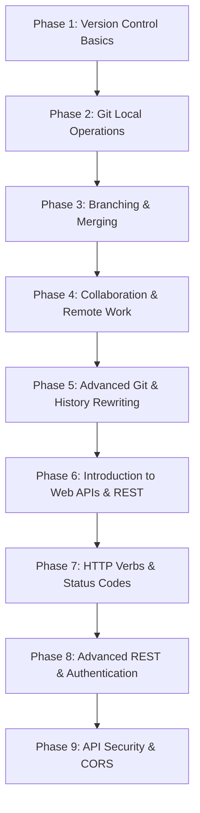
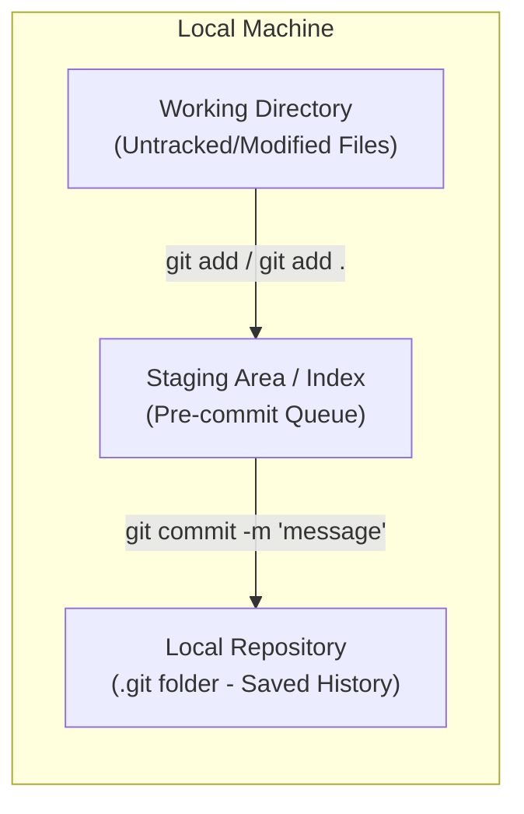
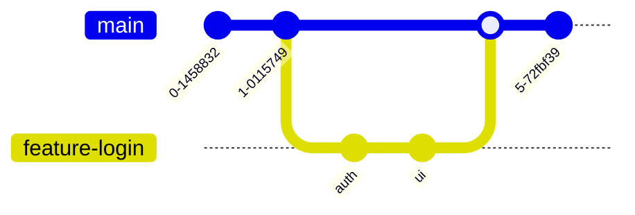
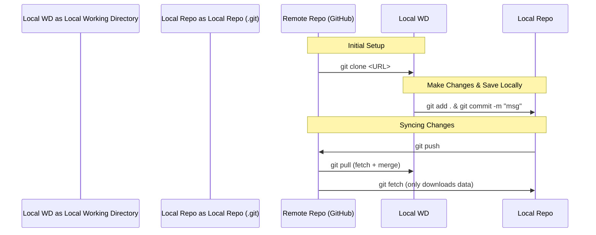
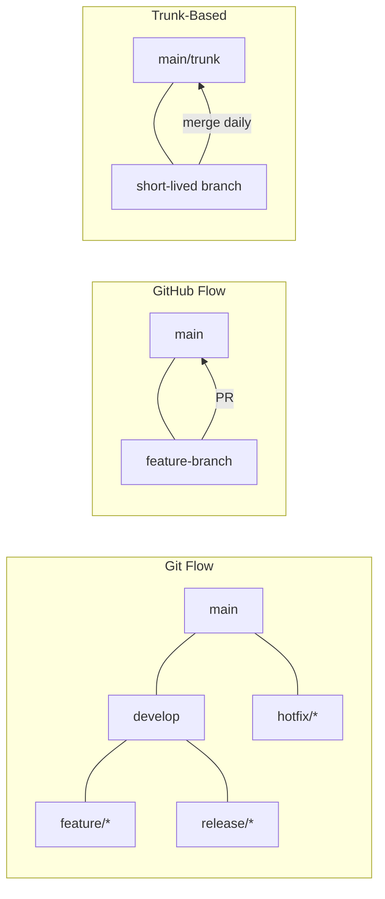
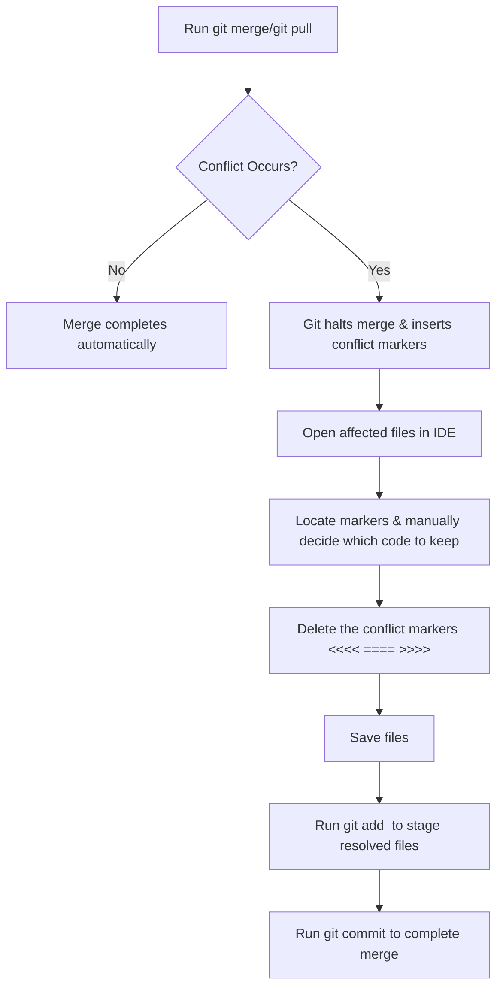
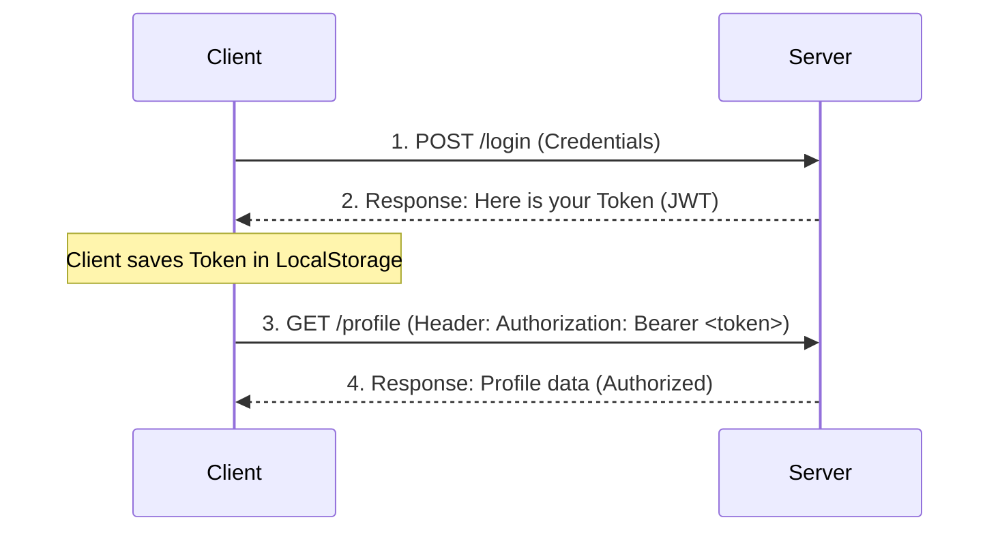

# 📘 THE ULTIMATE GIT, GITHUB & REST API HANDBOOK 📘

---

**Copyright © 2026**
*All rights reserved. This handbook is designed exclusively for placement preparation, technical interviews, and long-term mastery of Git, GitHub, and REST APIs.*

---

## 📖 PREFACE
Welcome to the **Ultimate Git, GitHub & REST API Handbook**. This guide is engineered to take you from a basic understanding to a placement-ready level for technical interviews at top-tier product-based and service-based companies. 

This is **NOT** just a basic command list. This is a comprehensive, topic-wise, point-by-point review guide containing **every single point** from your study notes, organized logically and enhanced with visual Mermaid diagrams, structured comparison tables, warning alerts, and common interview questions.

---

## 🗺️ LEARNING & PLACEMENT ROADMAP



---

## 📑 TABLE OF CONTENTS
- [PART I: INTRODUCTION TO VERSION CONTROL](#-part-i-introduction-to-version-control)
- [PART II: GIT LOCAL REPOSITORY WORKFLOW & OPERATIONS](#-part-ii-git-local-repository-workflow--operations)
- [PART III: BRANCHING & MERGING IN GIT](#-part-iii-branching--merging-in-git)
- [PART IV: COLLABORATION & REMOTE REPOSITORIES](#-part-iv-collaboration--remote-repositories)
- [PART V: UNDOING CHANGES & ADVANCED GIT TECHNIQUES](#-part-v-undoing-changes--advanced-git-techniques)
- [PART VI: INTRODUCTION TO APIS & REST ARCHITECTURE](#-part-vi-introduction-to-apis--rest-architecture)
- [PART VII: HTTP METHODS & STATUS CODES](#-part-vii-http-methods--status-codes)
- [PART VIII: ADVANCED REST API CONCEPTS](#-part-viii-advanced-rest-api-concepts)
- [PART IX: API SECURITY, PERFORMANCE & BEST PRACTICES](#-part-ix-api-security-performance--best-practices)
  - [9.4 GitHub Actions & CI/CD Basics](#94-github-actions--cicd-basics)
- [QUICK REVISION SUMMARIES](#-quick-revision-summaries)
- [FINAL COMMAND CHEAT SHEET](#-final-command-cheat-sheet)
- [TOP 50 PLACEMENT INTERVIEW QUESTIONS & SCENARIOS](#-top-50-placement-interview-questions--scenarios)

---

# 🚀 PART I: INTRODUCTION TO VERSION CONTROL

## 1.1 Fundamental Definitions
* **Version Control System (VCS)**: A system that manages and tracks changes in source code over time, acting as a "time machine" for your codebase. It allows developers to safely rollback to earlier versions and collaborate efficiently.
* **Git**: A free, open-source, local distributed version control software installed on a developer's machine. It tracks and saves your codebase's change history locally without needing an internet connection.
* **GitHub**: A cloud-based hosting platform that stores Git repositories online, enabling teams to share code, collaborate globally, manage projects, and run automation (CI/CD).

## 1.2 Git vs. GitHub Comparison
| Feature | Git | GitHub |
| :--- | :--- | :--- |
| **What is it?** | A local version control command-line software. | A cloud-based hosting platform/web service. |
| **Storage Location** | Local machine (your computer). | Cloud/Remote server (online). |
| **Internet Requirement** | Works completely offline. | Requires internet to push/pull/collaborate. |
| **Core Usage** | Tracking local history, staging, committing. | Global teamwork, code sharing, hosting, PR reviews. |
| **Key Features** | Commits, branching, local merges, diffs. | Issues, Pull Requests, Forking, Actions, Pages. |

## 1.3 Key Version Control Concepts
* **Unstaged Changes**: Modifications made in your local files that Git detects but has not yet queued up (added to the staging area) for the next commit.
* **Staged Changes**: Files that have been explicitly added to the Git index (queue) via `git add`. They are prepared and ready to be saved in the next commit snapshot.
* **Commit**: A saved, immutable snapshot of your staged files at a specific point in time. Each commit has a unique SHA-1 hash ID.
* **HEAD**: A special reference pointer indicating your current location (current branch and commit) in the repository history ("Where am I right now?").
* **.gitignore**: A plain text file placed in your repository root containing file paths or wildcard patterns of files/directories that Git should completely ignore (e.g., node_modules, .env, OS-specific files like .DS_Store, build files).

---

# 💻 PART II: GIT LOCAL REPOSITORY WORKFLOW & OPERATIONS

## 2.1 The Three-Stage Git Workflow
Local development in Git moves files through three logical areas: the Working Directory, the Staging Area, and the Local Repository (.git folder).



## 2.2 Setting Up Git (First-Time Configuration)
* `git config --global user.name "Your Name"`: Sets your identity (name) globally for all repositories on this machine.
* `git config --global user.email "you@example.com"`: Sets your identity (email) globally. This information is embedded in every commit you make.

## 2.3 Core Local Commands
* `git init`: Initializes a brand new, empty local Git repository in the current directory (creates the hidden `.git` folder).
* `git status`: Displays the status of files in your working directory and staging area, showing which files are untracked, modified, or staged.
* `git add <filename>`: Stages changes of a specific file, preparing it for the next commit.
* `git add .`: Stages all modified, new, and deleted files in the current directory and subdirectories.
* `git commit -m "your message"`: Saves a snapshot of all staged changes to the local repository history with a descriptive message.
* `git log`: Displays a detailed, chronological list of commit history, including SHA hashes, author, date, and messages.
* `git log --oneline`: Displays a simplified, compact commit history (first 7 characters of SHA-1 and the commit message).
* `git log --graph --oneline`: Displays a visual, branching graph of the commit history in the terminal.
* `git diff`: Shows exact line-by-line differences between files in the Working Directory and the Staging Area.
* `git blame <filename>`: Shows who last modified each line of a file, along with the commit hash and timestamp. Useful for tracking down who introduced a specific change or bug.

---

# 🌿 PART III: BRANCHING & MERGING IN GIT

## 3.1 Understanding Branches
A **branch** in Git represents an independent line of development. It acts as a pointer to a specific commit. Creating branches allows developers to safely build features or fix bugs in isolation without modifying or breaking the main production code.
By default, Git initializes with a primary branch, historically called `master` and modernly named `main`.



## 3.2 Branching Commands
* `git branch`: Lists all local branches in the repository. The active branch is highlighted with an asterisk (`*`).
* `git branch <branch-name>`: Creates a new branch at the current commit, but does *not* switch to it.
* `git checkout <branch-name>`: Switches your current working directory to the specified branch.
* `git checkout -b <branch-name>`: A shortcut command that creates a new branch and immediately switches to it.
* `git merge <branch-name>`: Merges the history and changes of the specified `<branch-name>` into your active branch.
* `git branch -d <branch-name>`: Deletes the specified branch locally (only if it has already been merged into the main line to prevent data loss).

---

# 🤝 PART IV: COLLABORATION & REMOTE REPOSITORIES

## 4.1 Local vs. Remote Repository Workflow
To collaborate with others, local repositories on developers' machines connect to a remote repository hosted on GitHub.



## 4.2 Collaboration Commands
* `git clone <repository-url>`: Copies an entire existing remote repository (including history, branches, and `.git` files) from GitHub to your local machine.
* `git remote add <name> <url>`: Connects your local repository to a remote repository URL. The default name for the primary remote is usually `origin` (e.g., `git remote add origin <repo-link>`).
* `git remote -v`: Lists all remote connections linked to the local repository, showing their names and URLs (for fetch and push).
* `git push -u <remote-name> <branch-name>`: Pushes local commits to the remote repository. The `-u` (upstream) flag sets tracking, making future pushes or pulls simpler (e.g., `git push -u origin main`).
* `git push`: Pushes local commits to the remote branch (used for subsequent pushes after upstream is set).
* `git push --force origin main`: Force pushes, overwriting the remote history with your local history.
  > [!WARNING]
  > `git push --force` is **DANGEROUS**. It permanently overwrites the remote repository's commit history. Use only when you are absolutely certain no one else has pulled the remote branch, or after a deliberate rebase.
* `git fetch <remote-name>`: Downloads all new branches, commits, and files from the remote repository to your local computer, but **does not merge** or change your local working files. It is a safe "check" command.
* `git pull <remote-name> <branch-name>`: Downloads changes from the remote repository and **immediately merges** them into your current local active branch. (Equivalent to `git fetch` + `git merge`).

## 4.3 Git Fetch vs. Git Pull Comparison
| Command | Action | Local Working Files | Best Use Case |
| :--- | :--- | :--- | :--- |
| **`git fetch`** | Downloads remote changes but does not apply them. | Unchanged. Safe to run anytime. | To check what teammates have done without disrupting your active work. |
| **`git pull`** | Downloads remote changes and merges them immediately. | Automatically updated/modified. | To quickly sync your active branch with the latest changes on GitHub. |

## 4.4 GitHub Collaboration Concepts
* **Forking**: Creating a personal copy of someone else's public repository on your own GitHub account. It allows you to freely experiment and make changes without affecting the original project.
* **Pull Request (PR)**: A request submitted on GitHub to merge your branch's commits into the original repository. It provides a web interface for code review, inline discussions, automated testing checks, and approval before integration.

## 4.5 Git Workflow Models
Teams adopt standardized branching strategies depending on project complexity:

| Workflow | Description | Best For |
| :--- | :--- | :--- |
| **Git Flow** | Uses multiple long-lived branches (`main`, `develop`) and short-lived branches (`feature/*`, `release/*`, `hotfix/*`). Strict and structured. | Large enterprise projects with scheduled releases. |
| **GitHub Flow** | Lightweight. Everything in `main` is always deployable. Create feature branches from `main`, open a PR, review, merge. | Continuous deployment, SaaS products, smaller teams. |
| **Trunk-Based Development** | Developers merge small, frequent updates directly to a core "trunk" (`main`) branch. Feature flags control incomplete work. | High-velocity teams practicing CI/CD. |



## 4.6 GitHub REST API Basics
GitHub provides a REST API that allows you to interact with GitHub resources (repositories, issues, pull requests, users) programmatically.
* **Base URL**: `https://api.github.com`
* **Authentication**: Use Personal Access Tokens (PAT) or OAuth tokens.
  * Header: `Authorization: Bearer <TOKEN>` or `Authorization: token <TOKEN>`
  * Custom API Version Header: `X-GitHub-Api-Version: 2022-11-28`
  * Best Practice Header: `Accept: application/vnd.github+json`
* **Common Endpoints**:
  * `GET /user` — Get authenticated user info.
  * `GET /repos/{owner}/{repo}` — Get repository details.
  * `POST /repos/{owner}/{repo}/issues` — Create a repository issue.
  * `GET /repos/{owner}/{repo}/pulls` — List pull requests.
* **Example cURL Request**:
  ```bash
  curl -L \
    -H "Accept: application/vnd.github+json" \
    -H "Authorization: Bearer YOUR_TOKEN" \
    -H "X-GitHub-Api-Version: 2022-11-28" \
    https://api.github.com/repos/octocat/hello-world
  ```

---

# 🛠️ PART V: UNDOING CHANGES & ADVANCED GIT TECHNIQUES

## 5.1 Undoing Mistakes locally
* `git restore <filename>`: Discards uncommitted changes in your local working directory for a specific file, reverting it to its last committed state.
  * *Legacy Alternative*: `git checkout -- <filename>` (Still widely asked in interviews).
* `git restore --staged <filename>`: Unstages a file, removing it from the pre-commit queue but preserving the modifications in your working directory.
  * *Legacy Alternative*: `git reset HEAD <filename>`.
* `git reset --soft HEAD~1`: Undoes the most recent commit, but keeps the files staged.
  * *Interview Tip*: `HEAD~1` (or `HEAD^`) refers to the immediate parent of the current commit.
* `git reset --mixed HEAD~1` (Default): Undoes the last commit and unstages the changes, keeping all changes intact in your working directory.
* `git reset --hard <commit-hash>`: Resets the current branch to a specific commit, completely discarding all commits, staged changes, and working directory modifications made after that point.
  > [!WARNING]
  > `git reset --hard` is destructive. Any uncommitted changes or un-pushed commits after the target commit will be permanently lost.
* `git revert <commit-hash>`: Creates a brand new commit that applies the exact opposite changes of the specified `<commit-hash>`. This is the safest way to undo a commit that has already been pushed to a public remote repository because it does not alter commit history.

## 5.2 Git Stash
When you need to switch branches or perform a pull but have unfinished, uncommitted work that you don't want to commit, you can "stash" it.
* `git stash` (or `git stash push`): Temporarily shelves (saves) all uncommitted changes (both staged and unstaged) and returns your working directory to a clean state.
* `git stash pop`: Restores the most recently stashed changes to your working directory and deletes that stash from the list.
* `git stash apply`: Restores the stashed changes but keeps the stash saved in the list for reuse.
* `git stash list`: Lists all stashes currently saved in memory.
* `git stash clear`: Permanently deletes all stashed changes in the list.

## 5.3 Advanced Git Operations
* `git cherry-pick <commit-hash>`: Applies the changes introduced by a specific existing commit from another branch directly onto your current active branch.
* `git rebase <branch-name>`: Re-applies the commits of your current branch one by one onto the tip of the specified target branch. It rewrites project history to create a clean, linear sequence of commits.
  > [!CAUTION]
  > **The Golden Rule of Rebasing**: Do not rebase commits that exist outside your local repository (e.g., commits pushed to a public/shared branch). Rebasing rewrites commit IDs, which will cause massive conflicts and confusion for collaborators who have already pulled that history.

## 5.4 Git Merge vs. Git Rebase Detailed Comparison
| Feature | Git Merge | Git Rebase |
| :--- | :--- | :--- |
| **History Structure** | Non-linear: Preserves actual branches and timelines, adding a "merge commit". | Linear: Rewrites history by moving commits to the tip of the target branch. |
| **Commit IDs** | Keeps original commit IDs intact. | Rewrites commit IDs during the re-apply phase. |
| **Safety** | Completely safe: Does not modify existing history. | Dangerous if done on shared/public remote branches. |
| **Conflict Resolution** | Resolves all conflicts at once inside the final merge commit. | Resolves conflicts commit-by-commit as they are applied. |
| **Aesthetics** | Can become messy with complex branching diagrams. | Extremely clean, straight history line. |

## 5.5 Resolving Merge Conflicts
A merge conflict occurs when two different branches modify the exact same line(s) of a file, or when one developer deletes a file that another developer is modifying, and Git cannot automatically determine which version to keep.

### Git Conflict Markers
When a conflict occurs, Git halts the merge and writes markers into the affected files:
```text
<<<<<<< HEAD
Your current active branch changes (e.g., changes on main)
=======
Separator line
>>>>>>> feature-branch
Incoming changes from the branch being merged (e.g., feature-branch)
```

### Step-by-Step Resolution Flowchart


---

# 🌐 PART VI: INTRODUCTION TO APIS & REST ARCHITECTURE

## 6.1 Definitions
* **API (Application Programming Interface)**: A set of defined protocols and rules that allows different software applications to communicate and exchange data with each other.
  * **Real-World Examples**: Frontend talking to Backend, Backend talking to a Database, or Backend talking to a Payment Gateway (like Stripe).
* **REST (Representational State Transfer)**: An architectural design style for building web services. REST APIs use standard HTTP protocols, URLs, headers, and media types (usually JSON) to communicate between clients and servers.
* **Why JSON?**: JSON (JavaScript Object Notation) is lightweight, easy for humans to read, and universally supported by almost all programming languages, making it the perfect format for data exchange in APIs.

## 6.2 Core Constraints & Rules of REST
1. **Client-Server Architecture**: Separation of concerns. The client handles user interface/experience, and the server handles data storage, business logic, and security.
2. **Statelessness**: Every HTTP request sent from the client to the server must contain all the information needed to understand and process it. The server does not store any client context or session state between requests.
3. **Cacheability**: Server responses must define themselves as cacheable or non-cacheable to improve performance and reduce network latency.
4. **Uniform Interface**: 
   * **Use URLs as Nouns**: Endpoints represent resources (nouns) not actions (verbs).
     * Correct: `GET /users`, `POST /books`
     * Incorrect: `GET /getUsers`, `POST /createNewBook`
   * **Use HTTP Methods as Verbs**: Use `GET` to read, `POST` to create, etc.
   * **JSON/XML Representation**: Standard formats that any language can parse.
5. **Layered System**: The client cannot tell whether it is connected directly to the server or through intermediaries (like load balancers, firewalls, caching servers, or API gateways).

---

# 📡 PART VII: HTTP METHODS & STATUS CODES

## 7.1 HTTP Methods (Verbs)
REST APIs use HTTP methods to perform operations on resources (CRUD - Create, Read, Update, Delete).

| Method | CRUD Action | Idempotent? | Safe? | Endpoint Example | Description |
| :--- | :--- | :--- | :--- | :--- | :--- |
| **`GET`** | Read | **Yes** | **Yes** | `GET /users/42` | Fetches details of user 42. Does not alter server state. |
| **`POST`** | Create | **No** | **No** | `POST /users` | Creates a new user. Multiple identical POSTs create duplicate entries. |
| **`PUT`** | Update (Full) | **Yes** | **No** | `PUT /users/42` | Replaces the entire resource 42. Fields omitted in request are reset/cleared. |
| **`PATCH`** | Update (Partial) | **No** | **No** | `PATCH /users/42` | Partially updates fields of user 42 (e.g., updating only email). |
| **`DELETE`** | Delete | **Yes** | **No** | `DELETE /users/42` | Deletes user 42. Calling it multiple times yields the same result. |

> [!NOTE]
> **Safe Methods** are HTTP methods that do not modify database resources (read-only operations like GET, HEAD, OPTIONS).
> **Idempotent Methods** are methods where sending the exact same request multiple times leaves the server in the exact same state (GET, PUT, DELETE, HEAD, OPTIONS).
> **Important Distinction**:
> * POST is **NOT** idempotent. Repeating it creates duplicate entries.
> * PATCH is **NOT** idempotent by default. If your patch contains relative operations (e.g. incrementing a value or appending to a list), repeating the request changes the server state each time.
> * PUT is idempotent because full replacement is a state-overwriting operation. Repeating it results in the same resource state.

## 7.2 PUT vs. PATCH Interview Deep Dive
* **`PUT`**: Used for **full replacement** of a resource. If you send a `PUT` request to `/users/42` with only `{"name": "Rahul"}`, any other existing fields (like `email` or `age`) on that user will be deleted or set to `null` on the server.
* **`PATCH`**: Used for **partial updates**. If you send a `PATCH` request to `/users/42` with `{"email": "rahul@x.com"}`, the server will only update the email address, leaving the user's name and age untouched.

## 7.3 HTTP Request & Response Structure
Every communication between client and server follows a strict payload structure:

```
CLIENT (Request)
  Method + URI + HTTP Version  --->  POST /users/42 HTTP/1.1
  Headers                      --->  Host: api.example.com
                                     Authorization: Bearer abc123
                                     Content-Type: application/json
  Body (Payload)               --->  {"name": "priya", "email": "p@gmail.com"}

SERVER (Response)
  HTTP Version + Status Code   --->  HTTP/1.1 201 Created
  Headers                      --->  Content-Type: application/json
                                     Cache-Control: no-cache
  Body (Payload)               --->  {"id": 42, "name": "priya", "email": "p@gmail.com"}
```

## 7.4 Standard HTTP Status Codes Reference
HTTP status codes are divided into classes: `2xx` (Success), `4xx` (Client/Your Error), `5xx` (Server/Their Error).

| Code | Status Message | Class | When/Why to Use It |
| :--- | :--- | :--- | :--- |
| **`200`** | OK | Success (2xx) | Request succeeded. Standard response for successful `GET`, `PUT`, or `PATCH`. |
| **`201`** | Created | Success (2xx) | Request succeeded and a new resource was successfully created (standard for `POST`). |
| **`204`** | No Content | Success (2xx) | Request succeeded, but there is no data to return in the response body (standard for `DELETE`). |
| **`400`** | Bad Request | Client Error (4xx) | The server cannot process the request due to client error (e.g., malformed JSON syntax, missing required fields). |
| **`401`** | Unauthorized | Client Error (4xx) | The request lacks valid authentication credentials. The user is **unauthenticated** (needs to log in). |
| **`403`** | Forbidden | Client Error (4xx) | The user is authenticated but does not have the necessary permissions/rights to access the resource. |
| **`404`** | Not Found | Client Error (4xx) | The requested resource or URL path does not exist on the server. |
| **`500`** | Internal Server Error | Server Error (5xx) | The server encountered an unexpected condition or bug that prevented it from fulfilling the request (e.g., code crash, DB down). |

---

# 🧠 PART VIII: ADVANCED REST API CONCEPTS

## 8.1 Statelessness in Action
Because REST is stateless, the server does not store session tables in RAM memory. To perform authenticated requests, the client must send authentication credentials (usually a Token) with **every single request** inside the HTTP headers.



## 8.2 JSON Web Tokens (JWT)
A **JWT** is a compact, URL-safe standard used for securely transmitting information between a client and server as a JSON object. It is digitally signed, making it tamper-proof.
A JWT is composed of three parts separated by dots (`.`):
1. **Header**: Specifies the token type (JWT) and signing algorithm (e.g., HS256).
2. **Payload**: Contains the claims (user ID, username, expiration time, roles).
3. **Signature**: Created by signing the encoded header, encoded payload, and a secret key known only to the server. Prevents clients from altering the token.
> [!WARNING]
> **Security Warning**: Standard JWT payloads are Base64Url-encoded, **NOT** encrypted. Anyone can decode a JWT easily (using tools like jwt.io). Therefore, **never** store sensitive user information (like passwords, credit card details, or private keys) in the JWT payload.

## 8.3 Authentication vs. Authorization Interview Q&A
* **Authentication (AuthN)**: Verifying **who** the user is. (e.g., Checking username/password, OTP, or validate login).
  * *Failure Code*: `401 Unauthorized` (Means: "I don't know who you are, please log in").
* **Authorization (AuthZ)**: Verifying **what** the authenticated user is allowed to do. (e.g., checking if an authenticated user has "Admin" permissions to delete a database entry).
  * *Failure Code*: `403 Forbidden` (Means: "I know who you are, but you are not allowed to perform this action").

## 8.4 Stateful vs. Stateless Architecture
* **Stateful**: The server maintains state information about clients in its memory (session variables). Subsequent requests from a client depend on the state stored from previous requests. Scales poorly because session data must be synchronized across multiple server instances.
* **Stateless**: The server stores no client session context. Each request contains all metadata and tokens required to execute. Extremely scalable because any incoming request can be processed by any server instance behind a load balancer.

## 8.5 Synchronous vs. Asynchronous APIs
* **Synchronous API**: A blocking operation. The client sends a request and must wait (block execution) until the server processes the data and returns a response.
  * *Example*: Fetching user profile information.
* **Asynchronous API**: A non-blocking operation. The client sends a request and receives an immediate acknowledgement (like `202 Accepted`). The client can continue other tasks. The actual heavy processing happens in the background, and the server notifies the client when done (via Webhooks, WebSockets, or polling).
  * *Example*: Requesting a long PDF report generation or video encoding.

---

# 🛡️ PART IX: API SECURITY, PERFORMANCE & BEST PRACTICES

## 9.1 Rate Limiting
* **Definition**: A traffic control mechanism that restricts the maximum number of API requests a user can make within a specified time window (e.g., maximum 100 requests per minute per IP address).
* **Purpose**:
  1. Protects the API from overloading, denial of service (DoS/DDoS) attacks, or brute-force attempts.
  2. Ensures system availability and fairness for all users (prevents single-user resource hogging).
  * *Response on Limit Exceeded*: `429 Too Many Requests`.

## 9.2 API Versioning
To make updates and improvements to your API without breaking existing client integrations, you must version your API.
Common API versioning practices:
1. **URI Versioning (Most Popular)**: Putting version inside URL path.
   * Example: `https://api.example.com/v1/users`
2. **Query Parameter Versioning**: Specifying version in queries.
   * Example: `https://api.example.com/users?version=1`
3. **Header Versioning (Custom Header)**: Specifying version in request headers.
   * Example: `X-API-Version: 2` or via Accept Header: `Accept: application/vnd.company.v2+json`

## 9.3 CORS (Cross-Origin Resource Sharing)
* **What is it?** A browser-enforced security mechanism that prevents web applications running on one domain (origin) from making HTTP requests to a backend API running on a different domain.
* **Why it exists**: To prevent malicious websites from executing cross-site request forgery attacks (CSRF) on your logged-in API sessions.
* **How it works**: By default, browsers block cross-origin requests. To allow them, the backend server must explicitly send headers (e.g., `Access-Control-Allow-Origin: *` or `Access-Control-Allow-Origin: https://myfrontend.com`) specifying which origins are permitted to access the API.
* **CORS Preflight Requests**:
  * For "non-simple" requests (e.g. requests with `application/json` content type, or custom headers), the browser sends an automatic preflight request using the HTTP **`OPTIONS`** method before sending the actual request.
  * The server must respond to this preflight request with appropriate CORS headers (`Access-Control-Allow-Methods`, `Access-Control-Allow-Headers`, `Access-Control-Allow-Origin`) to signal approval. If approved, the browser proceeds with the original request.

## 9.4 GitHub Actions & CI/CD Basics
* **GitHub Actions**: A workflow automation platform integrated directly into GitHub, allowing you to build, test, and deploy code directly from your repository.
* **Core Concepts**:
  * **Workflow**: A configurable automated process defined in a YAML file under `.github/workflows/`.
  * **Event**: A specific activity that triggers a workflow (e.g. `push`, `pull_request`, `release`).
  * **Job**: A set of steps that execute on the same runner (virtual machine or container). Jobs run in parallel by default but can be run sequentially.
  * **Step**: An individual task that runs commands or actions.
  * **Action**: Reusable, packaged extension/application for workflows (e.g. `actions/checkout@v4`).
  * **Runner**: A server hosted by GitHub or self-hosted that runs the workflow jobs.

---

# ⚡ QUICK REVISION SUMMARIES

## Git Quick Revision
```
Init Flow:      git init  →  git add .  →  git commit -m "Msg"
Link to Remote: git remote add origin <url>  →  git push -u origin main
Daily Flow:     git add .  →  git commit -m "update"  →  git push
Branching:      Protects main code. Always create a branch for new features.
Merge Conflicts: Happen when two people edit the same line. Requires manual resolution.
```

## REST API Quick Revision
```
REST:         Architectural style using URLs (nouns) and HTTP methods (verbs).
Methods:      GET (Read), POST (Create), PUT (Replace), PATCH (Update), DELETE (Remove).
Status Codes: 2xx (Success), 4xx (Client Error), 5xx (Server Error).
Idempotency:  Safe to repeat: GET, PUT, DELETE. POST is NOT idempotent.
Stateless:    Server forgets you after each request; send your token every time.
```

---

# 📋 FINAL COMMAND CHEAT SHEET

## Git Core Commands
| Action | Command |
| :--- | :--- |
| Set global name | `git config --global user.name "Your Name"` |
| Set global email | `git config --global user.email "you@example.com"` |
| Initialize repo | `git init` |
| Clone repo | `git clone <url>` |
| Check status | `git status` |
| Stage all changes | `git add .` |
| Stage specific file | `git add <filename>` |
| Commit changes | `git commit -m "msg"` |
| View history | `git log --oneline` |
| View visual history | `git log --graph --oneline` |
| See differences | `git diff` |
| Find who wrote a line | `git blame <filename>` |
| Discard local changes | `git restore <filename>` |
| Unstage a file | `git restore --staged <filename>` |
| Undo last commit (keep staged) | `git reset --soft HEAD~1` |
| Undo last commit (unstage) | `git reset --mixed HEAD~1` |
| Revert a commit safely | `git revert <commit-id>` |
| Stash uncommitted work | `git stash` |
| Restore stash & remove | `git stash pop` |
| Restore stash & keep | `git stash apply` |

## Git Branching & Remote
| Action | Command |
| :--- | :--- |
| List branches | `git branch` |
| Create & switch branch | `git checkout -b <name>` |
| Switch branch | `git checkout <name>` |
| Merge branch | `git merge <name>` |
| Delete branch | `git branch -d <name>` |
| Add remote | `git remote add origin <url>` |
| Verify remote | `git remote -v` |
| Push code (first time) | `git push -u origin main` |
| Push code (subsequent) | `git push` |
| Pull code | `git pull origin main` |
| Fetch data only | `git fetch` |
| Force push (DANGEROUS) | `git push --force origin main` |
| Cherry-pick a commit | `git cherry-pick <commit-hash>` |
| Rebase onto branch | `git rebase <branch-name>` |

---

# 💡 TOP 50 PLACEMENT INTERVIEW QUESTIONS & SCENARIOS

## 🔧 Git & GitHub Questions

### Q1: What is a commit in Git?
> **Answer**: A commit is a saved snapshot of your project files at a specific point in time. Each commit has a unique SHA-1 hash ID, an author, a timestamp, and a message describing the change. Commits form a linked chain (directed acyclic graph) that represents the complete history of your project.

### Q2: What is the difference between `git add` and `git commit`?
> **Answer**: `git add` moves changes from the Working Directory to the Staging Area (index), preparing them for the next commit. `git commit` takes everything currently in the Staging Area and saves it as an immutable snapshot in the Local Repository. They are two separate steps: stage first, then commit.

### Q3: What is a detached HEAD state in Git, and how do you fix it?
> **Answer**: A detached HEAD state occurs when your HEAD pointer references a specific commit directly rather than a local branch name. This happens when you run `git checkout <commit-hash>`. Any new commits made in this state are orphans and won't belong to any branch.
> **How to Fix**: To save your changes, create a new branch from this commit immediately using `git checkout -b <new-branch-name>`. To discard the changes, simply checkout back to your main branch: `git checkout main`.

### Q4: What is `git reflog` and when would you use it?
> **Answer**: `git reflog` (reference log) is a local command that records every single action you take in your Git repository (branch switches, commits, resets, rebases, merges). It tracks where HEAD has pointed.
> **Use Case**: It is a lifesaver for recovering deleted commits or branches. Even if you run `git reset --hard` or delete a branch, the commit history is still in reflog for a period of time (typically 30-90 days). You can find the commit hash before the deletion and run `git checkout <hash>` to recover it.

### Q5: What is a squash merge in Git?
> **Answer**: A squash merge takes all the commits made on a feature branch, combines (squashes) them into a single, clean commit, and applies it to the target branch (e.g., main). It keeps the main branch history clean and simple, removing feature branch noise like "fixed typo" commits.
> **Command**: `git merge --squash feature-branch` followed by `git commit -m "feature complete"`.

### Q6: What is a merge conflict, and how do you resolve it?
> **Answer**: A conflict occurs when Git cannot automatically merge changes (e.g., two people modifying the same line). To resolve it:
> 1. Open the conflicted files.
> 2. Look for markers `<<<<<<<`, `=======`, and `>>>>>>>`.
> 3. Manually edit the file to keep the correct code, remove the markers.
> 4. Stage with `git add` and complete with `git commit`.

### Q7: What is the difference between `git reset --soft`, `--mixed`, and `--hard`?
> **Answer**:
> * `--soft`: Undoes the commit; changes remain in the **Staging Area** (ready to recommit).
> * `--mixed` (default): Undoes the commit and unstages changes; files are kept in the **Working Directory**.
> * `--hard`: Undoes the commit, unstages changes, and **completely deletes** all modifications from your working directory. This is destructive and cannot be easily recovered.

### Q8: Git Merge vs. Git Rebase?
> **Answer**: Merge preserves exactly what happened and when, creating a "merge commit". It is safe and does not alter existing commits. Rebase rewrites history by applying commits one by one onto another branch, giving a straight, linear history. It rewrites commit IDs, which can be dangerous if others have already pulled the branch.
> **Rule of Thumb**: Use merge for shared/public branches. Use rebase for cleaning up local branches before pushing.

### Q9: What is `git stash` and when do you use it?
> **Answer**: `git stash` temporarily shelves uncommitted changes (both staged and unstaged) so you can work on something else (e.g., switch branches, pull code) without committing half-done work. Use `git stash pop` to restore and remove the stash, or `git stash apply` to restore but keep the stash saved.

### Q10: What is `git cherry-pick`?
> **Answer**: `git cherry-pick <commit-hash>` applies the changes from a single specific commit on one branch onto your current branch. It is useful when you need a particular bug fix from another branch without merging the entire branch.

### Q11: What is the difference between `git pull` and `git fetch`?
> **Answer**: `git fetch` downloads new data from the remote but does NOT change your local working files — it is safe and lets you review changes. `git pull` is `git fetch` + `git merge`: it downloads AND automatically merges remote changes into your current branch, which may cause conflicts.

### Q12: What is `git blame` and when would you use it?
> **Answer**: `git blame <filename>` shows a line-by-line annotation of a file, displaying who last modified each line, the commit hash, and timestamp. It is used to trace who introduced a bug or a specific change in the codebase.

### Q13: What is the difference between Forking and Cloning?
> **Answer**: **Cloning** (`git clone`) creates a local copy of a repository on your machine — it links back to the original remote. **Forking** creates a personal copy of someone else's repository on your own GitHub account — it is an entirely independent copy you can modify freely and later submit a Pull Request to the original repo.

### Q14: What are Git Workflow Models? Name three.
> **Answer**:
> 1. **Git Flow**: Structured workflow with `main`, `develop`, `feature/*`, `release/*`, and `hotfix/*` branches. Best for large teams with scheduled releases.
> 2. **GitHub Flow**: Lightweight — branch from `main`, open a PR, review, merge. Everything in `main` is always deployable.
> 3. **Trunk-Based Development**: Developers merge small, frequent updates directly to `main`. Feature flags control incomplete work.

### Q15: You accidentally committed sensitive data (API key) to Git. What do you do?
> **Answer**:
> 1. Immediately rotate/revoke the exposed API key.
> 2. Remove the file from tracking: `git rm --cached <filename>` and add it to `.gitignore`.
> 3. Use `git filter-branch` or `BFG Repo Cleaner` to rewrite history and purge the sensitive data from all commits.
> 4. Force push: `git push --force`.
> 5. Notify your team since force push rewrites history.

### Q16: What is the difference between `git checkout`, `git switch`, and `git restore`?
> **Answer**: In Git version 2.23, `git checkout` was split into two new commands to avoid confusion over its overloaded responsibilities:
> * `git switch` is used exclusively for switching branches (e.g. `git switch feature-branch` or creating one with `git switch -c new-branch`).
> * `git restore` is used exclusively for restoring files in the working directory or staging area (e.g. `git restore filename.txt` or `git restore --staged filename.txt`).
> * `git checkout` is still supported for backwards compatibility, but using `git switch` and `git restore` is the modern, recommended practice.

### Q17: How does Git store objects internally? What are blobs, trees, commits, and tags?
> **Answer**: Git is content-addressable storage. It stores history inside the `.git/objects/` folder using 4 main types of objects, compressed with zlib and identified by 40-character SHA-1 hashes:
> 1. **Blob (Binary Large Object)**: Stores file contents only (no metadata like file name, permissions, or path).
> 2. **Tree**: Represents a directory. It contains pointers to blobs (files) and other nested trees (subdirectories), along with their filenames and permissions.
> 3. **Commit**: Contains a pointer to a root tree object (representing the state of the repo at that moment), pointers to parent commits (history), commit author, committer, date, and commit message.
> 4. **Tag**: A permanent reference pointing to a specific commit, often used for releases (e.g., v1.0.0).

### Q18: What is a fast-forward merge vs. a three-way merge?
> **Answer**:
> * **Fast-Forward Merge**: Occurs when the target branch has not diverged since you branched off. Git simply moves the target branch pointer forward to point to the source branch's latest commit. No new merge commit is created.
> * **Three-Way Merge**: Occurs when the target branch has received new commits since you branched off. Git looks at the tip of both branches and their common ancestor (the merge base) to compute changes and create a new "merge commit".

### Q19: What is the purpose of the staging area (index) in Git?
> **Answer**: The Staging Area is a preparation buffer between the working directory and the repository history. It allows you to build clean, modular, and logical commits. You can edit multiple files, stage only a subset of them (or even specific lines using `git add -p`), write a commit message for those changes, and then stage the rest later. It acts as a draft area before finalizing the snapshot.

### Q20: How do you delete a branch locally and on the remote repository?
> **Answer**:
> * **Delete Local Branch**: `git branch -d <branch-name>` (safe delete; fails if branch isn't merged yet) or `git branch -D <branch-name>` (force delete).
> * **Delete Remote Branch**: `git push origin --delete <branch-name>` (this instructs the remote server to delete its branch reference).

### Q21: What are Git Hooks and what can they be used for?
> **Answer**: Git Hooks are custom scripts that run automatically at specific milestones in the Git lifecycle (e.g. before a commit, after a merge, before a push). They are located in the `.git/hooks/` directory.
> * **Common Use Cases**:
>   * `pre-commit`: Runs linters, tests, or credentials scanners to block commits with bad formatting or exposed secrets.
>   * `commit-msg`: Validates that the commit message conforms to team standards (e.g. Conventional Commits).
>   * `pre-push`: Runs full integration tests before uploading code to the remote.

### Q22: What is the difference between HEAD, index, and working directory?
> **Answer**: These are the "Three Trees" of Git architecture:
> 1. **Working Directory**: The actual files you see and edit on your computer's filesystem.
> 2. **Index (Staging Area)**: The binary cache representing the proposed next commit snapshot.
> 3. **HEAD**: The pointer indicating the commit snapshot that is currently checked out, representing the last state of your active branch.

### Q23: How do you rename a branch locally and on remote?
> **Answer**:
> * **Rename Local**: `git branch -m <new-name>` (renames the current active branch) or `git branch -m <old-name> <new-name>`.
> * **Rename Remote**:
>   1. Push the new branch and set upstream: `git push origin -u <new-name>`
>   2. Delete the old remote branch: `git push origin --delete <old-name>`

### Q24: What is `git clean`?
> **Answer**: `git clean` is a command used to remove untracked files from the local working directory.
> * `git clean -n` performs a dry run (shows what would be deleted).
> * `git clean -f` deletes untracked files.
> * `git clean -fd` deletes both untracked files and untracked directories.

### Q25: What is the difference between `HEAD~` and `HEAD^`?
> **Answer**:
> * **`HEAD~` (or `HEAD~1`)**: References the first parent commit in a linear history. `HEAD~2` references the grandparent commit (2 levels back in a straight line).
> * **`HEAD^` (or `HEAD^1`)**: References the first parent commit of a merge commit. `HEAD^2` references the second parent commit (the branch that was merged in).
> * In linear histories with no merges, `HEAD~1` and `HEAD^1` are identical.

### Q26: What are git submodules?
> **Answer**: Git submodules allow you to keep another separate Git repository embedded as a subdirectory inside your main Git repository. This allows you to clone another project into your repository while keeping your commits separate.
> * **Commands**: `git submodule add <repo-url>` to add, and `git submodule update --init --recursive` to initialize and download after cloning a parent repository.

### Q27: How do you write a good commit message?
> **Answer**: A standard professional commit message format:
> 1. Use the imperative mood in the subject line (e.g., "Fix auth token refresh" not "Fixed auth token refresh").
> 2. Limit the subject line to 50 characters.
> 3. Capitalize the subject line and do not end it with a period.
> 4. Separate subject from body with a blank line.
> 5. Explains *what* changes were made and *why* (not *how*).

---

## 🌐 REST API Questions

### Q28: Why do we use JSON in REST APIs?
> **Answer**: JSON (JavaScript Object Notation) is lightweight, easy for humans to read and write, and universally supported by almost all programming languages. This makes it the perfect format for structured data exchange between different systems.

### Q29: Why is POST considered non-idempotent, while PUT and DELETE are idempotent?
> **Answer**:
> * **POST** is non-idempotent because if you send `POST /users` with user details 5 times, the server will create 5 separate user records in the database with 5 unique IDs.
> * **PUT** is idempotent because if you send `PUT /users/42` with details `{"name": "Alice"}`, the first request updates user 42 to Alice. The next 4 requests perform the exact same replace action on user 42, leaving the database in the identical final state.
> * **DELETE** is idempotent because deleting user 42 once removes them. Deleting user 42 ten more times will return a `404 Not Found`, but the resource is still deleted — the end state of the server is unchanged.

### Q30: What is the difference between PUT and PATCH?
> **Answer**: PUT replaces the **entire** resource. If you omit fields, they might be set to null. PATCH only updates the **specific fields** you send, leaving the rest of the resource intact. Example: `PUT /users/42` with `{"name": "Rahul"}` clears the email field. `PATCH /users/42` with `{"name": "Rahul"}` keeps the email unchanged.

### Q31: What does it mean for a REST API to be stateless?
> **Answer**: Statelessness means the server does not store any information about the client session. Every request must be fully self-contained, including all necessary context, parameters, and security tokens (like a JWT in the `Authorization` header). The server "forgets" you after each request. This enables horizontal scaling because any server instance can handle any request.

### Q32: Explain the structure of JWT. How does the server verify its authenticity?
> **Answer**: A JWT consists of three parts separated by dots: **Header** (algorithm + token type), **Payload** (claims like user ID, expiry), and **Signature** (`HMAC(base64(Header) + "." + base64(Payload), ServerSecretKey)`).
> **Verification**: When the client sends the JWT in a header, the server re-signs the Header and Payload using its secret key and compares it with the signature in the token. If they match, the token is authentic and has not been tampered with. This avoids database lookups for session validation.

### Q33: Scenario: A user gets a `401 Unauthorized` sometimes and `403 Forbidden` other times. What is the difference?
> **Answer**:
> * `401 Unauthorized` is an **Authentication** failure. The client has not provided credentials, or their token has expired. They must log in.
> * `403 Forbidden` is an **Authorization** failure. The client is successfully logged in, but their user role (e.g., "User") does not have permission to access that specific endpoint (e.g., deleting another user's profile, which requires "Admin").

### Q34: What is CORS, and how do you resolve a CORS error?
> **Answer**: Cross-Origin Resource Sharing is a browser-enforced security feature that blocks web applications running on one domain from making requests to a different domain's API.
> **How to Resolve**: Configure your backend server to send the `Access-Control-Allow-Origin` header set to the domain of your frontend (e.g., `http://localhost:3000`). You can also allow specific HTTP methods and headers using `Access-Control-Allow-Methods` and `Access-Control-Allow-Headers`.

### Q35: What is Rate Limiting? Why is it important?
> **Answer**: Rate Limiting is a control mechanism that restricts the maximum number of API requests a user can make within a time window (e.g., 100 requests/minute). It protects the API from overloading, DoS attacks, and brute-force attempts. When exceeded, the server responds with `429 Too Many Requests`.

### Q36: What is API Versioning? Why do we need it?
> **Answer**: API Versioning allows you to make breaking changes or improvements to your API without disrupting existing client integrations. Common strategies:
> 1. **URI**: `https://api.example.com/v1/users` (most popular)
> 2. **Query Param**: `https://api.example.com/users?version=1`
> 3. **Header**: `Accept: application/vnd.company.v2+json`

### Q37: Explain the difference between Synchronous and Asynchronous APIs.
> **Answer**:
> * **Synchronous**: The client sends a request and **waits (blocks)** until the server responds. Suitable for fast, simple operations like fetching a user profile.
> * **Asynchronous**: The client sends a request and receives an **immediate acknowledgement** (e.g., `202 Accepted`). The server processes in the background and notifies the client when done (via Webhooks, WebSockets, or polling). Suitable for heavy operations like PDF generation, video encoding, or batch processing.

### Q38: What is content negotiation in REST APIs?
> **Answer**: Content Negotiation is the mechanism that allows a client and server to agree on the format of the data transmitted.
> * **Request**: The client sends the `Accept` header indicating what formats it can parse (e.g. `Accept: application/json, text/plain`).
> * **Response**: The server processes the request and formats the response, returning a `Content-Type` header indicating what format was used (e.g. `Content-Type: application/json`).

### Q39: What is the difference between Query Parameters, Path Parameters, and Request Body?
> **Answer**:
> * **Path Parameters**: Part of the URL path used to identify a specific resource.
>   * *Example*: `/users/{id}` $\rightarrow$ `/users/42` (Identifies user 42).
> * **Query Parameters**: Key-value pairs appended after the `?` in the URL used to filter, sort, search, or paginate resources.
>   * *Example*: `/users?status=active&sort=desc` (Filters active users, sorted).
> * **Request Body**: The main payload containing complex data, typically in JSON format, sent with POST, PUT, or PATCH requests.
>   * *Example*: Send `{"name": "Alice", "role": "admin"}` to create a user.

### Q40: What is pagination? What are the two main strategies in APIs?
> **Answer**: Pagination is the process of splitting a large dataset response into smaller, manageable chunks (pages) to optimize database query performance and response payloads.
> * **1. Offset-Based Pagination**: Uses `limit` (page size) and `offset` (skip count).
>   * *Pros*: Easy to implement, allows jumping to arbitrary pages.
>   * *Cons*: Performs slowly on very large offsets; prone to duplicate or skipped items if records are added/deleted between requests.
> * **2. Cursor-Based (Keyset) Pagination**: Uses a pointer (cursor/encoded ID) pointing to the last item fetched.
>   * *Pros*: Highly performant on large datasets; consistent and immune to real-time additions/deletions.
>   * *Cons*: Cannot jump to a specific page number; complex to implement.

### Q41: Explain the concept of CORS Preflight request. What HTTP method does it use?
> **Answer**: A CORS Preflight request is a security check automatically initiated by the browser before sending a "non-simple" cross-origin HTTP request (like a POST with a JSON body).
> * **Mechanism**: The browser sends an HTTP **`OPTIONS`** request containing headers like `Access-Control-Request-Method` and `Access-Control-Request-Headers`.
> * **Server Response**: The server must reply with headers indicating if the origin, method, and headers are allowed. If the server permits it, the browser sends the actual request. If not, the browser blocks the request and throws a CORS error.

### Q42: What is the difference between REST and SOAP?
> **Answer**:
> * **REST**: An architectural design style based on standard HTTP. It is lightweight, flexible, stateless, and typically uses JSON. Highly scalable and widely used in modern web and mobile apps.
> * **SOAP (Simple Object Access Protocol)**: A strict, XML-based protocol. It has built-in security standards (WS-Security), ACID transaction support, and strict contract definitions (WSDL). It is heavier and used heavily in legacy enterprise applications, banking, and financial services.

### Q43: How do you handle exceptions and return standard error responses in REST?
> **Answer**: Best practices include:
> 1. Use appropriate HTTP status codes (4xx/5xx) to signify the error type.
> 2. Avoid exposing internal stack traces or database details to the client (to prevent security leaks).
> 3. Return a consistent JSON error schema (such as the RFC 7807 standard) containing details like:
>    ```json
>    {
>      "type": "https://api.example.com/errors/invalid-input",
>      "title": "Invalid Request Data",
>      "status": 400,
>      "detail": "The email address provided is already registered.",
>      "timestamp": "2026-06-05T18:00:00Z"
>    }
>    ```

### Q44: What are the common headers for security and performance in REST APIs?
> **Answer**:
> * **Security Headers**:
>   * `Authorization`: Passes auth credentials (e.g. `Bearer <JWT>`).
>   * `Content-Security-Policy (CSP)`: Protects against XSS attacks.
>   * `Strict-Transport-Security (HSTS)`: Enforces HTTPS connections.
> * **Performance & Cache Headers**:
>   * `Cache-Control`: Instructs client/proxies on how to cache responses (e.g., `no-cache`, `max-age=3600`).
>   * `ETag`: Unique validator token for cache revalidation.
> * **Rate-Limiting Headers**:
>   * `X-RateLimit-Limit`, `X-RateLimit-Remaining`, `X-RateLimit-Reset`.

### Q45: What is SSL/TLS and HTTPS, and how does it protect APIs?
> **Answer**: HTTPS (Hypertext Transfer Protocol Secure) encrypts all communication between the client and the server using SSL/TLS protocols.
> * **Protection**:
>   1. **Encryption**: Prevents eavesdropping (Man-in-the-Middle attacks). Sensitive data like passwords, JWTs, and request payloads cannot be read in transit.
>   2. **Data Integrity**: Prevents headers or payloads from being tampered with during transmission.
>   3. **Authentication**: Uses SSL certificates to verify the server's identity, ensuring clients connect to the correct server.

### Q46: How do you implement Token Revocation in a Stateless JWT architecture?
> **Answer**: Since JWTs are stateless, they cannot be easily revoked before expiration. To handle sign-outs or compromise, teams use:
> 1. **Short-Lived Access Tokens & Long-Lived Refresh Tokens**: Access tokens expire in 10-15 minutes. Refresh tokens are stored in the database. When signing out, delete the refresh token from the database.
> 2. **Denylist / Blacklist Cache**: Store revoked access tokens in a fast in-memory database (like Redis) with a Time-To-Live (TTL) equal to the remaining token lifetime. On every request, check if the token exists in the denylist cache.

### Q47: What is API Gateway Pattern?
> **Answer**: An API Gateway is an architectural pattern that acts as a single entry point for all client requests in a microservices ecosystem. It is responsible for:
> * Routing requests to appropriate microservices.
> * SSL termination and encryption.
> * Authentication and Authorization verification.
> * Centralized Rate Limiting and Logging.
> * Load balancing and service discovery.

### Q48: What is HATEOAS in REST?
> **Answer**: HATEOAS (Hypermedia As the Engine Of Application State) is a constraint of REST. It means that the API server provides hypermedia links (URLs) in its responses, dynamically guiding the client on what actions are possible next.
> * *Example Response*:
>   ```json
>   {
>     "account_id": 12345,
>     "balance": 100.00,
>     "links": [
>       { "rel": "self", "href": "/accounts/12345", "method": "GET" },
>       { "rel": "deposit", "href": "/accounts/12345/deposit", "method": "POST" },
>       { "rel": "withdraw", "href": "/accounts/12345/withdraw", "method": "POST" }
>     ]
>   }
>   ```

### Q49: Explain URI versioning vs. Query Parameter versioning vs. Header versioning.
> **Answer**:
> * **URI versioning**: `https://api.example.com/v1/users`. Easy to inspect and cache, but requires updating links on client side for every version bump.
> * **Query Parameter versioning**: `https://api.example.com/users?version=1`. Simple and backward-compatible, but can clutter URL query parsing.
> * **Header versioning**: `Accept: application/vnd.company.v1+json` or `X-API-Version: 1`. Keeps URLs clean and elegant, but harder to test in browsers and harder to cache behind CDNs.

### Q50: How do you prevent SQL Injection, XSS, and CSRF in REST APIs?
> **Answer**:
> * **SQL Injection**: Use parameterized queries (Prepared Statements) or an ORM (Hibernate, Prisma) instead of raw string concatenation.
> * **XSS (Cross-Site Scripting)**: Sanitize and encode all input data, implement a strong Content Security Policy (CSP) header, and use browser attributes like `HttpOnly` on sensitive authentication cookies.
> * **CSRF (Cross-Site Request Forgery)**: Use stateless token auth (JWT in headers rather than cookies) so browsers don't automatically attach authorization info. If cookies are used, set `SameSite=Strict` or use CSRF tokens.

