# 📘 THE ULTIMATE JAVA PLACEMENT REVIEW FILE 📘

---

**Copyright © 2026**
*All rights reserved. This handbook is designed exclusively for placement preparation, technical interviews, and long-term mastery of Java.*

---

## 📖 PREFACE

Welcome to the **Ultimate Java Placement Review File**. This handbook is engineered to take you from a beginner to a placement-ready Software Engineer. Whether you are preparing for service-based MNCs (TCS, Infosys, Cognizant, Wipro) or product-based giants (Amazon, Microsoft, Adobe, Oracle), this guide is your final destination. 

This is **NOT** a summary. This is a complete, A-to-Z professional review handbook. We strictly follow a 15-point analysis for *every single topic* to ensure absolutely no detail is left out.

---

## 🎯 HOW TO USE THIS REVIEW FILE

1. **Sequential Reading**: If you are a beginner, read from Part I to Part XXII in order.
2. **Interview Prep**: Jump directly to **Part XVIII (Interview Master Section)** and **Part XXII (Company Preparation)**.
3. **Quick Revision**: Utilize the **Cheat Sheets (Part XX)** and **Final Revision Section** 1-3 days before the interview.
4. **Deep Dives**: Pay special attention to the **Internal Working**, **Dry Run**, and **Memory Diagram** sections for core concepts like Strings, OOPs, and Collections.

---

## 🗺️ LEARNING & PLACEMENT ROADMAP

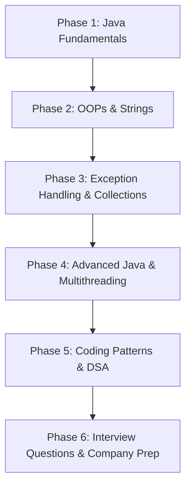

---

## 📑 TABLE OF CONTENTS

- **PART I**: JAVA FUNDAMENTALS
- **PART II**: STRINGS
- **PART III**: ARRAYS
- **PART IV**: METHODS
- **PART V**: OBJECT ORIENTED PROGRAMMING (OOP)
- **PART VI**: ACCESS MODIFIERS
- **PART VII**: PACKAGES
- **PART VIII**: EXCEPTION HANDLING
- **PART IX**: COLLECTIONS FRAMEWORK
- **PART X**: GENERICS
- **PART XI**: MULTITHREADING
- **PART XII**: FILE HANDLING
- **PART XIII**: JAVA 8+ FEATURES
- **PART XIV**: INTERFACES AND ABSTRACT CLASSES
- **PART XV**: INNER CLASSES AND ENUMS
- **PART XVI**: ANNOTATIONS AND REFLECTION
- **PART XVII**: DESIGN PATTERNS
- **PART XVIII**: JDBC AND DATABASE CONNECTIVITY
- **PART XIX**: JAVA MEMORY MANAGEMENT AND GARBAGE COLLECTION
- **PART XX**: MODERN JAVA FEATURES (JAVA 9–21)
- **PART XXI**: CODING PATTERNS FOR INTERVIEWS
- **PART XXII**: APPENDICES (Keywords, Complexity, Top 50 Interview Questions)
- **PART XXIII**: INTERVIEW MASTER SECTION (TOP 200 QUESTIONS)
- **PART XXIV**: JAVA CHEAT SHEETS
- **PART XXV**: COMMON MISTAKES
- **PART XXVI**: COMPANY PREPARATION
- **PART XXVII**: FINAL REVISION & REFERENCE


====================================================================

# 🚀 PART I: JAVA FUNDAMENTALS

## 1.1 Java Basics: Introduction, History, Features, Why Java, and Editions

### 1. Definition
**Java** is a high-level, robust, object-oriented, and secure programming language designed to have as few implementation dependencies as possible. 

### 2. Why It Exists
Java was created to solve the platform dependency issue present in C/C++. Developers needed a way to write code on one OS (like Windows) and run it on another (like Linux or Solaris) without rewriting or recompiling. This birthed the **WORA** (Write Once, Run Anywhere) philosophy.

### 3. Internal Working
Unlike C++, which compiles directly to machine code, Java compiles code (`.java`) into an intermediate, platform-independent format called **Bytecode** (`.class`). When the program is executed, the JVM (Java Virtual Machine) on the specific host operating system translates this bytecode into machine-specific native code.

### 4. Architecture
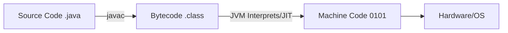

### 5. Syntax
```java
public class HelloWorld {
    public static void main(String[] args) {
        System.out.println("Hello, Placement!");
    }
}
```

### 6. Example
The above syntax is the classic "Hello World" example, demonstrating class declaration and the main method entry point.

### 7. Dry Run
1. `javac HelloWorld.java` is executed in the terminal.
2. The compiler checks for syntax errors. If clean, it generates `HelloWorld.class`.
3. `java HelloWorld` is executed.
4. The JVM loads the class, finds the `public static void main` method, and begins execution.
5. `System.out` stream outputs the string to the console.

### 8. Real World Example
- **Android Apps**: Historically written natively in Java.
- **Enterprise Web Apps**: Banking systems use Java Spring Boot for high-security transactions.
- **Big Data**: Hadoop and Apache Spark core systems are built with Java/Scala.

### 9. Advantages
- **Platform Independent**: Can run on any OS with a JVM.
- **Object-Oriented**: Promotes clean, modular, and reusable code.
- **Automatic Garbage Collection**: Eliminates manual memory allocation/deallocation (no `malloc`/`free`).
- **Multithreading**: Built-in support for concurrent execution.

### 10. Disadvantages
- **Performance**: Slower than native C++ because of the JVM interpretation overhead.
- **Memory Consumption**: The JVM itself requires a significant chunk of memory to run.
- **Verbose**: Requires boilerplate code compared to modern languages like Python.

### 11. Interview Questions
> [!NOTE] 
> **Q1: What are the main features of Java?**
> A: Simple, Object-Oriented, Portable, Platform Independent, Secured, Robust, Architecture Neutral, Interpreted, High Performance (via JIT), Multithreaded, Distributed.
> 
> **Q2: Differentiate between Java SE, Java EE, and Java ME.**
> A: 
> - **Java SE (Standard Edition)**: Core Java used for desktop apps.
> - **Java EE (Enterprise Edition)**: Used for web and enterprise-level applications (Servlets, JSP, EJB).
> - **Java ME (Micro Edition)**: Used for mobile and embedded devices.

### 12. Common Mistakes
> [!CAUTION]
> - Assuming Java is 100% object-oriented. (It is not, because primitive data types like `int` and `boolean` are not objects).
> - Confusing JavaScript with Java. They are completely unrelated languages.

### 13. Best Practices
> [!TIP]
> Always stick to Java Naming Conventions: `PascalCase` for classes, `camelCase` for methods/variables, and `UPPER_SNAKE_CASE` for constants.

### 14. FAQs
- **Is Java dying?** Absolutely not. It remains the backbone of enterprise software and has evolved significantly with releases like Java 8, 11, 17, and 21.

### 15. Revision Notes
- **Java** = Object-Oriented + Platform Independent + Secure.
- **WORA** = Write Once, Run Anywhere.

---

## 1.2 Java Platform & Execution: JDK, JRE, JVM, and Compilation

### 1. Definition
- **JDK (Java Development Kit)**: The complete toolkit containing everything needed to develop and run Java programs.
- **JRE (Java Runtime Environment)**: The environment that provides libraries and the JVM to run Java applications.
- **JVM (Java Virtual Machine)**: An abstract machine that executes Java Bytecode.
- **Bytecode**: The highly optimized set of instructions generated by the Java compiler.

### 2. Why It Exists
This separation of concerns ensures that a regular end-user only needs to download the JRE to run an application, saving storage and reducing complexity, while a developer downloads the JDK to write code.

### 3. Internal Working
When you hit 'Run', the compiler `javac` parses the Java code. If it passes syntax and semantic checks, it is converted into `.class` bytecode. The JVM takes over at runtime. The Class Loader subsystem loads the bytecode, the Bytecode Verifier checks for malicious code, and the Execution Engine converts it to machine code using a mix of interpretation and Just-In-Time (JIT) compilation.

### 4. Architecture
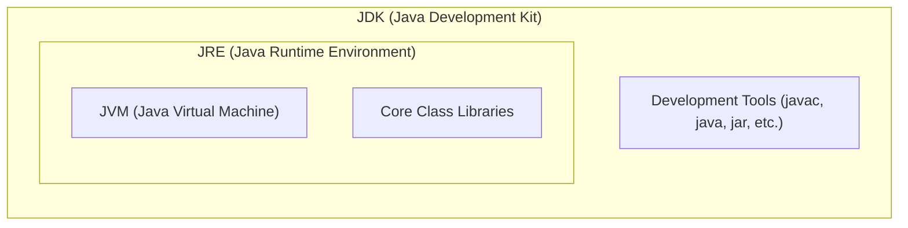

### 5. Syntax
```bash
# Compilation
javac MyProgram.java

# Execution
java MyProgram
```

### 6. Example
A developer uses the JDK on Windows to compile `App.java` into `App.class`. They send `App.class` to a server running Linux. The Linux server only has the JRE installed, but it runs `App.class` flawlessly.

### 7. Dry Run
1. Dev writes `App.java`.
2. `javac` processes it -> `App.class`.
3. On server, `java App` is triggered.
4. JVM's ClassLoader reads `App.class` from disk into RAM.
5. Execution Engine reads Bytecode `0xCAFEBABE` (Magic Number for Java class files).
6. Interprets and executes.

### 8. Real World Example
Think of the JDK as a fully equipped kitchen (ingredients + stove + utensils). The JRE is just the dining table and the food (ready to eat). The JVM is your mouth (actually consuming/executing the food).

### 9. Advantages
- **Security**: The JVM runs code in a sandbox, preventing malicious bytecode from accessing the host OS directly.
- **Flexibility**: End users don't need heavy development tools.

### 10. Disadvantages
- JVM startup time can cause a slight delay when launching Java applications (Cold Start problem).

### 11. Interview Questions
> [!NOTE] 
> **Q1: Differentiate between JDK, JRE, and JVM.**
> A: JDK = JRE + Dev Tools. JRE = JVM + Core Libraries. JVM = Execution Engine.
> 
> **Q2: Is the JVM platform-independent?**
> A: **NO!** The JVM is platform-dependent (there is a different JVM for Windows, Mac, Linux). It is the **Bytecode** that is platform-independent.

### 12. Common Mistakes
> [!CAUTION]
> - Trying to compile code (`javac`) when only the JRE is installed. It will throw "javac is not recognized".
> - Executing `.class` files by typing `java MyProgram.class`. The `.class` extension must be omitted during execution.

### 13. Best Practices
> [!TIP]
> Always ensure your `JAVA_HOME` environment variable points to the JDK directory, not the JRE, to ensure build tools like Maven/Gradle function correctly.

### 14. FAQs
- **What is a JIT Compiler?** It stands for Just-In-Time compiler. It is part of the JVM that optimizes performance by compiling frequently executed bytecode (hot spots) directly to native machine code.

### 15. Revision Notes
- **JDK** = Develop & Run.
- **JRE** = Run Only.
- **JVM** = Abstract execution machine.

---

## 1.3 JVM Architecture & Memory Management

### 1. Definition
The JVM Architecture consists of three main subsystems: the **Class Loader Subsystem**, the **Runtime Data Areas (Memory)**, and the **Execution Engine**.

### 2. Why It Exists
To provide a secure, controlled, and managed environment for Java applications, ensuring memory is allocated efficiently and garbage is collected automatically.

### 3. Internal Working
1. **Class Loader**: Loads `.class` files. Consists of Bootstrap, Extension, and Application class loaders.
2. **Runtime Data Areas**: Memory is divided into 5 regions (Method Area, Heap, Stack, PC Register, Native Method Stack).
3. **Execution Engine**: Executes the bytecode utilizing the Interpreter, JIT Compiler, and Garbage Collector.

### 4. Architecture
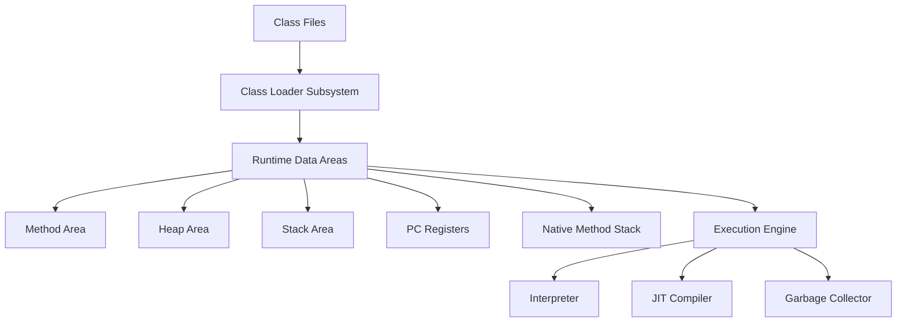

### 5. Syntax (Conceptual mapping)
```java
public class Test {
    static int count = 0; // Stored in Method Area
    public static void main(String[] args) {
        Test obj = new Test(); // 'obj' reference in Stack, object in Heap
    }
}
```

### 6. Example
When the above code runs, the JVM allocates the class metadata and static variable `count` to the Method Area. The `main` method frame is pushed to the Stack. The `new Test()` object is created in the Heap.

### 7. Dry Run
1. `Test.class` loaded by Application ClassLoader.
2. Static variables initialized in Method Area.
3. Thread created for `main`. PC Register points to first instruction.
4. Stack frame for `main` pushed to Stack.
5. Heap allocates memory for `new Test()`. Stack variable `obj` holds the Heap memory address.

### 8. Real World Example
Imagine a restaurant:
- **Class Loader**: The host bringing guests (classes) in.
- **Method Area**: The recipe book (shared by all).
- **Heap**: The tables where actual food (objects) is placed.
- **Stack**: The waiter's notepad tracking current orders (method calls).

### 9. Advantages
- Deep separation of memory types prevents conflicts.
- Thread-local memory (Stack, PC) ensures thread safety.

### 10. Disadvantages
- Complex tuning required for large enterprise apps (Heap sizing, GC tuning).

### 11. Interview Questions
> [!NOTE] 
> **Q1: Difference between Stack and Heap memory?**
> A: Stack stores local variables and method call frames; it is thread-safe and fast. Heap stores objects and instance variables; it is shared across all threads and is garbage collected.
> 
> **Q2: What is the Method Area?**
> A: A shared memory space storing class structures, static variables, and constant pool.

### 12. Common Mistakes
> [!CAUTION]
> - Believing objects are stored in the Stack. (References are in the stack, the actual object is ALWAYS in the Heap).
> - Not knowing that String Pool resides in the Heap.

### 13. Best Practices
> [!TIP]
> Avoid memory leaks by ensuring you drop references to large objects (like arrays or collections) when they are no longer needed so the Garbage Collector can clean the Heap.

### 14. FAQs
- **What happens if Stack gets full?** `StackOverflowError` is thrown (usually due to infinite recursion).
- **What happens if Heap gets full?** `OutOfMemoryError` is thrown.

### 15. Revision Notes
- **Heap** = Objects (Shared).
- **Stack** = Methods & Local Vars (Per Thread).
- **Method Area** = Class data & Statics (Shared).

---

## 1.4 Data Types, Variables, Literals, and Type Casting

### 1. Definition
- **Data Types**: Specify the size and type of values that can be stored.
- **Variables**: Containers for storing data values.
- **Literals**: Syntactic representations of boolean, character, numeric, or string data.
- **Type Casting**: Converting a value from one data type to another.

### 2. Why It Exists
Java is a strongly typed language. Every variable must have a declared type to ensure memory is allocated efficiently and type-safety is maintained at compile time, preventing unexpected runtime crashes.

### 3. Internal Working
Primitive types (like `int`, `double`) hold their values directly in the Stack (if local) or Heap (if instance). Object references point to Heap memory. Type casting alters the bits or changes the interpretation of bits from a smaller capacity to a larger one (Widening) or vice versa (Narrowing).

### 4. Architecture
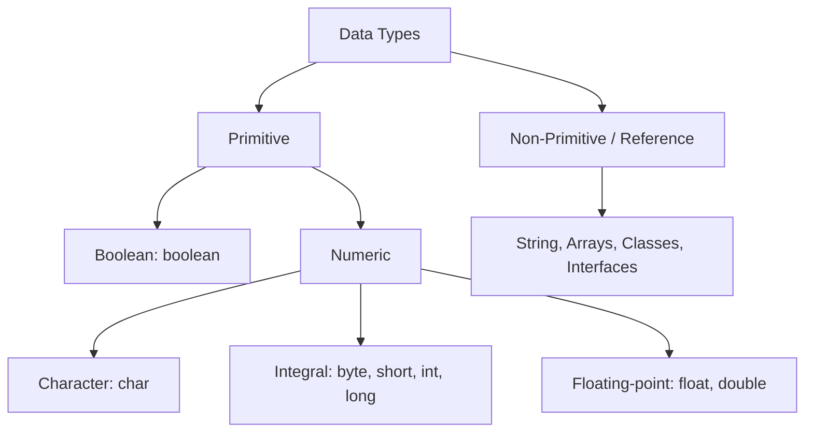

### 5. Syntax
```java
int a = 10; // Primitive variable with integer literal
String s = "Java"; // Reference variable with String literal
double d = a; // Implicit casting (Widening)
int b = (int) 3.14; // Explicit casting (Narrowing)
```

### 6. Example
```java
public class TypesDemo {
    public static void main(String[] args) {
        long bigNumber = 100000L; // 'L' literal
        float decimal = 5.5f;     // 'f' literal
        
        // Explicit cast
        int truncated = (int) decimal; 
        System.out.println(truncated); // Outputs 5
    }
}
```

### 7. Dry Run
1. `bigNumber` allocated 8 bytes, stores `100000`.
2. `decimal` allocated 4 bytes, stores `5.5`.
3. Casting `decimal` to `int` strips the fractional part.
4. `truncated` allocated 4 bytes, stores `5`.

### 8. Real World Example
- `byte` (1 byte): Saving pixel color values in an image to save memory.
- `double` (8 bytes): Calculating precise GPS coordinates.

### 9. Advantages
- Strong typing prevents bugs where a string might accidentally be multiplied by a number.
- Multiple primitive sizes (byte vs int) allow strict memory optimization.

### 10. Disadvantages
- Narrowing casting can cause data loss (e.g., converting `130` from `int` to `byte` results in `-126` due to overflow).

### 11. Interview Questions
> [!NOTE] 
> **Q1: Why is char 2 bytes in Java?**
> A: Because Java uses the Unicode system, not ASCII, to represent characters from global languages.
> 
> **Q2: What is the default value of a local variable?**
> A: Local variables do NOT have default values. They must be initialized before use, otherwise a compile-time error occurs.

### 12. Common Mistakes
> [!CAUTION]
> - Forgetting the `f` suffix for floats: `float x = 5.5;` // ERROR. Must be `5.5f`.
> - Forgetting that narrowing casting truncates decimals instead of rounding them.

### 13. Best Practices
> [!TIP]
> Use `double` for currency calculations? **NO!** Never use `float` or `double` for exact monetary calculations due to floating-point precision issues. Use `BigDecimal`.

### 14. FAQs
- **What is a literal?** The actual source code representation of a fixed value (e.g., the `10` in `int x = 10;`).

### 15. Revision Notes
- **Primitives**: `byte` (1), `short` (2), `int` (4), `long` (8), `float` (4), `double` (8), `char` (2), `boolean` (1 bit).
- **Widening**: Automatic (Smaller -> Larger).
- **Narrowing**: Manual (Larger -> Smaller).

---

## 1.5 Operators & Expressions

### 1. Definition
**Operators** are special symbols that perform specific operations on one, two, or three operands, and then return a result. An **Expression** is a construct made up of variables, operators, and method invocations that evaluates to a single value.

### 2. Why It Exists
Operators form the foundation of any computational logic—from basic arithmetic to complex bitwise manipulation and logical decision making.

### 3. Internal Working
Operators follow strict precedence and associativity rules. When an expression is evaluated, the JVM applies operators based on their precedence (e.g., multiplication before addition).

### 4. Architecture
| Category | Operators | Precedence |
| :--- | :--- | :--- |
| Postfix | `expr++ expr--` | 1 |
| Unary | `++expr --expr +expr -expr ~ !` | 2 |
| Multiplicative | `* / %` | 3 |
| Additive | `+ -` | 4 |
| Relational | `< > <= >= instanceof` | 5 |
| Equality | `== !=` | 6 |
| Logical AND/OR | `&&` / `||` | 7 / 8 |
| Ternary | `? :` | 9 |
| Assignment | `= += -= *= /=` | 10 |

### 5. Syntax
```java
int a = 10, b = 5;
int sum = a + b; // Arithmetic
boolean isGreater = (a > b) && (b > 0); // Relational & Logical
int max = (a > b) ? a : b; // Ternary
```

### 6. Example
```java
public class OperatorDemo {
    public static void main(String[] args) {
        int x = 5;
        // Post-increment vs Pre-increment
        System.out.println(x++); // Prints 5, then x becomes 6
        System.out.println(++x); // x becomes 7, then prints 7
    }
}
```

### 7. Dry Run
1. `x` initialized to 5.
2. `x++` is evaluated. The *current* value (5) is passed to `println`. Then `x` is incremented to 6 in memory.
3. `++x` is evaluated. `x` is incremented to 7 in memory first. Then the new value (7) is passed to `println`.

### 8. Real World Example
- `%` (Modulo): Used frequently to determine if a number is even/odd (`num % 2 == 0`).
- `&&` (Short-circuit AND): Used in login validation `(isValidUser && hasCorrectPassword)`.

### 9. Advantages
- Short-circuit logical operators (`&&`, `||`) optimize performance by skipping the second operand evaluation if the first determines the outcome.

### 10. Disadvantages
- Overusing ternary operators or bitwise operators can make code extremely hard to read and debug.

### 11. Interview Questions
> [!NOTE] 
> **Q1: Difference between `&` and `&&`?**
> A: `&` is a bitwise AND (and logical AND that doesn't short-circuit). `&&` is a logical short-circuit AND. If the left side of `&&` is false, it does not evaluate the right side.
> 
> **Q2: What is the `instanceof` operator?**
> A: Used to check whether an object is an instance of a specific class or interface.

### 12. Common Mistakes
> [!CAUTION]
> - Confusing assignment `=` with equality `==`. (e.g., `if (a = true)` instead of `if (a == true)`).
> - String concatenation trap: `"Value: " + 5 + 5` results in `"Value: 55"`, not `"Value: 10"`.

### 13. Best Practices
> [!TIP]
> Always use parentheses `()` in complex expressions to make the precedence explicitly clear to anyone reading the code.

### 14. FAQs
- **What is the ternary operator?** A shorthand for `if-else`. Syntax: `condition ? ifTrue : ifFalse`.

### 15. Revision Notes
- `x++` : Use then increment.
- `++x` : Increment then use.
- `&&` and `||` are short-circuited.

---

## 1.6 Input/Output Basics, Scanner, BufferedReader, and CLI Arguments

### 1. Definition
Java provides multiple ways to read input from the user/files and write output. `Scanner` is a simple text scanner. `BufferedReader` reads text from a character-input stream buffering characters. Command Line Arguments are inputs passed to the `main` method at runtime.

### 2. Why It Exists
Applications must be interactive. IO streams allow programs to accept dynamic data rather than hardcoding values. `Scanner` is for ease of use (parsing primitives), while `BufferedReader` is for high performance (reading chunks of data).

### 3. Internal Working
- **Scanner**: Parses underlying input streams using regular expressions, tokenizing input by whitespace.
- **BufferedReader**: Reads a large chunk of characters from the underlying `InputStreamReader` into an internal buffer array, reducing costly physical I/O operations.

### 4. Architecture
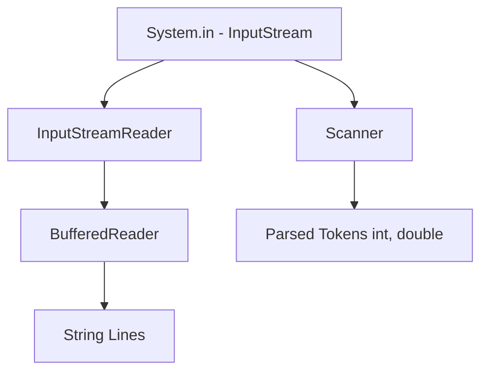

### 5. Syntax
```java
// Scanner
Scanner sc = new Scanner(System.in);
int num = sc.nextInt();

// BufferedReader
BufferedReader br = new BufferedReader(new InputStreamReader(System.in));
String line = br.readLine();
```

### 6. Example
```java
public class InputDemo {
    public static void main(String[] args) throws Exception {
        // CLI Arguments
        if(args.length > 0) {
            System.out.println("CLI Arg: " + args[0]);
        }

        // Scanner
        Scanner sc = new Scanner(System.in);
        System.out.print("Enter age: ");
        int age = sc.nextInt();
        System.out.println("Age is: " + age);
    }
}
```

### 7. Dry Run
1. User executes `java InputDemo Hello`.
2. JVM passes `["Hello"]` to `args`. `args[0]` is printed.
3. `Scanner` is initialized. Program halts at `nextInt()`.
4. User types `25` and hits Enter.
5. Scanner tokenizes the input, parses it to integer, and assigns it to `age`.

### 8. Real World Example
- **Scanner**: Used in competitive programming (Hackerrank/LeetCode) for quick, easy input reading.
- **BufferedReader**: Used in production systems parsing gigabytes of log files where speed is critical.
- **CLI Args**: Passing configuration file paths or flags (e.g., `-verbose`) when starting a server.

### 9. Advantages
- **Scanner**: Built-in parsing (`nextInt`, `nextDouble`).
- **BufferedReader**: Significantly faster execution and thread-safe.

### 10. Disadvantages
- **Scanner**: Slower because of regex parsing overhead. Not thread-safe.
- **BufferedReader**: Verbose syntax, reads only Strings (requires manual parsing to integers).

### 11. Interview Questions
> [!NOTE] 
> **Q1: Why is BufferedReader faster than Scanner?**
> A: Scanner does complex regex parsing to tokenize input and doesn't buffer heavily. BufferedReader reads large chunks into memory at once and simply returns strings, minimizing I/O overhead.
> 
> **Q2: What is the famous Scanner bug?**
> A: Calling `nextLine()` after `nextInt()`. The `nextInt()` consumes the number but leaves the newline `\n` in the buffer. The subsequent `nextLine()` immediately consumes the `\n` and returns an empty string.

### 12. Common Mistakes
> [!CAUTION]
> Forgetting to close the `Scanner` or `BufferedReader`, which leads to resource/memory leaks. (Use try-with-resources to fix this).

### 13. Best Practices
> [!TIP]
> For coding interviews (TCS, Infosys) use `Scanner` for simplicity. For highly optimized competitive programming or file reading, always use `BufferedReader`.

### 14. FAQs
- **What is System.out?** A standard output stream (usually the console) attached to the `PrintStream` class.

### 15. Revision Notes
- `Scanner`: Easy, parses primitives, slower, throws `InputMismatchException`.
- `BufferedReader`: Harder syntax, strings only, faster, throws `IOException`.

---

## 1.7 Control Flow Statements: If-Else, Switch, and Loops

### 1. Definition
Control flow statements determine the order in which instructions are executed. 
- **Decision Making**: `if`, `if-else`, `switch`
- **Looping**: `for`, `while`, `do-while`
- **Branching**: `break`, `continue`

### 2. Why It Exists
Without control flow, code would execute strictly top-to-bottom exactly once. Applications require branching logic (e.g., "if logged in, show dashboard") and repetitive logic (e.g., "process 100 items").

### 3. Internal Working
At the bytecode level, control flow translates to `goto` and conditional branch instructions (like `if_icmpeq`). The Program Counter (PC) register jumps to different memory addresses in the Method Area based on these branch conditions.

### 4. Architecture
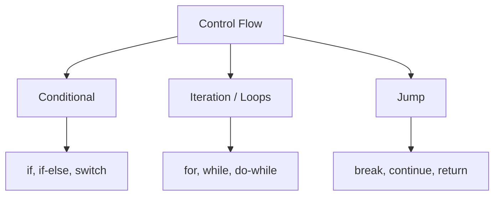

### 5. Syntax
```java
// Switch (Traditional)
switch(day) {
    case 1: System.out.println("Mon"); break;
    default: System.out.println("Invalid");
}

// Enhanced Switch (Java 12+)
String type = switch(day) {
    case 1, 2, 3, 4, 5 -> "Weekday";
    case 6, 7 -> "Weekend";
    default -> "Invalid";
};
```

### 6. Example
```java
public class LoopDemo {
    public static void main(String[] args) {
        for(int i = 1; i <= 5; i++) {
            if(i == 3) continue; // Skips 3
            System.out.print(i + " ");
        }
        // Output: 1 2 4 5
    }
}
```

### 7. Dry Run
1. `i = 1`. `i <= 5` (T). `i == 3` (F). Prints `1`. `i++`.
2. `i = 2`. `i <= 5` (T). `i == 3` (F). Prints `2`. `i++`.
3. `i = 3`. `i <= 5` (T). `i == 3` (T). `continue` executes. Skips print. `i++`.
4. `i = 4`. Prints `4`. `i++`.
5. `i = 5`. Prints `5`. `i++`.
6. `i = 6`. `i <= 5` (F). Loop terminates.

### 8. Real World Example
- **While Loop**: A game loop `while(gameIsRunning) { renderGraphics(); }`.
- **Switch**: A menu-driven application (Press 1 for Balance, 2 for Withdrawal).

### 9. Advantages
- **For Loop**: Best when iterations are known.
- **While Loop**: Best when iterations are unknown and depend on a dynamic condition.
- **Do-While**: Guarantees the code executes *at least once*.

### 10. Disadvantages
- Nested loops (loops inside loops) drastically increase Time Complexity (O(n²), O(n³)), leading to performance bottlenecks.

### 11. Interview Questions
> [!NOTE] 
> **Q1: Can we use Strings in switch cases?**
> A: Yes, starting from Java 7, Strings are allowed in switch expressions.
> 
> **Q2: What is an unreachable statement error?**
> A: Writing code immediately after a `break`, `continue`, or `return` statement in the same block. The compiler flags this as an error because the code can never be executed.

### 12. Common Mistakes
> [!CAUTION]
> - Putting a semicolon after a loop or if statement: `for(int i=0; i<5; i++); { ... }` The loop does nothing, and the block executes once.
> - Forgetting the `break` statement in traditional switch cases, leading to "fall-through" execution.

### 13. Best Practices
> [!TIP]
> Use Enhanced Switch expressions (Java 12+) to avoid fall-through bugs and write cleaner code without manual `break` statements.

### 14. FAQs
- **What's the difference between break and continue?** `break` completely exits the loop. `continue` skips the rest of the current iteration and jumps to the next iteration.

### 15. Revision Notes
- **For**: Known iterations.
- **While**: Unknown iterations, checks condition first.
- **Do-While**: Executes once, checks condition later.


====================================================================

# 🔤 PART II: STRINGS

## 2.1 String Class, String Pool, and Immutability

### 1. Definition
A **String** in Java is an object that represents a sequence of characters. Internally it is backed by a `char[]` (Java 8 and below) or `byte[]` (Java 9+). The **String Constant Pool (SCP)** is a special memory region inside the Heap where Java stores unique string literals. **Immutability** means that once a String object is created, its content can never be changed.

### 2. Why It Exists
Strings are the most frequently used data type in any application (usernames, passwords, URLs, SQL queries). Immutability enables **security** (strings used in class loading and network connections cannot be tampered with), **thread safety** (immutable objects are inherently safe to share across threads), and **performance** (String Pool allows reuse, saving memory).

### 3. Internal Working
When you write `String s = "Hello";`, the JVM checks the String Pool. If `"Hello"` already exists, `s` points to the existing object. If not, a new object is created in the pool. When you write `String s = new String("Hello");`, two objects may be created: one in the Pool (if it doesn't exist) and one in the regular Heap.

### 4. Architecture
```mermaid
graph TD
    A[Heap Memory] --> B[String Constant Pool]
    A --> C[Regular Heap Objects]
    B --> D["Hello" - shared]
    C --> E["new String - separate object"]
    F[s1 = "Hello"] --> D
    G[s2 = "Hello"] --> D
    H["s3 = new String(Hello)"] --> E
    E -.->|intern| D
```

### 5. Syntax
```java
String s1 = "Hello";                    // Pool
String s2 = "Hello";                    // Same pool reference
String s3 = new String("Hello");        // New Heap object
String s4 = s3.intern();               // Forces pool reference
```

### 6. Example
```java
public class StringDemo {
    public static void main(String[] args) {
        String a = "Java";
        String b = "Java";
        String c = new String("Java");
        
        System.out.println(a == b);       // true (same pool ref)
        System.out.println(a == c);       // false (different objects)
        System.out.println(a.equals(c));  // true (same content)
    }
}
```

### 7. Dry Run
1. `"Java"` is created in the String Pool. `a` points to it.
2. `b` also points to the same `"Java"` in the pool. No new object created.
3. `new String("Java")` creates a NEW object on the regular Heap. `c` points to it.
4. `a == b` compares references → same address → `true`.
5. `a == c` compares references → different addresses → `false`.
6. `a.equals(c)` compares content character by character → `true`.

### 8. Real World Example
- **Database URLs**: `String url = "jdbc:mysql://localhost:3306/db";` — immutability prevents accidental modification of the connection string at runtime.
- **HashMap Keys**: Strings are the most common HashMap key because immutability guarantees a stable hash code.

### 9. Advantages
- **Memory efficient**: String Pool prevents duplicate string objects.
- **Thread-safe**: Can be freely shared between threads.
- **Hashcode caching**: Since strings can't change, their hash code is computed once and cached.

### 10. Disadvantages
- Every modification (concatenation, replace, etc.) creates a **new** String object, leading to excessive garbage collection in loops.

### 11. Interview Questions
> [!NOTE]
> **Q1: Why are Strings immutable in Java?**
> A: For security (used in class loading, network connections), thread safety (no synchronization needed), hashcode caching (stable keys in HashMaps), and String Pool optimization.
>
> **Q2: How many objects are created by `String s = new String("Hello");`?**
> A: Potentially 2. One in the String Pool (if "Hello" doesn't exist there yet) and one on the regular Heap via `new`.
>
> **Q3: Difference between `==` and `.equals()` for Strings?**
> A: `==` compares memory addresses (references). `.equals()` compares the actual character content.

### 12. Common Mistakes
> [!CAUTION]
> - Using `==` to compare String content. Always use `.equals()`.
> - Concatenating strings inside a loop using `+`. Each `+` creates a new object. Use `StringBuilder` instead.

### 13. Best Practices
> [!TIP]
> - Always use string literals (`"Hello"`) instead of `new String("Hello")` unless you explicitly need a distinct object.
> - Use `"constant".equals(variable)` instead of `variable.equals("constant")` to avoid `NullPointerException`.

### 14. FAQs
- **What is `String.intern()`?** It returns a canonical representation of the string. If the pool already contains an equal string, it returns the pool reference. Otherwise, it adds the string to the pool and returns that reference.

### 15. Revision Notes
- `String` = Immutable, stored in Pool (literal) or Heap (new).
- `==` = Reference comparison. `.equals()` = Content comparison.
- String Pool is inside the Heap (since Java 7).

---

## 2.2 StringBuilder and StringBuffer

### 1. Definition
**StringBuilder** and **StringBuffer** are mutable alternatives to `String`. They allow in-place modification of character sequences without creating new objects.

### 2. Why It Exists
When performing heavy string manipulation (e.g., building SQL queries, concatenating in loops), creating a new `String` object every time is extremely wasteful. `StringBuilder`/`StringBuffer` modify the same internal `char[]` buffer, dramatically improving performance.

### 3. Internal Working
Both maintain an internal resizable `char[]` array. When `append()` is called, characters are added to the existing buffer. If the buffer is full, a new array of size `(oldCapacity * 2) + 2` is allocated, the old content is copied, and the old array is garbage collected. `StringBuffer` wraps every method with `synchronized`, making it thread-safe but slower.

### 4. Architecture (Comparison Table)

| Feature | String | StringBuilder | StringBuffer |
| :--- | :--- | :--- | :--- |
| **Mutability** | Immutable | Mutable | Mutable |
| **Thread Safety** | Yes (immutable) | No | Yes (synchronized) |
| **Performance** | Slowest (new objects) | Fastest | Moderate |
| **Since** | JDK 1.0 | JDK 1.5 | JDK 1.0 |
| **Use Case** | Few modifications | Single-threaded loops | Multi-threaded scenarios |

### 5. Syntax
```java
StringBuilder sb = new StringBuilder("Hello");
sb.append(" World");
sb.insert(5, ",");
sb.reverse();
sb.delete(0, 3);
String result = sb.toString();
```

### 6. Example
```java
public class BuilderDemo {
    public static void main(String[] args) {
        // BAD: String concatenation in loop
        String bad = "";
        for(int i = 0; i < 10000; i++) {
            bad += i; // Creates 10000 new String objects!
        }
        
        // GOOD: StringBuilder
        StringBuilder good = new StringBuilder();
        for(int i = 0; i < 10000; i++) {
            good.append(i); // Modifies same buffer
        }
    }
}
```

### 7. Dry Run (StringBuilder capacity)
1. `new StringBuilder()` creates internal `char[16]` (default capacity = 16).
2. `append("Hello")` → buffer now has 5 chars, capacity still 16.
3. Append more characters until length exceeds 16.
4. New capacity = `(16 * 2) + 2 = 34`. New `char[34]` allocated. Old content copied.

### 8. Real World Example
- **Log message building**: Constructing detailed log messages with timestamps, levels, and context.
- **HTML/XML generation**: Building markup dynamically in server-side code.

### 9. Advantages
- Dramatically faster than String for repeated modifications.
- `StringBuilder` is the fastest mutable string option in single-threaded apps.

### 10. Disadvantages
- Not as convenient as `String` for simple use cases.
- `StringBuffer`'s synchronization overhead makes it slower than `StringBuilder`.

### 11. Interview Questions
> [!NOTE]
> **Q1: Difference between StringBuilder and StringBuffer?**
> A: `StringBuilder` is not synchronized (faster, not thread-safe). `StringBuffer` is synchronized (slower, thread-safe).
>
> **Q2: What is the default capacity of StringBuilder?**
> A: 16 characters. When exceeded, new capacity = `(old * 2) + 2`.

### 12. Common Mistakes
> [!CAUTION]
> - Using `StringBuffer` when thread safety is not needed. Always prefer `StringBuilder` for single-threaded code.
> - Forgetting to call `.toString()` when assigning back to a `String`.

### 13. Best Practices
> [!TIP]
> Pre-allocate capacity if you know the approximate final size: `new StringBuilder(1024)` avoids multiple internal array resizings.

### 14. FAQs
- **Does the compiler optimize String `+` to StringBuilder?** Yes, since Java 5, the compiler converts `String a + b + c` into `new StringBuilder().append(a).append(b).append(c).toString()`. But this does NOT help inside loops since a new `StringBuilder` is created per iteration.

### 15. Revision Notes
- `String` = Immutable. `StringBuilder` = Mutable + Fast. `StringBuffer` = Mutable + Thread-safe.
- Default capacity = 16. Expansion = `(old * 2) + 2`.

---

## 2.3 Essential String Methods

### 1. Definition
The `String` class provides over 60 built-in methods for manipulation, searching, comparison, and transformation of character sequences.

### 2. Why It Exists
Without built-in methods, developers would have to write manual character-by-character logic for common operations like finding substrings, converting case, or trimming whitespace.

### 3. Internal Working
Most String methods iterate over the internal `char[]`/`byte[]` array. Since `String` is immutable, methods like `toUpperCase()` create and return a **new** String object rather than modifying the original.

### 4. Architecture (Key Methods Reference Table)

| Method | Description | Returns |
| :--- | :--- | :--- |
| `length()` | Number of characters | `int` |
| `charAt(int i)` | Character at index i | `char` |
| `substring(int begin, int end)` | Extracts portion [begin, end) | `String` |
| `indexOf(String s)` | First occurrence index | `int` (-1 if not found) |
| `lastIndexOf(String s)` | Last occurrence index | `int` |
| `contains(CharSequence s)` | Checks if contains substring | `boolean` |
| `equals(Object o)` | Content equality | `boolean` |
| `equalsIgnoreCase(String s)` | Case-insensitive equality | `boolean` |
| `compareTo(String s)` | Lexicographic comparison | `int` (0, +, -) |
| `toUpperCase()` / `toLowerCase()` | Case conversion | `String` |
| `trim()` | Removes leading/trailing spaces | `String` |
| `strip()` (Java 11) | Unicode-aware trim | `String` |
| `replace(old, new)` | Replaces all occurrences | `String` |
| `split(String regex)` | Splits by regex | `String[]` |
| `toCharArray()` | Converts to char array | `char[]` |
| `valueOf()` | Converts primitives to String | `String` |
| `isEmpty()` | True if length == 0 | `boolean` |
| `isBlank()` (Java 11) | True if empty or only whitespace | `boolean` |
| `startsWith()` / `endsWith()` | Prefix/suffix check | `boolean` |
| `join(delimiter, elements)` | Joins elements with delimiter | `String` |

### 5. Syntax
```java
String s = "  Hello, Java World!  ";
s.trim();                       // "Hello, Java World!"
s.substring(8, 12);             // "Java"
s.replace("Java", "Python");    // "  Hello, Python World!  "
s.split(", ");                  // ["  Hello", "Java World!  "]
String.join("-", "A", "B");     // "A-B"
```

### 6. Example
```java
public class StringMethodsDemo {
    public static void main(String[] args) {
        String email = "User@Example.COM";
        
        // Normalize email
        String normalized = email.trim().toLowerCase();
        System.out.println(normalized); // "user@example.com"
        
        // Extract domain
        String domain = normalized.substring(normalized.indexOf("@") + 1);
        System.out.println(domain); // "example.com"
        
        // Check validity
        System.out.println(normalized.contains("@")); // true
        System.out.println(normalized.endsWith(".com")); // true
    }
}
```

### 7. Dry Run
1. `email` = `"User@Example.COM"`.
2. `trim()` has no effect (no leading/trailing spaces). `toLowerCase()` → `"user@example.com"`.
3. `indexOf("@")` → 4. `substring(5)` → `"example.com"`.
4. `contains("@")` → scans string, finds `@` at index 4 → `true`.

### 8. Real World Example
- **Form validation**: `email.contains("@")` and `phone.matches("\\d{10}")`.
- **Data parsing**: `csvLine.split(",")` to parse CSV files.

### 9. Advantages
- Rich API covers virtually all common string operations.
- Methods are well-documented and performance-optimized internally.

### 10. Disadvantages
- Every method that "modifies" a String returns a new object. Chaining methods like `s.trim().toLowerCase().replace(...)` creates multiple intermediate objects.

### 11. Interview Questions
> [!NOTE]
> **Q1: Difference between `trim()` and `strip()`?**
> A: `trim()` only removes ASCII whitespace (chars ≤ 32). `strip()` (Java 11+) removes all Unicode whitespace characters.
>
> **Q2: What does `compareTo()` return?**
> A: 0 if equal, negative if the calling string is lexicographically less, positive if greater.
>
> **Q3: How to reverse a String?**
> A: `new StringBuilder(str).reverse().toString()`.

### 12. Common Mistakes
> [!CAUTION]
> - `substring(beginIndex, endIndex)` — the `endIndex` is **exclusive**. `"Hello".substring(0, 3)` returns `"Hel"`, not `"Hell"`.
> - `split(".")` won't work as expected. The `.` is a regex metacharacter. Use `split("\\.")`.

### 13. Best Practices
> [!TIP]
> Use `String.format()` or `MessageFormat` for complex string building with placeholders instead of `+` concatenation.

### 14. FAQs
- **Is String `+` operator overloaded?** Yes. Java overloads `+` for String concatenation. It is the only overloaded operator in Java.

### 15. Revision Notes
- `equals()` for content, `==` for reference.
- `substring` end is exclusive.
- `split` takes regex. Escape special chars with `\\`.

====================================================================

# 📦 PART III: ARRAYS

## 3.1 Arrays: 1D, 2D, Multidimensional, and Jagged Arrays

### 1. Definition
An **Array** is a fixed-size, contiguous block of memory that holds elements of the same data type. Arrays in Java are objects, stored in the Heap. **1D arrays** are linear. **2D arrays** are arrays of arrays (matrix). **Jagged arrays** are 2D arrays where each row can have a different number of columns.

### 2. Why It Exists
Arrays provide O(1) random access to elements by index, making them the fastest data structure for indexed retrieval. They are the building block for all other collection data structures (ArrayList, HashMap's internal bucket array, etc.).

### 3. Internal Working
When `new int[5]` is executed, the JVM allocates a contiguous block of `5 * 4 = 20` bytes on the Heap (each `int` = 4 bytes). The variable holding the array is a reference on the Stack pointing to this Heap block. Default values are assigned: `0` for numeric types, `false` for boolean, `null` for objects.

### 4. Architecture
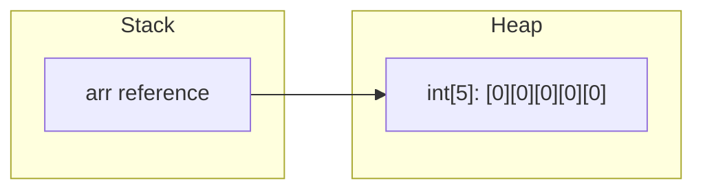

### 5. Syntax
```java
// 1D Array
int[] arr = new int[5];
int[] arr2 = {10, 20, 30, 40, 50};

// 2D Array
int[][] matrix = new int[3][4];
int[][] matrix2 = {{1,2},{3,4},{5,6}};

// Jagged Array
int[][] jagged = new int[3][];
jagged[0] = new int[2];
jagged[1] = new int[4];
jagged[2] = new int[1];
```

### 6. Example
```java
public class ArrayDemo {
    public static void main(String[] args) {
        int[] nums = {5, 3, 8, 1, 9};
        
        // Traversal
        for(int i = 0; i < nums.length; i++) {
            System.out.print(nums[i] + " ");
        }
        
        // Enhanced for-each
        for(int num : nums) {
            System.out.print(num + " ");
        }
    }
}
```

### 7. Dry Run
1. `nums` array created on Heap: `[5, 3, 8, 1, 9]`.
2. For loop: `i=0` → prints 5. `i=1` → prints 3. ... `i=4` → prints 9. `i=5` → condition fails, loop ends.
3. For-each internally uses an iterator-like mechanism on the array.

### 8. Real World Example
- **Image processing**: A 2D array of pixel RGB values.
- **Spreadsheet data**: A 2D array where rows are records and columns are fields.
- **Jagged arrays**: A school system where each class has a different number of students.

### 9. Advantages
- O(1) access by index. Fastest data structure for random access.
- Memory-efficient for primitives (no boxing overhead).

### 10. Disadvantages
- **Fixed size**: Cannot grow or shrink after creation. Must know size at compile time or use `ArrayList`.
- **No built-in methods**: No `add()`, `remove()`, `contains()`. Must use `Arrays` utility class or manual logic.

### 11. Interview Questions
> [!NOTE]
> **Q1: Can we change the size of an array after creation?**
> A: No. Arrays are fixed-size. To resize, create a new larger array and copy elements using `Arrays.copyOf()`.
>
> **Q2: What is `ArrayIndexOutOfBoundsException`?**
> A: Thrown when accessing an index that doesn't exist (e.g., index 5 on a 5-element array — valid indices are 0 to 4).
>
> **Q3: Difference between `length` and `length()`?**
> A: `length` is a field for arrays. `length()` is a method for Strings.

### 12. Common Mistakes
> [!CAUTION]
> - Accessing `arr[arr.length]` — this is always out of bounds. Last valid index is `arr.length - 1`.
> - Assuming 2D arrays in Java must be rectangular. Java supports jagged (ragged) arrays.

### 13. Best Practices
> [!TIP]
> Use `Arrays.toString(arr)` to print arrays instead of `System.out.println(arr)` (which prints the hash code, not the contents). For 2D arrays, use `Arrays.deepToString(matrix)`.

### 14. FAQs
- **Are arrays objects in Java?** Yes! Every array in Java is an object. That's why arrays are created with `new` and stored on the Heap.

### 15. Revision Notes
- Arrays = Fixed size, O(1) access, stored on Heap.
- Default values: `0` (int), `0.0` (double), `false` (boolean), `null` (objects).
- `length` is a field (no parentheses).

---

## 3.2 Array Operations: Searching, Sorting, and Common Problems

### 1. Definition
**Searching** is finding the position or existence of an element. **Sorting** is arranging elements in a defined order. Java provides built-in utilities via the `java.util.Arrays` class.

### 2. Why It Exists
Searching and sorting are fundamental operations in computer science. Efficient implementations (like binary search on sorted data) can reduce time complexity from O(n) to O(log n).

### 3. Internal Working
- `Arrays.sort()` uses **Dual-Pivot Quicksort** for primitives (average O(n log n)) and **TimSort** (a hybrid merge sort + insertion sort) for objects.
- `Arrays.binarySearch()` requires a pre-sorted array and performs a divide-and-conquer search in O(log n).

### 4. Architecture (Time Complexity Table)

| Operation | Algorithm | Best | Average | Worst |
| :--- | :--- | :--- | :--- | :--- |
| Linear Search | Sequential scan | O(1) | O(n) | O(n) |
| Binary Search | Divide & conquer | O(1) | O(log n) | O(log n) |
| `Arrays.sort()` (primitives) | Dual-Pivot Quicksort | O(n log n) | O(n log n) | O(n²) |
| `Arrays.sort()` (objects) | TimSort | O(n) | O(n log n) | O(n log n) |

### 5. Syntax
```java
int[] arr = {5, 2, 8, 1, 9};
Arrays.sort(arr);                       // [1, 2, 5, 8, 9]
int index = Arrays.binarySearch(arr, 5); // 2
int[] copy = Arrays.copyOf(arr, 10);    // [1,2,5,8,9,0,0,0,0,0]
Arrays.fill(arr, 0);                    // [0,0,0,0,0]
boolean eq = Arrays.equals(arr1, arr2); // Content equality
```

### 6. Example
```java
public class SearchSort {
    // Linear Search
    static int linearSearch(int[] arr, int target) {
        for(int i = 0; i < arr.length; i++) {
            if(arr[i] == target) return i;
        }
        return -1;
    }
    
    // Binary Search (iterative)
    static int binarySearch(int[] arr, int target) {
        int low = 0, high = arr.length - 1;
        while(low <= high) {
            int mid = low + (high - low) / 2;
            if(arr[mid] == target) return mid;
            else if(arr[mid] < target) low = mid + 1;
            else high = mid - 1;
        }
        return -1;
    }
}
```

### 7. Dry Run (Binary Search for target = 8 in [1, 2, 5, 8, 9])
1. `low=0, high=4, mid=2`. `arr[2]=5 < 8` → `low=3`.
2. `low=3, high=4, mid=3`. `arr[3]=8 == 8` → return `3`. ✅

### 8. Real World Example
- **E-commerce**: Sorting products by price, rating, or name.
- **Phone contacts**: Binary search on a sorted alphabetical list.

### 9. Advantages
- Binary search is exponentially faster than linear search for large datasets.
- `Arrays.sort()` is highly optimized by the JDK team.

### 10. Disadvantages
- Binary search requires pre-sorted data.
- Sorting has O(n log n) overhead that may not be worth it for small arrays.

### 11. Interview Questions
> [!NOTE]
> **Q1: Why `mid = low + (high - low) / 2` instead of `(low + high) / 2`?**
> A: To prevent integer overflow. If `low` and `high` are both large, their sum might exceed `Integer.MAX_VALUE`.

### 12. Common Mistakes
> [!CAUTION]
> Calling `Arrays.binarySearch()` on an unsorted array gives undefined (incorrect) results.

### 13. Best Practices
> [!TIP]
> Always sort first, then binary search. Or better, use a `HashSet` for O(1) lookups if order doesn't matter.

### 14. FAQs
- **What sorting algorithm does Java use?** Dual-Pivot Quicksort for primitives, TimSort for objects.

### 15. Revision Notes
- Linear Search = O(n). Binary Search = O(log n) (sorted only).
- `Arrays.sort()`, `Arrays.binarySearch()`, `Arrays.copyOf()`, `Arrays.fill()`.

====================================================================

# 🔧 PART IV: METHODS

## 4.1 Methods, Parameters, Return Types, and Call By Value

### 1. Definition
A **Method** is a block of code that performs a specific task, only runs when called, and can accept data (parameters) and return data (return type). Java is strictly **pass-by-value**: copies of the actual values are passed to methods.

### 2. Why It Exists
Methods promote code reusability, modularity, and the DRY (Don't Repeat Yourself) principle. Without methods, all logic would reside in `main()`, making code unmaintainable.

### 3. Internal Working
When a method is called, a new **Stack Frame** is pushed onto the thread's stack. This frame contains:
- Local variables
- Parameters (copies of arguments)
- Return address (where to go after method completes)

When the method finishes (`return` or end of block), the frame is popped from the stack.

### 4. Architecture
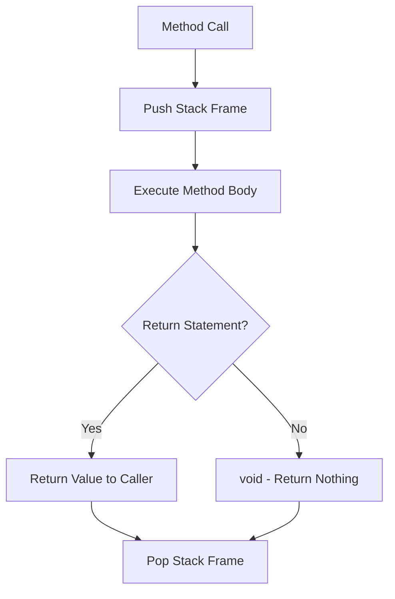

### 5. Syntax
```java
// Method Declaration
accessModifier returnType methodName(parameterList) {
    // body
    return value; // if not void
}

// Example
public static int add(int a, int b) {
    return a + b;
}
```

### 6. Example
```java
public class MethodDemo {
    // Method with parameters and return type
    static int multiply(int x, int y) {
        return x * y;
    }
    
    // void method
    static void greet(String name) {
        System.out.println("Hello, " + name);
    }
    
    public static void main(String[] args) {
        int result = multiply(5, 3);
        System.out.println(result); // 15
        greet("Omkar"); // Hello, Omkar
    }
}
```

### 7. Dry Run
1. `main` frame pushed to stack.
2. `multiply(5, 3)` called → new frame pushed. `x=5, y=3` (copies).
3. `return 15` → value returned, `multiply` frame popped.
4. `result = 15` stored in `main`'s frame.
5. `greet("Omkar")` called → new frame pushed. `name = "Omkar"` (copy of reference).
6. Prints "Hello, Omkar". Frame popped.

### 8. Real World Example
- **Banking app**: `calculateInterest(double principal, double rate, int years)`.
- **E-commerce**: `applyDiscount(double price, double discountPercent)`.

### 9. Advantages
- Code reusability. Write once, call many times.
- Easier debugging and testing (test individual methods).

### 10. Disadvantages
- Excessive method calls can cause `StackOverflowError` (e.g., infinite recursion).
- Method call overhead (stack frame creation/destruction) — though JIT optimizes this.

### 11. Interview Questions
> [!NOTE]
> **Q1: Is Java pass-by-value or pass-by-reference?**
> A: Java is **always pass-by-value**. For primitives, the value is copied. For objects, the **reference** (memory address) is copied — NOT the object itself. So you can modify the object's fields via the copied reference, but you cannot make the original reference point to a new object.
>
> **Q2: Can a method return multiple values?**
> A: Not directly. Use an array, a List, or a custom object to return multiple values.

### 12. Common Mistakes
> [!CAUTION]
> Thinking `swap(int a, int b)` will swap the original variables. Since Java passes copies, the originals remain unchanged.

### 13. Best Practices
> [!TIP]
> Keep methods short and focused (Single Responsibility). A method should do ONE thing and do it well.

### 14. FAQs
- **What is a method signature?** The method name + parameter types (NOT return type). E.g., `add(int, int)`.

### 15. Revision Notes
- Method = Reusable block of code.
- Java = Always pass-by-value. Object references are passed by value.
- Stack Frame = Created per method call, destroyed on return.

---

## 4.2 Method Overloading, Varargs, and Recursion

### 1. Definition
- **Method Overloading**: Defining multiple methods with the **same name** but **different parameter lists** (type, number, or order) in the same class. It is **compile-time (static) polymorphism**.
- **Varargs (Variable Arguments)**: A feature that allows a method to accept zero or more arguments of the same type using `...` syntax.
- **Recursion**: A method calling itself to solve a smaller sub-problem until a base condition is met.

### 2. Why It Exists
- **Overloading**: Provides convenience to the API user. Instead of `addInt`, `addDouble`, `addLong`, you have one name `add` with different parameter types.
- **Varargs**: Eliminates the need to create overloaded methods for every possible number of parameters.
- **Recursion**: Provides elegant solutions for problems that have a naturally recursive structure (trees, factorials, Fibonacci).

### 3. Internal Working
- **Overloading**: The compiler determines which method to call based on the argument types at compile time (static binding).
- **Varargs**: Internally, `int... nums` is compiled to `int[] nums`. The JVM creates an array from the arguments.
- **Recursion**: Each recursive call pushes a new stack frame. If the base case is never reached, the stack fills up → `StackOverflowError`.

### 4. Architecture (Recursion Stack)
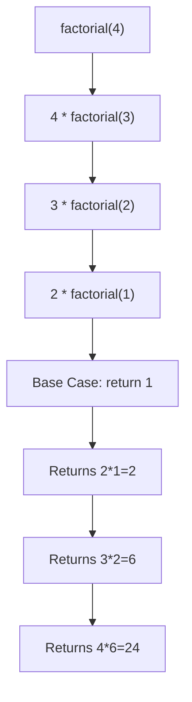

### 5. Syntax
```java
// Overloading
int add(int a, int b) { return a + b; }
double add(double a, double b) { return a + b; }
int add(int a, int b, int c) { return a + b + c; }

// Varargs
int sum(int... nums) {
    int total = 0;
    for(int n : nums) total += n;
    return total;
}

// Recursion
int factorial(int n) {
    if(n <= 1) return 1; // Base case
    return n * factorial(n - 1); // Recursive case
}
```

### 6. Example
```java
public class OverloadDemo {
    static void print(int x)    { System.out.println("int: " + x); }
    static void print(String x) { System.out.println("String: " + x); }
    static void print(double x) { System.out.println("double: " + x); }
    
    public static void main(String[] args) {
        print(5);        // int: 5
        print("Hello");  // String: Hello
        print(3.14);     // double: 3.14
    }
}
```

### 7. Dry Run (factorial(4))
1. `factorial(4)`: `4 > 1`, push frame, call `factorial(3)`.
2. `factorial(3)`: `3 > 1`, push frame, call `factorial(2)`.
3. `factorial(2)`: `2 > 1`, push frame, call `factorial(1)`.
4. `factorial(1)`: `1 <= 1`, return `1`. Pop frame.
5. Back to `factorial(2)`: return `2 * 1 = 2`. Pop frame.
6. Back to `factorial(3)`: return `3 * 2 = 6`. Pop frame.
7. Back to `factorial(4)`: return `4 * 6 = 24`. Pop frame. Result = `24`.

### 8. Real World Example
- **Overloading**: `System.out.println()` accepts `int`, `String`, `char`, `boolean`, etc. — all overloaded versions.
- **Recursion**: File system traversal (listing all files in all subdirectories).

### 9. Advantages
- Overloading improves code readability and API design.
- Recursion provides clean solutions for tree/graph traversals and divide-and-conquer algorithms.

### 10. Disadvantages
- Ambiguous overloading (e.g., `add(int, long)` vs `add(long, int)` called with `add(5, 5)`) causes compile error.
- Recursion is slower than iteration due to stack frame overhead and risks `StackOverflowError`.

### 11. Interview Questions
> [!NOTE]
> **Q1: Can we overload by changing only the return type?**
> A: **No.** Return type is NOT part of the method signature. Overloading requires different parameter lists.
>
> **Q2: Can `main()` be overloaded?**
> A: Yes! But the JVM will always call `public static void main(String[] args)` as the entry point.
>
> **Q3: Varargs vs Array parameter?**
> A: Functionally identical internally. But varargs allows calling `sum(1, 2, 3)` directly without creating an array explicitly.

### 12. Common Mistakes
> [!CAUTION]
> - Varargs must be the **last** parameter: `void m(int... a, String s)` is **ILLEGAL**.
> - Only **one** varargs parameter is allowed per method.

### 13. Best Practices
> [!TIP]
> Always define a clear **base case** in recursive methods. Without it, you will get `StackOverflowError`.

### 14. FAQs
- **Is recursion ever better than iteration?** Yes, for problems with recursive structure (trees, Tower of Hanoi). But for simple loops, iteration is always faster.

### 15. Revision Notes
- Overloading = Same name + Different params = Compile-time polymorphism.
- Varargs = `type... name` → compiled to array. Must be last param.
- Recursion = Method calls itself. Needs base case. Uses O(n) stack space.

====================================================================

# 🏗️ PART V: OBJECT ORIENTED PROGRAMMING (OOP)

## 5.1 Classes, Objects, and Constructors

### 1. Definition
- **Class**: A blueprint/template defining the structure (fields) and behavior (methods) of objects.
- **Object**: A runtime instance of a class, created using the `new` keyword.
- **Constructor**: A special method with the same name as the class, invoked automatically when an object is created. It has no return type (not even `void`).

### 2. Why It Exists
OOP exists to model real-world entities in code. A `Car` class has attributes (color, speed) and behaviors (accelerate, brake). Objects allow us to create multiple cars, each with their own state. Constructors ensure objects are initialized properly at creation time.

### 3. Internal Working
When `new Student("Omkar", 22)` is executed:
1. Memory for the `Student` object is allocated on the **Heap**.
2. Instance variables are set to default values (`null`, `0`).
3. The matching constructor is called, initializing the fields with provided values.
4. A reference (memory address) is returned and stored in the variable on the **Stack**.

### 4. Architecture
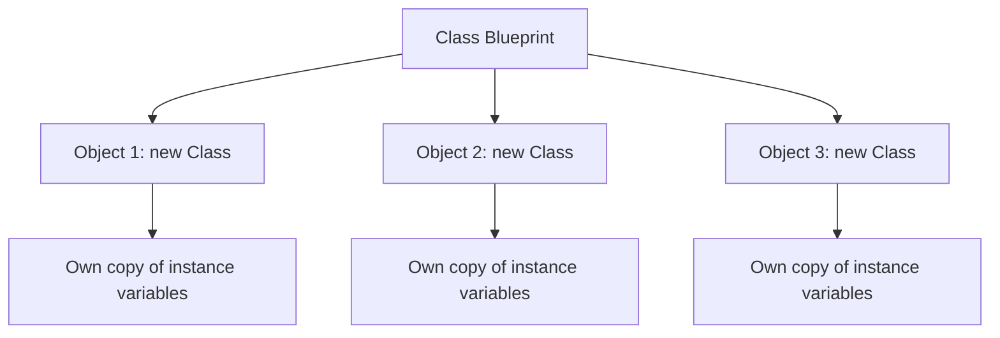

### 5. Syntax
```java
class Student {
    String name;
    int age;
    
    // Default Constructor
    Student() {
        this.name = "Unknown";
        this.age = 0;
    }
    
    // Parameterized Constructor
    Student(String name, int age) {
        this.name = name;
        this.age = age;
    }
    
    // Constructor Chaining
    Student(String name) {
        this(name, 18); // Calls parameterized constructor
    }
    
    void display() {
        System.out.println(name + " - " + age);
    }
}
```

### 6. Example
```java
public class Main {
    public static void main(String[] args) {
        Student s1 = new Student();          // Default
        Student s2 = new Student("Omkar", 22); // Parameterized
        Student s3 = new Student("Rahul");   // Chained
        
        s1.display(); // Unknown - 0
        s2.display(); // Omkar - 22
        s3.display(); // Rahul - 18
    }
}
```

### 7. Dry Run
1. `new Student()` → Heap allocates memory. Default constructor sets `name="Unknown", age=0`. Reference stored in `s1` on Stack.
2. `new Student("Omkar", 22)` → Heap allocates. Parameterized constructor sets fields. Reference → `s2`.
3. `new Student("Rahul")` → Calls `this("Rahul", 18)` which internally calls the 2-param constructor. → `s3`.

### 8. Real World Example
- **E-commerce**: `Product` class with `name`, `price`, `quantity` fields. Each product listed on the site is an object.
- **Banking**: `BankAccount` class with `accountNumber`, `balance`. Each customer has their own account object.

### 9. Advantages
- Constructors guarantee that an object is in a valid state when created.
- Constructor overloading provides flexible object creation.

### 10. Disadvantages
- If you define any parameterized constructor, Java **no longer provides** the default no-arg constructor. You must define it explicitly if needed.

### 11. Interview Questions
> [!NOTE]
> **Q1: Can a constructor be private?**
> A: Yes! Used in the **Singleton Design Pattern** to prevent external instantiation.
>
> **Q2: Difference between constructor and method?**
> A: Constructor has no return type, has the same name as the class, and is called automatically. Methods have return types, have custom names, and are called explicitly.
>
> **Q3: What is `this` keyword?**
> A: `this` refers to the current object's reference. Used to differentiate instance variables from parameters when they have the same name, and for constructor chaining (`this()`).

### 12. Common Mistakes
> [!CAUTION]
> - Writing a return type for a constructor: `void Student()` is a METHOD, not a constructor.
> - `this()` must be the **first statement** in a constructor when used for chaining.

### 13. Best Practices
> [!TIP]
> Always initialize all fields in the constructor. Use constructor chaining to avoid code duplication across overloaded constructors.

### 14. FAQs
- **Can a constructor call another constructor?** Yes, using `this(params)` for same-class constructors (chaining) or `super(params)` for parent-class constructors.

### 15. Revision Notes
- Class = Blueprint. Object = Instance.
- Constructor = No return type + Same name as class + Auto-called on `new`.
- `this()` = Constructor chaining (must be first line).

---

## 5.2 Encapsulation and Abstraction

### 1. Definition
- **Encapsulation**: Wrapping data (variables) and code (methods) into a single unit (class), and restricting direct access to the data by making fields `private` and providing `public` getters/setters. Also called **data hiding**.
- **Abstraction**: Hiding the complex implementation details and showing only the essential features to the user. Achieved using **abstract classes** and **interfaces**.

### 2. Why It Exists
- **Encapsulation**: Protects an object's internal state from unauthorized access. Allows validation in setters (e.g., age cannot be negative).
- **Abstraction**: Reduces complexity. A driver doesn't need to know how the engine works internally; they just need the steering wheel and pedals (the interface).

### 3. Internal Working
- **Encapsulation**: The compiler enforces access modifiers. `private` fields generate a compile error if accessed directly from outside the class. Getters/setters are regular methods that provide controlled access.
- **Abstraction**: Abstract classes cannot be instantiated with `new`. The JVM uses **vtable (virtual method table)** to resolve which concrete implementation to call at runtime.

### 4. Architecture
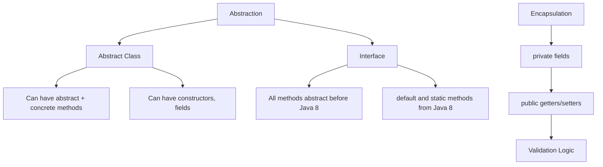

### 5. Syntax
```java
// Encapsulation
class BankAccount {
    private double balance;
    
    public double getBalance() { return balance; }
    
    public void deposit(double amount) {
        if(amount > 0) this.balance += amount; // Validation!
    }
}

// Abstraction
abstract class Shape {
    abstract double area(); // No body
    void display() { System.out.println("Shape"); } // Concrete method
}

interface Drawable {
    void draw(); // implicitly public abstract
}

class Circle extends Shape implements Drawable {
    double radius;
    Circle(double r) { this.radius = r; }
    double area() { return Math.PI * radius * radius; }
    public void draw() { System.out.println("Drawing Circle"); }
}
```

### 6. Example
```java
public class Main {
    public static void main(String[] args) {
        BankAccount acc = new BankAccount();
        // acc.balance = -500; // COMPILE ERROR! private field
        acc.deposit(1000);
        acc.deposit(-500); // Ignored by validation
        System.out.println(acc.getBalance()); // 1000.0
        
        Shape s = new Circle(5);
        System.out.println(s.area()); // 78.54
    }
}
```

### 7. Dry Run
1. `BankAccount` created. `balance = 0.0` (default).
2. `deposit(1000)`: `1000 > 0` → true → `balance = 0 + 1000 = 1000`.
3. `deposit(-500)`: `-500 > 0` → false → balance unchanged.
4. `getBalance()` returns `1000.0`.
5. `new Circle(5)`: `radius = 5`. Stored as `Shape` reference (abstraction).
6. `s.area()`: JVM calls `Circle.area()` via dynamic dispatch → `π * 25 = 78.54`.

### 8. Real World Example
- **Encapsulation**: ATM machine — you can check balance and withdraw, but you can't directly access the bank's database.
- **Abstraction**: A TV remote — you press "Volume Up" without knowing the internal circuit operations.

### 9. Advantages
- **Encapsulation**: Protects data integrity. Allows changing internal implementation without affecting external code.
- **Abstraction**: Reduces code complexity. Promotes loose coupling.

### 10. Disadvantages
- **Encapsulation**: Boilerplate getter/setter code (mitigated by IDEs and Lombok).
- **Abstraction**: Over-abstraction leads to too many layers and reduced readability.

### 11. Interview Questions
> [!NOTE]
> **Q1: Difference between Abstraction and Encapsulation?**
> A: Abstraction hides complexity (what to show). Encapsulation hides data (how to protect). Abstraction is a concept; Encapsulation is the implementation technique.
>
> **Q2: Can an abstract class have a constructor?**
> A: Yes! It cannot be instantiated directly, but its constructor is called when a subclass is instantiated via `super()`.
>
> **Q3: Difference between abstract class and interface?**
> A: Abstract class can have constructors, fields, and concrete methods. Interface (pre-Java 8) has only abstract methods and constants. From Java 8+, interfaces can have `default` and `static` methods.

### 12. Common Mistakes
> [!CAUTION]
> - Making all fields `public` — this breaks encapsulation completely.
> - Trying to instantiate an abstract class: `new Shape()` → COMPILE ERROR.

### 13. Best Practices
> [!TIP]
> Follow the JavaBeans convention: `private` fields, `public` getters (`getXxx()`) and setters (`setXxx()`). Use `is` prefix for boolean getters (`isActive()`).

### 14. FAQs
- **Can an abstract class have all concrete methods?** Yes. It just can't be instantiated.
- **When to use abstract class vs interface?** Use abstract class for shared code/state. Use interface for defining a contract/capability.

### 15. Revision Notes
- **Encapsulation** = private fields + public getters/setters = Data hiding.
- **Abstraction** = abstract class / interface = Complexity hiding.
- Abstract class: Can have state + constructors. Interface: Pure contract (mostly).

---

## 5.3 Inheritance and Types of Inheritance

### 1. Definition
**Inheritance** is a mechanism where a child class (subclass) acquires the properties and behaviors of a parent class (superclass). It represents an **IS-A** relationship. Java supports **Single**, **Multilevel**, and **Hierarchical** inheritance. **Multiple inheritance** through classes is NOT supported (to avoid the Diamond Problem), but IS supported through interfaces.

### 2. Why It Exists
To promote **code reuse**. Common attributes and methods can be defined once in a parent class and inherited by all children, avoiding duplication.

### 3. Internal Working
When a subclass object is created, the JVM first calls the parent class constructor (implicitly via `super()` or explicitly). The object in memory contains both the parent's and child's instance variables. Method resolution follows the **method dispatch table (vtable)**: if the child overrides a method, the child's version is called.

### 4. Architecture
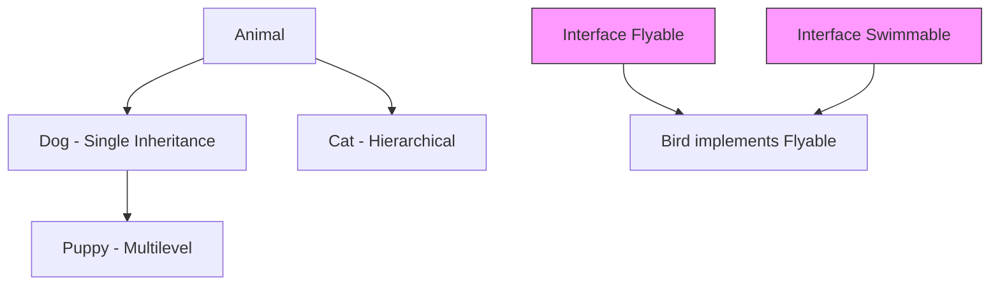

### 5. Syntax
```java
class Animal {
    String name;
    void eat() { System.out.println(name + " eats"); }
}

class Dog extends Animal {
    void bark() { System.out.println(name + " barks"); }
}

class Puppy extends Dog {
    void play() { System.out.println(name + " plays"); }
}
```

### 6. Example
```java
public class Main {
    public static void main(String[] args) {
        Puppy p = new Puppy();
        p.name = "Buddy"; // Inherited from Animal
        p.eat();          // Inherited from Animal
        p.bark();         // Inherited from Dog
        p.play();         // Own method
    }
}
```

### 7. Dry Run
1. `new Puppy()` → JVM calls `Animal()` constructor → `Dog()` constructor → `Puppy()` constructor (chain up).
2. `p.name = "Buddy"` → sets field inherited from `Animal`.
3. `p.eat()` → resolved from `Animal` class → prints "Buddy eats".
4. `p.bark()` → resolved from `Dog` class → prints "Buddy barks".
5. `p.play()` → resolved from `Puppy` class → prints "Buddy plays".

### 8. Real World Example
- **Vehicle hierarchy**: `Vehicle` → `Car` → `ElectricCar`. Each level adds specific features.
- **Employee system**: `Employee` → `Manager`, `Developer`, `Designer`.

### 9. Advantages
- Code reusability. Reduces redundancy.
- Enables polymorphism (parent reference can hold child object).

### 10. Disadvantages
- Tight coupling between parent and child. Changes in parent can break children.
- Deep inheritance hierarchies become hard to understand and maintain.

### 11. Interview Questions
> [!NOTE]
> **Q1: Why doesn't Java support multiple inheritance through classes?**
> A: To avoid the **Diamond Problem**. If class C extends both A and B, and both have a method `display()`, the compiler can't determine which one to call. Interfaces solve this since the implementing class must provide its own implementation.
>
> **Q2: What is the `super` keyword?**
> A: `super` refers to the immediate parent class. Used to call parent's constructor (`super()`), access parent's methods (`super.method()`), or parent's fields (`super.field`).
>
> **Q3: Can a constructor be inherited?**
> A: No. Constructors are NOT inherited. But the parent's constructor is called via `super()`.

### 12. Common Mistakes
> [!CAUTION]
> - Not calling `super()` explicitly → Java adds `super()` implicitly. But if the parent has NO no-arg constructor, you get a compile error.
> - Confusing IS-A (inheritance) with HAS-A (composition/aggregation).

### 13. Best Practices
> [!TIP]
> Prefer **composition over inheritance**. Use inheritance only for true IS-A relationships. For HAS-A relationships (a Car HAS-A Engine), use composition (a field of type Engine).

### 14. FAQs
- **Can we inherit private members?** They exist in the child's object memory but are NOT accessible directly. Only through inherited public/protected getters.

### 15. Revision Notes
- `extends` for class inheritance. `implements` for interface.
- Single, Multilevel, Hierarchical = Supported. Multiple (classes) = NOT supported.
- `super()` must be first line in constructor.

---

## 5.4 Polymorphism: Compile-Time and Runtime

### 1. Definition
**Polymorphism** means "many forms." The same method name behaves differently based on the context.
- **Compile-Time Polymorphism (Static)**: Method Overloading — resolved at compile time.
- **Runtime Polymorphism (Dynamic)**: Method Overriding — resolved at runtime using **dynamic method dispatch**.

### 2. Why It Exists
Polymorphism allows writing flexible, extensible code. A `Shape` reference can hold a `Circle`, `Rectangle`, or `Triangle` object, and calling `area()` automatically invokes the correct implementation — without the caller needing to know the specific type.

### 3. Internal Working
- **Overloading**: The compiler checks the method signature (name + parameter types) and binds the call at compile time.
- **Overriding**: At runtime, the JVM looks at the **actual object type** (not the reference type) and uses the **vtable** to dispatch the correct method. This is called **dynamic method dispatch** or **late binding**.

### 4. Architecture
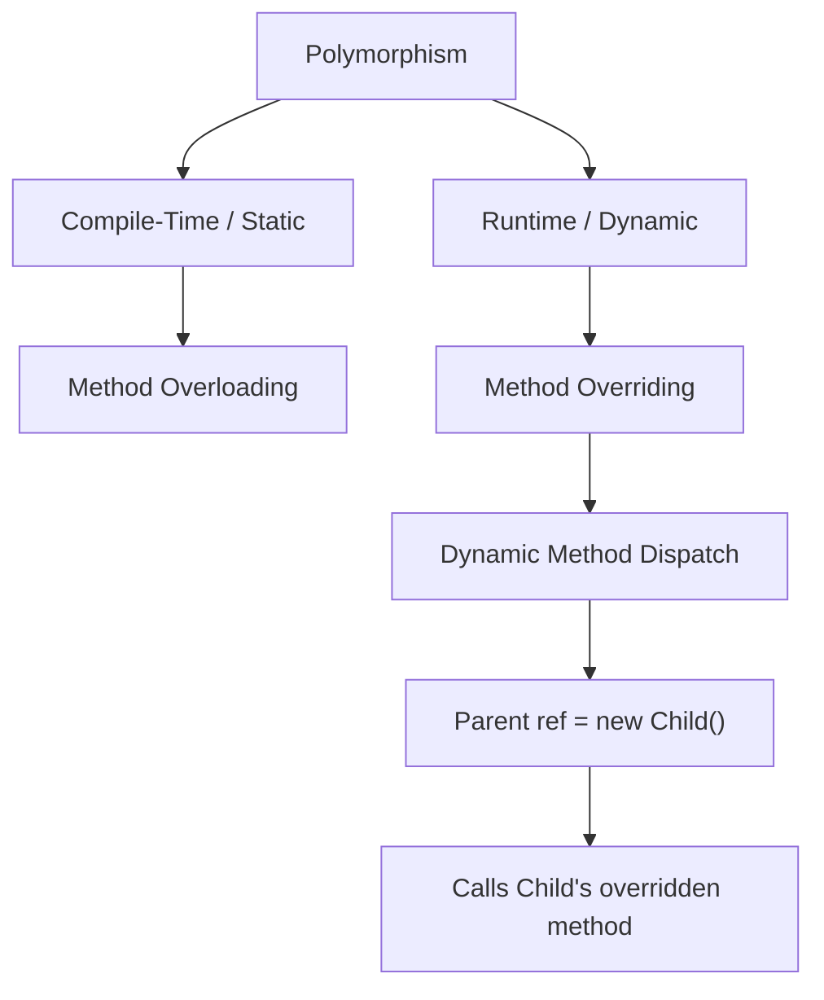

### 5. Syntax
```java
class Animal {
    void sound() { System.out.println("Some sound"); }
}

class Dog extends Animal {
    @Override
    void sound() { System.out.println("Bark"); }
}

class Cat extends Animal {
    @Override
    void sound() { System.out.println("Meow"); }
}
```

### 6. Example
```java
public class PolymorphismDemo {
    public static void main(String[] args) {
        Animal a;       // Parent reference
        
        a = new Dog();
        a.sound();      // "Bark" — Dog's version at runtime
        
        a = new Cat();
        a.sound();      // "Meow" — Cat's version at runtime
    }
}
```

### 7. Dry Run
1. `Animal a` → reference of type `Animal` on Stack. No object yet.
2. `a = new Dog()` → `Dog` object created on Heap. `a` points to it.
3. `a.sound()` → JVM checks actual object type (Dog) → vtable → `Dog.sound()` → prints "Bark".
4. `a = new Cat()` → `Cat` object on Heap. `a` now points to Cat.
5. `a.sound()` → actual type is `Cat` → `Cat.sound()` → prints "Meow".

### 8. Real World Example
- **Payment system**: `Payment` base class. `CreditCardPayment`, `UPIPayment`, `NetBankingPayment` override `processPayment()`. The calling code just calls `payment.processPayment()` regardless of the specific type.

### 9. Advantages
- Enables writing generic, flexible code.
- Makes code easily extensible (add new shapes without modifying existing code — Open/Closed Principle).

### 10. Disadvantages
- Runtime polymorphism has a slight performance overhead due to dynamic dispatch (vtable lookup).
- Debugging can be harder since the actual method called is determined at runtime.

### 11. Interview Questions
> [!NOTE]
> **Q1: Rules for method overriding?**
> A: Same method name, same parameters, same or covariant return type, access modifier must be same or wider, cannot override `static`, `final`, or `private` methods.
>
> **Q2: Can we override a static method?**
> A: No. Static methods are bound to the class, not the object. If a child class defines the same static method, it is called **method hiding**, not overriding.
>
> **Q3: What is covariant return type?**
> A: The overriding method can return a subclass of the return type declared in the parent method. E.g., parent returns `Animal`, child can return `Dog`.

### 12. Common Mistakes
> [!CAUTION]
> - Trying to override a `final` method → Compile Error.
> - Confusing overloading (same class, different params) with overriding (parent-child, same signature).
> - Reducing the access modifier in the child (e.g., parent has `public`, child has `protected`) → Compile Error.

### 13. Best Practices
> [!TIP]
> Always use the `@Override` annotation when overriding methods. It causes a compile error if you accidentally misspell the method name or use wrong parameters, catching bugs early.

### 14. FAQs
- **Can constructors be overridden?** No. Constructors are not inherited, so they cannot be overridden.

### 15. Revision Notes
- Overloading = Compile-time. Overriding = Runtime.
- Dynamic dispatch uses **actual object type**, not reference type.
- `@Override` annotation = Safety net against mistakes.

---

## 5.5 Object Class, Association, Aggregation, and Composition

### 1. Definition
- **Object Class**: The root class of all Java classes. Every class implicitly extends `java.lang.Object`. Key methods: `toString()`, `equals()`, `hashCode()`, `clone()`, `getClass()`, `finalize()`, `wait()`, `notify()`.
- **Association**: A relationship between two separate classes (Teacher teaches Student).
- **Aggregation**: A weak HAS-A relationship. The contained object can exist independently (Department HAS Students — students exist without the department).
- **Composition**: A strong HAS-A relationship. The contained object cannot exist independently (House HAS Rooms — rooms don't exist without the house).

### 2. Why It Exists
- `Object` class provides a universal set of methods available to all objects. `equals()` and `hashCode()` are critical for Collections.
- Association/Aggregation/Composition model real-world relationships beyond IS-A (inheritance), enabling flexible and maintainable designs.

### 3. Internal Working
- `toString()` by default returns `ClassName@HexHashCode`. Override it to return meaningful information.
- `equals()` by default uses `==` (reference comparison). Override it to compare content.
- `hashCode()` returns an integer hash. If `equals()` is overridden, `hashCode()` **must** also be overridden to maintain the contract: equal objects must have equal hash codes.

### 4. Architecture

| Relationship | Strength | Dependency | Example |
| :--- | :--- | :--- | :--- |
| Association | Weakest | Both exist independently | Teacher ↔ Student |
| Aggregation | Medium (HAS-A) | Part can exist alone | Department → Student |
| Composition | Strongest (HAS-A) | Part cannot exist alone | House → Room |
| Inheritance | IS-A | Child depends on parent | Dog IS-A Animal |

### 5. Syntax
```java
// Composition: Room cannot exist without House
class Room {
    String name;
    Room(String name) { this.name = name; }
}

class House {
    private Room room; // Composition
    House() {
        this.room = new Room("Living Room"); // Created inside
    }
}

// Aggregation: Student exists independently
class Student {
    String name;
    Student(String name) { this.name = name; }
}

class Department {
    List<Student> students; // Aggregation — students passed in
    Department(List<Student> students) {
        this.students = students;
    }
}
```

### 6. Example
```java
class Employee {
    String name;
    Employee(String name) { this.name = name; }
    
    @Override
    public String toString() {
        return "Employee{name='" + name + "'}";
    }
    
    @Override
    public boolean equals(Object o) {
        if(this == o) return true;
        if(o == null || getClass() != o.getClass()) return false;
        Employee e = (Employee) o;
        return name.equals(e.name);
    }
    
    @Override
    public int hashCode() {
        return name.hashCode();
    }
}
```

### 7. Dry Run
1. `Employee e1 = new Employee("Omkar")`.
2. `Employee e2 = new Employee("Omkar")`.
3. `e1 == e2` → false (different Heap addresses).
4. `e1.equals(e2)` → true (same name content).
5. `System.out.println(e1)` → calls `toString()` → prints `Employee{name='Omkar'}`.

### 8. Real World Example
- **Composition**: A `Car` has an `Engine`. If the car is destroyed, the engine is too.
- **Aggregation**: A `Library` has `Books`. Books can be moved to another library.

### 9. Advantages
- Properly overriding `equals()` and `hashCode()` ensures correct behavior in `HashMap`, `HashSet`.
- Composition provides better encapsulation than inheritance.

### 10. Disadvantages
- Forgetting to override `hashCode()` when `equals()` is overridden breaks hash-based collections.

### 11. Interview Questions
> [!NOTE]
> **Q1: Why must we override `hashCode()` when we override `equals()`?**
> A: The contract states that if two objects are equal (`equals()` returns true), they must have the same `hashCode()`. HashMap uses `hashCode()` to find the bucket and `equals()` to find the exact key. If hash codes differ for equal objects, HashMap won't find the key.
>
> **Q2: Difference between Aggregation and Composition?**
> A: In Aggregation, the child can exist independently. In Composition, the child's lifecycle depends entirely on the parent.

### 12. Common Mistakes
> [!CAUTION]
> - Not overriding `toString()` and getting useless output like `Student@3f2a7bc`.
> - Overriding `equals()` without `hashCode()` → HashMap/HashSet behave incorrectly.

### 13. Best Practices
> [!TIP]
> Use IDE-generated `equals()` and `hashCode()` methods or use `Objects.equals()` and `Objects.hash()` utility methods to avoid null-pointer bugs.

### 14. FAQs
- **What is the `getClass()` method?** Returns the runtime class of the object. Used in `equals()` to ensure type safety.

### 15. Revision Notes
- Every class extends `Object`. Override `toString()`, `equals()`, `hashCode()`.
- Composition = Strong HAS-A (lifecycle dependent). Aggregation = Weak HAS-A (independent).
- `equals()` ↔ `hashCode()` contract: Equal objects MUST have equal hash codes.


====================================================================

# 🔐 PART VI: ACCESS MODIFIERS

## 6.1 public, private, protected, and default

### 1. Definition
**Access Modifiers** control the visibility and accessibility of classes, methods, and variables.
- **public**: Accessible from anywhere.
- **private**: Accessible only within the declaring class.
- **protected**: Accessible within the same package and subclasses (even in different packages).
- **default** (no modifier): Accessible only within the same package.

### 2. Why It Exists
To enforce **encapsulation** and define clear boundaries in code architecture. Without access modifiers, any class could modify any other class's internal state, leading to tightly coupled, fragile code.

### 3. Internal Working
The compiler enforces access modifiers at compile time. If a class tries to access a `private` member of another class, the compiler throws an error. The JVM also verifies access rules at the bytecode level during class loading.

### 4. Architecture (Comparison Table)

| Modifier | Same Class | Same Package | Subclass (diff pkg) | Other Package |
| :--- | :---: | :---: | :---: | :---: |
| `public` | ✅ | ✅ | ✅ | ✅ |
| `protected` | ✅ | ✅ | ✅ | ❌ |
| `default` | ✅ | ✅ | ❌ | ❌ |
| `private` | ✅ | ❌ | ❌ | ❌ |

### 5. Syntax
```java
public class Employee {
    public String name;        // Anywhere
    protected int age;         // Package + Subclass
    String department;         // Package only (default)
    private double salary;     // This class only
    
    public double getSalary() { return salary; }
}
```

### 6. Example
```java
// File: com/company/Employee.java
package com.company;
public class Employee {
    private double salary = 50000;
    public double getSalary() { return salary; }
}

// File: com/app/Main.java
package com.app;
import com.company.Employee;

public class Main {
    public static void main(String[] args) {
        Employee e = new Employee();
        // System.out.println(e.salary); // COMPILE ERROR: private
        System.out.println(e.getSalary()); // OK: public getter
    }
}
```

### 7. Dry Run
1. `Employee` in package `com.company`. `salary` is `private`.
2. `Main` in package `com.app` tries `e.salary` → Compiler checks access → different class, different package → `private` denies → COMPILE ERROR.
3. `e.getSalary()` → `getSalary` is `public` → accessible → returns `50000`.

### 8. Real World Example
- **API Design**: Public methods form the API. Private methods are internal helpers. Protected methods are extension points for subclasses. Default (package-private) methods are shared within a module.

### 9. Advantages
- Enforces encapsulation and information hiding.
- Allows changing internal implementation without affecting external users.

### 10. Disadvantages
- Over-restricting access can make code inflexible for legitimate extension.

### 11. Interview Questions
> [!NOTE]
> **Q1: Can a class be private?**
> A: Only inner (nested) classes can be `private`. Top-level classes can only be `public` or default (package-private).
>
> **Q2: Can we access protected members from a different package without inheritance?**
> A: No. `protected` access in a different package is only through inheritance.
>
> **Q3: What is the default access modifier for interface methods?**
> A: `public abstract` (implicitly).

### 12. Common Mistakes
> [!CAUTION]
> - Writing `default` as a keyword: `default void method()` is NOT how you declare default access. Simply omit the modifier.
> - Confusing `default` access with the `default` keyword in interfaces (which defines a method body since Java 8).

### 13. Best Practices
> [!TIP]
> Apply the **principle of least privilege**: make everything `private` by default. Only widen access when explicitly needed.

### 14. FAQs
- **Which is more restrictive: default or protected?** `default` is more restrictive because it doesn't allow subclass access from other packages.

### 15. Revision Notes
- `private` < `default` < `protected` < `public` (increasing visibility).
- Top-level classes: only `public` or default.
- Inner classes: all four modifiers allowed.

====================================================================

# 📁 PART VII: PACKAGES

## 7.1 Packages, Import, and Static Import

### 1. Definition
A **Package** is a namespace that organizes related classes and interfaces. It is essentially a folder structure. **Import** statements allow using classes from other packages. **Static Import** allows using static members without class name qualification.

### 2. Why It Exists
- Avoids **naming conflicts** (two classes named `Date` can exist in different packages: `java.util.Date` and `java.sql.Date`).
- Provides **modular organization** and **access control** (default access is package-scoped).

### 3. Internal Working
The `package` keyword maps to the directory structure. `package com.example.utils;` means the class file must be in the `com/example/utils/` directory. The compiler and JVM use the fully qualified class name (FQCN) to locate classes.

### 4. Architecture
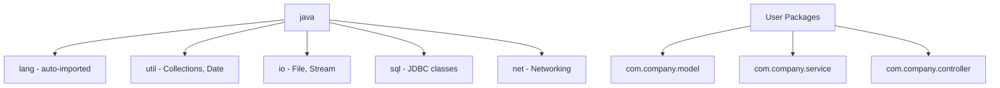

### 5. Syntax
```java
package com.company.model;          // Package declaration (first line)

import java.util.ArrayList;         // Specific import
import java.util.*;                 // Wildcard import
import static java.lang.Math.PI;   // Static import
import static java.lang.Math.*;    // Static wildcard import

public class MyClass {
    double area = PI * 5 * 5;      // No need for Math.PI
}
```

### 6. Example
```java
package com.example;

import java.util.Arrays;
import static java.lang.System.out; // Static import

public class PackageDemo {
    public static void main(String[] args) {
        int[] arr = {5, 3, 1};
        Arrays.sort(arr);
        out.println(Arrays.toString(arr)); // [1, 3, 5]
    }
}
```

### 7. Dry Run
1. Compiler reads `package com.example;` → expects file in `com/example/` directory.
2. `import java.util.Arrays;` → compiler resolves `Arrays` to `java.util.Arrays`.
3. `import static java.lang.System.out;` → `out` can be used directly instead of `System.out`.
4. `out.println(...)` → resolves to `System.out.println(...)`.

### 8. Real World Example
- **Spring Boot**: Packages like `com.app.controller`, `com.app.service`, `com.app.repository` organize MVC layers.

### 9. Advantages
- Clean code organization and namespace management.
- `java.lang` is auto-imported (String, System, Math, etc.).

### 10. Disadvantages
- Wildcard import (`import java.util.*`) can cause ambiguity if two packages have classes with the same name.

### 11. Interview Questions
> [!NOTE]
> **Q1: Which package is automatically imported?**
> A: `java.lang` — that's why `String`, `System`, `Math`, `Object` don't need explicit imports.
>
> **Q2: Difference between `import java.util.*` and `import java.util.ArrayList`?**
> A: Wildcard imports all public classes from the package. Specific import loads only one class. Performance is identical (wildcard doesn't load all classes at runtime — it's a compile-time convenience).

### 12. Common Mistakes
> [!CAUTION]
> - Importing `java.util.*` and `java.sql.*` together causes ambiguity for `Date` class. Must use FQCN: `java.util.Date` or `java.sql.Date`.

### 13. Best Practices
> [!TIP]
> Use specific imports over wildcard imports for clarity. Most IDEs auto-organize imports.

### 14. FAQs
- **Does wildcard import affect performance?** No. It's purely a compile-time resolution. No extra classes are loaded.

### 15. Revision Notes
- `package` = First line. `import` = After package. `class` = After imports.
- `java.lang` = Auto-imported. All others need explicit import.
- Static import = Access static members directly.

====================================================================

# ⚠️ PART VIII: EXCEPTION HANDLING

## 8.1 Exception Hierarchy, Checked, and Unchecked Exceptions

### 1. Definition
An **Exception** is an event that disrupts the normal flow of program execution. Java's exception mechanism provides a structured way to handle errors using `try-catch-finally`.
- **Checked Exceptions**: Compiler forces you to handle them (e.g., `IOException`, `SQLException`).
- **Unchecked Exceptions**: Runtime exceptions that are not checked at compile time (e.g., `NullPointerException`, `ArrayIndexOutOfBoundsException`).
- **Errors**: Severe problems that applications should not try to handle (e.g., `OutOfMemoryError`, `StackOverflowError`).

### 2. Why It Exists
Without exception handling, a single error (like dividing by zero) would crash the entire application. Exception handling allows programs to **recover gracefully**, log errors, and continue execution.

### 3. Internal Working
When an exception occurs, the JVM creates an **Exception object** containing the error type, message, and stack trace. It searches the call stack for a matching `catch` block. If found, execution transfers there. If not found anywhere in the call stack, the JVM terminates the thread and prints the stack trace.

### 4. Architecture
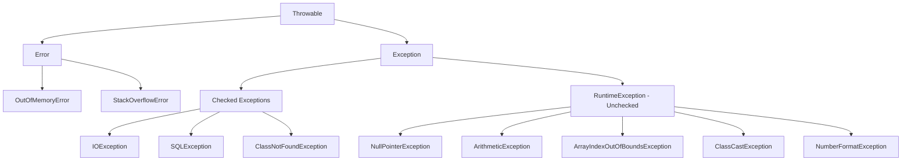

### 5. Syntax
```java
try {
    // Risky code
    int result = 10 / 0;
} catch (ArithmeticException e) {
    System.out.println("Cannot divide by zero: " + e.getMessage());
} catch (Exception e) {
    System.out.println("General exception: " + e);
} finally {
    System.out.println("Always executes");
}
```

### 6. Example
```java
public class ExceptionDemo {
    public static void main(String[] args) {
        try {
            String s = null;
            System.out.println(s.length()); // NullPointerException
        } catch (NullPointerException e) {
            System.out.println("Caught: " + e);
        } finally {
            System.out.println("Cleanup done");
        }
        System.out.println("Program continues!"); // Executes!
    }
}
```

### 7. Dry Run
1. Enter `try` block.
2. `s = null`. `s.length()` → JVM creates `NullPointerException` object.
3. JVM searches for matching `catch` → `catch(NullPointerException e)` found.
4. Prints "Caught: java.lang.NullPointerException".
5. `finally` executes regardless → prints "Cleanup done".
6. Execution continues after try-catch → prints "Program continues!".

### 8. Real World Example
- **Database connection**: `try` to connect → `catch` `SQLException` → `finally` close connection.
- **File reading**: `try` to read file → `catch` `FileNotFoundException` → `finally` close reader.

### 9. Advantages
- Separates error-handling code from normal logic.
- Provides meaningful error messages and stack traces for debugging.

### 10. Disadvantages
- Excessive try-catch blocks make code verbose and hard to read.
- Catching generic `Exception` hides specific bugs.

### 11. Interview Questions
> [!NOTE]
> **Q1: Difference between `throw` and `throws`?**
> A: `throw` is used to explicitly throw an exception object (`throw new Exception("msg")`). `throws` is used in method signature to declare that the method might throw an exception (`void read() throws IOException`).
>
> **Q2: Can `finally` block be skipped?**
> A: Only if `System.exit()` is called or the JVM crashes. Otherwise, `finally` ALWAYS executes.
>
> **Q3: What is try-with-resources?**
> A: Java 7+ feature. Resources (like `Scanner`, `BufferedReader`) that implement `AutoCloseable` are automatically closed at the end of the `try` block.

### 12. Common Mistakes
> [!CAUTION]
> - Catching `Exception` (too broad) instead of specific exceptions. This hides bugs.
> - Empty catch blocks: `catch(Exception e) { }` — silently swallowing errors is dangerous.
> - Writing `catch` blocks in wrong order: Catch specific exceptions FIRST, then general ones.

### 13. Best Practices
> [!TIP]
> - Use try-with-resources for all `AutoCloseable` resources.
> - Always log the exception message and stack trace.
> - Create custom exceptions for domain-specific errors.

### 14. FAQs
- **Can we have try without catch?** Yes, but only if `finally` is present: `try { } finally { }`.

### 15. Revision Notes
- **Checked** = Compile-time check (IOException). **Unchecked** = Runtime (NullPointerException).
- `throw` = Throw exception. `throws` = Declare exception.
- `finally` = Always runs (except `System.exit()`).

---

## 8.2 Custom Exceptions, throw, throws, and Advanced Patterns

### 1. Definition
**Custom Exceptions** are user-defined exception classes that extend `Exception` (checked) or `RuntimeException` (unchecked). `throw` explicitly raises an exception. `throws` declares exceptions in method signatures.

### 2. Why It Exists
Built-in exceptions are generic. Custom exceptions provide **domain-specific** error information (e.g., `InsufficientBalanceException`, `InvalidAgeException`), making error handling clearer and more meaningful.

### 3. Internal Working
Custom exceptions are regular classes that extend `Exception` or `RuntimeException`. When `throw new CustomException("msg")` is executed, the JVM creates the exception object, populates the stack trace, and begins unwinding the call stack to find a handler.

### 4. Architecture
```java
// Checked Custom Exception
class InsufficientBalanceException extends Exception {
    private double balance;
    
    InsufficientBalanceException(String msg, double balance) {
        super(msg);
        this.balance = balance;
    }
    
    public double getBalance() { return balance; }
}

// Unchecked Custom Exception
class InvalidAgeException extends RuntimeException {
    InvalidAgeException(String msg) { super(msg); }
}
```

### 5. Syntax
```java
// throw
if(age < 0) throw new InvalidAgeException("Age cannot be negative");

// throws
public void withdraw(double amount) throws InsufficientBalanceException {
    if(amount > balance) {
        throw new InsufficientBalanceException("Low balance", balance);
    }
    balance -= amount;
}

// Multiple catch & Nested try
try {
    try {
        // inner risky code
    } catch(ArithmeticException e) { }
} catch(Exception e) { }

// Multi-catch (Java 7+)
catch(IOException | SQLException e) { }
```

### 6. Example
```java
class BankAccount {
    private double balance = 1000;
    
    void withdraw(double amount) throws InsufficientBalanceException {
        if(amount > balance)
            throw new InsufficientBalanceException(
                "Cannot withdraw " + amount, balance);
        balance -= amount;
    }
}

public class Main {
    public static void main(String[] args) {
        BankAccount acc = new BankAccount();
        try {
            acc.withdraw(5000);
        } catch(InsufficientBalanceException e) {
            System.out.println(e.getMessage());
            System.out.println("Available: " + e.getBalance());
        }
    }
}
```

### 7. Dry Run
1. `acc.balance = 1000`. `withdraw(5000)` called.
2. `5000 > 1000` → true → `throw new InsufficientBalanceException(...)`.
3. JVM creates exception, unwinding to `main`.
4. `catch(InsufficientBalanceException e)` matches.
5. Prints "Cannot withdraw 5000.0" and "Available: 1000.0".

### 8. Real World Example
- **E-commerce**: `ProductNotFoundException`, `PaymentFailedException`.
- **Authentication**: `InvalidCredentialsException`, `AccountLockedException`.

### 9. Advantages
- Domain-specific exceptions make error handling self-documenting.
- Custom fields can carry additional context (balance, user ID, etc.).

### 10. Disadvantages
- Too many custom exceptions can clutter the codebase.

### 11. Interview Questions
> [!NOTE]
> **Q1: When to use checked vs unchecked custom exceptions?**
> A: Use checked when the caller CAN and SHOULD recover (e.g., insufficient balance — prompt user). Use unchecked when it's a programming bug (e.g., null argument).
>
> **Q2: What is exception chaining?**
> A: Wrapping one exception inside another: `throw new CustomException("msg", originalException);`. Preserves the original cause.

### 12. Common Mistakes
> [!CAUTION]
> - Not calling `super(message)` in custom exceptions — `getMessage()` returns `null`.
> - Catching and re-throwing without the original cause: `throw new RuntimeException("error")` instead of `throw new RuntimeException("error", e)`.

### 13. Best Practices
> [!TIP]
> Always use exception chaining to preserve the root cause. Always provide a meaningful message in custom exceptions.

### 14. FAQs
- **Can we throw checked exceptions from a method not declaring `throws`?** No, it causes a compile error.

### 15. Revision Notes
- Custom Checked: `extends Exception`. Custom Unchecked: `extends RuntimeException`.
- `throw` = Action. `throws` = Declaration.
- Multi-catch: `catch(A | B e)` (Java 7+).

====================================================================

# 🗃️ PART IX: COLLECTIONS FRAMEWORK

## 9.0 Collections Framework Overview

### 1. Definition
The **Java Collections Framework (JCF)** is a unified architecture for representing and manipulating collections of objects. It includes interfaces, implementations (classes), and algorithms.

### 2. Why It Exists
Before JCF, developers used raw arrays, `Vector`, and `Hashtable` with no common interface. JCF provides a standardized set of interfaces (`List`, `Set`, `Map`, `Queue`) that all implementations follow, allowing interchangeable use.

### 3. Architecture (Collection Hierarchy)
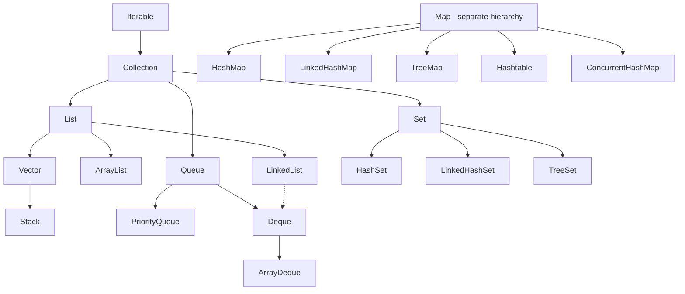

---

## 9.1 ArrayList

### 1. Definition
**ArrayList** is a resizable-array implementation of the `List` interface. Elements are stored in a dynamically growing `Object[]` array.

### 2. Why It Exists
Arrays have fixed size. `ArrayList` provides the convenience of dynamic sizing with the speed of array-based random access.

### 3. Internal Working
- Initial capacity: 10 (default).
- When the array is full, a new array of size `(oldCapacity * 3) / 2 + 1` (Java 6) or `oldCapacity + (oldCapacity >> 1)` (Java 7+, i.e., 1.5x) is created.
- Elements are copied to the new array using `System.arraycopy()`.
- `add(index, element)` shifts all subsequent elements to the right → O(n).

### 4. Architecture (Time Complexity)

| Operation | Time Complexity |
| :--- | :--- |
| `get(index)` | O(1) |
| `add(element)` (at end) | Amortized O(1) |
| `add(index, element)` | O(n) |
| `remove(index)` | O(n) |
| `contains(element)` | O(n) |
| `size()` | O(1) |

### 5. Syntax
```java
ArrayList<String> list = new ArrayList<>();
list.add("Java");
list.add("Python");
list.add(1, "C++");        // Insert at index 1
list.get(0);               // "Java"
list.set(0, "Kotlin");     // Replace
list.remove(2);            // Remove by index
list.remove("C++");        // Remove by object
list.contains("Kotlin");   // true
list.size();               // 2
```

### 6. Example
```java
import java.util.*;

public class ArrayListDemo {
    public static void main(String[] args) {
        List<Integer> nums = new ArrayList<>(Arrays.asList(5, 3, 8, 1));
        Collections.sort(nums);
        System.out.println(nums); // [1, 3, 5, 8]
        
        // Iterate
        for(int n : nums) System.out.print(n + " ");
        
        // Using Iterator
        Iterator<Integer> it = nums.iterator();
        while(it.hasNext()) {
            if(it.next() == 3) it.remove(); // Safe removal
        }
    }
}
```

### 7. Dry Run
1. `ArrayList` created with internal `Object[10]`.
2. `add(5)` → `arr[0] = 5`, size = 1.
3. `add(3)` → `arr[1] = 3`, size = 2.
4. `add(8)`, `add(1)` → size = 4.
5. `Collections.sort()` → internally uses TimSort → `[1, 3, 5, 8]`.

### 8. Real World Example
- **Shopping cart**: Dynamic list of products that can be added/removed.
- **Search results**: Display a list of matching items.

### 9. Advantages
- Fast random access O(1). Best for read-heavy workloads.

### 10. Disadvantages
- Slow insertions/deletions in the middle O(n) due to element shifting.
- Not thread-safe. Use `Collections.synchronizedList()` or `CopyOnWriteArrayList`.

### 11. Interview Questions
> [!NOTE]
> **Q1: Difference between ArrayList and LinkedList?**
> A: ArrayList uses a dynamic array (O(1) access, O(n) insert/delete). LinkedList uses doubly-linked nodes (O(n) access, O(1) insert/delete at known position).
>
> **Q2: Difference between ArrayList and Vector?**
> A: ArrayList is not synchronized (faster). Vector is synchronized (thread-safe but slower). Vector doubles its size; ArrayList grows by 50%.

### 12. Common Mistakes
> [!CAUTION]
> - Modifying a list while iterating with for-each → `ConcurrentModificationException`. Use `Iterator.remove()` instead.
> - Autoboxing confusion: `list.remove(3)` removes element at INDEX 3, not the Integer object `3`. Use `list.remove(Integer.valueOf(3))` to remove by value.

### 13. Best Practices
> [!TIP]
> Pre-allocate capacity if you know the approximate size: `new ArrayList<>(1000)` avoids multiple resizings.

### 14. FAQs
- **Can ArrayList store primitives?** No. It stores objects only. Primitives are autoboxed (int → Integer).

### 15. Revision Notes
- ArrayList = Dynamic array. O(1) get. O(n) add/remove at index.
- Default capacity 10. Grows by ~50%.
- Not thread-safe.

---

## 9.2 LinkedList

### 1. Definition
**LinkedList** implements both `List` and `Deque` interfaces. It stores elements as doubly-linked nodes, where each node contains data, a pointer to the previous node, and a pointer to the next node.

### 2. Why It Exists
For workloads requiring frequent insertions/deletions at arbitrary positions, LinkedList avoids the costly element shifting that ArrayList incurs.

### 3. Internal Working
Each element is wrapped in a `Node` object containing `item`, `prev`, and `next` references. Adding/removing at head or tail is O(1). Accessing by index requires traversal from head or tail → O(n).

### 4. Architecture
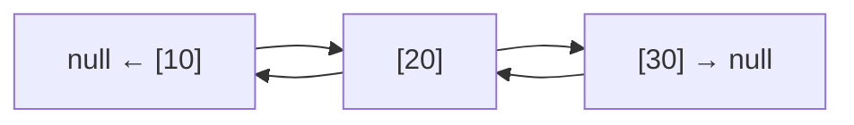

### 5. Syntax
```java
LinkedList<String> ll = new LinkedList<>();
ll.add("A");
ll.addFirst("B");       // B, A
ll.addLast("C");        // B, A, C
ll.getFirst();          // B
ll.getLast();            // C
ll.removeFirst();       // A, C
ll.push("X");           // Stack: X, A, C
ll.pop();               // Stack: A, C
ll.offer("Y");          // Queue: A, C, Y
ll.poll();              // Queue: C, Y
```

### 6. Example
```java
public class LinkedListDemo {
    public static void main(String[] args) {
        LinkedList<Integer> ll = new LinkedList<>();
        ll.add(10); ll.add(20); ll.add(30);
        ll.add(1, 15); // [10, 15, 20, 30]
        System.out.println(ll.get(2)); // 20 (O(n) traversal!)
    }
}
```

### 7. Dry Run
1. `add(10)`: Create Node(10). head = tail = Node(10).
2. `add(20)`: Create Node(20). Node(10).next = Node(20). Node(20).prev = Node(10). tail = Node(20).
3. `add(30)`: Similar. Chain: 10 ↔ 20 ↔ 30.
4. `add(1, 15)`: Traverse to index 1 (Node 20). Insert Node(15) between Node(10) and Node(20).
5. `get(2)`: Start from head, traverse 2 nodes → Node(20). Return 20.

### 8. Real World Example
- **Music playlist**: Previous/Next song navigation.
- **Browser history**: Back/Forward functionality.

### 9. Advantages
- O(1) insertion/deletion at head and tail. Great for implementing stacks and queues.
- No resizing overhead (no internal array to copy).

### 10. Disadvantages
- O(n) random access. Much slower than ArrayList for indexed access.
- Each element carries overhead of 2 extra pointers (prev, next), consuming more memory.

### 11. Interview Questions
> [!NOTE]
> **Q1: When to use ArrayList vs LinkedList?**
> A: ArrayList for frequent reads/random access. LinkedList for frequent additions/removals at head/tail.

### 12. Common Mistakes
> [!CAUTION]
> Using `get(index)` in a loop on LinkedList. This is O(n²). Use an Iterator instead.

### 13. Best Practices
> [!TIP]
> Use LinkedList primarily as a `Deque` (double-ended queue) rather than a random-access `List`.

### 14. FAQs
- **Does LinkedList implement Queue?** Yes, via the `Deque` interface.

### 15. Revision Notes
- LinkedList = Doubly-linked nodes. O(1) add/remove at ends. O(n) get.
- Implements `List` + `Deque`. Can be used as Stack, Queue, or List.

---

## 9.3 HashSet, LinkedHashSet, and TreeSet

### 1. Definition
- **HashSet**: Unordered collection that stores unique elements using a `HashMap` internally.
- **LinkedHashSet**: Maintains insertion order using a linked list internally.
- **TreeSet**: Stores elements in sorted (natural/comparator) order using a Red-Black Tree.

### 2. Why It Exists
When you need to ensure **no duplicate elements**, Sets are the ideal choice. Each implementation offers different ordering guarantees and performance characteristics.

### 3. Internal Working
- **HashSet**: Internally uses `HashMap<E, PRESENT>` where `PRESENT` is a dummy Object. The element is the key.
- **LinkedHashSet**: Extends `HashSet` but uses a `LinkedHashMap` to maintain insertion order via a doubly-linked list.
- **TreeSet**: Uses a `TreeMap` (Red-Black Tree) for sorted storage. Elements must be `Comparable` or a `Comparator` must be provided.

### 4. Architecture (Comparison Table)

| Feature | HashSet | LinkedHashSet | TreeSet |
| :--- | :--- | :--- | :--- |
| Ordering | No order | Insertion order | Sorted order |
| Underlying DS | HashMap | LinkedHashMap | TreeMap (Red-Black Tree) |
| Null allowed | Yes (one) | Yes (one) | No (throws NPE) |
| Performance | O(1) | O(1) | O(log n) |
| Thread Safe | No | No | No |

### 5. Syntax
```java
Set<String> hashSet = new HashSet<>();
hashSet.add("Banana"); hashSet.add("Apple"); hashSet.add("Cherry");
hashSet.add("Apple"); // Duplicate ignored
// Output order: unpredictable

Set<String> linkedSet = new LinkedHashSet<>();
linkedSet.add("Banana"); linkedSet.add("Apple"); linkedSet.add("Cherry");
// Output order: Banana, Apple, Cherry (insertion order)

Set<String> treeSet = new TreeSet<>();
treeSet.add("Banana"); treeSet.add("Apple"); treeSet.add("Cherry");
// Output order: Apple, Banana, Cherry (sorted)
```

### 6. Example
```java
public class SetDemo {
    public static void main(String[] args) {
        Set<Integer> set = new HashSet<>(Arrays.asList(5, 3, 8, 3, 1, 5));
        System.out.println(set); // [1, 3, 5, 8] (duplicates removed, no order)
        System.out.println(set.contains(3)); // true — O(1)
        set.remove(8);
    }
}
```

### 7. Dry Run (HashSet.add)
1. `add("Apple")`: `hashCode("Apple")` → bucket index (e.g., 5). Bucket empty → add.
2. `add("Banana")`: `hashCode("Banana")` → bucket 2. Add.
3. `add("Apple")`: `hashCode("Apple")` → bucket 5. Bucket has "Apple". `equals()` check → same → NOT added. Returns `false`.

### 8. Real World Example
- **Removing duplicates**: `new ArrayList<>(new HashSet<>(listWithDuplicates))`.
- **Unique visitors**: Track unique IP addresses.

### 9. Advantages
- O(1) add/remove/contains for HashSet. Extremely fast lookups.
- TreeSet provides automatic sorting without manual `sort()` calls.

### 10. Disadvantages
- HashSet has no ordering guarantee. TreeSet is slower at O(log n).

### 11. Interview Questions
> [!NOTE]
> **Q1: How does HashSet ensure uniqueness?**
> A: It uses `hashCode()` to find the bucket, then `equals()` to check for duplicates. If both match, the element is rejected.
>
> **Q2: Can TreeSet contain null?**
> A: No. `compareTo()` on null throws `NullPointerException`.

### 12. Common Mistakes
> [!CAUTION]
> Storing mutable objects in a HashSet and then modifying the fields used in `hashCode()`. This makes the object "lost" in the set since it's now in the wrong bucket.

### 13. Best Practices
> [!TIP]
> Use `HashSet` for fastest performance, `LinkedHashSet` to preserve insertion order, `TreeSet` for sorted data.

### 14. FAQs
- **Can we convert a List to a Set?** Yes. `Set<T> set = new HashSet<>(list);` removes duplicates.

### 15. Revision Notes
- HashSet = Fast (O(1)), no order. LinkedHashSet = Insertion order. TreeSet = Sorted (O(log n)).
- All sets reject duplicates using `hashCode()` + `equals()`.

---

## 9.4 HashMap, LinkedHashMap, TreeMap, Hashtable, and ConcurrentHashMap

### 1. Definition
- **HashMap**: Stores key-value pairs using hashing. Unordered. Allows one null key and multiple null values.
- **LinkedHashMap**: Maintains insertion order (or access order).
- **TreeMap**: Stores entries sorted by key using a Red-Black Tree.
- **Hashtable**: Legacy, synchronized version of HashMap. Does NOT allow null keys or values.
- **ConcurrentHashMap**: Thread-safe, high-performance alternative to Hashtable using segment-level locking.

### 2. Why It Exists
Maps provide O(1) average-time key-value lookups, making them ideal for caches, indexes, and any scenario requiring fast data retrieval by key.

### 3. Internal Working (HashMap)
1. **Hashing**: `hashCode()` of the key determines the bucket index.
2. **Bucket Array**: An array of `Node` (linked list) or `TreeNode` (Red-Black Tree for buckets with 8+ entries — Java 8+).
3. **Collision Handling**: If two keys hash to the same bucket, they are stored in a linked list (or tree) at that bucket.
4. **Load Factor**: Default 0.75. When `size > capacity * loadFactor`, the array doubles and all entries are **rehashed**.

### 4. Architecture (HashMap Internal)
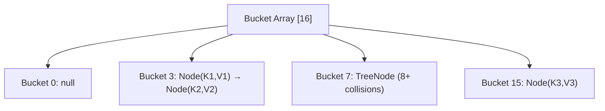

**Comparison Table:**

| Feature | HashMap | LinkedHashMap | TreeMap | Hashtable | ConcurrentHashMap |
| :--- | :--- | :--- | :--- | :--- | :--- |
| Order | No | Insertion | Sorted by key | No | No |
| Null keys | 1 allowed | 1 allowed | No | No | No |
| Thread safe | No | No | No | Yes (slow) | Yes (fast) |
| Performance | O(1) | O(1) | O(log n) | O(1) | O(1) |

### 5. Syntax
```java
Map<String, Integer> map = new HashMap<>();
map.put("Java", 1);
map.put("Python", 2);
map.put("Java", 3);     // Overwrites: "Java" → 3
map.get("Java");         // 3
map.containsKey("Python"); // true
map.remove("Python");
map.getOrDefault("C++", 0); // 0

// Iteration
for(Map.Entry<String, Integer> entry : map.entrySet()) {
    System.out.println(entry.getKey() + " = " + entry.getValue());
}

map.forEach((k, v) -> System.out.println(k + " = " + v));
```

### 6. Example
```java
public class HashMapDemo {
    public static void main(String[] args) {
        // Count character frequency
        String s = "hello";
        Map<Character, Integer> freq = new HashMap<>();
        for(char c : s.toCharArray()) {
            freq.put(c, freq.getOrDefault(c, 0) + 1);
        }
        System.out.println(freq); // {h=1, e=1, l=2, o=1}
    }
}
```

### 7. Dry Run (HashMap.put)
1. `put("Java", 1)`: `hashCode("Java")` → bucket index (e.g., 5). Bucket empty → create `Node("Java", 1)`.
2. `put("Python", 2)`: `hashCode("Python")` → bucket 12. Create `Node("Python", 2)`.
3. `put("Java", 3)`: `hashCode("Java")` → bucket 5. Found existing "Java" via `equals()`. Overwrite value: 1 → 3.

### 8. Real World Example
- **Caching**: In-memory cache storing user IDs mapped to user objects.
- **Configuration**: Key-value pairs for application settings.
- **Frequency counting**: Word count, character count algorithms.

### 9. Advantages
- O(1) average get/put operations.
- Extremely versatile for key-value data modeling.

### 10. Disadvantages
- HashMap is not thread-safe. Use `ConcurrentHashMap` for multi-threaded scenarios.
- Hash collisions can degrade performance to O(n) in worst case (mitigated by treeification in Java 8+).

### 11. Interview Questions
> [!NOTE]
> **Q1: What happens when two keys have the same hashCode?**
> A: **Collision**. Both entries are stored in the same bucket. In Java 7, as a linked list. In Java 8+, if the bucket exceeds 8 entries, the linked list converts to a balanced Red-Black Tree for O(log n) lookup.
>
> **Q2: Why is initial capacity a power of 2?**
> A: HashMap uses `hash & (n-1)` instead of `hash % n` for bucket index calculation. This bitwise AND operation is faster and works correctly only when n is a power of 2.
>
> **Q3: Difference between HashMap and ConcurrentHashMap?**
> A: HashMap is not thread-safe. ConcurrentHashMap uses segment-level (or node-level in Java 8+) locking, allowing multiple threads to read/write concurrently without blocking each other.

### 12. Common Mistakes
> [!CAUTION]
> - Using mutable objects as HashMap keys. If the key's `hashCode()` changes after insertion, the entry becomes unretrievable.
> - Confusing `HashMap` (allows null key) with `ConcurrentHashMap` (throws NPE on null key).

### 13. Best Practices
> [!TIP]
> - Use immutable objects (String, Integer) as keys.
> - Specify initial capacity if you know the approximate size to avoid rehashing: `new HashMap<>(expectedSize * 4/3 + 1)`.

### 14. FAQs
- **What is the default capacity and load factor?** Capacity = 16, Load factor = 0.75. Rehash occurs at 16 * 0.75 = 12 entries.

### 15. Revision Notes
- HashMap = O(1), unordered, 1 null key. Default cap=16, load=0.75.
- Collision: LinkedList (≤8) → Red-Black Tree (>8) in Java 8+.
- ConcurrentHashMap > Hashtable (segment locking vs full synchronization).

---

## 9.5 Queue, PriorityQueue, Deque, and ArrayDeque

### 1. Definition
- **Queue**: FIFO (First In, First Out) interface.
- **PriorityQueue**: Elements are dequeued based on priority (natural ordering or Comparator), NOT insertion order.
- **Deque (Double-Ended Queue)**: Elements can be added/removed from both ends.
- **ArrayDeque**: Resizable-array implementation of `Deque`. Faster than `LinkedList` as a deque.

### 2. Why It Exists
Queues model real-world first-come-first-served scenarios (task scheduling, BFS traversal). PriorityQueue handles priority-based processing (emergency room patients, CPU task scheduling).

### 3. Internal Working
- **PriorityQueue**: Uses a **min-heap** (binary heap backed by an array). The smallest element is always at the root. `add()` and `poll()` are O(log n).
- **ArrayDeque**: Uses a circular resizable array. Head and tail pointers wrap around the array.

### 4. Architecture

| Operation | Queue | PriorityQueue | ArrayDeque |
| :--- | :--- | :--- | :--- |
| Insert | `offer()` O(1) | `offer()` O(log n) | `offerFirst/Last()` O(1) |
| Remove | `poll()` O(1) | `poll()` O(log n) | `pollFirst/Last()` O(1) |
| Peek | `peek()` O(1) | `peek()` O(1) | `peekFirst/Last()` O(1) |
| Null | Depends | NOT allowed | NOT allowed |

### 5. Syntax
```java
// Queue via LinkedList
Queue<String> queue = new LinkedList<>();
queue.offer("A"); queue.offer("B"); queue.offer("C");
queue.poll();   // "A" (FIFO)
queue.peek();   // "B"

// PriorityQueue (min-heap by default)
PriorityQueue<Integer> pq = new PriorityQueue<>();
pq.offer(30); pq.offer(10); pq.offer(20);
pq.poll();   // 10 (smallest first)

// Max-heap
PriorityQueue<Integer> maxPQ = new PriorityQueue<>(Comparator.reverseOrder());

// ArrayDeque as Stack
Deque<Integer> stack = new ArrayDeque<>();
stack.push(1); stack.push(2);
stack.pop();  // 2 (LIFO)
```

### 6. Example
```java
public class PQDemo {
    public static void main(String[] args) {
        PriorityQueue<int[]> pq = new PriorityQueue<>(
            (a, b) -> a[1] - b[1] // Sort by second element
        );
        pq.offer(new int[]{1, 30});
        pq.offer(new int[]{2, 10});
        pq.offer(new int[]{3, 20});
        
        while(!pq.isEmpty()) {
            int[] item = pq.poll();
            System.out.println("ID:" + item[0] + " Priority:" + item[1]);
        }
        // ID:2 Priority:10, ID:3 Priority:20, ID:1 Priority:30
    }
}
```

### 7. Dry Run (PriorityQueue min-heap)
1. `offer(30)`: Heap = [30].
2. `offer(10)`: Heap = [10, 30]. (10 bubbles up to root).
3. `offer(20)`: Heap = [10, 30, 20].
4. `poll()`: Remove root (10). Replace with last (20). Heapify → [20, 30]. Return 10.

### 8. Real World Example
- **Task scheduling**: OS process scheduler uses priority queues.
- **BFS graph traversal**: Uses a regular Queue.
- **Undo/Redo**: Uses Deque (double-ended stack).

### 9. Advantages
- PriorityQueue automatically maintains order without explicit sorting.
- ArrayDeque is faster than Stack class and LinkedList for stack/queue operations.

### 10. Disadvantages
- PriorityQueue does not support random access.

### 11. Interview Questions
> [!NOTE]
> **Q1: Why use ArrayDeque over Stack class?**
> A: `Stack` extends `Vector` (legacy, synchronized, slow). `ArrayDeque` is modern, unsynchronized, and faster.
>
> **Q2: Is PriorityQueue sorted?**
> A: NOT fully sorted. Only the head (root of heap) is guaranteed to be the minimum. Internal order is a heap structure.

### 12. Common Mistakes
> [!CAUTION]
> - Assuming `PriorityQueue` iteration gives sorted order. It does NOT. Only `poll()` gives sorted output.
> - Adding `null` to `PriorityQueue` or `ArrayDeque` throws `NullPointerException`.

### 13. Best Practices
> [!TIP]
> Use `ArrayDeque` instead of `Stack` for stack operations and instead of `LinkedList` for queue operations.

### 14. FAQs
- **What is the time complexity of PriorityQueue?** `offer()` = O(log n), `poll()` = O(log n), `peek()` = O(1).

### 15. Revision Notes
- Queue = FIFO. Stack = LIFO. Deque = Both.
- PriorityQueue = Min-heap. O(log n) insert/remove.
- ArrayDeque > Stack, ArrayDeque > LinkedList (for queue/stack use).

---

## 9.6 Iterator, Comparable, Comparator, and Collections Utility

### 1. Definition
- **Iterator**: Interface to traverse a collection one element at a time. Supports safe removal during iteration.
- **Comparable**: Interface (`compareTo`) for defining natural ordering of objects.
- **Comparator**: Interface (`compare`) for defining custom ordering externally.
- **Collections**: Utility class with static methods for sorting, searching, shuffling, etc.

### 2. Why It Exists
- **Iterator**: Prevents `ConcurrentModificationException` by providing a controlled way to modify collections during traversal.
- **Comparable/Comparator**: Without them, custom objects (Employee, Student) can't be sorted.
- **Collections**: Provides common algorithms so developers don't reinvent the wheel.

### 3. Internal Working
- `Comparable.compareTo()` returns negative (less than), zero (equal), or positive (greater than).
- `Comparator.compare(a, b)` does the same but externally, allowing multiple sort strategies.
- `Collections.sort()` delegates to `Arrays.sort()` which uses TimSort.

### 4. Architecture

| Feature | Comparable | Comparator |
| :--- | :--- | :--- |
| Package | `java.lang` | `java.util` |
| Method | `compareTo(T o)` | `compare(T o1, T o2)` |
| Modifies class? | Yes (implements in the class) | No (external class/lambda) |
| Sort strategies | Single (natural order) | Multiple (custom) |

### 5. Syntax
```java
// Comparable
class Student implements Comparable<Student> {
    String name; int marks;
    public int compareTo(Student s) {
        return this.marks - s.marks; // Ascending by marks
    }
}

// Comparator (using lambda)
List<Student> list = new ArrayList<>();
list.sort((s1, s2) -> s1.name.compareTo(s2.name)); // Sort by name
list.sort(Comparator.comparingInt(s -> s.marks).reversed()); // Descending

// Collections utility
Collections.sort(list);
Collections.reverse(list);
Collections.shuffle(list);
Collections.max(list);
Collections.min(list);
Collections.unmodifiableList(list);
Collections.synchronizedList(list);
```

### 6. Example
```java
public class SortDemo {
    public static void main(String[] args) {
        List<String> names = Arrays.asList("Charlie", "Alice", "Bob");
        
        Collections.sort(names); // Natural: [Alice, Bob, Charlie]
        
        names.sort(Comparator.reverseOrder()); // [Charlie, Bob, Alice]
        
        names.sort(Comparator.comparingInt(String::length)); // By length
    }
}
```

### 7. Dry Run
1. `names` = ["Charlie", "Alice", "Bob"].
2. `Collections.sort()` → TimSort compares using `String.compareTo()` → ["Alice", "Bob", "Charlie"].
3. `Comparator.reverseOrder()` → reverses natural order → ["Charlie", "Bob", "Alice"].

### 8. Real World Example
- **Sorting employees**: By name (Comparable), by salary (Comparator 1), by joining date (Comparator 2).
- **Leaderboard**: Sort players by score descending.

### 9. Advantages
- Comparable provides a default sort order.
- Comparator allows unlimited sort strategies without modifying the class.

### 10. Disadvantages
- Comparable allows only ONE natural ordering per class.

### 11. Interview Questions
> [!NOTE]
> **Q1: When to use Comparable vs Comparator?**
> A: `Comparable` for the single most natural ordering (e.g., Student by roll number). `Comparator` for alternative orderings (by name, by marks, by age).
>
> **Q2: What is `ConcurrentModificationException`?**
> A: Thrown when a collection is structurally modified while iterating (e.g., `list.remove()` inside for-each). Use `Iterator.remove()` to safely remove.

### 12. Common Mistakes
> [!CAUTION]
> - Using `list.remove()` inside a for-each loop → `ConcurrentModificationException`.
> - Forgetting to return negative/zero/positive correctly in `compareTo()`.

### 13. Best Practices
> [!TIP]
> Use `Comparator.comparing()` chained methods for clean, readable multi-field sorting:
> `list.sort(Comparator.comparing(Student::getName).thenComparingInt(Student::getMarks));`

### 14. FAQs
- **What is ListIterator?** Extended Iterator for Lists that supports bidirectional traversal (`hasPrevious()`, `previous()`) and modification (`set()`, `add()`).

### 15. Revision Notes
- `Comparable` = Natural order, `compareTo()`, modifies class.
- `Comparator` = Custom order, `compare()`, external, lambda-friendly.
- Use `Iterator.remove()` for safe removal during iteration.


====================================================================

# 🧬 PART X: GENERICS

## 10.1 Generic Classes, Methods, Bounded Types, and Wildcards

### 1. Definition
**Generics** enable types (classes, interfaces, methods) to operate on objects of various types while providing **compile-time type safety**. Instead of using `Object` and casting, you parameterize the type.

### 2. Why It Exists
Before Generics (pre-Java 5), collections stored `Object` references. Every retrieval required explicit casting, which could fail at runtime with `ClassCastException`. Generics move this check to compile time.

### 3. Internal Working
Generics use **Type Erasure**. The compiler replaces all type parameters with their bounds (or `Object` if unbounded) and inserts casts where necessary. At runtime, there is NO generic type information — it's purely a compile-time feature.

### 4. Architecture
```mermaid
graph TD
    A[Generics] --> B[Generic Classes]
    A --> C[Generic Methods]
    A --> D[Bounded Types]
    A --> E[Wildcards]
    D --> F["Upper Bound: extends"]
    D --> G["Lower Bound: super"]
    E --> H["? - Unknown"]
    E --> I["? extends T - Upper"]
    E --> J["? super T - Lower"]
```

### 5. Syntax
```java
// Generic Class
class Box<T> {
    private T item;
    public void set(T item) { this.item = item; }
    public T get() { return item; }
}

// Generic Method
public static <T> void printArray(T[] arr) {
    for(T elem : arr) System.out.print(elem + " ");
}

// Bounded Type
class Calculator<T extends Number> {
    T num;
    double square() { return num.doubleValue() * num.doubleValue(); }
}

// Wildcards
void printList(List<?> list) { }              // Any type
void sumList(List<? extends Number> list) { }  // Number or subclass
void addInts(List<? super Integer> list) { }   // Integer or superclass
```

### 6. Example
```java
public class GenericsDemo {
    public static void main(String[] args) {
        Box<String> strBox = new Box<>();
        strBox.set("Java");
        String val = strBox.get(); // No casting needed!
        
        Box<Integer> intBox = new Box<>();
        intBox.set(42);
        int num = intBox.get(); // Auto-unboxing
        
        // intBox.set("Hello"); // COMPILE ERROR! Type safety!
    }
}
```

### 7. Dry Run
1. `Box<String>` → Compiler replaces `T` with `String` at compile time.
2. `strBox.set("Java")` → Type-checked as `set(String item)`.
3. `strBox.get()` → Returns `String`. No cast needed.
4. At runtime, type erasure means `Box<String>` and `Box<Integer>` are both just `Box` with `Object` fields.

### 8. Real World Example
- **Collections Framework**: `ArrayList<E>`, `HashMap<K,V>` — all generic.
- **API Design**: `Optional<T>`, `CompletableFuture<T>`.

### 9. Advantages
- Compile-time type safety eliminates `ClassCastException`.
- Code reusability (one `Box<T>` works for any type).
- Cleaner code (no explicit casts).

### 10. Disadvantages
- Cannot use primitives: `Box<int>` is illegal. Must use `Box<Integer>`.
- Type erasure means no runtime type info: `if(obj instanceof Box<String>)` is illegal.
- Cannot create generic arrays: `new T[10]` is illegal.

### 11. Interview Questions
> [!NOTE]
> **Q1: What is Type Erasure?**
> A: The compiler removes all generic type information after compilation. `List<String>` becomes just `List` at runtime. This ensures backward compatibility with pre-Generics code.
>
> **Q2: Difference between `? extends T` and `? super T`?**
> A: `? extends T` (Upper Bounded): Read-only. Can read as T. Used for consumers of data (PECS: Producer Extends).
> `? super T` (Lower Bounded): Write-only. Can add T. Used for producers of data (PECS: Consumer Super).
>
> **Q3: What is PECS?**
> A: **Producer Extends, Consumer Super**. If a collection produces data (you read from it), use `extends`. If it consumes data (you write to it), use `super`.

### 12. Common Mistakes
> [!CAUTION]
> - `List<Object>` is NOT a supertype of `List<String>`. Generics are invariant.
> - `List<?>` means "list of unknown type" — you can read from it but NOT add to it (except null).

### 13. Best Practices
> [!TIP]
> Always prefer `List<String>` over raw types `List`. Raw types bypass type checking completely.

### 14. FAQs
- **Can we overload methods with different generic types?** `void m(List<String> l)` and `void m(List<Integer> l)` — NO. After erasure, both become `void m(List l)`.

### 15. Revision Notes
- Generics = Compile-time type safety. Erased at runtime.
- `<T>` = Type parameter. `<?>` = Wildcard.
- PECS: Producer `extends`, Consumer `super`.

====================================================================

# 🧵 PART XI: MULTITHREADING

## 11.1 Threads, Thread Lifecycle, and Creation

### 1. Definition
A **Thread** is the smallest unit of execution within a process. **Multithreading** is the concurrent execution of two or more threads to maximize CPU utilization.

### 2. Why It Exists
Modern CPUs have multiple cores. Without threads, a program runs on a single core, wasting the others. Multithreading enables parallel execution of tasks — a web server handling multiple requests simultaneously, a UI remaining responsive while a background task runs.

### 3. Internal Working
The JVM creates a **main thread** when the program starts. Additional threads can be created by extending `Thread` or implementing `Runnable`. The **Thread Scheduler** (OS-level) decides which thread runs when, using preemptive scheduling.

### 4. Architecture (Thread Lifecycle)
```mermaid
stateDiagram-v2
    [*] --> New: new Thread()
    New --> Runnable: start()
    Runnable --> Running: Scheduler picks
    Running --> Runnable: yield() / time slice
    Running --> Blocked: wait() / sleep() / IO
    Blocked --> Runnable: notify() / timeout
    Running --> Terminated: run() completes
```

### 5. Syntax
```java
// Method 1: Extending Thread
class MyThread extends Thread {
    public void run() { System.out.println("Thread running"); }
}

// Method 2: Implementing Runnable (Preferred)
class MyRunnable implements Runnable {
    public void run() { System.out.println("Runnable running"); }
}

// Method 3: Lambda (Java 8+)
Thread t = new Thread(() -> System.out.println("Lambda thread"));
```

### 6. Example
```java
public class ThreadDemo {
    public static void main(String[] args) {
        Thread t1 = new Thread(() -> {
            for(int i = 0; i < 5; i++) {
                System.out.println("Thread-1: " + i);
                try { Thread.sleep(100); } catch(InterruptedException e) {}
            }
        });
        
        Thread t2 = new Thread(() -> {
            for(int i = 0; i < 5; i++) {
                System.out.println("Thread-2: " + i);
                try { Thread.sleep(100); } catch(InterruptedException e) {}
            }
        });
        
        t1.start(); // NOT t1.run()!
        t2.start();
    }
}
```

### 7. Dry Run
1. `t1.start()` → JVM creates a new OS-level thread. Calls `t1.run()` in the new thread.
2. `t2.start()` → Another new thread. Calls `t2.run()`.
3. `main` thread, `t1`, and `t2` run **concurrently**. Output is interleaved and non-deterministic.

### 8. Real World Example
- **Web server**: Each incoming HTTP request is handled by a separate thread.
- **Video player**: One thread for video rendering, one for audio, one for UI controls.

### 9. Advantages
- Maximizes CPU utilization on multi-core processors.
- Improves responsiveness (UI thread remains responsive).

### 10. Disadvantages
- Thread creation is expensive (memory for stack, OS resources).
- Race conditions, deadlocks, and debugging complexity.

### 11. Interview Questions
> [!NOTE]
> **Q1: Difference between `start()` and `run()`?**
> A: `start()` creates a new thread and invokes `run()` in that thread. Calling `run()` directly executes it in the current thread (no multithreading).
>
> **Q2: Runnable vs Thread?**
> A: Implementing `Runnable` is preferred because Java doesn't support multiple inheritance. Extending `Thread` wastes the single inheritance slot.
>
> **Q3: What is a Daemon thread?**
> A: A background thread (e.g., Garbage Collector) that doesn't prevent JVM shutdown. Set via `t.setDaemon(true)`.

### 12. Common Mistakes
> [!CAUTION]
> - Calling `t.run()` instead of `t.start()` — this runs synchronously in the calling thread.
> - Calling `start()` twice on the same thread → `IllegalThreadStateException`.

### 13. Best Practices
> [!TIP]
> Always implement `Runnable` (or use lambdas) instead of extending `Thread`. Use thread pools (`ExecutorService`) instead of creating threads manually.

### 14. FAQs
- **What is `Thread.sleep()`?** Pauses the current thread for specified milliseconds. Does NOT release locks.

### 15. Revision Notes
- Thread creation: `extends Thread` or `implements Runnable`.
- `start()` creates new thread. `run()` executes in current thread.
- States: New → Runnable → Running → Blocked → Terminated.

---

## 11.2 Synchronization, Deadlock, and Inter-Thread Communication

### 1. Definition
- **Synchronization**: Mechanism to control thread access to shared resources using locks/monitors.
- **Deadlock**: A situation where two or more threads are blocked forever, each waiting for the other's lock.
- **Inter-Thread Communication**: Threads communicate using `wait()`, `notify()`, and `notifyAll()`.

### 2. Why It Exists
When multiple threads access shared mutable data concurrently, **race conditions** occur — the outcome depends on thread scheduling order, leading to inconsistent or corrupted data.

### 3. Internal Working
Every Java object has an intrinsic lock (monitor). When a thread enters a `synchronized` block/method, it acquires the lock. Other threads trying to acquire the same lock are **blocked** until the lock is released.

### 4. Architecture
```java
class Counter {
    private int count = 0;
    
    // Synchronized method
    synchronized void increment() { count++; }
    
    // Synchronized block (more granular)
    void decrement() {
        synchronized(this) {
            count--;
        }
    }
}
```

**Deadlock Scenario:**
```mermaid
graph LR
    A[Thread 1 holds Lock A] --> B[Waiting for Lock B]
    C[Thread 2 holds Lock B] --> D[Waiting for Lock A]
    B -.-> C
    D -.-> A
```

### 5. Syntax
```java
// wait-notify
class SharedResource {
    private boolean available = false;
    
    synchronized void produce() throws InterruptedException {
        while(available) wait();     // Wait if already produced
        System.out.println("Produced");
        available = true;
        notify();                    // Notify consumer
    }
    
    synchronized void consume() throws InterruptedException {
        while(!available) wait();    // Wait if nothing to consume
        System.out.println("Consumed");
        available = false;
        notify();                    // Notify producer
    }
}
```

### 6. Example (Race Condition Fix)
```java
class BankAccount {
    private int balance = 1000;
    
    synchronized void withdraw(int amount) {
        if(balance >= amount) {
            balance -= amount;
            System.out.println(Thread.currentThread().getName() + " withdrew " + amount);
        }
    }
    
    synchronized int getBalance() { return balance; }
}
```

### 7. Dry Run (Without synchronization)
1. Balance = 1000. T1 checks `1000 >= 800` → true.
2. Context switch! T2 checks `1000 >= 800` → true.
3. T1 withdraws: `balance = 200`.
4. T2 withdraws: `balance = -600`. **RACE CONDITION!**
With `synchronized`, T2 would wait until T1 finishes.

### 8. Real World Example
- **Bank transactions**: Synchronized withdrawal to prevent negative balance.
- **Producer-Consumer pattern**: Buffer shared between producer and consumer threads.

### 9. Advantages
- Ensures data consistency in multi-threaded environments.
- `wait()`/`notify()` enable efficient inter-thread communication without busy-waiting.

### 10. Disadvantages
- Synchronization reduces performance due to lock contention.
- Improper lock ordering causes deadlocks.

### 11. Interview Questions
> [!NOTE]
> **Q1: How to prevent deadlock?**
> A: Always acquire locks in a consistent global order. Use timeouts (`tryLock`). Avoid nested locks. Use `java.util.concurrent` utilities.
>
> **Q2: Difference between `wait()` and `sleep()`?**
> A: `wait()` releases the lock and must be called inside `synchronized`. `sleep()` does NOT release the lock and can be called anywhere.
>
> **Q3: What is a race condition?**
> A: When the program's output depends on the scheduling order of threads, leading to unpredictable results.

### 12. Common Mistakes
> [!CAUTION]
> - Calling `wait()` outside a `synchronized` block → `IllegalMonitorStateException`.
> - Using `if` instead of `while` for `wait()` condition → spurious wakeup bug.

### 13. Best Practices
> [!TIP]
> Always use `while` loops for wait conditions, never `if`. Prefer `java.util.concurrent` classes (ReentrantLock, Semaphore) over raw `synchronized`.

### 14. FAQs
- **What is `volatile`?** Ensures visibility of changes across threads. A `volatile` variable is always read from main memory, not from a thread's local cache.

### 15. Revision Notes
- `synchronized` = Mutual exclusion via object monitor.
- `wait()` = Release lock + sleep. `notify()` = Wake one waiting thread.
- Deadlock = Circular lock dependency. Prevent with consistent lock ordering.

---

## 11.3 Executor Framework, Callable, and Future

### 1. Definition
The **Executor Framework** (`java.util.concurrent`) provides a higher-level API for managing thread pools, replacing manual thread creation. `Callable<V>` is like `Runnable` but returns a value. `Future<V>` represents the result of an asynchronous computation.

### 2. Why It Exists
Creating threads manually is expensive and error-prone. Thread pools reuse a fixed number of threads, reducing creation overhead and managing resources efficiently.

### 3. Internal Working
`ExecutorService` maintains a pool of worker threads and a task queue. When `submit()` is called, the task is placed in the queue. An idle thread picks it up and executes it. `Future.get()` blocks until the result is available.

### 4. Architecture
```mermaid
graph TD
    A[Client submits tasks] --> B[ExecutorService]
    B --> C[Task Queue]
    C --> D[Thread 1]
    C --> E[Thread 2]
    C --> F[Thread N]
    D --> G[Future result]
```

### 5. Syntax
```java
ExecutorService executor = Executors.newFixedThreadPool(3);

// Runnable (no return)
executor.submit(() -> System.out.println("Task 1"));

// Callable (returns value)
Future<Integer> future = executor.submit(() -> {
    Thread.sleep(1000);
    return 42;
});

int result = future.get(); // Blocks until result ready
System.out.println(result); // 42

executor.shutdown(); // Graceful shutdown
```

### 6. Example
```java
public class ExecutorDemo {
    public static void main(String[] args) throws Exception {
        ExecutorService pool = Executors.newFixedThreadPool(2);
        
        List<Future<Integer>> futures = new ArrayList<>();
        for(int i = 1; i <= 5; i++) {
            final int num = i;
            futures.add(pool.submit(() -> num * num));
        }
        
        for(Future<Integer> f : futures) {
            System.out.println(f.get()); // 1, 4, 9, 16, 25
        }
        
        pool.shutdown();
    }
}
```

### 7. Dry Run
1. Pool created with 2 threads.
2. 5 tasks submitted. Tasks 1 & 2 start immediately. Tasks 3, 4, 5 wait in queue.
3. When a thread finishes, it picks the next task from the queue.
4. `future.get()` blocks until each result is ready.

### 8. Real World Example
- **Web servers**: Thread pool handling HTTP requests.
- **Batch processing**: Processing thousands of records with a fixed thread pool.

### 9. Advantages
- Thread reuse reduces creation overhead. Controlled resource usage.
- `Callable` + `Future` enable returning results from async tasks.

### 10. Disadvantages
- `future.get()` blocks the calling thread. Use `CompletableFuture` for non-blocking.

### 11. Interview Questions
> [!NOTE]
> **Q1: Runnable vs Callable?**
> A: `Runnable.run()` returns `void` and cannot throw checked exceptions. `Callable.call()` returns a value and can throw checked exceptions.
>
> **Q2: Types of thread pools?**
> A: `newFixedThreadPool(n)`, `newCachedThreadPool()`, `newSingleThreadExecutor()`, `newScheduledThreadPool(n)`.

### 12. Common Mistakes
> [!CAUTION]
> - Forgetting `executor.shutdown()` → JVM won't exit because non-daemon pool threads keep running.
> - Not handling `ExecutionException` from `future.get()`.

### 13. Best Practices
> [!TIP]
> Always shutdown executors in a `finally` block. Use `CompletableFuture` (Java 8+) for chaining async operations.

### 14. FAQs
- **What is `CompletableFuture`?** An advanced `Future` that supports non-blocking callbacks via `thenApply()`, `thenAccept()`, and composition via `thenCompose()`.

### 15. Revision Notes
- `ExecutorService` = Thread pool manager.
- `Callable` = Returns value. `Runnable` = Returns void.
- `Future.get()` = Blocking. `CompletableFuture` = Non-blocking.

====================================================================

# 📂 PART XII: FILE HANDLING

## 12.1 File Class, Reading, Writing, and Streams

### 1. Definition
Java provides the `java.io` package for file operations. The `File` class represents file/directory paths. Reading/writing is done via character streams (`FileReader`/`FileWriter`) or byte streams (`FileInputStream`/`FileOutputStream`). Buffered wrappers improve performance.

### 2. Why It Exists
Applications must persist data beyond the runtime of a program — configuration files, logs, user data, reports, etc.

### 3. Internal Working
- **Character Streams** (`Reader`/`Writer`): Handle text data, converting between bytes and characters using a charset.
- **Byte Streams** (`InputStream`/`OutputStream`): Handle raw binary data.
- **Buffered Streams**: Wrap basic streams with an internal buffer (default 8KB), reducing the number of physical I/O operations.

### 4. Architecture
```mermaid
graph TD
    A[Java IO] --> B[Byte Streams]
    A --> C[Character Streams]
    B --> D[FileInputStream]
    B --> E[FileOutputStream]
    B --> F[BufferedInputStream]
    C --> G[FileReader]
    C --> H[FileWriter]
    C --> I[BufferedReader]
    C --> J[BufferedWriter]
```

### 5. Syntax
```java
// Writing
try(BufferedWriter bw = new BufferedWriter(new FileWriter("output.txt"))) {
    bw.write("Hello, Java!");
    bw.newLine();
    bw.write("File Handling Demo");
}

// Reading
try(BufferedReader br = new BufferedReader(new FileReader("output.txt"))) {
    String line;
    while((line = br.readLine()) != null) {
        System.out.println(line);
    }
}

// File operations
File f = new File("output.txt");
f.exists();       // true
f.length();       // size in bytes
f.getName();      // "output.txt"
f.delete();       // deletes file
```

### 6. Example
```java
public class FileDemo {
    public static void main(String[] args) {
        // Write
        try(FileWriter fw = new FileWriter("data.txt", true)) { // true = append
            fw.write("Line 1\n");
            fw.write("Line 2\n");
        } catch(IOException e) {
            e.printStackTrace();
        }
        
        // Read
        try(BufferedReader br = new BufferedReader(new FileReader("data.txt"))) {
            br.lines().forEach(System.out::println); // Java 8 Stream
        } catch(IOException e) {
            e.printStackTrace();
        }
    }
}
```

### 7. Dry Run
1. `FileWriter("data.txt", true)` opens file in append mode. Creates if not exists.
2. `write("Line 1\n")` → data written to internal buffer.
3. On `close()` (auto via try-with-resources), buffer is flushed to disk.
4. `BufferedReader` reads file line by line into an internal 8KB buffer.

### 8. Real World Example
- **Logging**: Writing application logs to files.
- **Configuration**: Reading `.properties` or `.yaml` files.
- **Data export**: Writing CSV/JSON files.

### 9. Advantages
- Try-with-resources ensures streams are always closed (no resource leaks).
- Buffered streams dramatically improve I/O performance.

### 10. Disadvantages
- Verbose API (many wrapper classes).
- `java.io` is blocking. For non-blocking I/O, use `java.nio`.

### 11. Interview Questions
> [!NOTE]
> **Q1: Difference between FileReader and BufferedReader?**
> A: `FileReader` reads character by character (slow). `BufferedReader` buffers chunks (fast) and provides `readLine()`.
>
> **Q2: What is try-with-resources?**
> A: A try statement that automatically closes resources implementing `AutoCloseable` when the block exits.

### 12. Common Mistakes
> [!CAUTION]
> - Not closing streams → resource/memory leaks. Always use try-with-resources.
> - `FileWriter("file.txt")` overwrites by default. Use `FileWriter("file.txt", true)` to append.

### 13. Best Practices
> [!TIP]
> Always use `BufferedReader`/`BufferedWriter` instead of raw `FileReader`/`FileWriter`. Use `java.nio.file.Files` (Java 7+) for modern, simpler file operations.

### 14. FAQs
- **What is `flush()`?** Forces buffered data to be written to the underlying stream immediately, without waiting for the buffer to fill.

### 15. Revision Notes
- Character streams = Text. Byte streams = Binary.
- Always buffer. Always use try-with-resources.
- `FileWriter(file, true)` = Append mode.

---

## 12.2 Serialization and Deserialization

### 1. Definition
**Serialization** is converting an object's state to a byte stream (for storage or transmission). **Deserialization** is reconstructing the object from the byte stream. A class must implement `java.io.Serializable`.

### 2. Why It Exists
To persist object state to disk, send objects over a network (RMI, sockets), or cache objects in distributed systems (Redis, Memcached).

### 3. Internal Working
`ObjectOutputStream.writeObject()` traverses the object graph, converting each field to bytes. `transient` fields are skipped. `serialVersionUID` is used to verify class compatibility during deserialization.

### 4. Architecture
```java
class Employee implements Serializable {
    private static final long serialVersionUID = 1L;
    String name;
    int age;
    transient String password; // NOT serialized
}
```

### 5. Syntax
```java
// Serialize
try(ObjectOutputStream oos = new ObjectOutputStream(
        new FileOutputStream("employee.ser"))) {
    oos.writeObject(new Employee("Omkar", 22, "secret"));
}

// Deserialize
try(ObjectInputStream ois = new ObjectInputStream(
        new FileInputStream("employee.ser"))) {
    Employee e = (Employee) ois.readObject();
    System.out.println(e.name);     // "Omkar"
    System.out.println(e.password); // null (transient)
}
```

### 6. Example
(Covered in syntax above)

### 7. Dry Run
1. `writeObject(emp)` → converts `name="Omkar"`, `age=22` to bytes. `password` is `transient` → skipped.
2. Bytes written to `employee.ser` file.
3. `readObject()` reads bytes → reconstructs `Employee` object.
4. `password` is `null` because it was not serialized.

### 8. Real World Example
- **Session management**: Serializing HTTP session objects in web servers.
- **Distributed caching**: Serializing objects to store in Redis.

### 9. Advantages
- Platform-independent object persistence.
- Built-in support via `Serializable` marker interface.

### 10. Disadvantages
- Security risk: Deserialization of untrusted data can execute arbitrary code.
- `serialVersionUID` mismatch causes `InvalidClassException`.

### 11. Interview Questions
> [!NOTE]
> **Q1: What is `transient` keyword?**
> A: Marks a field to be excluded from serialization. Useful for sensitive data (passwords) or non-serializable fields.
>
> **Q2: What is `serialVersionUID`?**
> A: A version identifier for the class. If the sender and receiver have different UIDs, deserialization fails with `InvalidClassException`.

### 12. Common Mistakes
> [!CAUTION]
> - Not defining `serialVersionUID` → JVM auto-generates one, which may differ across compilers/versions.
> - Trying to serialize a class that contains a non-serializable field → `NotSerializableException`.

### 13. Best Practices
> [!TIP]
> Always declare `serialVersionUID` explicitly. Use `transient` for sensitive and computed fields. Prefer JSON/Protobuf over Java serialization for modern applications.

### 14. FAQs
- **Can static fields be serialized?** No. Static fields belong to the class, not the object.

### 15. Revision Notes
- `Serializable` = Marker interface. `transient` = Skip field.
- `serialVersionUID` = Version control for class compatibility.
- Static fields are NOT serialized.

====================================================================

# ⚡ PART XIII: JAVA 8+ FEATURES

## 13.1 Lambda Expressions and Functional Interfaces

### 1. Definition
A **Lambda Expression** is a concise representation of an anonymous function (a function with no name). A **Functional Interface** is an interface with exactly ONE abstract method (e.g., `Runnable`, `Comparator`, `Predicate`).

### 2. Why It Exists
Before Java 8, simple operations required verbose anonymous inner classes. Lambdas enable **functional programming** in Java — treating functions as first-class citizens, leading to cleaner, more expressive code.

### 3. Internal Working
Lambdas are NOT anonymous inner classes. The JVM uses `invokedynamic` bytecode instruction to create a lambda instance at runtime without creating a `.class` file. This is more memory-efficient and faster than inner classes.

### 4. Architecture
```mermaid
graph TD
    A[Functional Interface] --> B["@FunctionalInterface annotation"]
    A --> C[Exactly 1 abstract method]
    A --> D[Can have default/static methods]
    
    E[Lambda Expression] --> F["(params) -> expression"]
    E --> G["(params) -> { statements }"]
    E --> H[Method Reference]
```

### 5. Syntax
```java
// No params
Runnable r = () -> System.out.println("Hello");

// One param (parentheses optional)
Consumer<String> c = s -> System.out.println(s);

// Multiple params
Comparator<Integer> comp = (a, b) -> a - b;

// Block body
Function<Integer, Integer> square = n -> {
    int result = n * n;
    return result;
};
```

### 6. Example
```java
public class LambdaDemo {
    public static void main(String[] args) {
        List<String> names = Arrays.asList("Charlie", "Alice", "Bob");
        
        // Before Java 8
        Collections.sort(names, new Comparator<String>() {
            public int compare(String a, String b) {
                return a.compareTo(b);
            }
        });
        
        // With Lambda
        names.sort((a, b) -> a.compareTo(b));
        
        // With Method Reference
        names.sort(String::compareTo);
        
        names.forEach(System.out::println);
    }
}
```

### 7. Dry Run
1. `(a, b) -> a.compareTo(b)` → JVM creates a `Comparator` implementation via `invokedynamic`.
2. `names.sort(...)` calls TimSort using this Comparator.
3. `String::compareTo` is a method reference — shorthand for the lambda.

### 8. Real World Example
- **Event handlers**: `button.setOnAction(e -> handleClick(e));`
- **Stream processing**: `list.stream().filter(x -> x > 5).collect(Collectors.toList());`
- **Thread creation**: `new Thread(() -> doWork()).start();`

### 9. Advantages
- Dramatically reduces boilerplate code.
- Enables functional programming patterns (map, filter, reduce).
- More efficient than anonymous inner classes.

### 10. Disadvantages
- Complex lambdas reduce readability. Keep them short.
- Debugging can be harder (no meaningful class name in stack traces).

### 11. Interview Questions
> [!NOTE]
> **Q1: What is a Functional Interface?**
> A: An interface with exactly one abstract method. Examples: `Runnable`, `Callable`, `Comparator`, `Predicate`, `Function`.
>
> **Q2: Can a Functional Interface have multiple methods?**
> A: Only ONE abstract method. But it can have multiple `default` and `static` methods.
>
> **Q3: What is a Method Reference?**
> A: A shorthand for a lambda that simply calls an existing method. `System.out::println` is equivalent to `x -> System.out.println(x)`.

### 12. Common Mistakes
> [!CAUTION]
> - Lambdas can only use **effectively final** local variables from the enclosing scope. Modifying a captured variable causes a compile error.

### 13. Best Practices
> [!TIP]
> Use method references when the lambda simply calls an existing method. Use `@FunctionalInterface` annotation to enforce the single-abstract-method contract.

### 14. FAQs
- **Types of Method References?** `ClassName::staticMethod`, `object::instanceMethod`, `ClassName::instanceMethod`, `ClassName::new`.

### 15. Revision Notes
- Lambda = `(params) -> body`. Functional Interface = 1 abstract method.
- Method Reference = Shorthand for lambda.
- Lambdas use `invokedynamic`, not inner classes.

---

## 13.2 Stream API

### 1. Definition
The **Stream API** provides a declarative, functional approach to processing collections of data. A Stream is a sequence of elements supporting sequential and parallel aggregate operations (filter, map, reduce, collect).

### 2. Why It Exists
Traditional collection processing uses external iteration (for loops), which is verbose and hard to parallelize. Streams provide internal iteration with lazy evaluation, enabling clean, parallelizable code.

### 3. Internal Working
Streams operate in a **pipeline**: Source → Intermediate operations (lazy) → Terminal operation (triggers execution).
- **Lazy evaluation**: Intermediate operations (filter, map) are not executed until a terminal operation (collect, forEach) is called.
- **Short-circuiting**: Operations like `findFirst()`, `anyMatch()` stop processing as soon as a result is found.

### 4. Architecture
```mermaid
graph LR
    A[Source: Collection/Array] --> B[Intermediate: filter, map, sorted]
    B --> C[Terminal: collect, forEach, reduce]
    C --> D[Result]
```

**Key Built-in Functional Interfaces:**

| Interface | Method | Input → Output |
| :--- | :--- | :--- |
| `Predicate<T>` | `test(T)` | `T → boolean` |
| `Function<T,R>` | `apply(T)` | `T → R` |
| `Consumer<T>` | `accept(T)` | `T → void` |
| `Supplier<T>` | `get()` | `() → T` |
| `UnaryOperator<T>` | `apply(T)` | `T → T` |
| `BinaryOperator<T>` | `apply(T,T)` | `(T,T) → T` |

### 5. Syntax
```java
List<Integer> nums = Arrays.asList(1, 2, 3, 4, 5, 6, 7, 8, 9, 10);

// Filter even, square them, collect to list
List<Integer> result = nums.stream()
    .filter(n -> n % 2 == 0)       // Predicate
    .map(n -> n * n)                // Function
    .collect(Collectors.toList());  // Terminal
// [4, 16, 36, 64, 100]

// Reduce (sum)
int sum = nums.stream().reduce(0, Integer::sum); // 55

// Count
long count = nums.stream().filter(n -> n > 5).count(); // 5

// Optional
Optional<Integer> first = nums.stream().filter(n -> n > 5).findFirst();
first.ifPresent(System.out::println); // 6
```

### 6. Example
```java
public class StreamDemo {
    public static void main(String[] args) {
        List<String> names = Arrays.asList("Alice", "Bob", "Charlie", "Anna", "Alex");
        
        // Names starting with 'A', uppercase, sorted
        List<String> result = names.stream()
            .filter(n -> n.startsWith("A"))
            .map(String::toUpperCase)
            .sorted()
            .collect(Collectors.toList());
        
        System.out.println(result); // [ALEX, ALICE, ANNA]
        
        // Joining
        String joined = names.stream().collect(Collectors.joining(", "));
        System.out.println(joined); // "Alice, Bob, Charlie, Anna, Alex"
        
        // Grouping
        Map<Character, List<String>> grouped = names.stream()
            .collect(Collectors.groupingBy(n -> n.charAt(0)));
        System.out.println(grouped); // {A=[Alice, Anna, Alex], B=[Bob], C=[Charlie]}
    }
}
```

### 7. Dry Run (filter + map pipeline)
1. Stream created from `names`. No processing yet (lazy).
2. `filter(n -> n.startsWith("A"))` — operation stored, not executed.
3. `map(String::toUpperCase)` — operation stored.
4. `collect(Collectors.toList())` — TERMINAL operation triggers pipeline.
5. Element "Alice": filter passes → map → "ALICE" → collected.
6. "Bob": filter fails → skipped entirely.
7. "Charlie": filter fails → skipped.
8. "Anna": filter passes → "ANNA" → collected.
9. "Alex": filter passes → "ALEX" → collected.
10. `sorted()` sorts: ["ALEX", "ALICE", "ANNA"].

### 8. Real World Example
- **Data processing**: Filtering and transforming database query results.
- **Report generation**: Aggregating statistics (sum, avg, max, grouping).
- **Parallel processing**: `nums.parallelStream().map(...)` automatically distributes work across CPU cores.

### 9. Advantages
- Declarative, readable code. No manual iteration.
- Easy parallelism with `parallelStream()`.
- Lazy evaluation improves performance for large datasets.

### 10. Disadvantages
- Debugging is harder (no intermediate variable to inspect).
- `parallelStream()` has overhead and is slower for small datasets.
- Streams are single-use — cannot be reused after a terminal operation.

### 11. Interview Questions
> [!NOTE]
> **Q1: Difference between `map()` and `flatMap()`?**
> A: `map()` applies a function to each element. `flatMap()` flattens nested structures (e.g., `Stream<List<String>>` → `Stream<String>`).
>
> **Q2: What is `Optional`?**
> A: A container that may or may not hold a value. Used to avoid `NullPointerException`. Methods: `isPresent()`, `ifPresent()`, `orElse()`, `orElseThrow()`.
>
> **Q3: Intermediate vs Terminal operations?**
> A: Intermediate (lazy, return Stream): `filter`, `map`, `sorted`, `distinct`, `limit`. Terminal (trigger execution, return result): `collect`, `forEach`, `reduce`, `count`, `findFirst`.

### 12. Common Mistakes
> [!CAUTION]
> - Reusing a stream after terminal operation → `IllegalStateException`.
> - Using `forEach` to modify external state (side effects). Streams should be side-effect free.
> - Using `parallelStream()` for I/O-bound tasks (it uses the common ForkJoinPool, which can block).

### 13. Best Practices
> [!TIP]
> Use `Collectors.toList()`, `Collectors.toMap()`, `Collectors.groupingBy()` for collecting results. Use `Optional.orElse()` or `Optional.orElseThrow()` instead of `isPresent()` + `get()`.

### 14. FAQs
- **Can Streams be infinite?** Yes! `Stream.iterate(0, n -> n + 1)` or `Stream.generate(Math::random)`. Use `limit()` to bound them.

### 15. Revision Notes
- Stream pipeline: Source → Intermediate (lazy) → Terminal (executes).
- Key operations: `filter`, `map`, `flatMap`, `sorted`, `reduce`, `collect`.
- `Optional` = Wrapper for nullable values. `orElse()` for default.
- Streams are single-use. Cannot be reused.


====================================================================

# 🔌 PART XIV: INTERFACES AND ABSTRACT CLASSES

## 14.1 Abstract Classes

### 1. Definition
An **Abstract Class** is a class that cannot be instantiated directly and may contain abstract methods (without body) and concrete methods (with body). It serves as a **blueprint** for subclasses.

### 2. Why It Exists
When you want to define a common template with some shared implementation and force subclasses to provide specific implementations for certain methods.

### 3. Internal Working
- Declared with the `abstract` keyword.
- Can have constructors (called via `super()` from subclasses).
- Can have instance variables, static methods, and final methods.
- A subclass MUST implement all abstract methods, or itself be declared abstract.

### 4. Syntax
```java
abstract class Shape {
    String color;
    
    Shape(String color) { this.color = color; }
    
    abstract double area();     // No body — subclass MUST implement
    
    void display() {            // Concrete method — inherited
        System.out.println("Color: " + color + ", Area: " + area());
    }
}

class Circle extends Shape {
    double radius;
    Circle(double r) { super("Red"); this.radius = r; }
    double area() { return Math.PI * radius * radius; }
}
```

### 5. Example
```java
public class AbstractDemo {
    public static void main(String[] args) {
        // Shape s = new Shape("Blue"); // COMPILE ERROR: cannot instantiate abstract
        Shape c = new Circle(5);
        c.display(); // Color: Red, Area: 78.53981633974483
    }
}
```

### 6. Interview Questions
> [!NOTE]
> **Q1: Can abstract class have a constructor?**
> A: Yes. It's called when a subclass is instantiated via `super()`.
>
> **Q2: Can abstract class have no abstract methods?**
> A: Yes. It simply can't be instantiated. Useful to prevent direct instantiation.
>
> **Q3: Abstract class vs Interface?**
> A: See comparison table below in 14.2.

### 7. Revision Notes
- `abstract class` = Template. Can have abstract + concrete methods.
- Cannot be instantiated. CAN have constructors, fields, access modifiers.
- Use when classes share code and behavior.

---

## 14.2 Interfaces (Including Java 8+ Features)

### 1. Definition
An **Interface** is a 100% abstract contract (pre-Java 8) that defines what a class must do. Since Java 8, interfaces can also have `default` methods (with body) and `static` methods. Since Java 9, interfaces can have `private` methods.

### 2. Why It Exists
Java doesn't support multiple inheritance of classes. Interfaces allow a class to **implement multiple contracts**, enabling polymorphism without the diamond problem.

### 3. Internal Working
- All fields are implicitly `public static final` (constants).
- All methods are implicitly `public abstract` (pre-Java 8).
- A class uses `implements` to adopt an interface.
- Java 8: `default` methods provide backward-compatible evolution of interfaces.

### 4. Architecture (Comparison Table)

| Feature | Abstract Class | Interface |
| :--- | :--- | :--- |
| Methods | Abstract + concrete | Abstract + default + static + private |
| Variables | Instance + static | Only `public static final` |
| Constructor | Yes | No |
| Inheritance | Single (`extends`) | Multiple (`implements`) |
| Access modifiers | All | Methods: public (abstract), default, private |
| When to use | Share code among related classes | Define a contract for unrelated classes |

### 5. Syntax
```java
interface Drawable {
    void draw();  // public abstract (implicit)
    
    default void render() {  // Java 8: default method
        System.out.println("Default rendering");
    }
    
    static void info() {     // Java 8: static method
        System.out.println("Drawable interface");
    }
    
    private void helper() {  // Java 9: private method
        System.out.println("Internal helper");
    }
}

// Multiple interface implementation
class Square implements Drawable, Serializable {
    public void draw() { System.out.println("Drawing Square"); }
}
```

### 6. Example (Diamond Problem Resolution)
```java
interface A { default void greet() { System.out.println("A"); } }
interface B { default void greet() { System.out.println("B"); } }

class C implements A, B {
    // MUST override to resolve conflict
    public void greet() {
        A.super.greet(); // Explicitly choose A's version
        // or B.super.greet();
    }
}
```

### 7. Interview Questions
> [!NOTE]
> **Q1: Can an interface extend another interface?**
> A: Yes. An interface can extend multiple interfaces: `interface C extends A, B { }`.
>
> **Q2: What are marker interfaces?**
> A: Interfaces with NO methods that "tag" a class for special behavior. Examples: `Serializable`, `Cloneable`, `Remote`.
>
> **Q3: Functional Interface?**
> A: An interface with exactly ONE abstract method. Used as lambda targets.

### 8. Revision Notes
- Interface = Contract. Abstract Class = Template.
- Interface: multiple inheritance allowed. Abstract class: single inheritance only.
- Java 8: `default` + `static` methods. Java 9: `private` methods.
- Marker Interface = No methods (Serializable, Cloneable).

====================================================================

# 🏗️ PART XV: INNER CLASSES AND ENUMS

## 15.1 Inner Classes (All Types)

### 1. Definition
**Inner classes** are classes defined within another class. Java supports four types:
1. **Member Inner Class**: Non-static class inside another class.
2. **Static Nested Class**: Static class inside another class.
3. **Local Inner Class**: Class defined inside a method.
4. **Anonymous Inner Class**: Class without a name, defined inline.

### 2. Why It Exists
To logically group classes that are only used in one place, increase encapsulation, and provide cleaner code organization.

### 3. Architecture (Comparison)

| Type | Has access to outer instance? | Can have static members? |
| :--- | :---: | :---: |
| Member Inner | Yes | No |
| Static Nested | No | Yes |
| Local Inner | Yes + local vars (effectively final) | No |
| Anonymous Inner | Yes + local vars (effectively final) | No |

### 4. Syntax
```java
class Outer {
    private int x = 10;
    
    // 1. Member Inner Class
    class Inner {
        void show() { System.out.println(x); } // Can access outer's private
    }
    
    // 2. Static Nested Class
    static class StaticNested {
        void show() { System.out.println("Static nested"); }
        // Cannot access x (no outer instance)
    }
    
    void method() {
        // 3. Local Inner Class
        class LocalInner {
            void show() { System.out.println(x); }
        }
        new LocalInner().show();
        
        // 4. Anonymous Inner Class
        Runnable r = new Runnable() {
            public void run() { System.out.println("Anonymous: " + x); }
        };
        r.run();
    }
}
```

### 5. Instantiation
```java
// Member Inner
Outer outer = new Outer();
Outer.Inner inner = outer.new Inner();

// Static Nested
Outer.StaticNested sn = new Outer.StaticNested();
```

### 6. Interview Questions
> [!NOTE]
> **Q1: When is Anonymous Inner Class replaced by Lambda?**
> A: When the anonymous class implements a **Functional Interface** (single abstract method). Lambdas cannot replace classes with multiple methods.

### 7. Revision Notes
- Member Inner = Needs outer instance. Static Nested = Independent.
- Anonymous Inner → Replaced by Lambdas for Functional Interfaces (Java 8+).
- Local Inner = Scoped to method. Accessed only within that method.

---

## 15.2 Enums

### 1. Definition
An **Enum** (Enumeration) is a special class that represents a group of named constants. Enums are implicitly `final` and extend `java.lang.Enum`.

### 2. Why It Exists
Before enums, constants were defined using `public static final int`. This was error-prone (any int could be passed), had no type safety, and couldn't have behavior. Enums solve all these issues.

### 3. Internal Working
Each enum constant is a `public static final` instance of the enum class, created at class loading time. Enums can have fields, constructors (private only), and methods.

### 4. Syntax
```java
enum Day {
    MONDAY, TUESDAY, WEDNESDAY, THURSDAY, FRIDAY, SATURDAY, SUNDAY;
}

// Enum with fields and methods
enum Planet {
    MERCURY(3.303e+23, 2.4397e6),
    EARTH(5.976e+24, 6.37814e6);
    
    private final double mass;
    private final double radius;
    
    Planet(double mass, double radius) {
        this.mass = mass;
        this.radius = radius;
    }
    
    double surfaceGravity() {
        return 6.67300E-11 * mass / (radius * radius);
    }
}
```

### 5. Example
```java
public class EnumDemo {
    public static void main(String[] args) {
        Day today = Day.MONDAY;
        
        // Switch
        switch(today) {
            case MONDAY: System.out.println("Start of week"); break;
            case FRIDAY: System.out.println("TGIF!"); break;
        }
        
        // Iterate
        for(Day d : Day.values()) {
            System.out.println(d + " ordinal=" + d.ordinal());
        }
        
        // String to Enum
        Day d = Day.valueOf("FRIDAY");
    }
}
```

### 6. Interview Questions
> [!NOTE]
> **Q1: Can enums implement interfaces?**
> A: Yes. Enums can implement interfaces but cannot extend classes (they already extend `Enum`).
>
> **Q2: Can enums have constructors?**
> A: Yes, but only `private` constructors. Cannot be `public` or `protected`.
>
> **Q3: Are enums Singleton?**
> A: Each constant is a singleton. Enums are the recommended way to implement the Singleton pattern (Effective Java).

### 7. Revision Notes
- Enum = Type-safe constants with behavior.
- `values()` = All constants. `valueOf(String)` = String to enum. `ordinal()` = Position.
- Enums can have fields, methods, interfaces. Constructors must be private.
- Best Singleton implementation in Java.

====================================================================

# 🪞 PART XVI: ANNOTATIONS AND REFLECTION

## 16.1 Annotations

### 1. Definition
**Annotations** are metadata tags applied to code elements (classes, methods, fields) that provide information to the compiler, runtime, or tools. They do not directly affect program logic.

### 2. Why It Exists
To replace XML configuration with inline metadata, enable compile-time checking, and support frameworks (Spring, Hibernate) that process annotations at runtime via reflection.

### 3. Key Built-in Annotations

| Annotation | Purpose |
| :--- | :--- |
| `@Override` | Compiler checks method actually overrides a parent method |
| `@Deprecated` | Marks element as obsolete; compiler warns on usage |
| `@SuppressWarnings` | Suppresses compiler warnings |
| `@FunctionalInterface` | Ensures interface has exactly one abstract method |
| `@SafeVarargs` | Suppresses heap pollution warnings for varargs |

### 4. Custom Annotations
```java
@Retention(RetentionPolicy.RUNTIME) // Available at runtime
@Target(ElementType.METHOD)          // Can only be applied to methods
@interface TestCase {
    String author() default "Unknown";
    int priority();
}

// Usage
class MyTest {
    @TestCase(author = "Omkar", priority = 1)
    void testLogin() { }
}
```

### 5. Interview Questions
> [!NOTE]
> **Q1: Retention Policies?**
> A: `SOURCE` (discarded by compiler), `CLASS` (in .class file, not runtime), `RUNTIME` (available via reflection).
>
> **Q2: Where are annotations used in frameworks?**
> A: `@Autowired` (Spring DI), `@Entity` (JPA/Hibernate), `@RequestMapping` (Spring MVC), `@Test` (JUnit).

### 6. Revision Notes
- `@Override` = Safety check. `@Deprecated` = Warning. `@FunctionalInterface` = Contract.
- Retention: SOURCE < CLASS < RUNTIME.
- Custom annotations enable framework-level processing.

---

## 16.2 Reflection API

### 1. Definition
The **Reflection API** (`java.lang.reflect`) allows inspecting and manipulating classes, methods, fields, and constructors at **runtime**, even if they're `private`.

### 2. Why It Exists
Frameworks (Spring, Hibernate, JUnit) use reflection to dynamically create objects, invoke methods, and inject dependencies without compile-time knowledge of the classes.

### 3. Syntax
```java
Class<?> clazz = Class.forName("com.example.Employee");

// Get all methods
Method[] methods = clazz.getDeclaredMethods();

// Access private field
Field field = clazz.getDeclaredField("salary");
field.setAccessible(true); // Bypass private
Object emp = clazz.getDeclaredConstructor().newInstance();
field.set(emp, 50000.0);

// Invoke method
Method m = clazz.getMethod("getSalary");
Object result = m.invoke(emp);
```

### 4. Interview Questions
> [!NOTE]
> **Q1: Can Reflection break Singleton?**
> A: Yes. Using `Constructor.setAccessible(true)`, you can invoke private constructors. Enum-based Singletons are immune to this.
>
> **Q2: Performance impact?**
> A: Reflection is 10-100x slower than direct access due to bypassing compiler optimizations.

### 5. Revision Notes
- `Class.forName()` = Load class by name. `getDeclaredField()` = Get any field.
- `setAccessible(true)` = Bypass access control (use with caution).
- Reflection powers: Spring DI, Hibernate ORM, JUnit test runners.

====================================================================

# 🎨 PART XVII: DESIGN PATTERNS

## 17.1 Creational Patterns

### Singleton Pattern
```java
// Thread-safe Singleton using Bill Pugh approach
class Singleton {
    private Singleton() { }
    
    private static class Holder {
        private static final Singleton INSTANCE = new Singleton();
    }
    
    public static Singleton getInstance() {
        return Holder.INSTANCE;
    }
}
```
**When to use**: Database connections, logger, configuration manager.

### Factory Pattern
```java
interface Shape { void draw(); }
class Circle implements Shape { public void draw() { System.out.println("Circle"); } }
class Rectangle implements Shape { public void draw() { System.out.println("Rectangle"); } }

class ShapeFactory {
    static Shape getShape(String type) {
        return switch(type) {
            case "CIRCLE" -> new Circle();
            case "RECTANGLE" -> new Rectangle();
            default -> throw new IllegalArgumentException("Unknown: " + type);
        };
    }
}
```
**When to use**: Creating objects without exposing creation logic to the client.

### Builder Pattern
```java
class User {
    private final String name;
    private final int age;
    private final String email;
    
    private User(Builder b) {
        this.name = b.name; this.age = b.age; this.email = b.email;
    }
    
    static class Builder {
        private String name;
        private int age;
        private String email;
        
        Builder name(String n) { this.name = n; return this; }
        Builder age(int a) { this.age = a; return this; }
        Builder email(String e) { this.email = e; return this; }
        User build() { return new User(this); }
    }
}

// Usage
User user = new User.Builder().name("Omkar").age(22).email("o@mail.com").build();
```
**When to use**: Objects with many optional parameters.

---

## 17.2 Structural Patterns

### Adapter Pattern
```java
// Target interface
interface MediaPlayer { void play(String filename); }

// Adaptee
class VlcPlayer { void playVlc(String f) { System.out.println("VLC: " + f); } }

// Adapter
class MediaAdapter implements MediaPlayer {
    VlcPlayer vlc = new VlcPlayer();
    public void play(String f) { vlc.playVlc(f); }
}
```
**When to use**: Making incompatible interfaces work together.

### Decorator Pattern
```java
interface Coffee { double cost(); String description(); }

class SimpleCoffee implements Coffee {
    public double cost() { return 1.0; }
    public String description() { return "Simple"; }
}

class MilkDecorator implements Coffee {
    Coffee coffee;
    MilkDecorator(Coffee c) { this.coffee = c; }
    public double cost() { return coffee.cost() + 0.5; }
    public String description() { return coffee.description() + " + Milk"; }
}

// Usage: new MilkDecorator(new SimpleCoffee()) → cost=1.5, desc="Simple + Milk"
```
**When to use**: Adding behavior to objects dynamically without modifying their class. Used in `java.io` (BufferedReader wraps Reader).

---

## 17.3 Behavioral Patterns

### Observer Pattern
```java
interface Observer { void update(String event); }

class EventManager {
    List<Observer> observers = new ArrayList<>();
    void subscribe(Observer o) { observers.add(o); }
    void notify(String event) { observers.forEach(o -> o.update(event)); }
}
```
**When to use**: Event-driven systems, pub-sub messaging.

### Strategy Pattern
```java
interface SortStrategy { void sort(int[] arr); }
class BubbleSort implements SortStrategy { public void sort(int[] a) { /*...*/ } }
class QuickSort implements SortStrategy { public void sort(int[] a) { /*...*/ } }

class Sorter {
    private SortStrategy strategy;
    Sorter(SortStrategy s) { this.strategy = s; }
    void sort(int[] arr) { strategy.sort(arr); }
}

// Usage: new Sorter(new QuickSort()).sort(array);
```
**When to use**: Swapping algorithms at runtime (sorting, payment methods, compression).

### 4. Interview Questions (Design Patterns)
> [!NOTE]
> **Q1: Top 5 most asked patterns in interviews?**
> A: Singleton, Factory, Observer, Builder, Strategy.
>
> **Q2: Which pattern does Java I/O use?**
> A: Decorator pattern — `BufferedReader` wraps `FileReader`, adding buffering behavior.
>
> **Q3: SOLID principles?**
> A: **S**ingle Responsibility, **O**pen/Closed, **L**iskov Substitution, **I**nterface Segregation, **D**ependency Inversion.

### 5. Revision Notes
- **Creational**: Singleton (one instance), Factory (hide creation), Builder (complex objects).
- **Structural**: Adapter (bridge incompatible interfaces), Decorator (add behavior).
- **Behavioral**: Observer (event system), Strategy (swap algorithms).
- SOLID principles guide all good design.


====================================================================

# 🗄️ PART XVIII: JDBC AND DATABASE CONNECTIVITY

## 18.1 JDBC Architecture and CRUD Operations

### 1. Definition
**JDBC (Java Database Connectivity)** is a Java API for connecting to relational databases, executing SQL queries, and processing results. It provides a standard interface that works with any database that has a JDBC driver.

### 2. Why It Exists
Applications need to persist data in databases. JDBC provides a database-agnostic API — the same Java code works with MySQL, PostgreSQL, Oracle, etc., by swapping the JDBC driver.

### 3. Architecture
```mermaid
graph TD
    A[Java Application] --> B[JDBC API]
    B --> C[JDBC Driver Manager]
    C --> D[MySQL Driver]
    C --> E[PostgreSQL Driver]
    C --> F[Oracle Driver]
    D --> G[MySQL Database]
    E --> H[PostgreSQL Database]
    F --> I[Oracle Database]
```

### 4. JDBC Steps (7 Steps)
```java
// 1. Load Driver (optional in JDBC 4.0+)
Class.forName("com.mysql.cj.jdbc.Driver");

// 2. Establish Connection
Connection conn = DriverManager.getConnection(
    "jdbc:mysql://localhost:3306/mydb", "user", "password");

// 3. Create Statement
PreparedStatement ps = conn.prepareStatement(
    "SELECT * FROM employees WHERE dept = ?");

// 4. Set Parameters
ps.setString(1, "Engineering");

// 5. Execute Query
ResultSet rs = ps.executeQuery();

// 6. Process Results
while(rs.next()) {
    System.out.println(rs.getString("name") + " - " + rs.getInt("salary"));
}

// 7. Close Resources
rs.close(); ps.close(); conn.close();
```

### 5. CRUD Operations
```java
// CREATE
PreparedStatement insert = conn.prepareStatement(
    "INSERT INTO employees (name, salary) VALUES (?, ?)");
insert.setString(1, "Omkar");
insert.setInt(2, 50000);
insert.executeUpdate(); // Returns affected row count

// READ
PreparedStatement select = conn.prepareStatement("SELECT * FROM employees");
ResultSet rs = select.executeQuery();

// UPDATE
PreparedStatement update = conn.prepareStatement(
    "UPDATE employees SET salary = ? WHERE name = ?");
update.setInt(1, 60000);
update.setString(2, "Omkar");
update.executeUpdate();

// DELETE
PreparedStatement delete = conn.prepareStatement(
    "DELETE FROM employees WHERE name = ?");
delete.setString(1, "Omkar");
delete.executeUpdate();
```

### 6. Interview Questions
> [!NOTE]
> **Q1: Statement vs PreparedStatement?**
> A: `Statement` executes static SQL (vulnerable to SQL injection). `PreparedStatement` uses parameterized queries (prevents SQL injection, better performance due to precompilation).
>
> **Q2: What is SQL Injection?**
> A: Malicious SQL inserted via user input: `"SELECT * FROM users WHERE name = '" + userInput + "'"`. If `userInput = "'; DROP TABLE users; --"`, the table is dropped. PreparedStatement prevents this.
>
> **Q3: What is Connection Pooling?**
> A: Reusing database connections instead of creating new ones for each request. Libraries: HikariCP, Apache DBCP, C3P0.

### 7. Best Practices
> [!TIP]
> - ALWAYS use `PreparedStatement` over `Statement`.
> - ALWAYS close connections in `finally` block or use try-with-resources.
> - Use Connection Pooling (HikariCP) in production.
> - Use transactions for multi-statement operations: `conn.setAutoCommit(false)`, `conn.commit()`, `conn.rollback()`.

### 8. Revision Notes
- JDBC = Java ↔ Database bridge. Driver-based architecture.
- `PreparedStatement` = Parameterized, safe, fast.
- `Statement` = Static SQL, SQL injection risk.
- Try-with-resources for all JDBC resources.

====================================================================

# 🧠 PART XIX: JAVA MEMORY MANAGEMENT AND GARBAGE COLLECTION

## 19.1 JVM Memory Architecture

### 1. Definition
The JVM manages memory automatically. It is divided into several areas, each serving a specific purpose during program execution.

### 2. Architecture
```mermaid
graph TD
    A[JVM Memory] --> B[Heap - Objects]
    A --> C[Stack - Method frames, local vars]
    A --> D[Method Area - Class metadata, static vars]
    A --> E[PC Register - Current instruction]
    A --> F[Native Method Stack]
    
    B --> G[Young Generation]
    B --> H[Old Generation]
    G --> I[Eden Space]
    G --> J[Survivor S0]
    G --> K[Survivor S1]
```

### 3. Key Memory Areas

| Area | Stores | Thread-shared? |
| :--- | :--- | :---: |
| **Heap** | All objects and arrays | Yes (shared) |
| **Stack** | Local variables, method calls, frames | No (per thread) |
| **Method Area** | Class metadata, static variables, constant pool | Yes (shared) |
| **PC Register** | Address of current JVM instruction | No (per thread) |

### 4. Stack vs Heap

| Feature | Stack | Heap |
| :--- | :--- | :--- |
| Stores | Primitives, references | Objects |
| Lifetime | Method scope | Until GC collects |
| Speed | Very fast | Slower |
| Thread-safe | Yes (per thread) | No (shared) |
| Error | `StackOverflowError` | `OutOfMemoryError` |

### 5. Example
```java
public class MemoryDemo {
    static int x = 10;           // Method Area
    
    public static void main(String[] args) {
        int a = 5;               // Stack (local var)
        String s = new String("Hello"); // s → Stack, "Hello" object → Heap
        int[] arr = new int[3];  // arr → Stack (reference), actual array → Heap
    }
}
```

---

## 19.2 Garbage Collection

### 1. Definition
**Garbage Collection (GC)** is the automatic process of identifying and freeing memory occupied by objects that are no longer reachable (referenced) by the application.

### 2. How It Works
1. **Mark**: GC identifies all reachable objects starting from GC roots (local variables, static fields, thread stacks).
2. **Sweep**: Unreachable objects are marked for deletion.
3. **Compact**: Remaining objects are moved together to reduce fragmentation.

### 3. GC Algorithms

| Algorithm | Description | Use Case |
| :--- | :--- | :--- |
| Serial GC | Single-threaded, stop-the-world | Small applications |
| Parallel GC | Multi-threaded young gen collection | Throughput-focused |
| G1 GC | Divides heap into regions, default since Java 9 | General purpose |
| ZGC | Ultra-low pause times (<10ms) | Latency-critical |
| Shenandoah | Concurrent compaction | Low-latency |

### 4. Interview Questions
> [!NOTE]
> **Q1: Can we force GC?**
> A: No. `System.gc()` is a request, not a command. JVM may ignore it.
>
> **Q2: What is `finalize()`?**
> A: Deprecated (Java 9+). Called before GC collects the object. Use `try-with-resources` or `Cleaner` instead.
>
> **Q3: What causes memory leaks in Java?**
> A: Unintentional object references (static collections growing indefinitely, unclosed resources, listeners not deregistered, inner class holding outer reference).

### 5. Revision Notes
- GC = Automatic memory management. Cannot be forced.
- Generations: Young (Eden + Survivor) → Old.
- G1 GC = Default since Java 9. ZGC = Ultra-low latency.
- `StackOverflowError` = Too-deep recursion. `OutOfMemoryError` = Heap full.

====================================================================

# 🆕 PART XX: MODERN JAVA FEATURES (JAVA 9–21)

## 20.1 Key Features by Version

### Java 9 (2017)
```java
// Module System (Project Jigsaw)
module com.example.app {
    requires java.sql;
    exports com.example.api;
}

// Private methods in interfaces
interface I {
    private void helper() { }
    default void method() { helper(); }
}

// Collection Factory Methods
List<String> list = List.of("A", "B", "C");      // Immutable
Set<Integer> set = Set.of(1, 2, 3);               // Immutable
Map<String, Integer> map = Map.of("a", 1, "b", 2); // Immutable

// Try-with-resources improvement
BufferedReader br = new BufferedReader(new FileReader("f.txt"));
try(br) { /* br can be effectively final */ }
```

### Java 10 (2018)
```java
// Local Variable Type Inference
var list = new ArrayList<String>(); // Compiler infers ArrayList<String>
var map = Map.of("a", 1);          // Compiler infers Map<String, Integer>
// var is NOT a keyword — it's a reserved type name
// Cannot use: var x; (must have initializer), method params, fields
```

### Java 11 (2018 LTS)
```java
// String methods
"  Hello  ".strip();        // "Hello" (Unicode-aware trim)
"  Hello  ".stripLeading(); // "Hello  "
"Hello".repeat(3);          // "HelloHelloHello"
"".isBlank();               // true
"Hi\nBye".lines().count();  // 2

// var in lambda
list.stream().map((var s) -> s.toUpperCase());

// Files
String content = Files.readString(Path.of("file.txt"));
Files.writeString(Path.of("out.txt"), "Hello");
```

### Java 14 (2020)
```java
// Switch Expressions (finalized)
String result = switch(day) {
    case MONDAY, FRIDAY -> "Work";
    case SATURDAY, SUNDAY -> "Rest";
    default -> "Midweek";
};

// Records (preview → final in Java 16)
record Point(int x, int y) { }
// Auto-generates: constructor, getters (x(), y()), equals, hashCode, toString

// Helpful NullPointerExceptions
// "Cannot invoke 'String.length()' because 'a.b.c' is null"
```

### Java 16 (2021)
```java
// Records (finalized)
record Employee(String name, int salary) {
    // Compact constructor for validation
    Employee {
        if(salary < 0) throw new IllegalArgumentException("Negative salary");
    }
}

// Pattern Matching for instanceof
if(obj instanceof String s) {
    System.out.println(s.toUpperCase()); // No explicit cast needed!
}
```

### Java 17 (2021 LTS)
```java
// Sealed Classes — restrict which classes can extend
sealed interface Shape permits Circle, Rectangle, Triangle { }
final class Circle implements Shape { }
final class Rectangle implements Shape { }
non-sealed class Triangle implements Shape { } // Can be extended further

// Text Blocks (finalized from Java 13)
String json = """
        {
            "name": "Omkar",
            "age": 22
        }
        """;
```

### Java 21 (2023 LTS)
```java
// Pattern Matching for switch (finalized)
String describe(Object obj) {
    return switch(obj) {
        case Integer i -> "Integer: " + i;
        case String s -> "String: " + s;
        case null -> "null";
        default -> "Unknown";
    };
}

// Virtual Threads (Project Loom)
Thread.startVirtualThread(() -> {
    System.out.println("Running on virtual thread!");
});

// Sequenced Collections
SequencedCollection<String> seq = new LinkedHashSet<>();
seq.addFirst("A");
seq.addLast("Z");
seq.getFirst(); // "A"
seq.reversed(); // Reversed view
```

### Interview Questions
> [!NOTE]
> **Q1: What are Records?**
> A: Immutable data carriers with auto-generated constructor, getters, `equals()`, `hashCode()`, `toString()`. Reduce boilerplate for DTO/value objects.
>
> **Q2: What are Sealed Classes?**
> A: Classes that explicitly declare which classes can extend them. Used with pattern matching for exhaustive `switch` statements.
>
> **Q3: What are Virtual Threads?**
> A: Lightweight threads managed by the JVM (not OS). Can create millions of virtual threads vs. thousands of platform threads. Ideal for I/O-bound applications (web servers).

### Revision Notes
- **Java 9**: Modules, `List.of()`, private interface methods.
- **Java 10**: `var` for local variables.
- **Java 11 LTS**: `String.strip()`, `Files.readString()`.
- **Java 14**: Switch expressions, Records (preview).
- **Java 16**: Records (final), `instanceof` pattern matching.
- **Java 17 LTS**: Sealed classes, Text blocks.
- **Java 21 LTS**: Virtual threads, Pattern matching for switch.

====================================================================

# 💻 PART XXI: CODING PATTERNS FOR INTERVIEWS

## 21.1 Must-Know Coding Patterns

### Pattern 1: Two Pointers
```java
// Find pair with target sum in sorted array
int[] twoSum(int[] arr, int target) {
    int left = 0, right = arr.length - 1;
    while(left < right) {
        int sum = arr[left] + arr[right];
        if(sum == target) return new int[]{left, right};
        else if(sum < target) left++;
        else right--;
    }
    return new int[]{-1, -1};
}
```
**Use when**: Sorted arrays, finding pairs, palindrome checks.

### Pattern 2: Sliding Window
```java
// Maximum sum subarray of size k
int maxSum(int[] arr, int k) {
    int windowSum = 0, maxSum = 0;
    for(int i = 0; i < arr.length; i++) {
        windowSum += arr[i];
        if(i >= k) windowSum -= arr[i - k];
        if(i >= k - 1) maxSum = Math.max(maxSum, windowSum);
    }
    return maxSum;
}
```
**Use when**: Contiguous subarrays/substrings with a constraint.

### Pattern 3: HashMap for Frequency/Lookup
```java
// First non-repeating character
char firstUnique(String s) {
    Map<Character, Integer> freq = new LinkedHashMap<>();
    for(char c : s.toCharArray())
        freq.merge(c, 1, Integer::sum);
    for(var entry : freq.entrySet())
        if(entry.getValue() == 1) return entry.getKey();
    return '_';
}
```

### Pattern 4: Stack-Based Problems
```java
// Valid parentheses
boolean isValid(String s) {
    Deque<Character> stack = new ArrayDeque<>();
    for(char c : s.toCharArray()) {
        if(c == '(') stack.push(')');
        else if(c == '{') stack.push('}');
        else if(c == '[') stack.push(']');
        else if(stack.isEmpty() || stack.pop() != c) return false;
    }
    return stack.isEmpty();
}
```

### Pattern 5: Binary Search
```java
int binarySearch(int[] arr, int target) {
    int lo = 0, hi = arr.length - 1;
    while(lo <= hi) {
        int mid = lo + (hi - lo) / 2; // Prevents overflow
        if(arr[mid] == target) return mid;
        else if(arr[mid] < target) lo = mid + 1;
        else hi = mid - 1;
    }
    return -1;
}
```

### Pattern 6: Recursion + Backtracking
```java
// Generate all permutations
void permute(int[] nums, List<Integer> current, boolean[] used, List<List<Integer>> result) {
    if(current.size() == nums.length) {
        result.add(new ArrayList<>(current));
        return;
    }
    for(int i = 0; i < nums.length; i++) {
        if(used[i]) continue;
        used[i] = true;
        current.add(nums[i]);
        permute(nums, current, used, result);
        current.remove(current.size() - 1); // Backtrack
        used[i] = false;
    }
}
```

### Pattern 7: LinkedList Problems (Fast & Slow Pointers)
```java
// Detect cycle in linked list (Floyd's)
boolean hasCycle(ListNode head) {
    ListNode slow = head, fast = head;
    while(fast != null && fast.next != null) {
        slow = slow.next;
        fast = fast.next.next;
        if(slow == fast) return true;
    }
    return false;
}

// Find middle of linked list
ListNode findMiddle(ListNode head) {
    ListNode slow = head, fast = head;
    while(fast != null && fast.next != null) {
        slow = slow.next;
        fast = fast.next.next;
    }
    return slow; // slow is at middle
}
```

### Pattern 8: Dynamic Programming
```java
// Fibonacci with memoization
int fib(int n, int[] memo) {
    if(n <= 1) return n;
    if(memo[n] != 0) return memo[n];
    return memo[n] = fib(n - 1, memo) + fib(n - 2, memo);
}

// Tabulation (Bottom-up)
int fibTab(int n) {
    int[] dp = new int[n + 1];
    dp[0] = 0; dp[1] = 1;
    for(int i = 2; i <= n; i++)
        dp[i] = dp[i - 1] + dp[i - 2];
    return dp[n];
}
```

### Pattern 9: BFS and DFS (Graphs/Trees)
```java
// BFS - Level Order Traversal of Binary Tree
List<List<Integer>> levelOrder(TreeNode root) {
    List<List<Integer>> result = new ArrayList<>();
    if(root == null) return result;
    Queue<TreeNode> queue = new LinkedList<>();
    queue.offer(root);
    while(!queue.isEmpty()) {
        int size = queue.size();
        List<Integer> level = new ArrayList<>();
        for(int i = 0; i < size; i++) {
            TreeNode node = queue.poll();
            level.add(node.val);
            if(node.left != null) queue.offer(node.left);
            if(node.right != null) queue.offer(node.right);
        }
        result.add(level);
    }
    return result;
}
```

### Revision Notes
| Pattern | Data Structure | Time |
| :--- | :--- | :--- |
| Two Pointers | Sorted Array | O(n) |
| Sliding Window | Array/String | O(n) |
| HashMap Lookup | Array/String | O(n) |
| Stack | Brackets/Expression | O(n) |
| Binary Search | Sorted Array | O(log n) |
| Backtracking | Recursion Tree | O(n!) |
| Fast/Slow Pointers | Linked List | O(n) |
| DP | Array (memo/table) | O(n) or O(n²) |
| BFS/DFS | Graph/Tree | O(V+E) |

====================================================================

# 📎 PART XXII: APPENDICES

## Appendix A: Java Keywords Reference

| Keyword | Purpose | Keyword | Purpose |
| :--- | :--- | :--- | :--- |
| `abstract` | Abstract class/method | `final` | Constant/prevent override |
| `assert` | Debugging assertions | `finally` | Always-execute block |
| `boolean` | Boolean type | `float` | 32-bit decimal |
| `break` | Exit loop/switch | `for` | Loop |
| `byte` | 8-bit integer | `if` | Conditional |
| `case` | Switch case | `implements` | Implement interface |
| `catch` | Exception handler | `import` | Import class |
| `char` | Character type | `instanceof` | Type check |
| `class` | Define class | `int` | 32-bit integer |
| `continue` | Skip iteration | `interface` | Define interface |
| `default` | Default case/method | `long` | 64-bit integer |
| `do` | Do-while loop | `native` | Native method |
| `double` | 64-bit decimal | `new` | Create object |
| `else` | Else branch | `package` | Package declaration |
| `enum` | Enumeration | `private` | Private access |
| `extends` | Inherit class | `protected` | Protected access |
| `public` | Public access | `return` | Return value |
| `short` | 16-bit integer | `static` | Class-level member |
| `strictfp` | Strict FP math | `super` | Parent reference |
| `switch` | Switch statement | `synchronized` | Thread lock |
| `this` | Current object | `throw` | Throw exception |
| `throws` | Declare exception | `transient` | Skip serialization |
| `try` | Exception block | `void` | No return |
| `volatile` | Thread-visible | `while` | Loop |

---

## Appendix B: Time Complexity Cheat Sheet

| Data Structure | Access | Search | Insert | Delete |
| :--- | :---: | :---: | :---: | :---: |
| Array | O(1) | O(n) | O(n) | O(n) |
| ArrayList | O(1) | O(n) | O(n)* | O(n) |
| LinkedList | O(n) | O(n) | O(1)** | O(1)** |
| HashMap | — | O(1) | O(1) | O(1) |
| TreeMap | — | O(log n) | O(log n) | O(log n) |
| HashSet | — | O(1) | O(1) | O(1) |
| TreeSet | — | O(log n) | O(log n) | O(log n) |
| PriorityQueue | — | O(n) | O(log n) | O(log n) |
| Stack (ArrayDeque) | O(n) | O(n) | O(1) | O(1) |

\* Amortized O(1) at end. \*\* At known position.

---

## Appendix C: String Methods Quick Reference

| Method | Returns | Example |
| :--- | :--- | :--- |
| `length()` | int | `"Hello".length()` → 5 |
| `charAt(i)` | char | `"Hello".charAt(1)` → 'e' |
| `substring(a,b)` | String | `"Hello".substring(1,4)` → "ell" |
| `indexOf(s)` | int | `"Hello".indexOf("ll")` → 2 |
| `contains(s)` | boolean | `"Hello".contains("ell")` → true |
| `equals(s)` | boolean | `"Hello".equals("hello")` → false |
| `equalsIgnoreCase(s)` | boolean | `"Hello".equalsIgnoreCase("hello")` → true |
| `toLowerCase()` | String | `"Hello".toLowerCase()` → "hello" |
| `toUpperCase()` | String | `"Hello".toUpperCase()` → "HELLO" |
| `trim()` / `strip()` | String | `" Hi ".strip()` → "Hi" |
| `replace(a,b)` | String | `"Hello".replace('l','r')` → "Herro" |
| `split(regex)` | String[] | `"a,b,c".split(",")` → ["a","b","c"] |
| `toCharArray()` | char[] | `"Hi".toCharArray()` → ['H','i'] |
| `valueOf(x)` | String | `String.valueOf(42)` → "42" |
| `isEmpty()` | boolean | `"".isEmpty()` → true |
| `isBlank()` | boolean | `"  ".isBlank()` → true (Java 11) |
| `repeat(n)` | String | `"Ha".repeat(3)` → "HaHaHa" (Java 11) |

---

## Appendix D: Collections Methods Quick Reference

| Method | Class | Description |
| :--- | :--- | :--- |
| `Collections.sort(list)` | Collections | Sort in natural order |
| `Collections.reverse(list)` | Collections | Reverse the list |
| `Collections.shuffle(list)` | Collections | Randomize order |
| `Collections.max(collection)` | Collections | Find maximum element |
| `Collections.min(collection)` | Collections | Find minimum element |
| `Collections.frequency(c, obj)` | Collections | Count occurrences |
| `Collections.unmodifiableList(l)` | Collections | Immutable wrapper |
| `Collections.synchronizedList(l)` | Collections | Thread-safe wrapper |
| `Arrays.sort(arr)` | Arrays | Sort array |
| `Arrays.binarySearch(arr, key)` | Arrays | Binary search |
| `Arrays.copyOf(arr, len)` | Arrays | Copy array |
| `Arrays.fill(arr, val)` | Arrays | Fill array |
| `Arrays.asList(arr)` | Arrays | Array → List (fixed-size) |
| `List.of(...)` | List | Immutable list (Java 9+) |
| `Map.of(k,v,...)` | Map | Immutable map (Java 9+) |

---

## Appendix E: Top 50 Interview Questions (Quick Reference)

| # | Question | Key Answer |
| :--- | :--- | :--- |
| 1 | JDK vs JRE vs JVM | JDK ⊃ JRE ⊃ JVM |
| 2 | Why Java is platform independent | Bytecode + JVM |
| 3 | `==` vs `equals()` | Reference vs content comparison |
| 4 | String pool | Shared pool for String literals |
| 5 | `String` vs `StringBuilder` vs `StringBuffer` | Immutable vs mutable (not sync) vs mutable (sync) |
| 6 | Why `String` is immutable | Security, caching, thread-safety, hashCode |
| 7 | Stack vs Heap | Local vars vs Objects |
| 8 | `final` vs `finally` vs `finalize()` | Constant / always-run / GC callback (deprecated) |
| 9 | Method overloading vs overriding | Compile-time vs runtime polymorphism |
| 10 | Abstract class vs Interface | Template vs Contract |
| 11 | Can abstract class have constructor? | Yes |
| 12 | Multiple inheritance in Java | Only via interfaces |
| 13 | `this` vs `super` | Current object vs parent reference |
| 14 | `static` keyword | Class-level member, shared across instances |
| 15 | Checked vs Unchecked exceptions | Compile-time vs Runtime |
| 16 | `throw` vs `throws` | Throw object vs Declare |
| 17 | `try-with-resources` | Auto-close `AutoCloseable` resources |
| 18 | ArrayList vs LinkedList | Array (O(1) access) vs Nodes (O(1) insert at ends) |
| 19 | HashMap internal working | Hashing + buckets + linked list/tree |
| 20 | HashMap vs Hashtable | Not sync, null OK vs Sync, no null |
| 21 | `equals()` and `hashCode()` contract | Equal objects → equal hashCodes |
| 22 | Fail-fast vs Fail-safe | ConcurrentModificationException vs copy |
| 23 | Comparable vs Comparator | Natural order vs Custom order |
| 24 | What are Generics? | Type-safe parameterized types |
| 25 | Type Erasure | Generic info removed at runtime |
| 26 | `start()` vs `run()` | New thread vs current thread |
| 27 | `synchronized` keyword | Mutual exclusion lock |
| 28 | `wait()` vs `sleep()` | Releases lock vs holds lock |
| 29 | Deadlock | Circular lock dependency |
| 30 | `volatile` keyword | Memory visibility guarantee |
| 31 | ExecutorService | Thread pool management |
| 32 | What are Lambdas? | Anonymous functions (Java 8) |
| 33 | Functional Interface | 1 abstract method |
| 34 | Stream API | Declarative collection processing |
| 35 | `map()` vs `flatMap()` | Transform vs Flatten+Transform |
| 36 | `Optional` class | Null-safe container |
| 37 | Singleton pattern | One instance, global access |
| 38 | Factory pattern | Hide creation logic |
| 39 | Observer pattern | Event pub-sub |
| 40 | SOLID principles | SRP, OCP, LSP, ISP, DIP |
| 41 | `transient` keyword | Skip serialization |
| 42 | `serialVersionUID` | Class version for serialization |
| 43 | What are Annotations? | Metadata tags |
| 44 | Reflection API | Runtime class inspection |
| 45 | Enum advantages | Type-safe constants with behavior |
| 46 | JDBC steps | Load → Connect → Statement → Execute → Process → Close |
| 47 | PreparedStatement vs Statement | Parameterized (safe) vs static (unsafe) |
| 48 | What are Records? | Immutable data carriers (Java 16) |
| 49 | Sealed classes | Restrict subclassing |
| 50 | Virtual Threads | Lightweight JVM-managed threads (Java 21) |

====================================================================

# 🙋‍♂️ PART XXIII: INTERVIEW MASTER SECTION (TOP 200 QUESTIONS)

This section compiles the **Top 200 Java Interview Questions** categorized by core domains. Every answer is tailored to hit the precise technical keywords and design patterns that interviewers from top product and service MNCs look for.

---

## 🏗️ CATEGORY 1: CORE JAVA, JVM ARCHITECTURE, & MEMORY (Q1 - Q40)

#### Q1: What is the primary difference between JDK, JRE, and JVM?
- **JVM (Java Virtual Machine)**: Executive engine that executes Java bytecode (`.class` files). It is platform-dependent.
- **JRE (Java Runtime Environment)**: JVM + Libraries required to *run* Java applications.
- **JDK (Java Development Kit)**: JRE + Development tools (compiler `javac`, debugger, archiver).

#### Q2: Why is Java platform-independent but the JVM is platform-dependent?
Java code compiles into intermediate **Bytecode**, which is platform-neutral. However, each operating system requires a different JVM implementation to translate this bytecode into native machine instructions.

#### Q3: What is JIT (Just-In-Time) Compiler?
A component of the JVM that optimizes performance by compiling frequently executed bytecode (hotspots) into native machine code at runtime, bypassing interpreter overhead.

#### Q4: Explain the Class Loader Subsystem in Java.
It loads, links, and initializes class files. It uses **Delegation Hierarchy Principle** with three loaders: Bootstrap, Extension/Platform, and Application/System Class Loaders.

#### Q5: What is the difference between Stack and Heap memory?
- **Stack**: Stores local variables, primitive data, and method call frames. Fast allocation, private per thread.
- **Heap**: Stores all objects and instance variables. Slower allocation, shared across threads, managed by GC.

#### Q6: What is a StackOverflowError and how to resolve it?
Occurs when stack memory is exhausted, typically due to deep or infinite recursion. Resolve by optimizing recursive base cases or converting to iterative loops.

#### Q7: What is an OutOfMemoryError (OOM) and its common causes?
Occurs when the heap runs out of memory. Causes: memory leaks (e.g. static maps holding references), too many active objects, or insufficient max heap size (`-Xmx`).

#### Q8: What are the main memory areas in JVM?
Method Area (Class structures, static variables), Heap, JVM Stack, PC Registers, and Native Method Stack.

#### Q9: What is the role of the Metaspace in Java 8+?
Metaspace replaced the PermGen space for class metadata. It uses raw native memory (off-heap) rather than a fixed JVM heap portion, auto-sizing based on needs.

#### Q10: How does GC distinguish between active and garbage objects?
Via **Reachability Analysis** starting from **GC Roots** (local stack variables, active threads, static references). Objects with no reference path from roots are garbage.

#### Q11: Explain the generational hypothesis of Garbage Collection.
Most objects die young. Therefore, the heap is split into **Young Generation** (Eden + S0/S1 survivors) and **Old Generation** to optimize collection frequency and performance.

#### Q12: Differentiate between Minor GC, Major GC, and Full GC.
- **Minor GC**: Cleans Young Generation (fast, frequent).
- **Major GC**: Cleans Old Generation.
- **Full GC**: Cleans entire heap (Young, Old, Metaspace), causing "stop-the-world" pauses.

#### Q13: What is the difference between `System.gc()` and `Runtime.getRuntime().gc()`?
Both send a request to the JVM to trigger Garbage Collection. However, they are suggestions only; the JVM decides when to actually run GC.

#### Q14: What are the main Garbage Collection algorithms in Java?
Serial (single-threaded), Parallel (multi-threaded throughput), G1 (region-based, low pause), and ZGC/Shenandoah (ultra-low latency, concurrent compaction).

#### Q15: Why are memory leaks possible in Java despite automatic GC?
If an object is no longer needed but still reachable via active references (e.g. static collections, unclosed resources, listeners), the GC cannot collect it.

#### Q16: What is the difference between Strong, Soft, Weak, and Phantom references?
- **Strong**: Never collected while reachable.
- **Soft**: Collected only when JVM runs out of memory.
- **Weak**: Collected during next GC cycle regardless of memory.
- **Phantom**: Enqueued in a ReferenceQueue after object death for custom cleanups.

#### Q17: What is a ClassCastException?
A runtime exception thrown when attempting to cast an object to a subclass of which it is not an instance (e.g. casting `Object obj = new Integer(10)` to `String`).

#### Q18: What is bytecode?
The intermediate machine-independent instruction set generated by `javac` that runs on any standard JVM.

#### Q19: Explain the compile-time constant folding optimization.
The compiler evaluates expressions containing only literals (e.g. `int x = 2 + 3;`) at compile time, replacing them with the result (`5`) in bytecode.

#### Q20: What are the differences between 32-bit and 64-bit JVMs?
64-bit JVMs support much larger heaps but use slightly more memory per object reference due to wider pointers (can be optimized using `-XX:+UseCompressedOops`).

#### Q21: What is a platform thread vs a virtual thread in Java 21?
- **Platform Thread**: Wrapper around an OS thread; heavy, costly (1MB stack).
- **Virtual Thread**: Lightweight, JVM-managed thread; runs on a carrier platform thread, cheap (bytes to KB stack).

#### Q22: What is the dynamic compilation process in JVM?
The JVM starts by interpreting bytecode. If a method is executed frequently, the JIT compiler compiles it to native code and optimizes it (inlining, loop unrolling).

#### Q23: What is a heap dump?
A snapshot of JVM memory at a given moment. Used to diagnose memory leaks and analyze object allocation via tools like Eclipse Memory Analyzer (MAT).

#### Q24: What is a thread dump?
A diagnostic text dump showing the state and stack trace of all active threads in the JVM. Essential for debugging deadlocks.

#### Q25: Differentiate between standard execution modes: `-server` vs `-client`.
- `-client`: Configured for fast startup and low memory footprint (desktop apps).
- `-server`: Configured for maximum throughput and runtime speed (web servers).

#### Q26: What is Java Native Interface (JNI)?
A framework that allows Java code to interact with native applications and libraries written in C, C++, or Assembly.

#### Q27: What is dynamic class loading?
Loading classes into memory at runtime using `Class.forName()` or custom ClassLoaders, rather than at startup.

#### Q28: How does the JVM handle static variables?
Static variables are stored in the Method Area (Metaspace) and are shared across all instances of the class.

#### Q29: What is the constant pool in a class file?
A table containing literal strings, class/method references, and constants used by the class, optimized for space.

#### Q30: What is the difference between deep copying and shallow copying?
- **Shallow Copy**: Copies the object structure but duplicates references to nested objects.
- **Deep Copy**: Copies the object structure and recursively copies all nested objects.

#### Q31: Why does Java not support global variables?
To maintain encapsulation and namespace safety. Static variables inside classes serve a similar purpose when needed.

#### Q32: What is the startup penalty of Java?
The delay caused by JVM initialization, class loading, and JIT compilation on application startup.

#### Q33: How does JVM manage thread stacks?
Each thread has a private stack. Every method invocation pushes a new stack frame containing local variables, parameters, and return address.

#### Q34: What is target instruction in JVM?
The instruction pointing to the current execution line, tracked via the Program Counter (PC) Register per thread.

#### Q35: Differentiate between Heap fragmentation and compaction.
Allocation/deallocation leaves memory gaps (fragmentation). Compaction moves active objects together, leaving a contiguous block of free memory.

#### Q36: What is off-heap memory?
Memory allocated outside the JVM heap (managed by the OS). Direct ByteBuffers use this to bypass GC overhead for fast I/O operations.

#### Q37: What is class initialization?
Executing static initializer blocks (`static {}`) and initializing static variables when the class is first referenced.

#### Q38: What is escape analysis?
A JIT compiler optimization that determines if an object's scope escapes a method. If not, the object can be allocated on the stack instead of the heap.

#### Q39: Differentiate between `javac` and `java` commands.
- `javac`: Compiles `.java` files to `.class` bytecode.
- `java`: Launches the JVM and runs the specified `.class` file.

#### Q40: What is a bootstrap loader?
The root class loader, written in native code (C/C++), that loads core Java runtime classes (like `java.lang.*`) from the JDK runtimes.

---

## 📦 CATEGORY 2: DATA TYPES, SYNTAX, & CONTROL FLOW (Q41 - Q65)

#### Q41: Why is Java not a 100% object-oriented language?
Because it supports 8 primitive data types (`byte`, `short`, `int`, `long`, `float`, `double`, `char`, `boolean`) which are not objects.

#### Q42: What is Autoboxing and Unboxing?
- **Autoboxing**: Automatic conversion of primitives to wrapper objects (e.g. `int` to `Integer`).
- **Unboxing**: Automatic conversion of wrapper objects back to primitives.

#### Q43: What is the Integer Cache in Java?
JVM caches `Integer` objects for values from `-128` to `127`. Comparing two `Integer` objects in this range using `==` yields `true` due to object reuse.

#### Q44: Differentiate between `float` and `double` primitive types.
- `float`: 32-bit single-precision, IEEE 754. Syntax requires suffix `f` or `F`.
- `double`: 64-bit double-precision, IEEE 754. Default representation for decimals.

#### Q45: Explain type casting and the difference between implicit and explicit casting.
- **Implicit (Widening)**: Conversion of a smaller type to a larger type (e.g., `int` to `double`). Done automatically.
- **Explicit (Narrowing)**: Conversion of a larger type to a smaller type (e.g., `double` to `int`). Requires manual cast operators.

#### Q46: What is the use of `instanceof` operator?
Used to check whether an object is an instance of a specific class or interface at runtime.

#### Q47: What is the ternary operator in Java?
A shorthand for if-else: `condition ? expression1 : expression2;`.

#### Q48: How does short-circuit evaluation work with `&&` and `||`?
- `&&`: If the left expression is `false`, the right expression is not evaluated.
- `||`: If the left expression is `true`, the right expression is not evaluated.

#### Q49: Why should you avoid using floating-point numbers (`double`/`float`) for currency?
Floating-point arithmetic is subject to rounding errors due to binary representation limits. Use `BigDecimal` for precise decimal calculations.

#### Q50: Differentiate between `break` and `continue` statements.
- `break`: Terminates the enclosing loop or switch statement immediately.
- `continue`: Skips the remaining code in the current loop iteration and moves to the next.

#### Q51: What is a labeled statement in Java?
A loop prefixed with a label (e.g., `outerLoop:`), allowing a nested `break` or `continue` to reference the outer loop.

#### Q52: What is dynamic initialization of variables?
Initializing a variable at runtime using expressions, method calls, or user input rather than static literals.

#### Q53: Explain the new pattern-matching `switch` feature in Java 21.
Allows matching types directly in switch cases, binding the variable automatically (e.g., `case Integer i -> ...`).

#### Q54: Differentiate between local variables and instance variables.
- **Local variables**: Declared inside a method; stored on the stack; no default values (must initialize).
- **Instance variables**: Declared inside a class but outside methods; stored on the heap; initialized with default values.

#### Q55: What is the default type of a literal decimal value in Java?
`double`. Writing `float f = 3.14;` results in a compilation error; it must be `3.14f`.

#### Q56: Why cannot we use `var` for class-level fields?
Type inference `var` is restricted to local variables with initializers to maintain clear API contracts and compile-time predictability.

#### Q57: What is the purpose of the `Scanner` class?
Used to read user input from various sources (like `System.in` or files) using simple token-parsing methods.

#### Q58: Why does `System.out.println()` accept any object type?
Because it invokes `String.valueOf(object)`, which internally calls the object's `toString()` method.

#### Q59: Explain the behavior of command-line arguments in Java.
Passed as a `String[]` to the `main` method. If no arguments are passed, the array is empty, not null.

#### Q60: Differentiate between a compiler warning and a compilation error.
- **Error**: Violates syntax rules; compilation fails; no bytecode is generated.
- **Warning**: Code is syntactically correct but contains potential design flaws or deprecated usages; compile succeeds.

#### Q61: What is standard input, output, and error in Java?
Represented by `System.in` (InputStream), `System.out` (PrintStream), and `System.err` (PrintStream).

#### Q62: Why is the `switch` statement faster than multiple `if-else` blocks?
The compiler optimizes `switch` using lookup tables (`lookupswitch` or `tableswitch` JVM instructions), yielding `O(1)` performance.

#### Q63: Can you declare a local variable as `static`?
No. Local variables exist only within the execution lifecycle of a method stack frame and cannot have class-level scope.

#### Q64: What is the range of a `byte` data type?
`-128` to `127` (8-bit signed two's complement).

#### Q65: What is a raw type?
A generic class used without type arguments (e.g., `List` instead of `List<String>`). Bypasses compile-time safety and should be avoided.

---

## 🧩 CATEGORY 3: OBJECT-ORIENTED PROGRAMMING (Q66 - Q105)

#### Q66: What are the four core pillars of OOPs?
Encapsulation (data hiding), Abstraction (hiding implementation), Inheritance (code reuse), and Polymorphism (dynamic behavior).

#### Q67: Explain the difference between Abstraction and Encapsulation.
- **Abstraction**: Hides complex details at design level using abstract classes and interfaces. Focuses on *what* an object does.
- **Encapsulation**: Binds data and methods together inside a class and restricts direct access using private modifiers. Focuses on *how* data is secured.

#### Q68: What is Constructor Chaining?
The process of calling one constructor from another constructor within the same class (using `this()`) or from the superclass (using `super()`).

#### Q69: Why can we not override static methods?
Because method overriding is resolved at runtime (dynamic binding), whereas static methods are bound at compile-time (static binding) to their class.

#### Q70: What is Method Hiding?
When a subclass defines a static method with the same signature as a static method in the superclass, the subclass method hides the superclass method.

#### Q71: Differentiate between Method Overloading and Method Overriding.
- **Overloading**: Same method name, different parameters. Checked at compile-time (compile-time polymorphism).
- **Overriding**: Subclass redefines superclass method with same signature. Resolved at runtime (runtime polymorphism).

#### Q72: What is the use of `super` keyword?
Used to refer to immediate parent class instance variables, invoke parent constructors, or call parent overridden methods.

#### Q73: Why does Java not support multiple inheritance with classes?
To avoid the **Diamond Problem** (ambiguity when two parent classes define the same method). This is resolved in interfaces because interfaces do not hold state.

#### Q74: What is the `Object` class?
The ultimate root class of the Java class hierarchy. Every class implicitly inherits from `java.lang.Object`.

#### Q75: Differentiate between Composition and Aggregation.
- **Composition**: "Has-a" relationship where the child object cannot exist without the parent (strong association, e.g., Engine in a Car).
- **Aggregation**: "Has-a" relationship where the child object can exist independently of the parent (weak association, e.g., Teacher in a Department).

#### Q76: What is runtime polymorphism (Dynamic Method Dispatch)?
A process in which a call to an overridden method is resolved at runtime through a reference variable of a superclass.

#### Q77: Why cannot you instantiate an abstract class?
An abstract class is an incomplete template that may contain abstract methods without implementation, making direct instantiation logically invalid.

#### Q78: Differentiate between an Abstract Class and an Interface.
- **Abstract Class**: Can have state (fields), constructors, instance methods, and private members. Supports single inheritance.
- **Interface**: Stateless contract. Default methods are allowed. Can implement multiple interfaces.

#### Q79: What are default methods in interfaces and why were they introduced?
Introduced in Java 8 to allow adding new methods to interfaces without breaking existing implementations.

#### Q80: What is a marker interface? Give examples.
An interface with no fields or methods, used to deliver metadata instructions to the JVM/compiler (e.g. `Serializable`, `Cloneable`).

#### Q81: What is a functional interface?
An interface containing exactly one abstract method. Can be target for lambda expressions (e.g. `Runnable`, `Callable`, `Comparator`).

#### Q82: What is Covariant Return Type?
Allows overriding a method such that the subclass method return type is a subclass of the superclass method return type.

#### Q83: What is the `final` keyword when applied to class, method, and variable?
- **Class**: Cannot be inherited.
- **Method**: Cannot be overridden.
- **Variable**: Becomes a constant; value cannot be reassigned.

#### Q84: What is the `static` keyword?
Indicates a class-level member. Shared across all class instances and loaded into memory once when class is loaded.

#### Q85: What is the purpose of the `finalize()` method?
An inherited method from `Object` called by GC before reclaiming object memory. Deprecated in Java 9+ due to unpredictable execution.

#### Q86: Can you override a private method?
No. Private methods are invisible outside the declaring class and use static binding, making overriding impossible.

#### Q87: Differentiate between static binding and dynamic binding.
- **Static Binding**: Resolved at compile-time (e.g. overloaded, private, static, or final methods).
- **Dynamic Binding**: Resolved at runtime based on the actual object type (overridden methods).

#### Q88: What is a copy constructor?
A constructor that initializes a new object using the values of an existing object of the same class.

#### Q89: Why should a class overriding `equals()` also override `hashCode()`?
To maintain the contract: if two objects are equal according to `equals()`, they must produce the same integer result from `hashCode()`. Failing to do so breaks hash-based collections like `HashMap`.

#### Q90: What is downcasting and when is it safe?
Casting a parent reference back to a child object. It is safe only if the reference actually points to an instance of the child class at runtime (check using `instanceof`).

#### Q91: What is a constructor? Can it return a value?
A block of code that initializes a newly created object. It has no return type, but it implicitly returns the instance of the class.

#### Q92: What happens if you do not define a constructor in a class?
The compiler automatically generates a default, no-argument constructor. If you define any constructor, this default constructor is not created.

#### Q93: Can a class be declared as `private` or `protected`?
Only nested/inner classes can be private or protected. Outer classes can only be public or default package-private.

#### Q94: What is an anonymous inner class?
A local class defined without a name, declared and instantiated in a single expression, typically used to implement interfaces on the fly.

#### Q95: Explain the Liskov Substitution Principle (LSP).
A SOLID design principle stating that objects of a superclass should be replaceable with objects of its subclasses without altering application correctness.

#### Q96: What is a sealed class or interface permits clause?
Specifies explicitly which subclasses are allowed to extend or implement the sealed type, preventing arbitrary extension.

#### Q97: What is object serialization?
The process of converting an object's state into a byte stream, allowing it to be saved to a file or sent over a network.

#### Q98: What is the role of `transient` keyword?
Prevents variables from being serialized, typically used for sensitive data (e.g., passwords) or derived fields.

#### Q99: What is the `serialVersionUID`?
A unique identifier for a Serializable class used during deserialization to verify that the sender and receiver of a serialized object have compatible classes loaded.

#### Q100: Differentiate between `Cloneable` interface and writing a custom clone method.
`Cloneable` is a marker interface. Implementing it allows calling `Object.clone()`, which performs a fast native shallow copy. Custom cloning requires deep copying manually.

#### Q101: What is a subclass?
A class that inherits state and behavior from a parent superclass.

#### Q102: Can an interface have instance variables?
No. All variables declared in interfaces are implicitly `public static final` (constants).

#### Q103: What are access modifiers?
Keywords (`public`, `protected`, `private`, or default package-private) that restrict the visibility and access scope of classes, fields, and methods.

#### Q104: What is runtime binding?
Another term for dynamic binding, where method calls are resolved at runtime based on the actual object instance.

#### Q105: Differentiate between ISA and HASA relationships.
- **IS-A**: Represents inheritance (e.g., Dog IS-A Animal).
- **HAS-A**: Represents composition/aggregation (e.g., Car HAS-A Engine).

---

## ⚠️ CATEGORY 4: EXCEPTION HANDLING (Q106 - Q125)

#### Q106: Explain the Java Exception Hierarchy.
`Throwable` is the root class. It has two main subclasses: `Error` (severe system issues, e.g. OOM) and `Exception` (application-level issues). `Exception` is split into checked exceptions and unchecked exceptions (`RuntimeException`).

#### Q107: Differentiate between Checked and Unchecked Exceptions.
- **Checked**: Inherited directly from `Exception` (excluding `RuntimeException`). Checked at compile-time; must be handled using `try-catch` or declared in `throws`.
- **Unchecked**: Inherited from `RuntimeException`. Not checked at compile-time; occur due to programming errors (e.g., `NullPointerException`).

#### Q108: What is the purpose of `finally` block?
A block that always executes when the try-catch block exits, regardless of whether an exception was thrown or caught. Used for resource cleanups.

#### Q109: Under what conditions does a `finally` block NOT execute?
If `System.exit()` is called, JVM crashes, infinite loop in try/catch block, or hardware power failure occurs.

#### Q110: Differentiate between `throw` and `throws` keywords.
- `throw`: Used to explicitly throw an exception object from a method.
- `throws`: Used in method signatures to declare exceptions that a method might throw.

#### Q111: Explain try-with-resources and `AutoCloseable` interface.
Introduced in Java 7 to automate resource management. Resources declared inside `try(...)` must implement `AutoCloseable` and are closed automatically, avoiding explicit finally blocks.

#### Q112: What is exception propagation?
When an exception is thrown but not caught in the current method, it drops down the call stack to the calling method, propagating until caught or terminating the thread.

#### Q113: What is a multi-catch block?
Catching multiple unrelated exceptions in a single catch block separated by a pipe character: `catch (IOException | SQLException e)`.

#### Q114: What is chained exception?
A design pattern where a caught exception throws a new exception while maintaining the root cause via the constructor (e.g. `throw new CustomException("Failed", parentException);`).

#### Q115: Explain the "Catching generic Exception" antipattern.
Writing `catch (Exception e)` catches all exceptions, including runtime failures. This masks bugs and complicates debugging. Catch specific exceptions instead.

#### Q116: What is a custom exception and how to create one?
An application-specific exception class. Create by extending `Exception` (for checked exceptions) or `RuntimeException` (for unchecked exceptions).

#### Q117: What is the difference between `NoClassDefFoundError` and `ClassNotFoundException`?
- `ClassNotFoundException`: Checked exception thrown when dynamically loading a class by name (`Class.forName()`) but the class cannot be found on classpath.
- `NoClassDefFoundError`: Error thrown when the compiler compiled the class, but at runtime, the JVM cannot find the class definition (e.g., class deleted or build issue).

#### Q118: What is a NullPointerException (NPE) and how to prevent it?
Occurs when attempting to call methods or access fields on a null reference. Prevent using null checks, `Objects.requireNonNull()`, or Java 8's `Optional`.

#### Q119: Can a subclass method declare broader checked exceptions than the superclass method?
No. An overriding subclass method cannot declare new or broader checked exceptions, but it can declare narrower subclasses or fewer exceptions.

#### Q120: Differentiate between an exception stack trace and printStackTrace().
The stack trace is the sequence of method calls leading to the exception. `printStackTrace()` prints this trace directly to the console. Production code should use loggers instead.

#### Q121: What is the unchecked exception for array index bounds?
`ArrayIndexOutOfBoundsException`.

#### Q122: What happens if an exception is thrown in a static block?
It is wrapped in a `ExceptionInInitializerError` and prevents the class from being loaded by the JVM.

#### Q123: What is the purpose of the `getCause()` method?
Returns the cause of the current exception or null if the cause is nonexistent or unknown.

#### Q124: Can we write a `try` block without a `catch` block?
Yes, as long as it is followed by a `finally` block or uses the try-with-resources syntax.

#### Q125: What is the runtime exception thrown when dividing an integer by zero?
`ArithmeticException`.

---

## 📚 CATEGORY 5: COLLECTIONS FRAMEWORK & GENERICS (Q126 - Q160)

#### Q126: Explain the Collections Framework hierarchy.
The root is `Iterable`, inherited by `Collection`. `Collection` is inherited by three core interfaces: `List` (ordered, duplicates allowed), `Set` (unordered, unique elements), and `Queue` (FIFO order). `Map` (Key-Value) is separate but part of the framework.

#### Q127: Differentiate between `ArrayList` and `LinkedList`.
- `ArrayList`: Backed by a dynamic array. `O(1)` random access; `O(n)` insertions/deletions due to shifting.
- `LinkedList`: Backed by a doubly-linked list. `O(n)` sequential access; `O(1)` pointer updates for insert/delete at known positions.

#### Q128: How does `HashMap` work internally in Java?
Uses hashing. Maps key hash codes to index buckets. Resolves collisions using Linked Lists in buckets. Since Java 8, if a bucket exceeds 8 elements, the linked list converts to a balanced Red-Black Tree (`TreeMap`), improving collision complexity from `O(n)` to `O(log n)`.

#### Q129: Explain the hash collision resolution process.
If two keys map to the same bucket index:
1. If the key `equals()` check is true, the old value is replaced.
2. If `equals()` is false, the entry is appended to the linked list (or Red-Black tree) at that bucket.

#### Q130: Why should keys in a HashMap be immutable?
If a key's state changes after insertion, its `hashCode()` changes. Finding the key again points to the wrong bucket index, causing silent data loss.

#### Q131: Differentiate between `HashMap` and `Hashtable`.
- `HashMap`: Not synchronized; permits one null key and multiple null values; fast.
- `Hashtable`: Synchronized (thread-safe); null keys/values forbidden; deprecated (use `ConcurrentHashMap`).

#### Q132: What is the role of the load factor in `HashMap`?
The threshold (default `0.75`) determining when to resize the bucket array. When size exceeds `capacity * loadFactor`, capacity is doubled and keys are rehashed.

#### Q133: Differentiate between Fail-Fast and Fail-Safe Iterators.
- **Fail-Fast**: Iterates directly over collection data. Throws `ConcurrentModificationException` if modified during iteration (e.g. `ArrayList` iterator).
- **Fail-Safe/Fail-Safe-ish**: Iterates over a copy of the collection or uses concurrent structures. Does not throw exceptions (e.g. `CopyOnWriteArrayList` iterator).

#### Q134: Differentiate between `Comparable` and `Comparator`.
- `Comparable`: Defines natural ordering for a class via `compareTo(obj)` method inside the class.
- `Comparator`: Defines custom ordering via `compare(obj1, obj2)` in an external class.

#### Q135: What is `LinkedHashMap`?
A subclass of `HashMap` that maintains a doubly-linked list running through all its entries, preserving insertion or access order.

#### Q136: Differentiate between `HashSet`, `LinkedHashSet`, and `TreeSet`.
- `HashSet`: Unordered; backed by HashMap; `O(1)` operations.
- `LinkedHashSet`: Maintains insertion order using doubly-linked list; `O(1)` operations.
- `TreeSet`: Sorted order; backed by Red-Black tree; `O(log n)` operations.

#### Q137: What is the `PriorityQueue`?
An implementation of an unbounded queue backed by a binary heap. Elements are ordered by natural ordering or a custom `Comparator`.

#### Q138: Explain Type Erasure in Generics.
A compile-time process where the compiler replaces generic type parameters with their bounds (or `Object` if unbounded) and inserts casts, maintaining runtime backward compatibility.

#### Q139: Differentiate between `List<?>` and `List<Object>`.
- `List<?>`: A list of unknown type. Read-only; cannot add elements (except null) because the concrete type is unknown.
- `List<Object>`: A concrete list of objects. Can add any object type.

#### Q140: Differentiate between `extends` and `super` wildcards (PECS rule).
**PECS**: Producer Extends, Consumer Super.
- Use `? extends T` (upper bound) when retrieving/producing elements from a collection.
- Use `? super T` (lower bound) when writing/consuming elements into a collection.

#### Q141: What is the `ConcurrentHashMap`?
A highly concurrent thread-safe Map. Unlike `Hashtable` which locks the entire map, `ConcurrentHashMap` locks at the bucket level (segment/node lock), permitting concurrent reads and writes.

#### Q142: Differentiate between `Collection` and `Collections`.
- `Collection`: The root interface of the collections hierarchy.
- `Collections`: A utility class containing static helper methods (sorting, searching, wrappers).

#### Q143: What is the use of `EnumMap`?
A specialized Map implementation for enum keys. Highly optimized using arrays internally.

#### Q144: Can we add null elements to a `TreeSet`?
No. `TreeSet` uses natural ordering or a comparator to sort elements. Comparing any object to `null` throws a `NullPointerException`.

#### Q145: Differentiate between `Vector` and `ArrayList`.
- `Vector`: Synchronized; doubles capacity when full; slow.
- `ArrayList`: Not synchronized; grows capacity by 50% when full; fast.

#### Q146: What is a load factor check?
Checking if the current elements count exceeds the product of capacity and load factor.

#### Q147: Explain the utility of `Arrays.asList()`.
Returns a fixed-size list backed by the specified array. Modifications to the list write through to the array. Cannot add or remove elements.

#### Q148: What are Sequenced Collections in Java 21?
New interfaces (`SequencedCollection`, `SequencedSet`, `SequencedMap`) providing uniform access to the first and last elements (e.g. `addFirst()`, `getFirst()`, `reversed()`).

#### Q149: Differentiate between `poll()` and `remove()` in a Queue.
- `poll()`: Retrieves and removes the head of the queue, returning `null` if empty.
- `remove()`: Retrieves and removes the head, throwing a `NoSuchElementException` if empty.

#### Q150: What is the default initial capacity of a `HashMap`?
`16` buckets.

#### Q151: What is `CopyOnWriteArrayList`?
A thread-safe list variant where all mutative operations (add, set) create a fresh copy of the underlying array, bypassing lock contention for readers.

#### Q152: Why does `List.of()` return immutable lists?
To prevent modification side-effects and optimize memory footprint for static collections.

#### Q153: Differentiate between `HashMap` and `TreeMap`.
- `HashMap`: Hashed entries; no order; `O(1)` access.
- `TreeMap`: Red-Black tree; sorted order; `O(log n)` access.

#### Q154: Explain the dynamic resizing of `ArrayList`.
When the array is full, a new array of size `oldCapacity + (oldCapacity >> 1)` is created, and elements are copied over via `Arrays.copyOf()`.

#### Q155: Can generic type parameters be primitives?
No. Generics use Type Erasure, replacing generic parameters with `Object`. Since primitives do not inherit from Object, only wrapper classes can be used.

#### Q156: Explain `Collections.unmodifiableList()`.
Returns a read-only view of the specified list. Attempting to modify it throws an `UnsupportedOperationException`.

#### Q157: Differentiate between `LinkedHashSet` and `TreeSet`.
- `LinkedHashSet`: Maintains insertion order; `O(1)` time.
- `TreeSet`: Maintains sorted order; `O(log n)` time.

#### Q158: What is `IdentityHashMap`?
A special Map that compares keys using reference equality (`==`) instead of value equality (`equals()`).

#### Q159: What is `WeakHashMap`?
A Map implementation where keys are stored as weak references. If a key is no longer strongly referenced elsewhere, its entry is automatically removed during GC.

#### Q160: Why is `HashMap` lookup time O(1)?
Because hash code calculations map keys directly to bucket indices using mathematical operations, bypassing sequential searching.

---

## 🧵 CATEGORY 6: MULTITHREADING & CONCURRENCY (Q161 - Q180)

#### Q161: What are the two ways to create a thread in Java?
1. Extending the `Thread` class.
2. Implementing the `Runnable` interface (preferred, as it allows extending other classes).

#### Q162: Differentiate between `start()` and `run()` methods.
- `start()`: Registers the thread with the OS thread scheduler, creates a new execution stack, and calls `run()`.
- `run()`: Executes as a normal method call in the current thread stack without creating a new thread.

#### Q163: Explain the lifecycle states of a thread.
New, Runnable (Ready/Running), Blocked (waiting for lock), Waiting (waiting on condition), Timed Waiting (waiting with timeout), and Terminated.

#### Q164: What is the `synchronized` keyword?
A lock mechanism ensuring mutual exclusion. Only one thread can execute a synchronized method or block on a target object monitor at a time.

#### Q165: Differentiate between Class Lock and Object Lock.
- **Object Lock**: Synchronizes on a non-static method or block. Blocks other threads accessing synchronized blocks on the same instance.
- **Class Lock**: Synchronizes on a static method or class literal monitor. Blocks other threads accessing static synchronized methods for the entire class.

#### Q166: Differentiate between `wait()` and `sleep()` methods.
- `wait()`: Declared in `Object`. Releases monitor lock; waits until notified; must be called from synchronized context.
- `sleep()`: Declared in `Thread`. Keeps monitor lock; pauses execution for a specified duration.

#### Q167: What is a deadlock and how to prevent it?
A state where two or more threads are blocked forever, each waiting for locks held by the other. Prevent by acquiring locks in a consistent, defined order, using timeouts (`tryLock()`), or minimizing nested locks.

#### Q168: What is the `volatile` keyword?
Guarantees memory visibility. Tells the compiler and CPU not to cache the variable value in registers or local caches, forcing reads and writes directly from/to main memory.

#### Q169: Differentiate between `Runnable` and `Callable` interfaces.
- `Runnable`: `run()` method returns void; cannot throw checked exceptions.
- `Callable`: `call()` method returns a `Future` result; can throw checked exceptions.

#### Q170: What is an ExecutorService?
A thread pool manager that decoupling task submission from task execution, managing thread recycling and work queues.

#### Q171: Explain the purpose of `CountDownLatch`.
A synchronization aid that allows one or more threads to wait until a set of operations being performed in other threads completes.

#### Q172: What is `ReentrantLock`?
A lock implementation offering extended capabilities compared to `synchronized` (fairness configuration, lock interruption, non-blocking `tryLock()`).

#### Q173: Differentiate between `notify()` and `notifyAll()`.
- `notify()`: Wakes up a single thread waiting on the object monitor.
- `notifyAll()`: Wakes up all threads waiting on the object monitor, allowing them to compete for the lock.

#### Q174: What is Thread Interference (Race Condition)?
A condition where multiple threads read and write a shared memory variable concurrently, leading to unpredictable, corrupted data states.

#### Q175: What is atomic variable wrapper?
Classes like `AtomicInteger` that use CPU-level **Compare-And-Swap (CAS)** instructions to update variables thread-safely without locks.

#### Q176: What is a ThreadLocal variable?
Provides thread-local variables. Each thread accessing the variable has its own independent, initialized copy.

#### Q177: What is the fork/join framework?
An implementation of the ExecutorService designed to speed up parallel processing by splitting large tasks recursively (work-stealing algorithm).

#### Q178: What is the purpose of the `join()` method?
Causes the current thread to pause execution until the thread on which `join()` was called completes execution.

#### Q179: Differentiate between daemon threads and user threads.
- **User Thread**: High-priority thread. The JVM will not exit while user threads are active.
- **Daemon Thread**: Low-priority helper thread (e.g. GC). The JVM exits immediately when all user threads finish, terminating daemon threads.

#### Q180: What is a thread pool?
A collection of pre-instantiated worker threads ready to execute tasks, avoiding thread-creation overhead.

---

## ⚡ CATEGORY 7: JAVA 8+ STREAMS, LAMBDAS, & MODERN FEATURES (Q181 - Q200)

#### Q181: What is a lambda expression?
An anonymous function allowing functional programming style. Syntax: `(parameters) -> { body }`.

#### Q182: What is the Stream API in Java 8?
A pipeline processing framework for collections, supporting functional-style declarative operations (filtering, mapping, reductions).

#### Q183: Differentiate between Intermediate and Terminal Stream operations.
- **Intermediate**: Returns a new Stream; lazy evaluation (e.g. `filter()`, `map()`, `sorted()`).
- **Terminal**: Triggers execution; returns a concrete result or void; consumes the Stream (e.g. `collect()`, `forEach()`, `reduce()`).

#### Q184: Differentiate between `map()` and `flatMap()`.
- `map()`: Transforms each element into another element (`Stream<T>` to `Stream<R>`). One-to-one mapping.
- `flatMap()`: Transforms each element into a stream of elements and flattens all nested streams into a single stream (`Stream<List<T>>` to `Stream<T>`). One-to-many mapping.

#### Q185: What is the purpose of the `Optional` class?
A container object that may or may not contain a non-null value, introduced to avoid code pollution with null checks and prevent `NullPointerException`.

#### Q186: Explain Method References in Java 8.
A shorthand syntax for lambda expressions that call an existing method. Syntax: `ClassOrInstance::methodName`.

#### Q187: Differentiate between a Parallel Stream and a Sequential Stream.
- **Sequential**: Executes stream operations in a single thread sequentially.
- **Parallel**: Divides data into chunks and processes them in parallel using the Common ForkJoinPool, aggregating results.

#### Q188: Differentiate between `findFirst()` and `findAny()` in Streams.
- `findFirst()`: Returns the absolute first element in the stream (deterministic).
- `findAny()`: Returns any element from the stream, ideal for parallel execution (non-deterministic).

#### Q189: What is the purpose of default and static interface methods?
- **Default**: Add implementation to interface methods without breaking implementing classes.
- **Static**: Add utility methods bound to the interface class itself.

#### Q190: What is a record in Java 16?
An immutable data carrier class that automatically generates constructors, accessors (getters), `toString()`, `hashCode()`, and `equals()`.

#### Q191: What is class sealing in Java 17?
A mechanism to restrict which subclasses can inherit from a class or interface using `sealed` and `permits` keywords.

#### Q192: What are text blocks in Java 15?
Multi-line string literals enclosed in triple quotes (`"""`), maintaining indentation and escaping quote characters automatically.

#### Q193: What are Sequenced Collections in Java 21?
A unified collection structure introducing common methods for accessing first/last elements (`getFirst()`, `getLast()`, `reversed()`) across List, Set, and Map.

#### Q194: What is the Module System (Project Jigsaw) in Java 9?
Introduced strong encapsulation and package grouping via `module-info.java` to reduce runtime footprint and improve security.

#### Q195: Differentiate between `var` and traditional variables.
`var` infers types at compile-time for local variables. Traditional declaration requires explicit types. `var` is not a runtime dynamic type.

#### Q196: What are virtual threads?
Lightweight threads executing on carrier platform threads, allowing millions of concurrent tasks to run in low-resource environments.

#### Q197: Differentiate between `Optional.orElse()` and `Optional.orElseGet()`.
- `orElse()`: Evaluates the default value expression even if the Optional contains a valid value (overhead).
- `orElseGet()`: Evaluates the default value expression lazily using a Supplier lambda only if the Optional is empty.

#### Q198: What is a Predicate functional interface?
A functional interface representing a boolean-valued function of one argument: `test(T t) -> boolean`.

#### Q199: Differentiate between `Collection.stream()` and `Collection.parallelStream()`.
- `stream()`: Single-threaded pipeline.
- `parallelStream()`: ForkJoinPool-driven multi-threaded pipeline.

#### Q200: What is the purpose of Project Loom?
The Java initiative that brought virtual threads and structured concurrency to Java, simplifying high-scale concurrency coding models.

====================================================================

# 📝 PART XXIV: JAVA CHEAT SHEETS

This section provides high-density cheat sheets containing syntax templates, API references, execution rules, and memory behavior diagrams for last-minute revision.

---

## 24.1 Java Syntax Sheet

### 1. Basic Declarations
```java
// Variables
int count = 10;
final double PI = 3.14159; // Constant
var list = new ArrayList<String>(); // Local Type Inference (Java 10+)

// 1D Array
int[] arr1 = {1, 2, 3};
int[] arr2 = new int[5]; // Default values: 0

// 2D Array (Row-Column)
int[][] grid = new int[3][4];

// Jagged Array (Varying column sizes)
int[][] jagged = new int[3][];
jagged[0] = new int[2];
jagged[1] = new int[5];
jagged[2] = new int[1];
```

### 2. Control Structures
```java
// Ternary Operator
int max = (a > b) ? a : b;

// Enhanced For Loop (Iterable/Array)
for (String element : list) {
    System.out.println(element);
}

// Switch Expression (Java 14+)
String dayType = switch(day) {
    case SATURDAY, SUNDAY -> "Weekend";
    default -> "Weekday";
};
```

---

## 24.2 OOP Cheat Sheet

| OOP Pillar | Description | Implementation in Java |
| :--- | :--- | :--- |
| **Encapsulation** | Hiding implementation details, protecting data integrity. | Use `private` fields + `public` getters/setters. |
| **Abstraction** | Hiding complexity by showing only essential features. | Use `abstract` classes and `interfaces`. |
| **Inheritance** | Reusing code from a parent class. | Use `extends` (single class) and `implements` (multiple interfaces). |
| **Polymorphism** | Performing a single action in different ways. | **Method Overloading** (compile-time) vs **Method Overriding** (runtime). |

### Common OOP Access Modifiers

| Modifier | Class | Package | Subclass (Same Pkg) | Subclass (Diff Pkg) | World |
| :--- | :---: | :---: | :---: | :---: | :---: |
| `public` | Y | Y | Y | Y | Y |
| `protected` | Y | Y | Y | Y | N |
| *default* | Y | Y | Y | N | N |
| `private` | Y | N | N | N | N |

---

## 24.3 Collections Cheat Sheet

```mermaid
classDiagram
    Iterable <|-- Collection
    Collection <|-- List
    Collection <|-- Set
    Collection <|-- Queue
    List .. ArrayList
    List .. LinkedList
    Set .. HashSet
    Set .. TreeSet
    Queue .. PriorityQueue
    Queue .. ArrayDeque
    
    class Iterable{
        +iterator() Iterator
    }
    class Collection{
        +add(E e) boolean
        +remove(Object o) boolean
        +size() int
        +clear() void
    }
    class List{
        +get(int index) E
        +set(int index, E element) E
    }
    class Set{
        // Unique elements contract
    }
    class Queue{
        +offer(E e) boolean
        +poll() E
        +peek() E
    }
```

### Collection Performance Reference

| Collection | Underlying DS | Order | Access | Insert/Delete (End) | Search | Nulls Allowed? |
| :--- | :--- | :--- | :---: | :---: | :---: | :---: |
| `ArrayList` | Dynamic Array | Insertion | `O(1)` | `O(1)` amortized | `O(n)` | Yes |
| `LinkedList` | Doubly Linked List | Insertion | `O(n)` | `O(1)` | `O(n)` | Yes |
| `HashSet` | HashTable (HashMap) | Unordered | — | `O(1)` | `O(1)` | Yes |
| `TreeSet` | Red-Black Tree | Sorted | — | `O(log n)` | `O(log n)` | No |
| `HashMap` | Arrays + LinkedList/Tree | Unordered | — | `O(1)` | `O(1)` | 1 Null Key |
| `TreeMap` | Red-Black Tree | Sorted | — | `O(log n)` | `O(log n)` | No Null Key |

---

## 24.4 Exception Cheat Sheet

```
                   Throwable
                  /         \
             Exception       Error (Fatal JVM Issues: OOM, StackOverflow)
            /         \
     Checked Exception \
 (Must handle at compile-time: \
    IOException, SQLException)  \
                            Unchecked Exception (RuntimeException)
                       (Programming bugs: NullPointerException, 
                        ArithmeticException, IllegalArgumentException)
```

### Try-With-Resources Syntax (Java 7+)
```java
// Resource must implement AutoCloseable
try (BufferedReader br = new BufferedReader(new FileReader("file.txt"))) {
    System.out.println(br.readLine());
} catch (IOException e) {
    e.printStackTrace();
} // br is closed automatically here, even if an exception occurs
```

---

## 24.5 Stream API Cheat Sheet

### Pipeline Operations Flow
```
Collection/Source ➔ Intermediate Operations (Lazy, Returns Stream) ➔ Terminal Operation (Eager, Consumes Stream)
```

```java
List<String> names = Arrays.asList("Omkar", "Amit", "Rahul", "Abhi");

List<String> result = names.stream()
    .filter(s -> s.startsWith("A"))        // Intermediate: Filter
    .map(String::toUpperCase)              // Intermediate: Transform
    .sorted()                              // Intermediate: Sort
    .collect(Collectors.toList());         // Terminal: Collect as List

// Output: ["ABHI", "AMIT"]
```

### Top Stream Intermediate vs Terminal Operations

| Operation | Type | Return Type | Description |
| :--- | :---: | :--- | :--- |
| `filter(Predicate)` | Intermediate | `Stream<T>` | Retains elements matching the condition. |
| `map(Function)` | Intermediate | `Stream<R>` | Transforms elements. |
| `flatMap(Function)` | Intermediate | `Stream<R>` | Flattens a stream of streams into a single stream. |
| `distinct()` | Intermediate | `Stream<T>` | Removes duplicates based on `equals()`. |
| `sorted()` | Intermediate | `Stream<T>` | Sorts elements. |
| `forEach(Consumer)` | Terminal | `void` | Performs an action on each element. |
| `collect(Collector)`| Terminal | `R` (e.g., List) | Gathers elements into a collection. |
| `reduce(BinaryOperator)`| Terminal | `Optional<T>` | Combines elements into a single value. |
| `count()` | Terminal | `long` | Returns the number of elements. |

---

## 24.6 JDBC Cheat Sheet

```java
import java.sql.*;

public class JdbcMiniTemplate {
    public static void main(String[] args) {
        String url = "jdbc:mysql://localhost:3306/db";
        String user = "root";
        String pass = "password";
        String query = "SELECT id, name FROM users WHERE role = ?";

        // Auto-closes Connection, PreparedStatement, and ResultSet
        try (Connection conn = DriverManager.getConnection(url, user, pass);
             PreparedStatement ps = conn.prepareStatement(query)) {
            
            ps.setString(1, "ADMIN");
            
            try (ResultSet rs = ps.executeQuery()) {
                while (rs.next()) {
                    System.out.println(rs.getInt("id") + " : " + rs.getString("name"));
                }
            }
        } catch (SQLException e) {
            System.err.println("Database error: " + e.getMessage());
        }
    }
}
```

====================================================================

# ❌ PART XXV: COMMON MISTAKES

This section highlights the most common mistakes made by developers and candidates in exams, coding rounds, and technical interviews, along with corrections and explanations.

---

## 25.1 Beginner Mistakes

### 1. Using `==` instead of `equals()` for String Comparison
- **The Mistake**: Comparing string content using the reference comparison operator `==`.
- **The Code**:
  ```java
  // ❌ WRONG
  String s1 = new String("Java");
  String s2 = new String("Java");
  if (s1 == s2) { ... } // Evaluates to false (different references)
  
  // ✔ RIGHT
  if (s1.equals(s2)) { ... } // Evaluates to true (content matches)
  ```
- **Why It Fails**: `==` checks if two references point to the exact same memory location on the heap. `equals()` checks if the actual sequence of characters is identical.

### 2. Modifying Collections During Iteration (ConcurrentModificationException)
- **The Mistake**: Removing elements from a collection inside a standard enhanced for-loop.
- **The Code**:
  ```java
  // ❌ WRONG
  for (String item : list) {
      if (item.equals("delete")) list.remove(item); // Throws ConcurrentModificationException
  }
  
  // ✔ RIGHT
  Iterator<String> it = list.iterator();
  while (it.hasNext()) {
      if (it.next().equals("delete")) it.remove(); // Safe modification
  }
  ```

---

## 25.2 Interview Mistakes

### 1. Breaking the `hashCode()` and `equals()` Contract
- **The Mistake**: Overriding `equals()` to compare custom objects but neglecting to override `hashCode()`.
- **Why It Fails**: Hash-based collections (like `HashMap`, `HashSet`) use `hashCode()` to find the bucket index. If two equal objects return different hash codes, the collection treats them as distinct, causing duplicates or lookup failures.
- **Correction**: Always override `hashCode()` whenever you override `equals()`. Ensure that `a.equals(b) == true` implies `a.hashCode() == b.hashCode()`.

### 2. Assuming `System.gc()` Forcefully Collects Memory
- **The Mistake**: Answering that `System.gc()` immediately frees memory.
- **Correction**: Explain that `System.gc()` is merely a suggestion/hint to the JVM. The JVM decides when to execute GC based on its internal garbage-collection thresholds.

---

## 25.3 Coding Mistakes

### 1. Primitive Array to List Conversion Traps
- **The Mistake**: Using `Arrays.asList()` on primitive arrays (e.g. `int[]`).
- **The Code**:
  ```java
  // ❌ WRONG
  int[] nums = {1, 2, 3};
  List<int[]> list = Arrays.asList(nums); // List contains a single element (the array itself!)
  System.out.println(list.size()); // Prints 1
  
  // ✔ RIGHT
  Integer[] numsBoxed = {1, 2, 3};
  List<Integer> list2 = Arrays.asList(numsBoxed); // List of Integers, size 3
  ```

### 2. Null Checks After De-referencing
- **The Mistake**: Writing null checks after calling methods on the target object.
- **The Code**:
  ```java
  // ❌ WRONG
  System.out.println(user.getName()); // Throws NullPointerException if user is null
  if (user != null) { ... }
  
  // ✔ RIGHT
  if (user != null) {
      System.out.println(user.getName());
  }
  ```

---

## 25.4 Collections Mistakes

### 1. Inserting Non-Comparable Elements into `TreeSet`/`TreeMap`
- **The Mistake**: Adding custom objects that do not implement `Comparable` to a sorting collection.
- **Why It Fails**: Throws a `ClassCastException` at runtime because the collection attempts to sort elements by casting them to `Comparable`.
- **Correction**: Implement `Comparable<T>` on the class or pass a custom `Comparator` to the `TreeSet`/`TreeMap` constructor.

### 2. Using `Arrays.asList().add()`
- **The Mistake**: Attempting to add elements to a list returned by `Arrays.asList()`.
- **Why It Fails**: Throws an `UnsupportedOperationException`. `Arrays.asList()` returns a fixed-size list backed by the original array.
- **Correction**: Wrap it in a dynamic array list: `new ArrayList<>(Arrays.asList(array))`.

---

## 25.5 OOP Mistakes

### 1. Overriding a Method but Changing Checked Exception Types
- **The Mistake**: Subclass overridden method declaring broader checked exceptions.
- **Why It Fails**: Compilation fails. A subclass method can only declare narrower or fewer checked exceptions than the parent method.
- **Correction**: Align checked exceptions to parent signatures or use runtime/unchecked exceptions instead.

### 2. Non-Static Inner Class Memory Leak
- **The Mistake**: Declaring inner classes without `static`, keeping a hidden reference to the outer class.
- **Correction**: Declare nested helper classes as `static class` if they do not require access to the outer class instance variables.

---

## 25.6 Multithreading Mistakes

### 1. Calling `Thread.run()` Instead of `Thread.start()`
- **The Mistake**: Initiating a thread by invoking its `run()` method.
- **Why It Fails**: Runs sequentially in the parent calling thread instead of spinning up a separate OS-level thread stack.
- **Correction**: Always invoke `start()`.

### 2. Double-Checked Locking Without `volatile`
- **The Mistake**: Implementing Singleton using lazy thread-safe locking without declaring the instance `volatile`.
- **Why It Fails**: Instruction reordering in JVM can cause one thread to read a partially initialized instance, leading to crashes.
- **Correction**: Declare the instance field `private static volatile MySingleton instance;`.

====================================================================

# 🏢 PART XXVI: COMPANY PREPARATION

This section provides target preparation roadmaps, high-frequency interview topics, and revision strategies for top service-based and product-based companies hiring Java developers.

---

## 26.1 Service-Based Giants

### 1. TCS (Tata Consultancy Services)
- **Important Topics**: Core Java, OOPs concepts (Encapsulation, Polymorphism), String pooling, basic Array operations, static vs instance variables, JDK vs JRE vs JVM.
- **Interview Pattern**: 
  - Round 1: Online Test (MCQs on Java + coding question like String reversal or Fibonacci).
  - Round 2: Technical Interview (Core Java concepts, basic OOPs definitions).
- **FAQ**: *"Explain why Java is not 100% object-oriented."*
- **Revision Strategy**: Master fundamental definitions, difference-between questions, and basic syntax details.

### 2. Infosys
- **Important Topics**: OOPs (Constructor Chaining, inheritance rules), Interfaces vs Abstract Classes, Exception Handling (`try-catch-finally`, checked vs unchecked), basic collections (`ArrayList`, `HashMap`).
- **Interview Pattern**: 
  - Round 1: InfyTQ or Online HackwithInfy Test.
  - Round 2: Technical Interview (Design classes, write simple SQL queries & Java database connectivity basics).
- **FAQ**: *"What is the difference between `final`, `finally`, and `finalize()`?"*
- **Revision Strategy**: Focus on real-world coding of OOPs models and basic data structure usage.

### 3. Cognizant (CTS)
- **Important Topics**: Java 8 features (Streams, Lambdas), collections manipulation, exception hierarchy, abstract methods, JDBC connections.
- **Interview Pattern**: Online coding round followed by Technical and HR interviews.
- **FAQ**: *"Explain how `try-with-resources` works in Java 7+."*
- **Revision Strategy**: Focus on transition from Java 7 to Java 8+ features.

### 4. Accenture
- **Important Topics**: Method overloading vs overriding, String vs StringBuilder, static block execution flow, Collection methods, custom exceptions.
- **Interview Pattern**: Cognitive & Technical assessment followed by a combined Technical/HR Interview.
- **FAQ**: *"What is the difference between checked and unchecked exceptions?"*
- **Revision Strategy**: Practice tracing execution flow outputs of class constructors and blocks.

### 5. Capgemini
- **Important Topics**: Interface default methods, array sorting/searching, `HashMap` internal capacity, wrappers and autoboxing.
- **Interview Pattern**: Pseudo-code test followed by Technical Interview.
- **FAQ**: *"Can an abstract class have a constructor? If yes, how is it invoked?"*
- **Revision Strategy**: Read about the internal working of Java wrapper classes and JVM memory allocation.

### 6. Wipro
- **Important Topics**: Core Java syntax, basic Multithreading (Runnable vs Thread), Exception Handling, file reading/writing APIs.
- **Interview Pattern**: Elite National Talent Hunt (NLTH) test followed by Technical Round.
- **FAQ**: *"What is the difference between `start()` and `run()` in Java multithreading?"*
- **Revision Strategy**: Focus on writing clean code templates for fundamental tasks (like reading/writing files).

### 7. Deloitte
- **Important Topics**: OOPs Design Principles (SOLID), JDBC connectivity, collections performance (ArrayList vs LinkedList), garbage collection basics.
- **Interview Pattern**: Online Aptitude + Tech MCQ test followed by Case Study/Technical Interview.
- **FAQ**: *"What are the SOLID design principles in Java?"*
- **Revision Strategy**: Revise design patterns (especially Singleton and Factory) and database connectivity APIs.

---

## 26.2 Product & Enterprise Tech

### 8. Oracle
- **Important Topics**: JVM Internals, Garbage Collection algorithms (G1, ZGC), Java Memory model, Advanced Collections (ConcurrentHashMap, CopyOnWriteArrayList), ClassLoader details.
- **Interview Pattern**: Online Tech MCQ test (very deep Java specifications) followed by 2-3 Technical Rounds.
- **FAQ**: *"How does the G1 Garbage Collector partition memory, and how does it differ from Parallel GC?"*
- **Revision Strategy**: Study the inner workings of JVM memory, garbage collection roots, and bytecode execution optimizations.

### 9. IBM
- **Important Topics**: Enterprise design patterns, REST API development (Spring Boot), JDBC connectivity, multithreading synchronization, collections thread-safety.
- **Interview Pattern**: Cognitive assessment followed by Technical rounds focusing on Backend APIs and Java Web architecture.
- **FAQ**: *"Explain the internal hashing mechanism and collision resolution in HashMap."*
- **Revision Strategy**: Focus on building REST services, JDBC transaction management, and thread coordination.

### 10. SAP
- **Important Topics**: Memory management, Memory leaks prevention, Heap dump analysis, Multi-tenant Java applications, Generics (`extends` vs `super`).
- **Interview Pattern**: Coding rounds on data structures followed by deep technical architectural interviews.
- **FAQ**: *"What causes memory leaks in Java, and how do you analyze them using heap dumps?"*
- **Revision Strategy**: Learn how to diagnose memory usage, analyze GC logs, and implement generic, reusable APIs.

### 11. Walmart
- **Important Topics**: Highly scalable concurrency, Thread Pools, ExecutorService, Lock-free algorithms, Java 21 Virtual Threads, CompletableFuture.
- **Interview Pattern**: Online coding round (LeetCode Medium-Hard) followed by 2-3 Technical rounds focusing on concurrency.
- **FAQ**: *"Design a custom thread pool in Java using blocking queues."*
- **Revision Strategy**: Master `java.util.concurrent` package classes, CAS operations, and parallel stream optimizations.

---

## 26.3 Top-Tier Product Giants

### 12. Adobe
- **Important Topics**: Advanced Data Structures, recursion & backtracking, Java memory optimization, Garbage Collection customization, Custom Annotation processing.
- **Interview Pattern**: Online coding round followed by 3-4 intense technical rounds (System Design + DSA + Java Deep Dives).
- **FAQ**: *"How does the Reflection API bypass private modifiers, and what is its performance impact?"*
- **Revision Strategy**: Practice LeetCode Medium/Hard questions alongside deep Java API specifications.

### 13. Amazon
- **Important Topics**: Low-Level System Design (LLD), OOP design patterns, Multithreading synchronization, collections performance profiles, concurrency controls.
- **Interview Pattern**: Coding rounds (focused on DSA & Leadership Principles) followed by System Design rounds.
- **FAQ**: *"Design an elevator system class structure using appropriate OOP design patterns."*
- **Revision Strategy**: Master SOLID principles, design patterns (Builder, Strategy, Observer, Decorator), and write production-grade thread-safe Java code.

### 14. Microsoft
- **Important Topics**: Memory architectures, Operating system interfaces, Compiler optimization tricks, Concurrent data structures, Custom ClassLoaders, JVM profiling.
- **Interview Pattern**: Multiple coding rounds (DSA + system integration) followed by architectural deep-dives.
- **FAQ**: *"Explain the difference between platform threads and Java 21 virtual threads, and how they map to OS kernels."*
- **Revision Strategy**: Master deep OS concepts, JVM execution pipelines, and high-performance algorithms.

====================================================================

# 🏁 PART XXVII: FINAL REVISION & REFERENCE

This final part contains preparation plans, key rules, reference tables, a glossary, and a concept index to help you organize your final sprint before the interview.

---

## 27.1 Revision Plans

### 1-Day Revision Sheet
- **Hour 1-2**: Revise **Part I (JVM architecture)**, **Stack vs Heap**, and **Part II (String pool & immutability)**.
- **Hour 3-4**: Go over **Part V (OOP pillars)**, inheritance rules, overriding exceptions, and `equals()` & `hashCode()`.
- **Hour 5-6**: Revise **Part IX (HashMap, ArrayList vs LinkedList)** and the collections hierarchy diagram.
- **Hour 7-8**: Revise **Part XI (Multithreading basics)**, synchronization, and **Part XX (Java 8 Streams / modern features)**.
- **Hour 9+**: Scan **Part XXV (Common Mistakes)** and **Part XXII (Appendix E: Top 50 questions)**.

### 3-Day Revision Plan
- **Day 1: Basics & OOPs**
  - Study Parts I-VIII. Write and run code for Constructor Chaining, static blocks, exception propagation, and custom exceptions.
- **Day 2: Collections & Concurrency**
  - Study Parts IX-XII. Focus on HashMap internal working, Comparable/Comparator coding, and thread lifecycle states.
- **Day 3: Modern Java, Design Patterns, & Company Prep**
  - Study Parts XIII-XXI and Part XXVI (Target Company). Write Stream APIs, review design pattern implementations, and practice dry-running coding patterns.

### 7-Day Revision Plan
- **Day 1-2**: Java Fundamentals, Strings, Arrays, & Methods (Parts I-IV).
- **Day 3**: Object-Oriented Programming, Access Modifiers, and Packages (Parts V-VII).
- **Day 4**: Exceptions, File Handling, and JDBC (Parts VIII, XII, XVIII).
- **Day 5**: Collections & Generics (Parts IX-X).
- **Day 6**: Multithreading, JVM Memory, and Garbage Collection (Parts XI, XIX).
- **Day 7**: Java 8+ features, Design Patterns, Interview Q&As, and Cheat Sheets (Parts XIII-XVII, XX-XXV).

---

## 27.2 Last Minute Interview Revision

1. **Default Values**: Remember that local variables do not get default values; instance fields do (`0`, `0.0`, `false`, `null`).
2. **String Pool**: String literals are stored in the String Constant Pool (SCP). `new String()` always bypasses SCP and creates an object on the heap.
3. **Double Equal (`==`)**: Compares memory addresses. Use `.equals()` to compare contents.
4. **Checked vs Unchecked**: Checked exceptions must be declared/handled at compile time. RuntimeExceptions (unchecked) do not require declaration.
5. **Collection Sorting**: `Arrays.sort()` and `Collections.sort()` use dual-pivot Quicksort and Timsort respectively.
6. **Thread State Changes**: `sleep()` keeps the monitor lock. `wait()` releases it.

---

## 27.3 Java Formula Sheet

- **Array Index Offset**: $\text{Address}(A[i]) = \text{Base Address} + i \times \text{Size of Element}$
- **String Length**: `str.length()`
- **Array Size**: `arr.length`
- **Collection Size**: `collection.size()`
- **Binary Search Midpoint**: `int mid = lo + (hi - lo) / 2;` (avoids integer overflow: `(lo + hi) / 2` can overflow).
- **HashMap Bucket Index**: $\text{Index} = \text{hash}(key) \pmod{\text{number of buckets}}$
- **ArrayList Growth Formula**: $\text{New Capacity} = \text{Old Capacity} \times 1.5$
- **Vector Growth Formula**: $\text{New Capacity} = \text{Old Capacity} \times 2.0$

---

## 27.4 Java Quick Reference Tables

### Java Collections Framework Complexity

| Collection | Add (average) | Delete (average) | Search (average) | Access (average) |
| :--- | :---: | :---: | :---: | :---: |
| `ArrayList` | $O(1)$ | $O(n)$ | $O(n)$ | $O(1)$ |
| `LinkedList` | $O(1)$ | $O(1)$ | $O(n)$ | $O(n)$ |
| `HashSet` | $O(1)$ | $O(1)$ | $O(1)$ | — |
| `TreeSet` | $O(\log n)$ | $O(\log n)$ | $O(\log n)$ | — |
| `HashMap` | $O(1)$ | $O(1)$ | $O(1)$ | — |
| `TreeMap` | $O(\log n)$ | $O(\log n)$ | $O(\log n)$ | — |

---

## 27.5 Java Glossary

- **Bytecode**: Machine-independent code compiled from Java source, run by JVM.
- **Dynamic Method Dispatch**: Runtime polymorphism resolution mechanism.
- **Fail-Fast**: Iterators that fail immediately upon concurrent modification.
- **Functional Interface**: Interface with exactly one abstract method.
- **Garbage Collection**: Automatic memory reclamation process in the JVM.
- **Metaspace**: Native memory region storing class metadata.
- **Serialization**: Converting object states to byte streams.
- **Type Erasure**: Removing generic type parameters at compile time.
- **Virtual Thread**: JVM-managed lightweight concurrent thread.

---

## 27.6 Java Index

- **A**: Abstraction, Access Modifiers, Annotations, ArrayList.
- **B**: Binary Search, Bootstrap Loader, Builder Pattern, Bytecode.
- **C**: Callable, Class Loader, Comparable, Comparator, ConcurrentHashMap.
- **D**: Deadlock, Decorator Pattern, Default Methods, Dynamic Method Dispatch.
- **E**: Encapsulation, Enum, Equals, Escape Analysis, Exception.
- **F**: Fail-Fast, Factory Pattern, Final, Finally, Finalize, FlatMap.
- **G**: Garbage Collection, Generics.
- **H**: HashMap, Heap Memory, Hash Collision.
- **I**: Inheritance, Inner Class, Instanceof, Interface.
- **J**: JDBC, JIT Compiler, JRE, JVM.
- **L**: Lambda Expression, Labeled Statement, LinkedList.
- **M**: Map, Metaspace, Method Overloading, Method Overriding, Module.
- **N**: NullPointerException, NoClassDefFoundError.
- **O**: Object Class, OutOfMemoryError.
- **P**: Parallel Stream, Polymorphism, PreparedStatement.
- **R**: Record, Reflection, Runnable, RuntimeException.
- **S**: Sealed Class, Serialization, Singleton, Stack Memory, Stream API.
- **T**: Ternary Operator, Thread, ThreadLocal, Transient, Try-with-resources.
- **V**: Varargs, Vector, Virtual Thread, Volatile.
- **W**: WeakHashMap, Wildcard.
- **Z**: ZGC (Z Garbage Collector).

====================================================================

# ✅ FINAL NOTE

This handbook covers Java from A to Z, structured for:
- **Quick revision** before interviews
- **Deep understanding** for coding rounds
- **Reference guide** for daily development

> [!IMPORTANT]
> **Study Strategy:**
> 1. Read each part thoroughly at least once.
> 2. Code every example yourself.
> 3. Attempt the interview questions without looking at answers first.
> 4. Revise using the Revision Notes sections.
> 5. Practice coding patterns (Part XXI) daily.

---

*© 2024-2026 Ultimate Java Placement Handbook. Created for placement preparation and technical interviews.*

====================================================================


