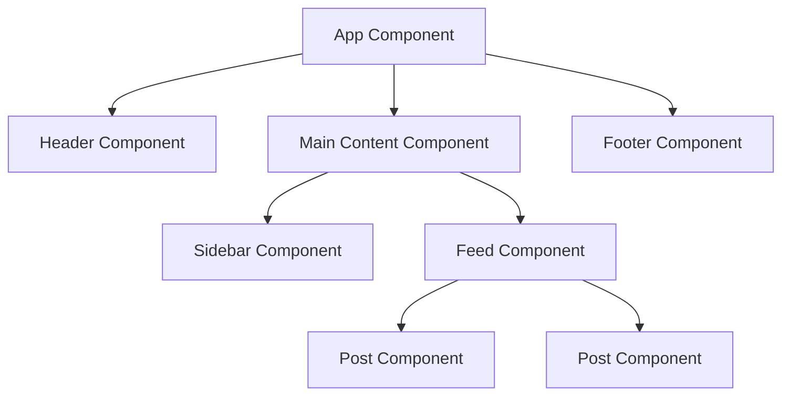
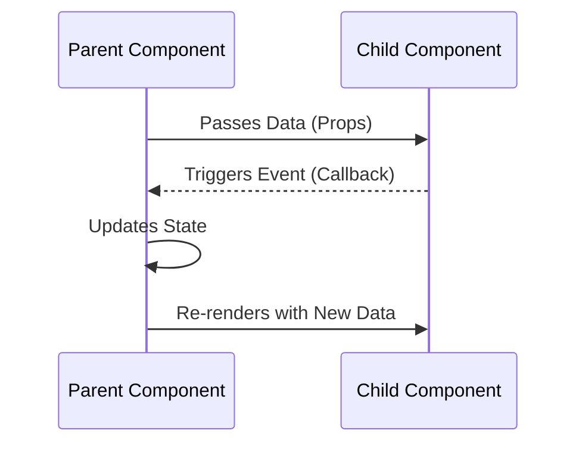
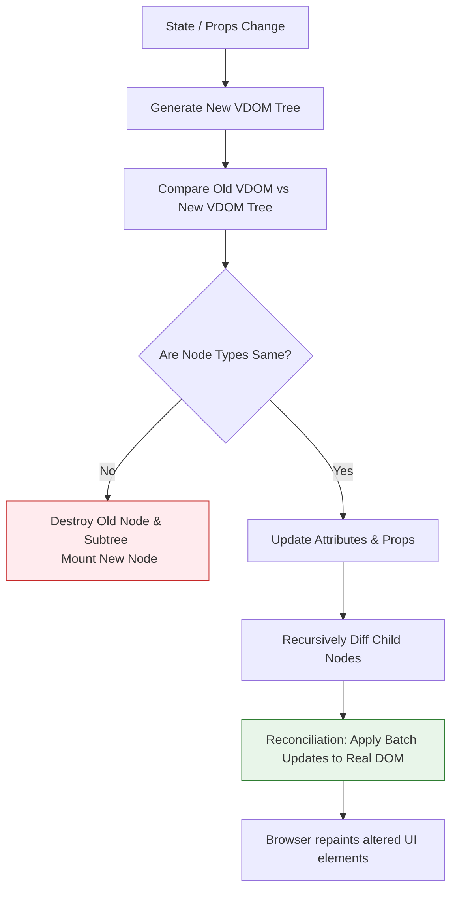

# 📦 Module 1: Introduction to React & JSX

Welcome to Module 1. In this module, we will explore the core concepts of React, how it manages updates using the Virtual DOM, and the syntax rules of JSX.

---

## 🚀 React Features

React provides several key features that make it a powerful choice for building modern web applications.

### 1. Component-Based Architecture
React applications are built using encapsulated components that manage their own state. These components are then composed to make complex UIs.
- **Benefits**: Simplifies logic, easier debugging, and improved code maintainability.



### 2. Declarative UI
You describe *what* the UI should look like for a given state, and React handles *how* to update the DOM to match that state.
- **Benefits**: Makes code more predictable and easier to debug compared to imperative DOM manipulation.

### 3. One-Way Data Binding
Data in React flows in a single direction (from parent to child).
- **Benefits**: Makes it easier to track data flow and find bugs. Changes in child components don't unexpectedly affect the parent's state without explicit callback functions.



### 4. Reusable Components
Once you build a component (e.g., a Button or a Card), you can reuse it across different parts of your application.
- **Benefits**: Speeds up development and ensures consistency in design and behavior.

### 5. Single Page Application (SPA)
React is widely used to build SPAs where the initial HTML page is loaded once, and subsequent interactions update the UI dynamically without full page reloads.
- **Benefits**: Provides a seamless, app-like user experience.

> [!NOTE]
> **Interview Note: Why did React become so popular?**
> React gained massive popularity because it solved the performance bottleneck of complex UI updates with the **Virtual DOM**, introduced a more intuitive **declarative programming paradigm**, and was backed by **Facebook (Meta)**, which provided strong community support and ecosystem growth.

---

## ⚔️ React vs Vanilla JavaScript

When interviewing, you will often be asked to justify choosing React over plain (vanilla) JavaScript.

### Detailed Comparison Table

| Feature | Vanilla JavaScript | React |
| :--- | :--- | :--- |
| **DOM Manipulation** | Real DOM (Direct manipulation) | Virtual DOM (In-memory diffing) |
| **Performance** | Slower for frequent UI updates | Faster for complex, dynamic updates |
| **Reusability** | Difficult; often requires manual copy-pasting | High; component-based architecture |
| **State Management** | Hard to track and manage across multiple elements | Centralized and predictable via hooks/state |
| **Maintainability** | Can become "spaghetti code" as app grows | Highly maintainable modular structure |
| **Development Speed** | Slower for large apps due to boilerplate | Faster due to reusable components and ecosystem |
| **Scalability** | Hard to scale for large teams and features | Designed to scale efficiently |

> [!TIP]
> **Best Practice:** If you are building a simple, static website with minimal interactivity, Vanilla JS is often sufficient and avoids unnecessary overhead. For highly interactive, data-driven applications, React is the better choice.

---

## 🔬 Real DOM vs. Virtual DOM

The HTML DOM (Document Object Model) represents the UI of your application. Every time the state of the UI changes, the DOM needs to be updated to represent that change. However, updating the DOM directly is slow because the browser has to recalculate CSS layouts and repaint the screen.

React solves this by using a **Virtual DOM (VDOM)**. The VDOM is a lightweight, in-memory representation of the real DOM.

### 📋 Detailed DOM Comparison

| Feature | Real DOM | Virtual DOM |
| :--- | :--- | :--- |
| **Speed** | Slow updates (triggers layout/reflow) | Fast updates (just a JS object) |
| **Memory** | High memory usage | Efficient memory footprint |
| **Direct HTML** | Can manipulate HTML directly | Cannot directly change HTML |
| **Rendering** | Re-renders entire page or parent subtree | Minimal selective updates via reconciliation |

---

## 🔄 The Virtual DOM Diffing & Reconciliation Flow

When a component's state or props change, React runs a process called **reconciliation** to compute the difference (diff) between the old VDOM and the new VDOM, then updates the Real DOM with the minimum required changes.



### 🗝️ The Importance of Keys in Diffing
When rendering lists, React relies on the `key` prop to identify which items have changed, been added, or been removed.
> [!WARNING]
> - Never use array indices (`index`) as keys if the list can be reordered, filtered, or deleted. This causes rendering bugs and breaks state retention in child elements.
> - Always use a unique, persistent identifier (e.g., `user.id`).

---

## 📝 JSX (JavaScript XML) Under the Hood

JSX is a syntax extension that allows you to write HTML structure inside JavaScript. The browser does not understand JSX. It must be compiled into standard JavaScript.

### How JSX Compiles:
**JSX Code:**
```jsx
const element = <h1 className="title">Hello World</h1>;
```
**Babel/Vite Compiled JavaScript (Pre-React 17):**
```javascript
const element = React.createElement('h1', { className: 'title' }, 'Hello World');
```
**Modern JSX Transform Compiled JavaScript (React 17+):**
```javascript
import { jsx as _jsx } from 'react/jsx-runtime';
const element = _jsx('h1', { className: 'title', children: 'Hello World' });
```

---

## 🛠️ JSX Syntax Rules

1. **Must Return a Single Root**: Sibling elements must be wrapped in a container element or a React Fragment `<> ... </>`.
2. **JavaScript Expressions**: Embedded JavaScript inside JSX must be wrapped in curly braces `{ }`.
3. **CamelCase Attributes**: HTML attributes are replaced by camelCase JS properties:
   - `class` $\rightarrow$ `className`
   - `onclick` $\rightarrow$ `onClick`
   - `for` $\rightarrow$ `htmlFor`
4. **Self-Closing Tags**: Elements with no children must close with a slash `/` (e.g., ``, `<input />`).

```jsx
// Fleshed out Example
import React from 'react';

function Header() {
  const isUserLoggedIn = true;
  const username = "Omkar";
  const styles = { color: '#61DAFB', fontSize: '20px' };

  return (
    <header className="header-container" style={styles}>
      <h2>App Navigation</h2>
      {isUserLoggedIn ? (
        <p>Welcome, <strong>{username}</strong>!</p>
      ) : (
        <button onClick={() => alert('Redirecting to login...')}>Login</button>
      )}
      
    </header>
  );
}
```

---

## 🧩 JSX Expressions

JSX allows you to embed JavaScript expressions inside your markup using curly braces `{}`. However, not everything is valid inside JSX.

### What CAN be written inside JSX?
Any valid **JavaScript expression** that evaluates to a value can be placed inside JSX.

- **Variables:** `{name}`
- **Arithmetic Expressions:** `{10 + 20}`
- **Function Calls:** `{getUserName()}`
- **Ternary Operators:** `{isLoggedIn ? 'Welcome' : 'Please Log In'}`
- **Array Methods (like `map`):** `{items.map(item => <li key={item.id}>{item.name}</li>)}`

### What CANNOT be written inside JSX?
You cannot write **statements** (code that performs an action but does not produce a value directly) inside JSX curly braces.

- ❌ `if / else` statements (Use Ternary or Logical `&&` instead)
- ❌ `for / while` loops (Use array methods like `.map()` instead)
- ❌ Object declarations (unless double curlies for styles like `{{ color: 'red' }}`)

### 💡 Examples

```jsx
function UserProfile() {
  const name = "Omkar";
  const age = 22;
  const isEmployed = true;
  const skills = ["React", "JavaScript", "CSS"];

  return (
    <div className="profile">
      {/* Variable */}
      <h1>{name}</h1>
      
      {/* Arithmetic Expression */}
      <p>Age next year: {age + 1}</p>
      
      {/* Ternary Operator */}
      <p>Status: {isEmployed ? "Employed" : "Looking for opportunities"}</p>
      
      {/* Array Rendering */}
      <ul>
        {skills.map((skill, index) => (
          <li key={index}>{skill}</li>
        ))}
      </ul>
    </div>
  );
}
```

> [!WARNING]
> **Common Mistake:** Trying to render an entire object directly in JSX like `<div>{userObj}</div>` will throw an error: `Objects are not valid as a React child`. You must access specific properties like `<div>{userObj.name}</div>` or stringify it.

---

## ❓ Common Interview Questions
1. **Why does React need a Virtual DOM?**
   - Direct DOM manipulation is computationally expensive. The Virtual DOM allows React to batch modifications and perform them in memory first, minimizing layout reflows in the browser.
2. **What is React Fragment and why use it?**
   - A Fragment lets you group a list of children without adding extra DOM nodes (like a wrapper `div`), which keeps the DOM markup clean and avoids layout issues.

---

🔗 **[Back to Course Index](./React_Course_Index.md)** | **[Proceed to Module 2](./Module_02_Components_Props.md)**
