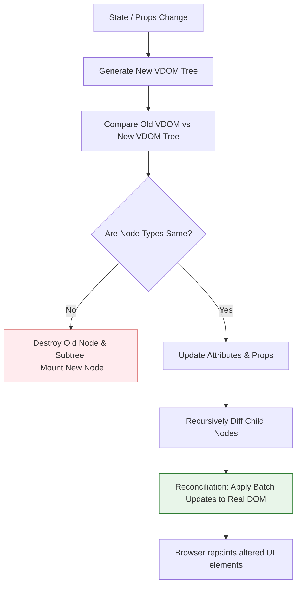

# 📦 Module 1: Introduction to React & JSX

Welcome to Module 1. In this module, we will explore the core concepts of React, how it manages updates using the Virtual DOM, and the syntax rules of JSX.

---

## 🔬 Real DOM vs. Virtual DOM

The HTML DOM (Document Object Model) represents the UI of your application. Every time the state of the UI changes, the DOM needs to be updated to represent that change. However, updating the DOM directly is slow because the browser has to recalculate CSS layouts and repaint the screen.

React solves this by using a **Virtual DOM (VDOM)**. The VDOM is a lightweight, in-memory representation of the real DOM.

### 📋 Detailed DOM Comparison

| Feature | Real DOM | Virtual DOM |
| :--- | :--- | :--- |
| **Speed** | Slow updates (triggers layout/reflow) | Fast updates (just a JS object) |
| **Memory** | High memory usage | Efficient memory footprint |
| **Direct HTML** | Can manipulate HTML directly | Cannot directly change HTML |
| **Rendering** | Re-renders entire page or parent subtree | Minimal selective updates via reconciliation |

---

## 🔄 The Virtual DOM Diffing & Reconciliation Flow

When a component's state or props change, React runs a process called **reconciliation** to compute the difference (diff) between the old VDOM and the new VDOM, then updates the Real DOM with the minimum required changes.



### 🗝️ The Importance of Keys in Diffing
When rendering lists, React relies on the `key` prop to identify which items have changed, been added, or been removed.
> [!WARNING]
> - Never use array indices (`index`) as keys if the list can be reordered, filtered, or deleted. This causes rendering bugs and breaks state retention in child elements.
> - Always use a unique, persistent identifier (e.g., `user.id`).

---

## 📝 JSX (JavaScript XML) Under the Hood

JSX is a syntax extension that allows you to write HTML structure inside JavaScript. The browser does not understand JSX. It must be compiled into standard JavaScript.

### How JSX Compiles:
**JSX Code:**
```jsx
const element = <h1 className="title">Hello World</h1>;
```
**Babel/Vite Compiled JavaScript (Pre-React 17):**
```javascript
const element = React.createElement('h1', { className: 'title' }, 'Hello World');
```
**Modern JSX Transform Compiled JavaScript (React 17+):**
```javascript
import { jsx as _jsx } from 'react/jsx-runtime';
const element = _jsx('h1', { className: 'title', children: 'Hello World' });
```

---

## 🛠️ JSX Syntax Rules

1. **Must Return a Single Root**: Sibling elements must be wrapped in a container element or a React Fragment `<> ... </>`.
2. **JavaScript Expressions**: Embedded JavaScript inside JSX must be wrapped in curly braces `{ }`.
3. **CamelCase Attributes**: HTML attributes are replaced by camelCase JS properties:
   - `class` $\rightarrow$ `className`
   - `onclick` $\rightarrow$ `onClick`
   - `for` $\rightarrow$ `htmlFor`
4. **Self-Closing Tags**: Elements with no children must close with a slash `/` (e.g., ``, `<input />`).

```jsx
// Fleshed out Example
import React from 'react';

function Header() {
  const isUserLoggedIn = true;
  const username = "Omkar";
  const styles = { color: '#61DAFB', fontSize: '20px' };

  return (
    <header className="header-container" style={styles}>
      <h2>App Navigation</h2>
      {isUserLoggedIn ? (
        <p>Welcome, <strong>{username}</strong>!</p>
      ) : (
        <button onClick={() => alert('Redirecting to login...')}>Login</button>
      )}
      
    </header>
  );
}
```

---

## ❓ Common Interview Questions
1. **Why does React need a Virtual DOM?**
   - Direct DOM manipulation is computationally expensive. The Virtual DOM allows React to batch modifications and perform them in memory first, minimizing layout reflows in the browser.
2. **What is React Fragment and why use it?**
   - A Fragment lets you group a list of children without adding extra DOM nodes (like a wrapper `div`), which keeps the DOM markup clean and avoids layout issues.

---

🔗 **[Back to Course Index](./React_Course_Index.md)** | **[Proceed to Module 2](./Module_02_Components_Props.md)**
