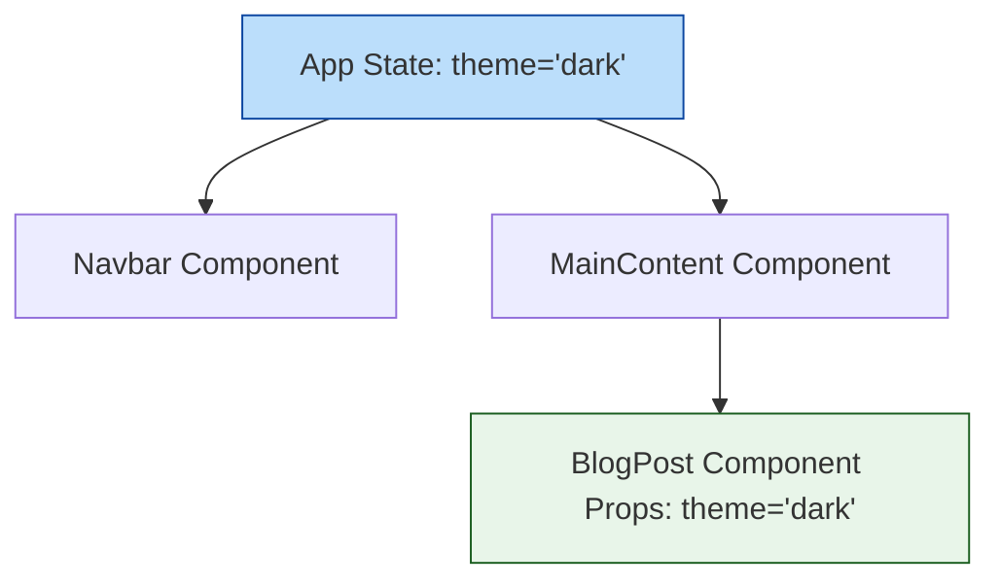

# 🧩 Module 2: Components & Props

Components are the basic building blocks of any React application. In this module, we will discuss the types of components, the immutable nature of props, and component composition.

---

## 🏛️ Class vs. Functional Components

Historically, React components were declared as either Class Components or Functional Components. Functional components were simple, stateless templates until React 16.8 introduced **Hooks**, which gave functional components access to state and lifecycles.

### 📋 Architectural Differences

| Feature | Functional Component (Modern) | Class Component (Legacy) |
| :--- | :--- | :--- |
| **Declaration** | Standard JS Function / Arrow Function | ES6 Class extending `React.Component` |
| **State Management** | Managed via `useState` and other hooks | Managed via `this.state` and `this.setState` |
| **Lifecycle Methods** | Synced via `useEffect` hook | Uses `componentDidMount`, `componentDidUpdate`, etc. |
| **Syntactic Overhead**| Low (no `this` keyword, clean syntax) | High (requires constructor, binding handlers) |
| **Performance** | Lightweight and easily optimized | Higher memory footprint due to class instances |

---

## 📥 Unidirectional Data Flow & Immutability

Props (properties) are parameters passed into a component from its parent. Data in React always flows **downwards** (from parent to child).



> [!IMPORTANT]
> **Props are Immutable**: A component must act like a **pure function** with respect to its props. It should never modify them. If you need to change a value over time, that value belongs in **State** (Module 3).

---

## 💻 Props Features: Destructuring, Defaults & Validation

### 1. Destructuring Props
Instead of accessing values via `props.title`, destructure them in the function parameters signature for cleaner code.

### 2. Default Values
Provide fallback values directly in the destructuring assignment.

### 3. Prop Types (Validation)
Use the `prop-types` library to enforce typing in JavaScript projects.

```jsx
import React from 'react';
import PropTypes from 'prop-types';

// Child Component
function ProductCard({ title, price, inStock = true }) {
  return (
    <div className="product-card">
      <h4>{title}</h4>
      <p>Price: ${price.toFixed(2)}</p>
      <span>{inStock ? "Available" : "Out of Stock"}</span>
    </div>
  );
}

// Defining Prop Validation rules
ProductCard.propTypes = {
  title: PropTypes.string.isRequired,
  price: PropTypes.number.isRequired,
  inStock: PropTypes.bool
};

// Parent Component
export default function Marketplace() {
  return (
    <div className="market">
      <ProductCard title="Wireless Mouse" price={29.99} />
      <ProductCard title="Mechanical Keyboard" price={89.99} inStock={false} />
    </div>
  );
}
```

---

## 🗃️ Component Composition (`props.children`)

Component composition is a design pattern where a layout component wraps nested elements. React passes the nested content via a special prop named `children`.

```jsx
// Layout Card component
function Panel({ headerText, children }) {
  return (
    <div className="panel-frame">
      <div className="panel-header">{headerText}</div>
      <div className="panel-body">
        {children} {/* Renders nested content here */}
      </div>
    </div>
  );
}

// Composition Usage
function App() {
  return (
    <Panel headerText="User Info">
      <p>Name: Omkar</p>
      <p>Role: Web Developer</p>
    </Panel>
  );
}
```

---

## ❓ Common Gotchas
- **Passing Numbers vs Strings**: To pass a number, boolean, or array as a prop, wrap it in curly braces (e.g. `price={20}`). Passing it as `price="20"` passes it as a string, which breaks numeric operations.

---

🔗 **[Back to Course Index](./React_Course_Index.md)** | **[Proceed to Module 3](./Module_03_State_Events.md)**
