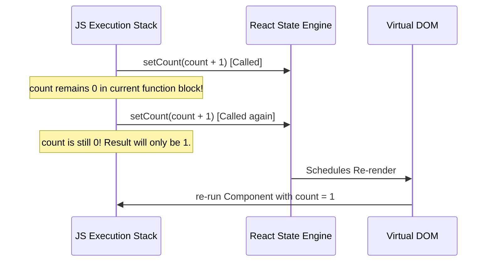

# ⚡ Module 3: State & Event Handling

In this module, we will learn how components manage internal state using the `useState` hook, how to handle events, and how state updates trigger renders.

---

## 🛠️ The State Lifecycle & Asynchronous Updates

When you call the state setter function (e.g. `setCount`), React does not immediately update the variable in the running JavaScript execution block. Instead, it schedules a re-render.



> [!IMPORTANT]
> **Functional Updates**: If your new state depends on the previous state, **always** pass a function to the setter instead of a raw value.
> - `setCount(count + 1)` $\rightarrow$ Vulnerable to stale closures.
> - `setCount(prev => prev + 1)` $\rightarrow$ Guaranteed to use the most up-to-date state.

---

## 🏗️ Modifying Objects and Arrays in State

React determines state updates by comparing references (shallow equality). If you mutate an object or array directly without changing its reference, React will not detect the change and will skip rendering.

```jsx
// ❌ WRONG: Mutating state directly
const [user, setUser] = useState({ name: 'Omkar', age: 24 });
user.age = 25; 
setUser(user); // Will NOT trigger re-render (same reference)

//  CORRECT: Create a new object using spread operator
setUser(prevUser => ({
  ...prevUser, // Copy all existing key/values
  age: 25      // Override age
}));
```

### 📋 Common Immutability Operations

| Operation | Array (Staging state changes) |
| :--- | :--- |
| **Adding Item** | `setItems(prev => [...prev, newItem])` |
| **Removing Item** | `setItems(prev => prev.filter(item => item.id !== targetId))` |
| **Updating Item** | `setItems(prev => prev.map(item => item.id === targetId ? { ...item, val: newVal } : item))` |

---

## ⚡ React Synthetic Events

React events are camelCase wrappers around native browser events. React routes all events through a single listener attached to the root element for performance efficiency.

```jsx
function ClickExplorer() {
  const handleClick = (event) => {
    event.preventDefault(); // Prevents default browser actions
    console.log("Event Type:", event.type); // "click"
    console.log("Target Element:", event.target); // The button node
  };

  return (
    <button onClick={handleClick}>
      Analyze Click Event
    </button>
  );
}
```

---

## ❓ Common Interview Questions
1. **What is state batching?**
   - React combines multiple state updates inside promise/event handlers into a single render to avoid layout calculations. Since React 18, automatic batching covers timeouts, promises, and native event handlers alike.

---

🔗 **[Back to Course Index](./React_Course_Index.md)** | **[Proceed to Module 4](./Module_04_Lifecycles_useEffect.md)**
