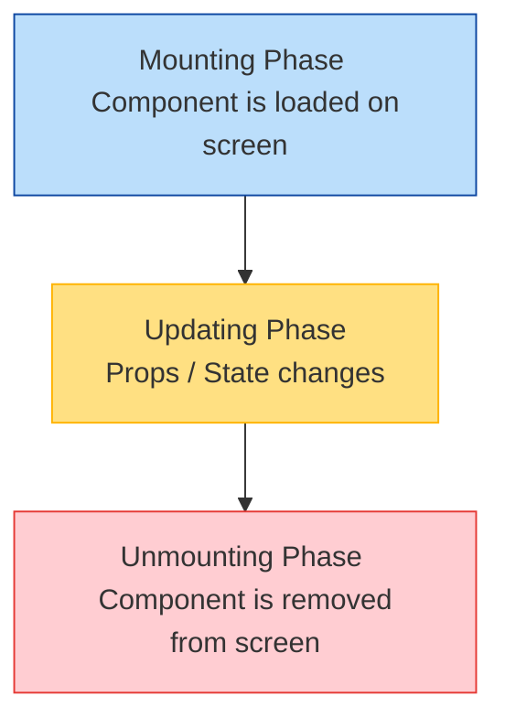

# ⏳ Module 4: Lifecycles & Side Effects (`useEffect`)

Side effects are operations that access or update external systems (e.g. databases, local storage, API end-points, manual DOM updates). The `useEffect` hook enables components to manage these side effects in sync with the React component tree lifecycle.

---

## 📅 The 3 Lifecycle Phases of React Components



---

## 🔬 The Dependency Array Configuration

The behavior of `useEffect` is controlled by the dependency array passed as the second argument:

```javascript
useEffect(() => {
  // Effect code here
}, [dependencies]);
```

### 📋 Dependency Array Scenarios

| Syntax | Execution | Use Case |
| :--- | :--- | :--- |
| **No Array** (`undefined`) | Runs after **every single render**. | Logging, tracking rendering times. |
| **Empty Array** (`[]`) | Runs only **once** after mounting. | Initial API fetch, setting up intervals/event listeners. |
| **With Values** (`[prop, state]`) | Runs on mount and whenever **dependencies change**. | Search input filtering, synchronization of states. |

---

## ⚠️ React 18 StrictMode Double-Firing Gotcha

In React 18 Development mode under `<StrictMode>`, React mounts components, immediately unmounts them, and mounts them again. This is done to force developers to write correct cleanups.

### Correct Implementation Pattern:
```jsx
import { useState, useEffect } from 'react';

function UserStatus({ userId }) {
  const [status, setStatus] = useState("Offline");

  useEffect(() => {
    let active = true; // Flag prevents race conditions

    async function checkStatus() {
      const response = await fetch(`https://api.site.com/user/${userId}`);
      const data = await response.json();
      if (active) {
        setStatus(data.status);
      }
    }
    checkStatus();

    // Clean up
    return () => {
      active = false; // Flag set to false prevents setting state on unmounted components
    };
  }, [userId]);

  return <p>User status: {status}</p>;
}
```

---

## ❓ Common Interview Questions
1. **What happens if you omit the dependency array in `useEffect`?**
   - The effect will re-run on *every* component render, which can cause performance bottlenecks and infinite render loops if the effect updates state inside.
2. **What is the cleanup function for?**
   - The cleanup function runs before the component is unmounted and before every new execution of the effect. It prevents memory leaks, resets event handlers, and cancels ongoing subscriptions or network requests.

---

🔗 **[Back to Course Index](./React_Course_Index.md)** | **[Proceed to Module 5](./Module_05_Forms_Inputs.md)**
