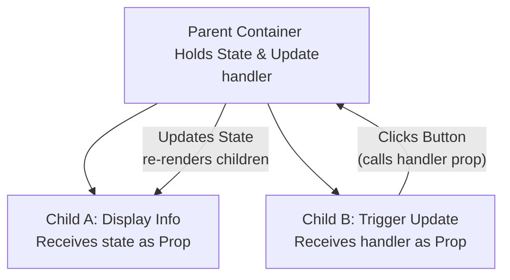
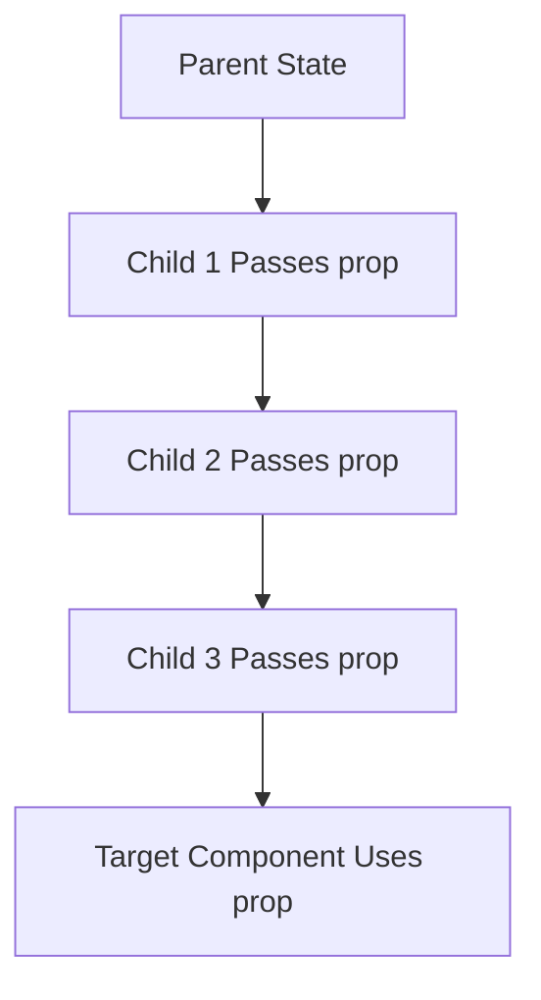

# 🏗️ Module 6: Lifting State Up & Component Composition

In React, state should reside in the component that actually needs to manage it. However, if multiple child components need to share the same dynamic data, you must lift the state up to their closest common ancestor.

---

## 📌 The State Hoisting Architecture

State hoisting shifts state up the component tree, converting lower components into "dumb" or stateless components that only receive data via props.



---

## 💻 Code Example: A Synced Todo List & Stats Panel

```jsx
import { useState } from 'react';

// Child A: Form to add item
function TodoForm({ onAddTodo }) {
  const [task, setTask] = useState("");

  const handleSubmit = (e) => {
    e.preventDefault();
    if (!task.trim()) return;
    onAddTodo(task);
    setTask("");
  };

  return (
    <form onSubmit={handleSubmit}>
      <input value={task} onChange={(e) => setTask(e.target.value)} />
      <button type="submit">Add Task</button>
    </form>
  );
}

// Child B: Stats indicator
function TodoStats({ totalTasks }) {
  return <h3>Total Tasks In Queue: {totalTasks}</h3>;
}

// Parent: Manages state
export default function TodoDashboard() {
  const [todos, setTodos] = useState([]);

  const addTodo = (newText) => {
    setTodos(prev => [...prev, { id: Date.now(), text: newText }]);
  };

  return (
    <div className="dashboard">
      <h2>My Tasks Manager</h2>
      <TodoStats totalTasks={todos.length} />
      <TodoForm onAddTodo={addTodo} />
      <ul>
        {todos.map(t => <li key={t.id}>{t.text}</li>)}
      </ul>
    </div>
  );
}
```

---

## ⚠️ The Limitation: Prop Drilling

Lifting state works well for shallow component trees. However, if you need to pass state through 5 or 6 nested components just to reach a child that needs it, this leads to **Prop Drilling**.



> [!TIP]
> To solve the prop drilling problem for deeply nested components, use the **Context API** (Module 8) or external state managers.

---

🔗 **[Back to Course Index](./React_Course_Index.md)** | **[Proceed to Module 7](./Module_07_Advanced_Hooks.md)**
