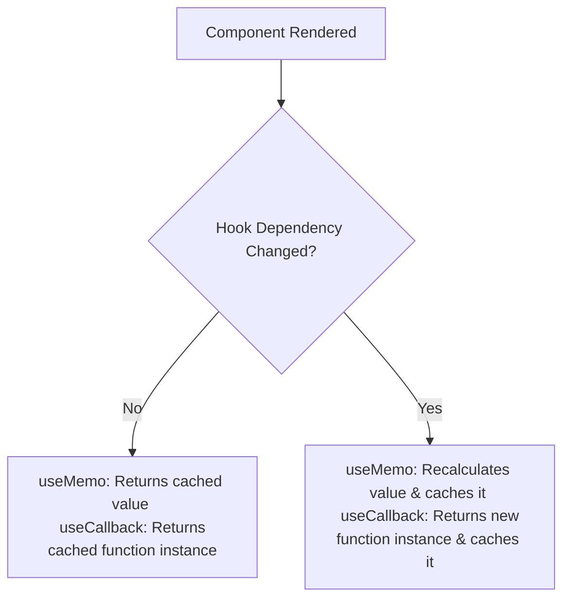

# 🛠️ Module 7: Advanced Hooks & Optimization

In this module, we will cover performance optimization and advanced state management hooks: `useMemo`, `useCallback`, `useRef`, and `useReducer`.

---

## 📏 The Strict Rules of React Hooks

Before using hooks, you must follow these two strict rules:
1. **Only Call Hooks at the Top Level**: Do not call Hooks inside loops, conditions, or nested functions. Ensure Hooks run in the exact same order on every render.
2. **Only Call Hooks from React Functions**: Call Hooks only from React functional components or custom hooks. Do not call them from regular JS functions.

---

## ⚡ `useMemo` vs. `useCallback`

Both hooks are used for optimization, but they memoize different things:



### 📋 Memoization Comparison

| Hook | What it Caches | Signature | Use Case |
| :--- | :--- | :--- | :--- |
| **`useMemo`** | The **result** of a function call. | `useMemo(() => computeValue(a), [a])` | Expensive calculations, heavy loops. |
| **`useCallback`** | The **function instance** itself. | `useCallback(() => doWork(), [a])` | Preventing child re-renders on passed callbacks. |

```jsx
import { useState, useMemo, useCallback } from 'react';

function CalculationApp() {
  const [num, setNum] = useState(5);
  const [darkTheme, setDarkTheme] = useState(false);

  // useMemo: Runs only if 'num' changes (not when darkTheme changes)
  const squaredNumber = useMemo(() => {
    console.log("Squaring number...");
    return num * num;
  }, [num]);

  // useCallback: Maintains function reference integrity
  const logMessage = useCallback(() => {
    console.log("Current number is:", num);
  }, [num]);

  return (
    <div style={{ background: darkTheme ? '#333' : '#FFF', color: darkTheme ? '#FFF' : '#333' }}>
      <input type="number" value={num} onChange={(e) => setNum(parseInt(e.target.value) || 0)} />
      <p>Result: {squaredNumber}</p>
      <button onClick={() => setDarkTheme(prev => !prev)}>Toggle Theme</button>
      <button onClick={logMessage}>Log Number</button>
    </div>
  );
}
```

---

## 🧲 `useRef` for Persistent Values and DOM Control

`useRef` returns a mutable object whose `.current` property persists across renders. 

> [!IMPORTANT]
> Modifying `.current` **does not** trigger a re-render.

```jsx
import { useRef, useEffect } from 'react';

function DOMInputFocus() {
  const inputRef = useRef(null);
  const renderCounterRef = useRef(0);

  useEffect(() => {
    renderCounterRef.current += 1;
    console.log("Total Renders:", renderCounterRef.current);
  });

  const handleFocus = () => {
    // Access DOM element directly
    inputRef.current.focus();
  };

  return (
    <div>
      <input ref={inputRef} type="text" />
      <button onClick={handleFocus}>Focus Input Box</button>
    </div>
  );
}
```

---

🔗 **[Back to Course Index](./React_Course_Index.md)** | **[Proceed to Module 8](./Module_08_Context_API.md)**
