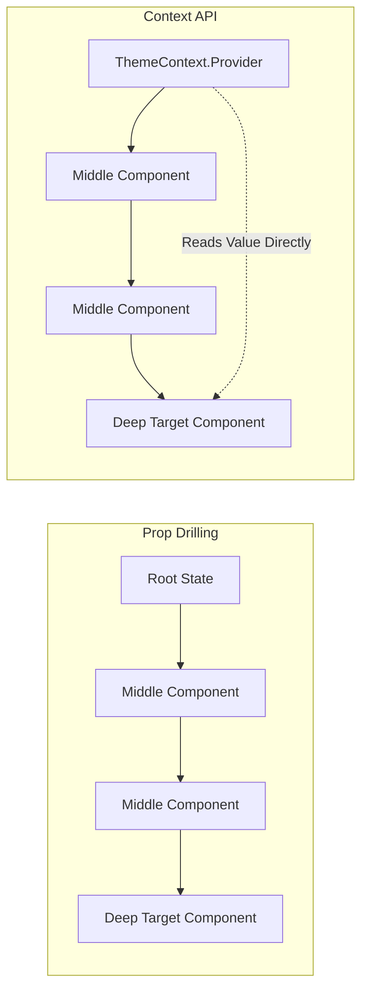

# 🌐 Module 8: Context API & State Management

In this module, we will explore global state management using React's native Context API, look at custom consumer hooks, examine performance implications, and compare Context with external state libraries.

---

## 🏗️ The Problem: Prop Drilling vs. Context Solution

If a deeply nested child component needs access to state held in the root parent, every intermediate component must pass the prop down.



---

## 💻 Custom Context Hook Implementation

Instead of importing both `useContext` and the context definition in every file, wrap them in a custom hook (like `useTheme`) to simplify consumer code.

```jsx
import { createContext, useContext, useState } from 'react';

// 1. Create Context Object
const ThemeContext = createContext();

// 2. Create Provider Wrapper Component
export function ThemeProvider({ children }) {
  const [theme, setTheme] = useState('light');
  const toggleTheme = () => setTheme(t => t === 'light' ? 'dark' : 'light');

  return (
    <ThemeContext.Provider value={{ theme, toggleTheme }}>
      {children}
    </ThemeContext.Provider>
  );
}

// 3. Create Custom Consumer Hook
export function useTheme() {
  const context = useContext(ThemeContext);
  // Throw error if the hook is called outside the Provider boundaries
  if (!context) {
    throw new Error("useTheme must be used within a ThemeProvider wrapper");
  }
  return context;
}
```

---

## ⚡ Context Performance Considerations

> [!WARNING]
> Whenever the Context value object changes, **all** components consuming the Context will re-render, even if they only use one property of that object.

### How to optimize Context performance:
1. **Split Contexts**: Create separate contexts for different features (e.g., `UserAuthContext`, `ThemeContext`).
2. **Split State and Dispatch**: Create one context for state data values and a separate context for the dispatch functions.
3. **Use Memoization**: Wrap descendants of the consumer in `React.memo` or use `useMemo` on the context value.

---

## 📊 Context vs. External State Management Libraries

| Feature | Context API | Redux Toolkit | Zustand |
| :--- | :--- | :--- | :--- |
| **Setup Overhead** | Extremely low | Medium-High | Extremely low |
| **Use Case** | Low frequency updates (e.g., theme, auth) | Large-scale complex applications | Moderate to high scale state requirements |
| **Selective Renders** | No (re-renders all consumers) | Yes (using selectors) | Yes (using custom hooks selectors) |
| **Asynchronous Actions** | Handled manually with effects | Middleware required (e.g. Thunks) | Built-in async support |

---

🔗 **[Back to Course Index](./React_Course_Index.md)** | **[Proceed to Module 9](./Module_09_Routing.md)**
