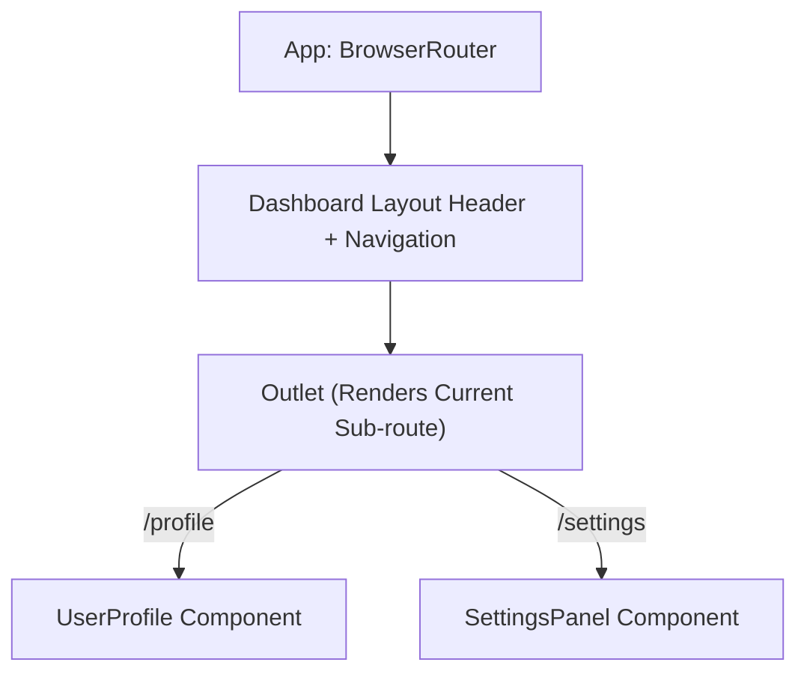

# 🗺️ Module 9: Client-Side Routing

Modern single-page applications (SPAs) use client-side routing to load page views instantly without sending document requests to the server on every navigation.

---

## 🔀 Route Configuration & Layout Nesting

Nested routing enables dashboard layout components to persist (headers, navigation sidebars) while sub-pages render dynamically inside the layout body using React Router's `<Outlet />`.



---

## 💻 Full Navigation Setup Example

```jsx
import { BrowserRouter, Routes, Route, Link, Outlet, useParams, useNavigate } from 'react-router-dom';

// 1. Layout Component
function MainLayout() {
  return (
    <div className="app-layout">
      <nav className="navbar">
        <Link to="/">Home</Link>
        <Link to="/products">Store Products</Link>
      </nav>
      <main className="content">
        <Outlet /> {/* Nested route components render here */}
      </main>
    </div>
  );
}

// 2. Dynamic Route Detail Component
function ProductDetail() {
  const { productId } = useParams(); // Reads parameter from URL: e.g. "/products/42"
  const navigate = useNavigate();

  return (
    <div className="product-view">
      <h3>Viewing Product ID: {productId}</h3>
      <button onClick={() => navigate('/products')}>Back to Products</button>
      <button onClick={() => navigate(-1)}>Go Back One Page</button>
    </div>
  );
}

// 3. Fallback 404 Component
function NotFound() {
  return (
    <div>
      <h2>404 - Page Not Found</h2>
      <Link to="/">Go back home</Link>
    </div>
  );
}

// 4. Main App Routing Engine
export default function AppRouter() {
  return (
    <BrowserRouter>
      <Routes>
        <Route path="/" element={<MainLayout />}>
          <Route index element={<h2>Dashboard Overview</h2>} />
          <Route path="products" element={<h2>Products Listing</h2>} />
          <Route path="products/:productId" element={<ProductDetail />} />
          {/* Catch-all route for missing routes */}
          <Route path="*" element={<NotFound />} />
        </Route>
      </Routes>
    </BrowserRouter>
  );
}
```

---

## ❓ Common Interview Questions
1. **What is the difference between `<Link>` and standard `<a>` tags?**
   - The `<a>` tag triggers a browser page refresh, downloading all scripts and resources again. The `<Link>` component intercepts clicks, updates the browser URL bar, and renders new components in memory without refreshing the page.

---

🔗 **[Back to Course Index](./React_Course_Index.md)** | **[Proceed to Module 10](./Module_10_API_Integration.md)**
