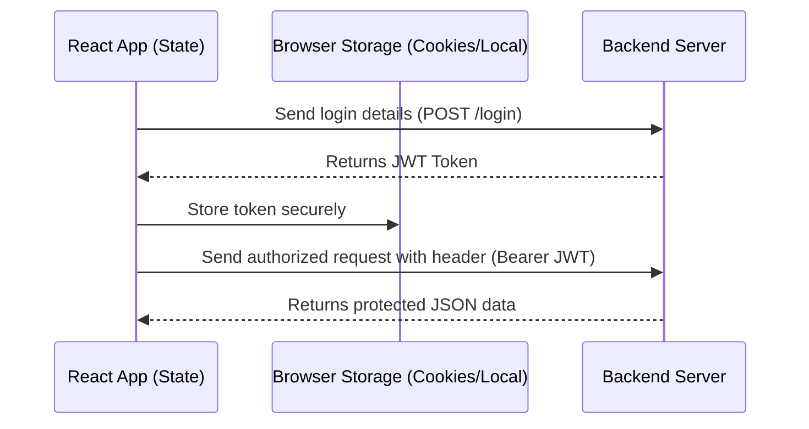

# 🔐 Module 11: Authentication & Security

Securing frontends involves managing authenticated state, saving JWT tokens, and guarding routes using protected navigation paths.

---

## 🔐 JWT Authentication & Request Flow



---

## 💾 Storage Alternatives Comparison

| Storage Mechanism | Read/Write Access | XSS Security | CSRF Security | Life Span |
| :--- | :--- | :--- | :--- | :--- |
| **`localStorage`** | Direct JS Access | Vulnerable | Secure | Permanent (until cleared) |
| **`sessionStorage`** | Direct JS Access | Vulnerable | Secure | Tab Close |
| **HttpOnly Cookie** | Automated by browser | Secure | Vulnerable | Defined by server |

---

## 🛡️ Complete Auth System & Protected Router Example

```jsx
import { createContext, useContext, useState } from 'react';
import { Navigate, Outlet, useLocation } from 'react-router-dom';

// 1. Authentication Context Setup
const AuthContext = createContext(null);

export function AuthProvider({ children }) {
  const [user, setUser] = useState(() => {
    const savedToken = localStorage.getItem('token');
    const savedRole = localStorage.getItem('role');
    return savedToken ? { token: savedToken, role: savedRole } : null;
  });

  const login = async (username, password) => {
    // Simulated API response containing token
    const mockToken = "eyJhbGciOiJIUzI1NiIsInR5cCI6IkpXVCJ9";
    const mockRole = username === "admin" ? "Admin" : "User";

    localStorage.setItem('token', mockToken);
    localStorage.setItem('role', mockRole);
    setUser({ token: mockToken, role: mockRole });
  };

  const logout = () => {
    localStorage.removeItem('token');
    localStorage.removeItem('role');
    setUser(null);
  };

  return (
    <AuthContext.Provider value={{ user, login, logout }}>
      {children}
    </AuthContext.Provider>
  );
}

export const useAuth = () => useContext(AuthContext);

// 2. Protected Route Component with Role Checks (RBAC)
export function ProtectedRoutes({ allowedRoles }) {
  const { user } = useAuth();
  const location = useLocation();

  if (!user) {
    // Redirect to login but save current location for redirection after login
    return <Navigate to="/login" state={{ from: location }} replace />;
  }

  if (allowedRoles && !allowedRoles.includes(user.role)) {
    return <Navigate to="/unauthorized" replace />;
  }

  return <Outlet />; // Render matching child routes
}
```

---

🔗 **[Back to Course Index](./React_Course_Index.md)** | **[Proceed to Module 12](./Module_12_Optimization_Deploy.md)**
