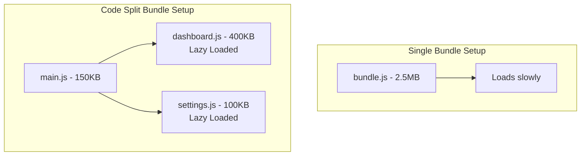

# ⚡ Module 12: Performance & Deployment

To deploy high-performance applications, you must minimize download sizes (bundle sizes), optimize execution render speeds, and configure production server deployment routing.

---

## 🛠️ Optimization Checklist

### 1. `React.memo` for Component Memoization
`React.memo` is a higher-order component that wraps functional components. It intercepts renders and performs a shallow comparison on incoming props.

```jsx
import React from 'react';

// This component will ONLY re-render if title or price properties change reference
const ProductRow = React.memo(({ title, price }) => {
  console.log("Rendering Row:", title);
  return (
    <tr>
      <td>{title}</td>
      <td>${price}</td>
    </tr>
  );
});

// Custom comparison function option (if shallow comparison is insufficient)
const MemoizedRow = React.memo(ProductRow, (prevProps, nextProps) => {
  return prevProps.price === nextProps.price; // Ignore title changes
});
```

---

## 📦 Code Splitting via Dynamic Imports

By default, bundlers pack all JavaScript files into one single file. Users must wait for the entire application to download before seeing the first page. Code splitting splits the bundle into smaller chunks.



```jsx
import { lazy, Suspense } from 'react';
import { BrowserRouter, Routes, Route } from 'react-router-dom';

// 1. Dynamic Imports
const LazyDashboard = lazy(() => import('./pages/Dashboard'));
const LazySettings = lazy(() => import('./pages/Settings'));

export default function App() {
  return (
    <BrowserRouter>
      {/* Suspense fallback component will display while script is being downloaded */}
      <Suspense fallback={<div className="loading-spinner">Loading view...</div>}>
        <Routes>
          <Route path="/" element={<LazyDashboard />} />
          <Route path="/settings" element={<LazySettings />} />
        </Routes>
      </Suspense>
    </BrowserRouter>
  );
}
```

---

## 🚀 Production Hosting & Fallback Configuration

When a user visits a path directly on a single-page app (e.g., `https://mysite.com/dashboard`), the hosting server will look for a file named `/dashboard/index.html` and return a **404 Not Found** error, since only a single `/index.html` root file exists.

### Server Fallback Configurations:

#### Netlify (`public/_redirects`):
```text
/*    /index.html   200
```

#### Vercel (`vercel.json`):
```json
{
  "rewrites": [
    { "source": "/(.*)", "destination": "/index.html" }
  ]
}
```

#### Apache (`.htaccess`):
```apache
RewriteEngine On
RewriteBase /
RewriteRule ^index\.html$ - [L]
RewriteCond %{REQUEST_FILENAME} !-f
RewriteCond %{REQUEST_FILENAME} !-d
RewriteRule . /index.html [L]
```

---

🔗 **[Back to Course Index](./React_Course_Index.md)**
