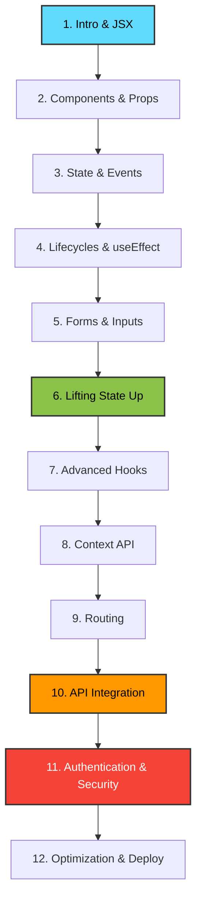

# 🎓 React.js Visual Masterclass - Study Index

Welcome to the structured React.js Visual Masterclass. Below is the list of all 12 modules. Click on any module to open its full study guide, featuring diagrams, code, and explanations.

---

## 🗺️ Learning Roadmap

---

## 📚 Course Modules

1. **[Module 01: Introduction to React & JSX](./Module_01_Intro_JSX.md)**
   - Concepts: Virtual DOM, Reconciliation, JSX syntax rules.
2. **[Module 02: Components & Props](./Module_02_Components_Props.md)**
   - Concepts: Functional components, Props immutability, Unidirectional data flow.
3. **[Module 03: State & Event Handling](./Module_03_State_Events.md)**
   - Concepts: `useState` hook, React Synthetic Events, Functional updates.
4. **[Module 04: Lifecycles & Side Effects](./Module_04_Lifecycles_useEffect.md)**
   - Concepts: `useEffect` hook, Dependency array types, Cleanup functions.
5. **[Module 05: Handling Forms & User Input](./Module_05_Forms_Inputs.md)**
   - Concepts: Controlled components vs Uncontrolled components, forms submit.
6. **[Module 06: Lifting State Up & Composition](./Module_06_Lifting_State.md)**
   - Concepts: Hoisting state, Callbacks, Composition (`props.children`).
7. **[Module 07: Advanced Hooks & Optimization](./Module_07_Advanced_Hooks.md)**
   - Concepts: `useMemo`, `useCallback`, `useReducer`.
8. **[Module 08: Context API & Global State](./Module_08_Context_API.md)**
   - Concepts: Context Provider/Consumer pattern, Global state.
9. **[Module 09: Client-Side Routing](./Module_09_Routing.md)**
   - Concepts: Single Page App routing, React Router path matching.
10. **[Module 10: API Integration](./Module_10_API_Integration.md)**
    - Concepts: Fetch API, Axios, Loading & Error states, Custom fetch hooks.
11. **[Module 11: Authentication & Security](./Module_11_Auth_Security.md)**
    - Concepts: JWT authentication flow, Protected Routes, Token storage options.
12. **[Module 12: Performance & Deployment](./Module_12_Optimization_Deploy.md)**
    - Concepts: `React.memo`, Code splitting, `lazy`/`Suspense`, production build.
